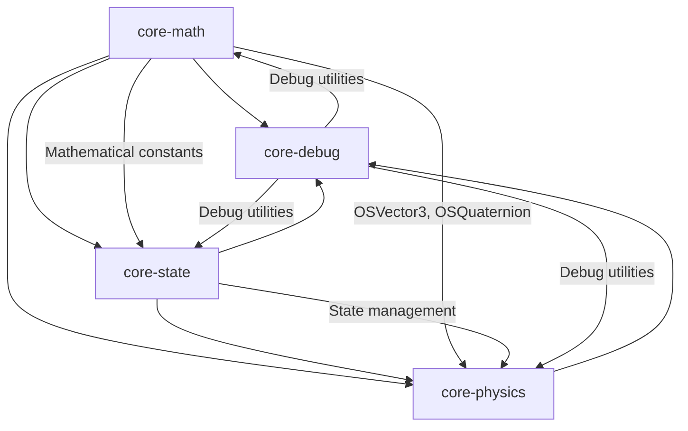
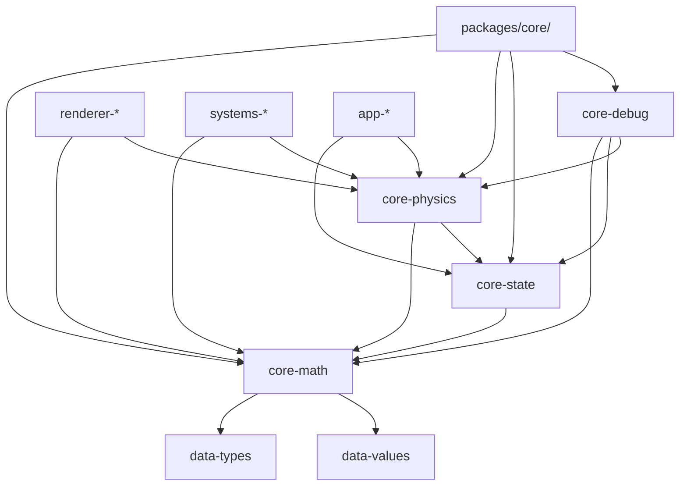

# AGENTS.md

A comprehensive guide for AI coding agents working on the Teskooano Core packages.

## Package Overview

The **`packages/core/`** directory contains the foundational packages that form the mathematical, physical, and state management backbone of the Teskooano engine. These packages provide the essential building blocks for all other components in the system, ensuring type safety, performance, and maintainability across the entire codebase.

### Purpose

- **Mathematical Foundation**: Core mathematical types and operations for the entire engine
- **Physics Engine**: Comprehensive N-body simulation and celestial mechanics
- **State Management**: Reactive state management with intelligent caching and performance optimization
- **Debug Infrastructure**: Centralized debugging tools and development utilities
- **Type Safety**: Comprehensive TypeScript interfaces and type definitions
- **Performance**: Optimized algorithms and memory management

## Core Package Architecture

### Directory Structure

```
packages/core/
├── debug/                    # Debug utilities and development tools
│   ├── AGENTS.md            # Debug package agent guide
│   ├── src/
│   │   ├── debug-config.ts  # Global debug configuration
│   │   ├── logger.ts        # Multi-level logging system
│   │   ├── vector-debug.ts  # OSVector3 debugging utilities
│   │   ├── three-vector-debug.ts # THREE.Vector3 debugging
│   │   ├── celestial-debug.ts # Celestial object debugging
│   │   └── global-state-debug.ts # Global state monitoring
│   └── package.json
├── math/                     # Mathematical foundation
│   ├── AGENTS.md            # Math package agent guide
│   ├── src/
│   │   ├── OSVector3.ts     # 3D vector mathematics
│   │   ├── OSQuaternion.ts  # Quaternion operations
│   │   ├── OSMatrix3.ts     # 3x3 matrix operations
│   │   ├── OSMatrix4.ts     # 4x4 matrix operations
│   │   ├── constants.ts     # Mathematical constants
│   │   ├── random.ts        # Seeded random number generation
│   │   └── epoch.ts         # Astronomical epoch utilities
│   └── package.json
├── physics/                  # Physics simulation engine
│   ├── AGENTS.md            # Physics package agent guide
│   ├── src/
│   │   ├── algorithms/      # Force calculation algorithms
│   │   ├── integrators/     # Numerical integration methods
│   │   ├── orbital/         # Orbital mechanics calculations
│   │   ├── collision/       # Collision detection and resolution
│   │   ├── spatial/         # Spatial data structures
│   │   ├── forces/          # Force calculation methods
│   │   └── simulation/      # Main simulation orchestration
│   └── package.json
├── state/                    # State management system
│   ├── AGENTS.md            # State package agent guide
│   ├── src/
│   │   ├── stores/          # Reactive state stores
│   │   ├── managers/        # State management orchestrators
│   │   ├── services/        # State calculation services
│   │   ├── adapters/        # System integration adapters
│   │   └── utils/           # State utility functions
│   └── package.json
└── AGENTS.md                # This file - Core packages overview
```

## Package Dependencies and Relationships

### Dependency Hierarchy



### Data Flow

```
Mathematical Operations (math) → State Management (state) → Physics Simulation (physics) → Debug Monitoring (debug)
```

## Individual Package Guides

### 1. Core Math Package (`@teskooano/core-math`)

**Purpose**: Mathematical foundation providing essential types and operations

**Key Components**:

- **OSVector3**: 3D vector mathematics with comprehensive operations
- **OSQuaternion**: Quaternion operations for rotations
- **OSMatrix3/OSMatrix4**: Matrix operations for transformations
- **Constants**: Mathematical and physical constants
- **Random**: Seeded random number generation for deterministic operations
- **Epoch**: Astronomical epoch management and validation

**Agent Guide**: See [packages/core/math/AGENTS.md](./math/AGENTS.md) for detailed documentation.

### 2. Core Physics Package (`@teskooano/core-physics`)

**Purpose**: Comprehensive physics simulation engine for celestial mechanics

**Key Components**:

- **Algorithms**: Direct, Barnes-Hut, FMM, P3M, Tree-PM force calculation
- **Integrators**: Velocity Verlet, RK4, adaptive methods, symplectic integrators
- **Orbital Mechanics**: Kepler solver, state conversions, Lagrange points
- **Collision System**: Detection and resolution with WASM enhancements
- **Spatial Structures**: Octree and WASM spatial partitioning
- **Simulation Manager**: High-level orchestration and configuration

**Agent Guide**: See [packages/core/physics/AGENTS.md](./physics/AGENTS.md) for detailed documentation.

### 3. Core State Package (`@teskooano/core-state`)

**Purpose**: Centralized reactive state management system

**Key Components**:

- **Stores**: CelestialStore, PhysicsStore, RenderableStore, SeedStore, SimulationStore, CameraStore
- **Services**: PhysicsStateProvider, PhysicsStateCalculator, FlatHierarchyService
- **Managers**: CelestialManager, SimulationManager, CameraManager
- **Adapters**: PhysicsSystemAdapter for system integration
- **Utilities**: State accessors, subscription mixins, store filters

**Agent Guide**: See [packages/core/state/AGENTS.md](./state/AGENTS.md) for detailed documentation.

### 4. Core Debug Package (`@teskooano/core-debug`)

**Purpose**: Centralized debugging and development utilities

**Key Components**:

- **Debug Configuration**: Global settings for log levels and visualization
- **Logging System**: Multi-level logging with module-specific loggers
- **Vector Debugging**: OSVector3 and THREE.Vector3 debugging utilities
- **Celestial Debugging**: Rich debugging data for celestial objects
- **Global State Debugging**: Reactive monitoring of simulation state

**Agent Guide**: See [packages/core/debug/AGENTS.md](./debug/AGENTS.md) for detailed documentation.

## Cross-Package Integration Patterns

### 1. Mathematical Operations

All packages use the core math types for consistent mathematical operations:

```typescript
import { OSVector3, OSQuaternion } from "@teskooano/core-math";

// Used in physics for force calculations
const force = new OSVector3(0, 0, 0);
force.addScaledVector(direction, magnitude);

// Used in state for position tracking
const position = new OSVector3(x, y, z);
```

### 2. State Management Integration

Physics and debug packages integrate with the state management system:

```typescript
import { physicsSystemAdapter } from "@teskooano/core-state";
import { SimulationManager } from "@teskooano/core-physics";

// Physics updates state through adapters
const result = simulationManager.simulate(params);
physicsSystemAdapter.updatePhysicsStates(result.states);
```

### 3. Debug Integration

All packages can use debug utilities for development and troubleshooting:

```typescript
import { createLogger, isVisualizationEnabled } from "@teskooano/core-debug";

const logger = createLogger("PhysicsEngine");
if (isVisualizationEnabled()) {
  // Debug operations only run when needed
  logger.debug("Force calculation completed", { forceCount: forces.length });
}
```

## Development Workflow

### Setup Commands

```bash
# Install dependencies for all core packages
proto use

# Run tests for all core packages
moon run :test

# Run tests for specific package
moon run math:test
moon run physics:test
moon run state:test
moon run debug:test

# Build all core packages
moon run :build
```

### Testing Strategy

- **Unit Tests**: Each package has comprehensive unit tests
- **Integration Tests**: Cross-package integration validation
- **Performance Tests**: Algorithm scaling and memory usage
- **Type Safety**: Full TypeScript type checking

### Code Style Standards

- **TypeScript**: Strict mode with comprehensive type safety
- **Indentation**: 2-space indentation throughout
- **Naming**: PascalCase for classes, camelCase for properties
- **Documentation**: JSDoc for all public methods
- **Performance**: Zero-overhead abstractions where possible

## Performance Considerations

### Memory Management

- **Vector Pooling**: Reuse OSVector3 instances to reduce GC pressure
- **In-Memory Caching**: Debug data stored in memory for fast access
- **State Optimization**: Intelligent caching and filtering in state management
- **Algorithm Selection**: Automatic selection of optimal algorithms based on system size

### Computational Optimization

- **WASM Integration**: High-performance spatial operations using WebAssembly
- **Adaptive Algorithms**: Dynamic selection of force calculation methods
- **Symplectic Integrators**: Long-term stability for orbital mechanics
- **Spatial Partitioning**: O(N log N) algorithms for large systems

## Troubleshooting Guide

### Common Issues

#### Type Safety Issues

```typescript
// ❌ Incorrect - mixing coordinate systems
const position = new OSVector3(x, 0, y); // Wrong Z mapping

// ✅ Correct - consistent right-handed system
const position = new OSVector3(x, 0, -y); // Correct Z mapping
```

#### Performance Issues

```typescript
// ❌ Incorrect - expensive operations always run
celestialDebugger.setPhysicsData(objectId, expensiveData);

// ✅ Correct - check debug flags first
if (isVisualizationEnabled()) {
  celestialDebugger.setPhysicsData(objectId, expensiveData);
}
```

#### State Synchronization Issues

```typescript
// ❌ Incorrect - direct state manipulation
physicsSystemAdapter.directStateUpdate(newState);

// ✅ Correct - use proper state management
physicsSystemAdapter.updatePhysicsStates(result.states);
```

### Debugging Tips

- **Use Module Loggers**: Create named loggers for better context
- **Check Debug Flags**: Always verify debug flags before expensive operations
- **Monitor Performance**: Use built-in timing functions to measure performance impact
- **Validate Types**: Ensure consistent use of core math types across packages

## Integration with Other Packages

### Data Packages

- **`@teskooano/data-types`**: Provides type definitions used by all core packages
- **`@teskooano/data-values`**: Provides constants and values used by core packages

### Renderer Packages

- **`@teskooano/renderer-threejs-*`**: Uses core math types and physics calculations
- **`@teskooano/renderer-threejs-orbits`**: Uses physics trajectory prediction

### System Packages

- **`@teskooano/systems-procedural-generation`**: Uses core math and physics for generation
- **`@teskooano/systems-solar-system`**: Uses core physics for solar system data

### Application Packages

- **`@teskooano/app-simulation`**: Uses core state and physics for simulation control

## Contributing Guidelines

### Before Making Changes

1. **Read Package Documentation**: Understand the specific package's architecture and patterns
2. **Check Dependencies**: Ensure changes don't break cross-package dependencies
3. **Consider Performance**: Maintain zero-overhead abstractions where possible
4. **Test Thoroughly**: Write comprehensive tests for new functionality

### Code Review Checklist

- [ ] Follows established patterns for the specific package
- [ ] Maintains type safety across all packages
- [ ] Includes comprehensive tests
- [ ] No breaking changes to existing APIs
- [ ] Proper integration with other core packages
- [ ] Performance impact is minimal

### Testing Requirements

- [ ] Unit tests for all new functionality
- [ ] Integration tests for cross-package interactions
- [ ] Performance tests for critical operations
- [ ] Type safety validation

## Architecture Documentation

### Package Relationships



### Data Flow

```
Input Data → Math Operations → State Management → Physics Simulation → Debug Monitoring → Output/UI
```

## Scientific References

### Mathematical Standards

- **Vector Mathematics**: Standard 3D vector operations and transformations
- **Quaternion Operations**: Efficient rotation representations
- **Matrix Operations**: 3D transformation matrices
- **Numerical Methods**: Runge-Kutta and symplectic integrators

### Physical Standards

- **Newtonian Mechanics**: Standard gravitational force calculations
- **Orbital Mechanics**: Kepler's laws and orbital element calculations
- **N-Body Simulations**: Barnes-Hut, FMM, and Tree-PM algorithms
- **Collision Detection**: Sphere-based collision detection and resolution

### Performance Standards

- **Memory Management**: JavaScript memory management best practices
- **Algorithm Complexity**: O(N log N) algorithms for large systems
- **WASM Integration**: High-performance spatial operations
- **Reactive Programming**: RxJS-based state management

---

**Remember**: The core packages form the foundation of the entire Teskooano system. Always maintain type safety, performance optimization, and proper integration between packages. Changes to core packages can have far-reaching effects, so thorough testing and documentation are essential.
