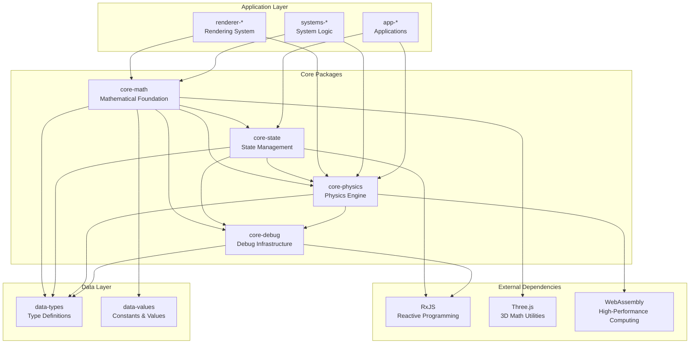
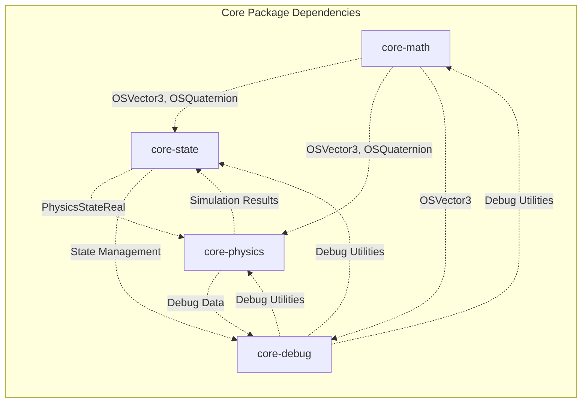
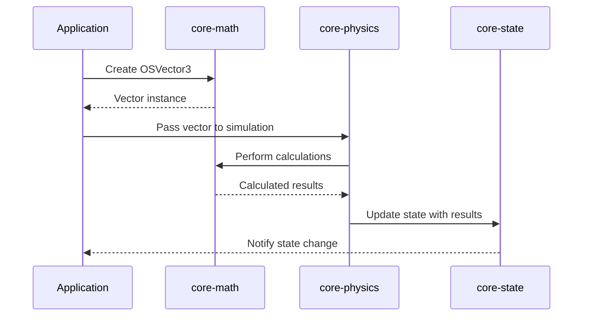
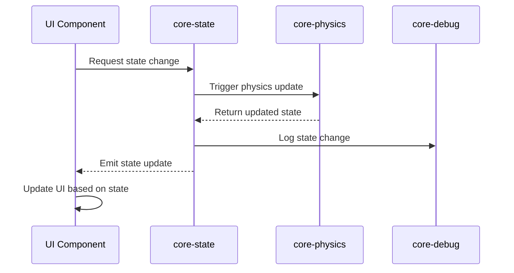
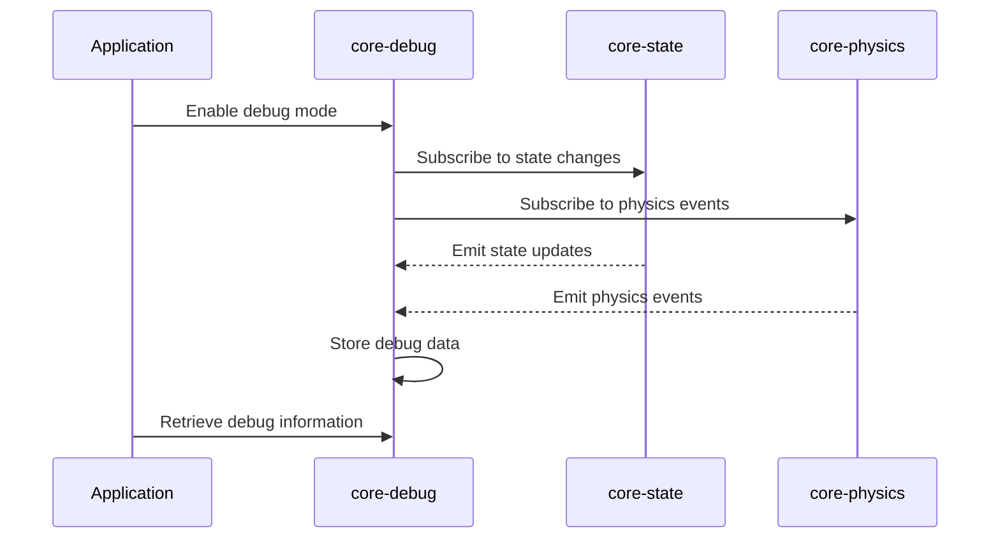
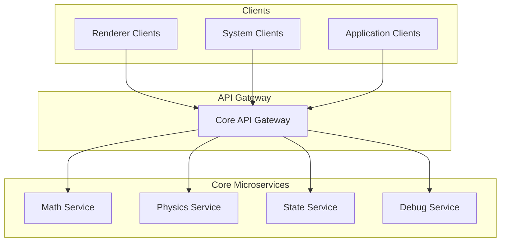

# ARCHITECTURE.md

Technical architecture documentation for the Teskooano Core packages.

## Overview

The Teskooano Core packages form the foundational layer of the simulation engine, providing essential mathematical operations, physics simulation, state management, and debugging infrastructure. This document describes the technical architecture, design patterns, and integration strategies used across all core packages.

## System Architecture

### High-Level Architecture



### Package Dependencies



## Design Patterns

### 1. Layered Architecture

The core packages follow a strict layered architecture where each layer depends only on layers below it:

```
┌─────────────────────────────────────┐
│           Application Layer         │
│        (apps, renderer, systems)    │
├─────────────────────────────────────┤
│            Core Layer               │
│     (math, physics, state, debug)   │
├─────────────────────────────────────┤
│            Data Layer               │
│        (data-types, data-values)    │
├─────────────────────────────────────┤
│         External Dependencies       │
│     (RxJS, Three.js, WebAssembly)   │
└─────────────────────────────────────┘
```

### 2. Dependency Injection

Core packages use dependency injection to maintain loose coupling:

```typescript
// Example: Physics package injecting math dependencies
class SimulationManager {
  constructor(
    private mathUtils: MathUtils,
    private stateAdapter: PhysicsSystemAdapter,
  ) {}
}

// Example: Debug package injecting state dependencies
class CelestialDebugger {
  constructor(
    private stateService: FlatHierarchyService,
    private physicsAdapter: PhysicsSystemAdapter,
  ) {}
}
```

### 3. Strategy Pattern

The physics package uses the strategy pattern for algorithm selection:

```typescript
interface ForceCalculationAlgorithm {
  calculateAcceleration(
    targetBody: PhysicsStateReal,
    allBodies: PhysicsStateReal[],
    config: AlgorithmConfig,
  ): OSVector3;
}

class AlgorithmFactory {
  static createAlgorithm(
    algorithmType: AlgorithmType,
    dependencies: AlgorithmDependencies,
  ): ForceCalculationAlgorithm;
}
```

### 4. Observer Pattern

State management uses RxJS observables for reactive programming:

```typescript
class CelestialStore {
  private readonly _celestialObjects$ = new BehaviorSubject<
    Record<string, CelestialObject>
  >({});

  public get celestialObjects$(): Observable<Record<string, CelestialObject>> {
    return this._celestialObjects$.asObservable();
  }
}
```

### 5. Singleton Pattern

Debug utilities use singleton pattern for global access:

```typescript
class CelestialDebugger {
  private static instance: CelestialDebugger;

  public static getInstance(): CelestialDebugger {
    if (!CelestialDebugger.instance) {
      CelestialDebugger.instance = new CelestialDebugger();
    }
    return CelestialDebugger.instance;
  }
}
```

## Data Flow Architecture

### 1. Mathematical Operations Flow



### 2. State Management Flow



### 3. Debug Monitoring Flow



## Performance Architecture

### 1. Memory Management

#### Vector Pooling

```typescript
class VectorPool {
  private static pool: OSVector3[] = [];

  static get(): OSVector3 {
    return this.pool.pop() || new OSVector3();
  }

  static release(vector: OSVector3): void {
    vector.setZero();
    this.pool.push(vector);
  }
}
```

#### In-Memory Caching

```typescript
class CelestialDebugger {
  private dataCache: Map<string, CelestialDebugCache> = new Map();

  // Fast in-memory access without localStorage overhead
  public getDebugData(objectId: string): CelestialDebugCache | undefined {
    return this.dataCache.get(objectId);
  }
}
```

### 2. Computational Optimization

#### Algorithm Selection

```typescript
class AlgorithmFactory {
  static selectOptimalAlgorithm(bodyCount: number): AlgorithmType {
    if (bodyCount <= 100) return "direct";
    if (bodyCount <= 1000) return "barnes-hut";
    if (bodyCount <= 10000) return "tree-pm";
    return "fmm";
  }
}
```

#### WASM Integration

```typescript
class SpatialPartitioning {
  private wasmModule: WebAssembly.Module;

  async initialize(): Promise<void> {
    this.wasmModule = await WebAssembly.instantiate(wasmBytes);
  }

  findNeighbors(bodyId: string): string[] {
    // High-performance spatial operations in WASM
    return this.wasmModule.exports.findNeighbors(bodyId);
  }
}
```

### 3. Reactive Performance

#### Selective Subscriptions

```typescript
class StateSubscriptionMixin {
  private subscriptions: Subscription[] = [];

  subscribeToProperty<T>(
    observable: Observable<T>,
    propertyName: string,
    callback: (value: T) => void,
  ): void {
    const subscription = observable
      .pipe(
        distinctUntilChanged(),
        debounceTime(16), // 60 FPS throttling
      )
      .subscribe(callback);

    this.subscriptions.push(subscription);
  }
}
```

## Error Handling Architecture

### 1. Graceful Degradation

```typescript
class SimulationManager {
  async simulate(params: SimulationParams): Promise<SimulationResult> {
    try {
      return await this.executeSimulation(params);
    } catch (error) {
      this.logger.error("Simulation failed, falling back to ideal mode", error);
      return this.fallbackToIdealMode(params);
    }
  }
}
```

### 2. Validation Layers

```typescript
class PhysicsStateValidator {
  static validateState(state: PhysicsStateReal): ValidationResult {
    const errors: string[] = [];

    if (!state.position.isFinite()) {
      errors.push("Position contains invalid values");
    }

    if (state.mass_kg <= 0) {
      errors.push("Mass must be positive");
    }

    return {
      isValid: errors.length === 0,
      errors,
    };
  }
}
```

### 3. Debug Integration

```typescript
class ErrorHandler {
  constructor(private debugger: CelestialDebugger) {}

  handleError(error: Error, context: string): void {
    if (isVisualizationEnabled()) {
      this.debugger.setErrorData(context, {
        message: error.message,
        stack: error.stack,
        timestamp: Date.now()
      });
    }

    this.logger.error(`Error in ${context}:`, error);
  }
}
```

## Testing Architecture

### 1. Unit Testing Strategy

```typescript
// Example: Math package unit tests
describe("OSVector3", () => {
  it("should perform vector addition correctly", () => {
    const v1 = new OSVector3(1, 2, 3);
    const v2 = new OSVector3(4, 5, 6);
    const result = v1.add(v2);

    expect(result.x).toBe(5);
    expect(result.y).toBe(7);
    expect(result.z).toBe(9);
  });
});
```

### 2. Integration Testing

```typescript
// Example: Cross-package integration tests
describe("Physics-State Integration", () => {
  it("should update state after physics simulation", async () => {
    const physicsManager = new SimulationManager();
    const stateAdapter = new PhysicsSystemAdapter();

    const result = await physicsManager.simulate(testParams);
    stateAdapter.updatePhysicsStates(result.states);

    const updatedState = stateAdapter.getPhysicsStates();
    expect(updatedState).toHaveLength(result.states.length);
  });
});
```

### 3. Performance Testing

```typescript
// Example: Performance benchmarks
describe("Algorithm Performance", () => {
  it("should scale linearly with body count", () => {
    const bodyCounts = [100, 500, 1000, 5000];
    const results = bodyCounts.map((count) => {
      const bodies = generateTestBodies(count);
      const start = performance.now();
      algorithm.calculateForces(bodies);
      return performance.now() - start;
    });

    // Verify O(N log N) scaling
    expect(results[3] / results[1]).toBeLessThan(10);
  });
});
```

## Security Architecture

### 1. Input Validation

```typescript
class InputValidator {
  static validatePhysicsState(input: any): PhysicsStateReal {
    if (!input || typeof input !== "object") {
      throw new Error("Invalid input: must be an object");
    }

    if (typeof input.mass_kg !== "number" || input.mass_kg <= 0) {
      throw new Error("Invalid mass: must be a positive number");
    }

    return input as PhysicsStateReal;
  }
}
```

### 2. Resource Limits

```typescript
class ResourceManager {
  private static readonly MAX_BODIES = 10000;
  private static readonly MAX_DEBUG_DATA = 1000;

  static validateBodyCount(count: number): void {
    if (count > this.MAX_BODIES) {
      throw new Error(`Body count ${count} exceeds maximum ${this.MAX_BODIES}`);
    }
  }
}
```

## Monitoring and Observability

### 1. Performance Metrics

```typescript
class PerformanceMonitor {
  private metrics: Map<string, number[]> = new Map();

  recordMetric(name: string, value: number): void {
    if (!this.metrics.has(name)) {
      this.metrics.set(name, []);
    }

    const values = this.metrics.get(name)!;
    values.push(value);

    // Keep only last 100 values
    if (values.length > 100) {
      values.shift();
    }
  }

  getAverageMetric(name: string): number {
    const values = this.metrics.get(name) || [];
    return values.reduce((sum, val) => sum + val, 0) / values.length;
  }
}
```

### 2. Health Checks

```typescript
class HealthChecker {
  async checkSystemHealth(): Promise<HealthStatus> {
    const checks = await Promise.all([
      this.checkMathPackage(),
      this.checkPhysicsPackage(),
      this.checkStatePackage(),
      this.checkDebugPackage(),
    ]);

    return {
      overall: checks.every((check) => check.healthy),
      packages: checks,
    };
  }
}
```

## Future Architecture Considerations

### 1. Microservices Migration

The current monolithic core packages could be split into microservices:



### 2. Event-Driven Architecture

Implement event-driven communication between packages:

```typescript
interface CoreEvent {
  type: string;
  payload: any;
  timestamp: number;
  source: string;
}

class EventBus {
  private subscribers: Map<string, Function[]> = new Map();

  publish(event: CoreEvent): void {
    const handlers = this.subscribers.get(event.type) || [];
    handlers.forEach((handler) => handler(event));
  }

  subscribe(eventType: string, handler: Function): void {
    if (!this.subscribers.has(eventType)) {
      this.subscribers.set(eventType, []);
    }
    this.subscribers.get(eventType)!.push(handler);
  }
}
```

### 3. Plugin Architecture

Enable dynamic loading of core functionality:

```typescript
interface CorePlugin {
  name: string;
  version: string;
  initialize(): Promise<void>;
  destroy(): Promise<void>;
}

class PluginManager {
  private plugins: Map<string, CorePlugin> = new Map();

  async loadPlugin(plugin: CorePlugin): Promise<void> {
    await plugin.initialize();
    this.plugins.set(plugin.name, plugin);
  }
}
```

## Conclusion

The Teskooano Core packages architecture provides a solid foundation for the simulation engine with clear separation of concerns, performance optimization, and extensibility. The layered architecture ensures maintainability while the reactive patterns enable efficient state management and debugging capabilities.

Key architectural strengths:

- **Modularity**: Clear package boundaries with well-defined interfaces
- **Performance**: Optimized algorithms and memory management
- **Testability**: Comprehensive testing strategies at all levels
- **Extensibility**: Plugin-ready architecture for future enhancements
- **Observability**: Built-in monitoring and debugging capabilities

This architecture supports the current requirements while providing a path for future scalability and feature expansion.
