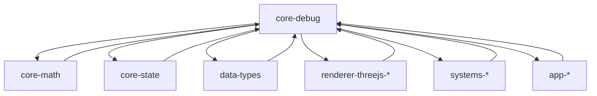

# AGENTS.md

A comprehensive guide for AI coding agents working on the Teskooano Core Debug package.

## Package Overview

The **`@teskooano/core-debug`** package is the centralized debugging and development utilities system for the Teskooano engine. It provides comprehensive debugging tools, logging infrastructure, and visualization helpers that enable developers to inspect, monitor, and troubleshoot the simulation engine during development and testing.

### Purpose

- **Centralized Debug Configuration**: Global settings for log levels, visualization, and debugging behavior
- **Comprehensive Logging**: Multi-level logging system with module-specific loggers and performance timing
- **Vector Debugging**: Specialized tools for debugging OSVector3 and THREE.Vector3 operations
- **Celestial Object Debugging**: Rich debugging data for celestial objects including physics, orbital, and material properties
- **Performance Monitoring**: Built-in timing and performance analysis tools
- **State Inspection**: Tools for examining global simulation state and hierarchy

## Setup Commands

### Prerequisites

- Install [moon](https://moonrepo.dev/) and [proto](https://moonrepo.dev/proto) for task running and dependency management
- Node.js 24.2.0 (specified in package.json engines)

### Installation & Development

```bash
# Install dependencies
proto use

# Run tests
moon run debug:test

# Build package
moon run debug:build

# Lint code
npm run lint
```

## Package Architecture

### Directory Structure

```
src/
├── debug-config.ts           # Global debug configuration and enums
├── logger.ts                 # Multi-level logging system with timing
├── vector-debug.ts           # OSVector3 debugging utilities
├── three-vector-debug.ts     # THREE.Vector3 debugging utilities
├── celestial-debug.ts        # Celestial object debugging system
├── global-state-debug.ts     # Global simulation state monitoring
└── index.ts                  # Main package entry point
```

### Design Principles

#### 1. Performance-First Design

All debugging operations are guarded by configuration checks to ensure zero performance impact in production:

```typescript
if (isVisualizationEnabled()) {
  // Expensive debug operations only run when needed
  celestialDebugger.setPhysicsData(objectId, physicsData);
}
```

#### 2. Centralized Configuration

Global debug behavior controlled through a single configuration object:

```typescript
export const debugConfig: DebugConfig = {
  level:
    process.env.NODE_ENV === "production" ? DebugLevel.ERROR : DebugLevel.INFO,
  visualize: process.env.NODE_ENV !== "production",
  logging: process.env.NODE_ENV !== "production",
};
```

#### 3. In-Memory Caching

Debug data is stored in performant in-memory caches to avoid localStorage performance bottlenecks:

```typescript
private dataCache: Map<string, CelestialDebugCache> = new Map();
```

#### 4. Modular Architecture

Each debug utility is self-contained and can be used independently:

- **Vector Debugging**: For mathematical vector operations
- **Celestial Debugging**: For celestial object inspection
- **Global State Debugging**: For simulation state monitoring
- **Logging**: For development and troubleshooting

## Code Style & Conventions

### TypeScript Standards

- **Strict Mode**: Always use strict TypeScript configuration
- **Type Safety**: All interfaces are properly typed with no `any` types
- **JSDoc**: Comprehensive documentation for all public methods
- **Minimal Dependencies**: Only essential dependencies for debugging functionality

### Code Style

- **Indentation**: Use 2-space indentation
- **Naming**:
  - `PascalCase` for classes, interfaces, and types
  - `camelCase` for properties and methods
  - `UPPER_CASE` for constants
- **File Size**: Keep files focused and under 500 lines
- **Performance**: Always check debug flags before expensive operations

### Import Patterns

- **Static Imports**: Use ES import statements at the top of files
- **Barrel Exports**: Use index.ts files for clean imports
- **Path Aliases**: Use `@teskooano/*` aliases when available

## Key Components

### Debug Configuration

#### DebugConfig (`debug-config.ts`)

Global configuration for all debugging behavior:

```typescript
export interface DebugConfig {
  level: DebugLevel; // Current debug level
  visualize: boolean; // Whether to display debug visuals
  logging: boolean; // Whether to log debug messages to console
}
```

#### DebugLevel Enum

Hierarchical debug levels for controlling verbosity:

```typescript
export enum DebugLevel {
  OFF = 0, // No debugging
  ERROR = 1, // Only errors
  WARN = 2, // Warnings and errors
  INFO = 3, // Info, warnings, and errors
  DEBUG = 4, // Debug, info, warnings, and errors
  TRACE = 5, // All debug information
}
```

### Logging System

#### Logger (`logger.ts`)

Comprehensive logging system with multiple levels and performance timing:

```typescript
export function createLogger(moduleName: string) {
  return {
    error: (message: string, ...args: any[]) =>
      error(`[${moduleName}] ${message}`, ...args),
    warn: (message: string, ...args: any[]) =>
      warn(`[${moduleName}] ${message}`, ...args),
    info: (message: string, ...args: any[]) =>
      info(`[${moduleName}] ${message}`, ...args),
    debug: (message: string, ...args: any[]) =>
      debug(`[${moduleName}] ${message}`, ...args),
    trace: (message: string, ...args: any[]) =>
      trace(`[${moduleName}] ${message}`, ...args),
    time: <T>(operationName: string, fn: () => T) =>
      timeExecution(`${moduleName}:${operationName}`, fn),
  };
}
```

**Features:**

- **Module-Specific Loggers**: Create named loggers for different components
- **Performance Timing**: Built-in timing for expensive operations
- **Level-Based Filtering**: Only log messages at or below the current debug level
- **Console Integration**: Uses native console methods for proper formatting

### Vector Debugging

#### VectorDebug (`vector-debug.ts`)

In-memory storage for OSVector3 debugging:

```typescript
export class VectorDebug {
  private _vectors: Map<string, Record<string, OSVector3>> = new Map();

  public setVector(name: string, key: string, vector: OSVector3): void;
  public getVector(name: string, key: string): OSVector3 | undefined;
  public getVectors(name: string): Record<string, OSVector3> | undefined;
  public clearVectors(name: string): void;
  public clearAll(): void;
}
```

#### ThreeVectorDebug (`three-vector-debug.ts`)

THREE.js vector debugging with automatic conversion:

```typescript
export class ThreeVectorDebug {
  public setVector(name: string, key: string, vector: THREE.Vector3): void;
  public setVectors(name: string, vectors: Record<string, THREE.Vector3>): void;
  public getVector(
    name: string,
    key: string,
  ): { x: number; y: number; z: number } | undefined;
  public getVectors(
    name: string,
  ): Record<string, { x: number; y: number; z: number }> | undefined;
}
```

### Celestial Object Debugging

#### CelestialDebugger (`celestial-debug.ts`)

Comprehensive debugging system for celestial objects:

```typescript
export class CelestialDebugger {
  private dataCache: Map<string, CelestialDebugCache> = new Map();

  public setVectors(objectId: string, vectors: CelestialVectorPairs): void;
  public setOrbitalData(objectId: string, data: OrbitalDebugData): void;
  public setMaterialData(objectId: string, data: MaterialDebugData): void;
  public setPhysicsData(objectId: string, data: PhysicsDebugData): void;
  public setLightingData(objectId: string, data: LightingDebugData): void;
  public getDebugData(objectId: string): CelestialDebugCache | undefined;
  public getTrackedObjectIds(): string[];
  public getSystemHierarchy(): SystemHierarchyNode[];
  public getHierarchyDebugInfo(): HierarchyDebugInfo;
  public getHierarchyStats(): HierarchyStats;
}
```

**Debug Data Types:**

- **OrbitalDebugData**: Semi-major axis, eccentricity, inclination, etc.
- **MaterialDebugData**: Shader type, parameters, textures
- **PhysicsDebugData**: Mass, density, radius, gravity, escape velocity
- **LightingDebugData**: Light source, intensity, color, temperature

### Global State Debugging

#### GlobalStateDebugger (`global-state-debug.ts`)

Reactive monitoring of global simulation state:

```typescript
export class GlobalStateDebugger {
  private readonly _globalState$ = new BehaviorSubject<SimulationState | null>(
    null,
  );

  public get globalState$(): Observable<SimulationState | null>;
  public startMonitoring(): void;
  public stopMonitoring(): void;
  public dispose(): void;
}
```

**Features:**

- **Reactive State**: Observable stream of global simulation state
- **Performance Guarded**: Only monitors when debugging is enabled
- **Automatic Cleanup**: Proper disposal of resources

## Usage Examples

### Basic Logging

```typescript
import {
  createLogger,
  isDebugEnabled,
  DebugLevel,
} from "@teskooano/core-debug";

// Create module-specific logger
const physicsLogger = createLogger("PhysicsEngine");

// Basic logging
physicsLogger.info("Physics system started");
physicsLogger.warn("Potential issue detected: Resource limit approaching");
physicsLogger.error("Failed to load critical resource", {
  id: "config.json",
  status: 404,
});

// Conditional debug logging
if (isDebugEnabled(DebugLevel.DEBUG)) {
  physicsLogger.debug("Processing item", {
    itemId: 123,
    data: { value: "example" },
  });
}

// Performance timing
physicsLogger.time("integrateVelocities", () => {
  // Perform expensive physics calculations...
  for (let i = 0; i < 1e6; i++) {
    Math.sqrt(i);
  }
});
// Output: [PhysicsEngine] INFO: integrateVelocities took 15.23ms
```

### Vector Debugging

```typescript
import {
  vectorDebug,
  threeVectorDebug,
  isVisualizationEnabled,
} from "@teskooano/core-debug";
import { OSVector3 } from "@teskooano/core-math";
import * as THREE from "three";

const objId = "planet-x";

// OSVector3 debugging
if (isVisualizationEnabled()) {
  vectorDebug.setVector(objId, "position", new OSVector3(100, 0, 0));
  vectorDebug.setVector(objId, "velocity", new OSVector3(0, 10, 0));
}

// Retrieve vectors
const pos = vectorDebug.getVector(objId, "position");
if (pos) {
  console.log(`Position of ${objId}:`, pos.toString());
}

// THREE.js vector debugging
const sunDirection = new THREE.Vector3(1, 0, 0);
const upDirection = new THREE.Vector3(0, 1, 0);

if (isVisualizationEnabled()) {
  threeVectorDebug.setVectors("mesh-alpha", {
    sunDir: sunDirection,
    localUp: upDirection,
  });
}

// Retrieve THREE.js vectors
const debugData = threeVectorDebug.getVectors("mesh-alpha");
if (debugData) {
  console.log(`Sun direction:`, debugData.sunDir);
}
```

### Celestial Object Debugging

```typescript
import {
  celestialDebugger,
  isVisualizationEnabled,
} from "@teskooano/core-debug";

const objectId = "earth";

if (isVisualizationEnabled()) {
  // Store physics data
  celestialDebugger.setPhysicsData(objectId, {
    mass: 5.972e24,
    radius: 6371000,
    density: 5514,
  });

  // Store orbital data
  celestialDebugger.setOrbitalData(objectId, {
    semiMajorAxis: 149.6e9,
    eccentricity: 0.0167,
  });

  // Store material data
  celestialDebugger.setMaterialData(objectId, {
    type: "terrestrial",
    shaderType: "procedural",
    parameters: { noiseScale: 0.1, colorPalette: "earth-like" },
  });
}

// Retrieve debug data
const allDebugData = celestialDebugger.getDebugData(objectId);
if (allDebugData) {
  console.log(`Physics data:`, allDebugData.physics);
  console.log(`Orbital data:`, allDebugData.orbital);
  console.log(`Material data:`, allDebugData.material);
}

// Get system hierarchy
const hierarchy = celestialDebugger.getSystemHierarchy();
console.log("System hierarchy:", hierarchy);

// Get hierarchy statistics
const stats = celestialDebugger.getHierarchyStats();
console.log("Hierarchy stats:", stats);
```

### Global State Monitoring

```typescript
import { globalStateDebugger } from "@teskooano/core-debug";

// Subscribe to global state changes
globalStateDebugger.globalState$.subscribe((state) => {
  if (state) {
    console.log("Global state updated:", state);
    console.log("Active objects:", Object.keys(state.celestialObjects));
    console.log("Simulation time:", state.simulationTime);
  }
});

// Start monitoring (if not already started)
globalStateDebugger.startMonitoring();

// Stop monitoring when done
globalStateDebugger.stopMonitoring();
```

## Performance Guidelines

### Debug Flag Usage

Always check debug flags before expensive operations:

```typescript
// ✅ Correct - check flag before expensive operation
if (isVisualizationEnabled()) {
  celestialDebugger.setPhysicsData(objectId, expensivePhysicsData);
}

// ❌ Incorrect - expensive operation always runs
celestialDebugger.setPhysicsData(objectId, expensivePhysicsData);
```

### Memory Management

- **In-Memory Caching**: Debug data is stored in memory for fast access
- **Automatic Cleanup**: Use `clearVectors()` and `clearObjectDebugData()` to prevent memory leaks
- **Singleton Pattern**: Debug services are singletons to avoid multiple instances

### Logging Performance

- **Level Filtering**: Only log messages at or below the current debug level
- **Conditional Logging**: Use `isDebugEnabled()` for expensive debug operations
- **Module Loggers**: Create named loggers to avoid string concatenation overhead

## Testing Strategy

### Test Organization

- **File Convention**: Test files (`<filename>.spec.ts`) adjacent to source files
- **Unit Tests**: Use Vitest for testing individual components
- **Integration Tests**: End-to-end debugging functionality validation
- **Performance Tests**: Memory usage and performance impact validation

### Test Commands

```bash
# Run all tests
moon run debug:test

# Run tests in interactive mode
npm run test

# Run tests with coverage
npm run test -- --coverage
```

### Test Patterns

```typescript
// Test debug configuration
describe("Debug Configuration", () => {
  it("should respect debug level settings", () => {
    debugConfig.level = DebugLevel.INFO;
    expect(isDebugEnabled(DebugLevel.INFO)).toBe(true);
    expect(isDebugEnabled(DebugLevel.DEBUG)).toBe(false);
  });
});

// Test vector debugging
describe("Vector Debugging", () => {
  it("should store and retrieve vectors correctly", () => {
    const vector = new OSVector3(1, 2, 3);
    vectorDebug.setVector("test", "position", vector);

    const retrieved = vectorDebug.getVector("test", "position");
    expect(retrieved).toEqual(vector);
  });
});

// Test celestial debugging
describe("Celestial Debugging", () => {
  it("should store and retrieve celestial debug data", () => {
    const physicsData = { mass: 1000, radius: 10 };
    celestialDebugger.setPhysicsData("test-object", physicsData);

    const debugData = celestialDebugger.getDebugData("test-object");
    expect(debugData?.physics).toEqual(physicsData);
  });
});
```

## Troubleshooting

### Common Issues

#### Performance Impact

```typescript
// ❌ Incorrect - expensive operation always runs
celestialDebugger.setPhysicsData(objectId, expensiveData);

// ✅ Correct - check flag first
if (isVisualizationEnabled()) {
  celestialDebugger.setPhysicsData(objectId, expensiveData);
}
```

#### Memory Leaks

```typescript
// ❌ Incorrect - never clear debug data
vectorDebug.setVector("object", "position", vector);

// ✅ Correct - clear when done
vectorDebug.setVector("object", "position", vector);
// ... later ...
vectorDebug.clearVectors("object");
```

#### Logging Overhead

```typescript
// ❌ Incorrect - expensive string operations always run
logger.debug(`Complex calculation result: ${JSON.stringify(complexObject)}`);

// ✅ Correct - check level first
if (isDebugEnabled(DebugLevel.DEBUG)) {
  logger.debug(`Complex calculation result: ${JSON.stringify(complexObject)}`);
}
```

### Debugging Tips

- **Use Module Loggers**: Create named loggers for better context
- **Check Debug Flags**: Always verify debug flags before expensive operations
- **Clear Debug Data**: Regularly clear debug data to prevent memory leaks
- **Monitor Performance**: Use built-in timing functions to measure performance impact

## Dependencies

### Runtime Dependencies

- **`@teskooano/core-math`**: Vector mathematics (`OSVector3`)
- **`@teskooano/core-state`**: State management and hierarchy services
- **`@teskooano/data-types`**: Type definitions for celestial objects
- **`three`**: THREE.js vector types for rendering debugging

### Development Dependencies

- **`typescript`**: TypeScript compiler (version 5.9.2)
- **`vitest`**: Testing framework (version 3.2.4)
- **`@types/node`**: Node.js type definitions (version 24.5.2)

## Contributing Guidelines

### Before Making Changes

1. **Read Documentation**: Understand the debugging architecture and performance implications
2. **Check Existing Patterns**: Follow established patterns for debug utilities
3. **Consider Performance**: Ensure changes don't impact performance in production
4. **Test Thoroughly**: Write comprehensive tests for new debugging functionality

### Code Review Checklist

- [ ] Follows debug flag checking patterns
- [ ] Implements proper memory management
- [ ] Includes comprehensive tests
- [ ] Maintains performance optimization
- [ ] No breaking changes to existing APIs
- [ ] Proper cleanup and disposal

### Testing Requirements

- [ ] Unit tests for all new debug utilities
- [ ] Performance tests for memory usage
- [ ] Integration tests for debug data flow
- [ ] Edge case tests for error handling

## Integration Points

### Core Packages

- **`@teskooano/core-math`**: Uses OSVector3 for vector debugging
- **`@teskooano/core-state`**: Uses state management for global state debugging
- **`@teskooano/data-types`**: Uses celestial object types for debugging

### Renderer Packages

- **`@teskooano/renderer-threejs-*`**: Uses THREE.js vector debugging for rendering
- **`@teskooano/renderer-threejs-orbits`**: Uses vector debugging for orbit visualization

### System Packages

- **`@teskooano/systems-procedural-generation`**: Uses logging for generation debugging
- **`@teskooano/systems-solar-system`**: Uses celestial debugging for system inspection

### Application Packages

- **`@teskooano/app-simulation`**: Uses global state debugging for simulation monitoring

## Architecture Documentation

### Package Relationships



### Data Flow

```
Debug Request → Debug Flag Check → Debug Operation → In-Memory Storage → Debug UI/Console Output
```

## Scientific References

### Debugging Standards

- **Performance Monitoring**: JavaScript performance measurement best practices
- **Memory Management**: Efficient memory usage patterns for debug data
- **Logging Standards**: Structured logging and log level management
- **State Inspection**: Reactive state monitoring and debugging

### Development Standards

- **Debug Architecture**: Centralized debug configuration and utilities
- **Performance Optimization**: Zero-overhead debugging in production
- **Memory Efficiency**: In-memory caching and automatic cleanup
- **Modular Design**: Self-contained debug utilities

---

**Remember**: This package is the debugging foundation for the entire Teskooano system. Always follow established debugging patterns, maintain performance optimization, and ensure zero impact in production. Changes to debugging utilities can affect development workflow, so thorough testing and documentation are essential.
