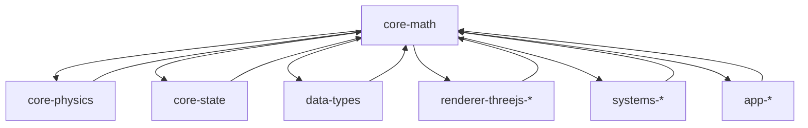

# AGENTS.md

A comprehensive guide for AI coding agents working on the Teskooano Core Math package.

## Package Overview

The **`@teskooano/core-math`** package is the mathematical foundation of the Teskooano engine, providing essential mathematical types, constants, and utility functions. It serves as the core mathematical library for physics calculations, 3D transformations, and coordinate system operations throughout the entire simulation engine.

### Purpose

- **Mathematical Foundation**: Core mathematical types and operations for the entire engine
- **3D Vector Mathematics**: Custom 3D vector class with comprehensive operations
- **Coordinate System**: Right-handed Y-up coordinate system with Three.js interoperability
- **Performance Optimization**: Allocation-free operations and efficient mathematical functions
- **Type Safety**: Full TypeScript type safety with comprehensive test coverage

## Setup Commands

### Prerequisites

- Install [moon](https://moonrepo.dev/) and [proto](https://moonrepo.dev/proto) for task running and dependency management
- Node.js 24.2.0 (specified in package.json engines)

### Installation & Development

```bash
# Install dependencies
proto use

# Run tests
moon run math:test

# Build package
moon run math:build

# Lint code
npm run lint
```

## Package Architecture

### Directory Structure

```
src/
├── OSVector3.ts              # Custom 3D vector class with comprehensive operations
├── OSQuaternion.ts           # Quaternion class for 3D rotations
├── OSMatrix3.ts              # 3x3 matrix class for 2D transformations
├── OSMatrix4.ts              # 4x4 matrix class for 3D transformations
├── constants.ts              # Mathematical constants (PI, EPSILON, etc.)
├── random.ts                 # Seeded random number generation
├── epoch.ts                  # Astronomical epoch utilities and validation
├── utils/
│   ├── index.ts              # Mathematical utility functions
│   └── index.spec.ts         # Utility function tests
├── coordinate-system.test.ts # Coordinate system validation tests
├── index.ts                  # Main package entry point
└── *.spec.ts                 # Test files for all components
```

### Design Principles

#### 1. Mathematical Foundation

- **Custom Math Types**: Independent mathematical types (OSVector3, OSQuaternion, OSMatrix3/4)
- **Three.js Interoperability**: Conversion methods for rendering engine integration
- **Performance Focus**: Allocation-free operations and efficient algorithms
- **Type Safety**: Comprehensive TypeScript interfaces with no `any` types

#### 2. Coordinate System

- **Right-Handed System**: Consistent right-handed coordinate system throughout
- **Y-Up Orientation**: Y-axis points up, X-axis points right, Z-axis points forward
- **Cross Product Validation**: Ensures X × Y = Z, Y × Z = X, Z × X = Y
- **Rotation Consistency**: All rotations follow right-handed convention

#### 3. Performance Optimization

- **Allocation-Free Operations**: In-place operations to minimize garbage collection
- **Efficient Algorithms**: Optimized mathematical operations for performance
- **Memory Management**: Reusable objects and efficient data structures
- **Batch Operations**: Support for bulk mathematical operations

#### 4. Scientific Accuracy

- **Astronomical Standards**: J2000 epoch and Julian Day calculations
- **Precision Handling**: Proper floating-point precision management
- **Epoch Validation**: Comprehensive epoch consistency checking
- **Mathematical Constants**: Standard mathematical constants with proper precision

## Code Style & Conventions

### TypeScript Standards

- **Strict Mode**: Always use strict TypeScript configuration
- **Type Safety**: All interfaces are properly typed with no `any` types
- **JSDoc**: Comprehensive documentation with mathematical formulas
- **Minimal Dependencies**: Only essential dependencies (Three.js for interoperability)

### Code Style

- **Indentation**: Use 2-space indentation
- **Naming**:
  - `PascalCase` for classes, interfaces, and types
  - `camelCase` for properties and methods
  - `UPPER_CASE` for constants
- **File Size**: Keep files focused and under 400 lines
- **Mathematical Notation**: Use clear mathematical variable names

### Import Patterns

- **Static Imports**: Use ES import statements at the top of files
- **Barrel Exports**: Use index.ts files for clean imports
- **Path Aliases**: Use `@teskooano/*` aliases when available

## Key Components

### Core Math Types

#### OSVector3 (`OSVector3.ts`)

The primary 3D vector class for all spatial calculations:

```typescript
export class OSVector3 {
  public x: number;
  public y: number;
  public z: number;

  // Core operations
  constructor(x?: number, y?: number, z?: number);
  clone(): OSVector3;
  set(x: number, y: number, z: number): OSVector3;
  copy(v: OSVector3): OSVector3;

  // Vector operations
  add(v: OSVector3): OSVector3;
  sub(v: OSVector3): OSVector3;
  multiplyScalar(scalar: number): OSVector3;
  divideScalar(scalar: number): OSVector3;

  // Mathematical operations
  length(): number;
  lengthSq(): number;
  normalize(): OSVector3;
  dot(v: OSVector3): number;
  cross(v: OSVector3): OSVector3;

  // Advanced operations
  lerp(v: OSVector3, alpha: number): OSVector3;
  angleTo(v: OSVector3): number;
  projectOnVector(v: OSVector3): OSVector3;
  reflect(normal: OSVector3): OSVector3;

  // Utility operations
  addScaledVector(v: OSVector3, scalar: number): OSVector3;
  subScaledVector(v: OSVector3, scalar: number): OSVector3;
  negate(): OSVector3;
  setFromArray(array: number[], offset?: number): OSVector3;
  toArray(): [number, number, number];
  isFinite(): boolean;
  setZero(): OSVector3;

  // Three.js interoperability
  toThreeJS(target?: Vector3): Vector3;
  static fromThreeJS(v: Vector3): OSVector3;
  applyQuaternion(q: OSQuaternion): OSVector3;
}
```

#### OSQuaternion (`OSQuaternion.ts`)

Quaternion class for 3D rotations:

```typescript
export class OSQuaternion {
  public x: number;
  public y: number;
  public z: number;
  public w: number;

  // Core operations
  constructor(x?: number, y?: number, z?: number, w?: number);
  clone(): OSQuaternion;
  set(x: number, y: number, z: number, w: number): OSQuaternion;
  copy(q: OSQuaternion): OSQuaternion;

  // Mathematical operations
  dot(q: OSQuaternion): number;
  length(): number;
  lengthSq(): number;
  normalize(): OSQuaternion;
  conjugate(): OSQuaternion;
  invert(): OSQuaternion;

  // Rotation operations
  multiply(q: OSQuaternion): OSQuaternion;
  slerp(qb: OSQuaternion, t: number): OSQuaternion;
  setFromAxisAngle(axis: OSVector3, angle: number): OSQuaternion;
  setFromEuler(euler: OSVector3, order: "XYZ"): OSQuaternion;

  // Three.js interoperability
  toThreeJS(): Quaternion;
  static fromThreeJS(q: Quaternion): OSQuaternion;
}
```

#### OSMatrix3 (`OSMatrix3.ts`)

3x3 matrix class for 2D transformations:

```typescript
export class OSMatrix3 {
  public elements: number[];

  // Core operations
  constructor();
  set(
    n11: number,
    n12: number,
    n13: number,
    n21: number,
    n22: number,
    n23: number,
    n31: number,
    n32: number,
    n33: number,
  ): OSMatrix3;
  identity(): OSMatrix3;
  clone(): OSMatrix3;
  copy(m: OSMatrix3): OSMatrix3;

  // Mathematical operations
  multiplyScalar(s: number): OSMatrix3;
  determinant(): number;
  invert(): OSMatrix3;
  transpose(): OSMatrix3;

  // Three.js interoperability
  toThreeJS(): Matrix3;
  static fromThreeJS(m: Matrix3): OSMatrix3;
}
```

#### OSMatrix4 (`OSMatrix4.ts`)

4x4 matrix class for 3D transformations:

```typescript
export class OSMatrix4 {
  public elements: number[];

  // Core operations
  constructor();
  set(
    n11: number,
    n12: number,
    n13: number,
    n14: number,
    n21: number,
    n22: number,
    n23: number,
    n24: number,
    n31: number,
    n32: number,
    n33: number,
    n34: number,
    n41: number,
    n42: number,
    n43: number,
    n44: number,
  ): OSMatrix4;
  identity(): OSMatrix4;
  clone(): OSMatrix4;
  copy(m: OSMatrix4): OSMatrix4;

  // Transformation operations
  makeRotationFromQuaternion(q: OSQuaternion): OSMatrix4;
  lookAt(eye: OSVector3, target: OSVector3, up: OSVector3): OSMatrix4;
  makePerspective(
    left: number,
    right: number,
    top: number,
    bottom: number,
    near: number,
    far: number,
  ): OSMatrix4;
  makeOrthographic(
    left: number,
    right: number,
    top: number,
    bottom: number,
    near: number,
    far: number,
  ): OSMatrix4;

  // Mathematical operations
  multiply(m: OSMatrix4): OSMatrix4;
  transpose(): OSMatrix4;
  determinant(): number;
  invert(): OSMatrix4;

  // Three.js interoperability
  toThreeJS(): Matrix4;
  static fromThreeJS(m: Matrix4): OSMatrix4;
}
```

### Mathematical Constants (`constants.ts`)

Essential mathematical constants:

```typescript
export const EPSILON = 0.000001; // Smallest positive number for comparisons
export const PI = Math.PI; // Mathematical constant π
export const TWO_PI = PI * 2; // 2π for circular calculations
export const HALF_PI = PI / 2; // π/2 for right-angle calculations
export const DEG_TO_RAD = PI / 180; // Degrees to radians conversion
```

### Random Number Generation (`random.ts`)

Seeded pseudo-random number generators:

```typescript
// Synchronous seeded random generator
export function createSeededRandomSync(seed: string): () => number;

// Asynchronous seeded random generator using Web Crypto API
export async function createSeededRandom(seed: string): Promise<() => number>;
```

### Epoch Utilities (`epoch.ts`)

Astronomical epoch management and validation:

```typescript
// Epoch constants
export const J2000_EPOCH = "J2000";
export const J2000_JULIAN_DAY = 2451545.0;

// Epoch functions
export function getCurrentEpoch(): string;
export function getCurrentPreciseEpoch(): string;
export function getCurrentJulianDay(): number;
export function dateToJulianDay(date: Date): number;
export function julianDayToYearsSinceJ2000(julianDay: number): number;
export function yearsSinceJ2000ToJulianDay(years: number): number;
export function getJulianDayForEpoch(epoch: string): number;

// Validation and analysis
export function validateEpochConsistency<T>(
  objects: Array<{ name: string; orbit?: { epoch: string } }>,
): EpochValidationResult;
export function generateEpochSummary<T>(
  objects: Array<{ orbit?: { epoch: string } }>,
): EpochSummary;
export function calculateProcessingStats(
  processedObjects: Map<string, EpochProcessingInfo>,
): EpochProcessingStats;
export function logEpochAnalysis<T>(
  objects: Array<{ name: string; orbit?: { epoch: string } }>,
  title?: string,
): void;
export function logProcessingStats(
  stats: EpochProcessingStats,
  title?: string,
): void;
```

### Utility Functions (`utils/index.ts`)

Mathematical utility functions:

```typescript
// Mathematical operations
export function clamp(value: number, min: number, max: number): number;
export function lerp(start: number, end: number, t: number): number;
export function degToRad(degrees: number): number;
export function radToDeg(radians: number): number;
export function equals(a: number, b: number, epsilon?: number): boolean;

// Power of two operations
export function isPowerOfTwo(value: number): boolean;
export function ceilPowerOfTwo(value: number): number;
export function floorPowerOfTwo(value: number): number;
export function nearestPowerOfTwo(value: number): number;

// General utilities
export function uuid4(): string;

// Function modifiers
export function debounce<T extends (...args: any[]) => any>(
  func: T,
  wait: number,
): (...args: Parameters<T>) => void;
export function throttle<T extends (...args: any[]) => any>(
  func: T,
  limit: number,
): (...args: Parameters<T>) => void;
export function memoize<T extends (...args: any[]) => any>(
  func: T,
): (...args: Parameters<T>) => ReturnType<T>;
```

## Testing Strategy

### Test Organization

- **File Convention**: Test files (`<filename>.spec.ts`) adjacent to source files
- **Unit Tests**: Use Vitest for testing individual components
- **Coordinate System Tests**: Comprehensive validation of right-handed coordinate system
- **Three.js Compatibility**: Tests for interoperability with Three.js types
- **Mathematical Accuracy**: Tests for mathematical precision and edge cases

### Test Commands

```bash
# Run all tests
moon run math:test

# Run tests in interactive mode
npm run test

# Run tests with coverage
npm run test -- --coverage
```

### Test Patterns

```typescript
// Test vector operations
describe("OSVector3", () => {
  it("should perform vector addition correctly", () => {
    const v1 = new OSVector3(1, 2, 3);
    const v2 = new OSVector3(4, 5, 6);
    v1.add(v2);
    expect(v1.x).toBe(5);
    expect(v1.y).toBe(7);
    expect(v1.z).toBe(9);
  });
});

// Test coordinate system consistency
describe("Coordinate System", () => {
  it("should maintain right-handed cross product", () => {
    const x = new OSVector3(1, 0, 0);
    const y = new OSVector3(0, 1, 0);
    const cross = x.clone().cross(y);
    expect(cross.z).toBeCloseTo(1, 10);
  });
});

// Test Three.js interoperability
describe("Three.js Compatibility", () => {
  it("should convert to Three.js Vector3 correctly", () => {
    const osVector = new OSVector3(1.5, 2.7, -3.2);
    const threeVector = osVector.toThreeJS();
    expect(threeVector.x).toBe(osVector.x);
    expect(threeVector.y).toBe(osVector.y);
    expect(threeVector.z).toBe(osVector.z);
  });
});
```

## Coordinate System

### Right-Handed Coordinate System

The package enforces a consistent right-handed coordinate system:

- **X-axis**: Points to the right
- **Y-axis**: Points up
- **Z-axis**: Points forward (toward the viewer)

### Cross Product Validation

```typescript
// Right-handed cross products
X × Y = Z
Y × Z = X
Z × X = Y

// Left-handed cross products (negative)
Y × X = -Z
Z × Y = -X
X × Z = -Y
```

### Rotation Conventions

All rotations follow the right-handed convention:

- Positive angles rotate counter-clockwise when viewed from the positive axis direction
- Quaternion rotations maintain right-handed orientation
- Matrix transformations preserve coordinate system consistency

## Performance Considerations

### Mathematical Performance

- **Allocation-Free Operations**: In-place operations to minimize garbage collection
- **Efficient Algorithms**: Optimized mathematical operations for performance
- **Memory Management**: Reusable objects and efficient data structures
- **Batch Operations**: Support for bulk mathematical operations

### Memory Efficiency

- **In-Place Operations**: Methods modify the object instead of creating new ones
- **Reusable Objects**: Clone methods for creating new instances when needed
- **Efficient Storage**: Column-major matrix storage for optimal memory access
- **Minimal Dependencies**: Only essential dependencies to reduce bundle size

### Bundle Size

- **Tree Shaking**: Individual components can be imported to reduce bundle size
- **Minimal Dependencies**: Only Three.js for interoperability
- **Efficient Imports**: Barrel exports allow for efficient importing
- **No Unused Code**: All exported functions are actively used

## Troubleshooting

### Common Issues

#### Coordinate System Inconsistencies

```typescript
// ❌ Incorrect - mixing coordinate systems
const vector = new OSVector3(1, 0, 0);
const result = vector.cross(new OSVector3(0, 1, 0));
// Result should be (0, 0, 1) in right-handed system

// ✅ Correct - consistent right-handed system
const x = new OSVector3(1, 0, 0);
const y = new OSVector3(0, 1, 0);
const z = x.clone().cross(y);
expect(z.z).toBeCloseTo(1);
```

#### Three.js Conversion Issues

```typescript
// ❌ Incorrect - not handling target parameter
const osVector = new OSVector3(1, 2, 3);
const threeVector = osVector.toThreeJS();

// ✅ Correct - using target for efficiency
const osVector = new OSVector3(1, 2, 3);
const threeVector = new THREE.Vector3();
osVector.toThreeJS(threeVector);
```

#### Mathematical Precision Issues

```typescript
// ❌ Incorrect - using exact equality
expect(vector1.x).toBe(vector2.x);

// ✅ Correct - using approximate equality
expect(vector1.equals(vector2)).toBe(true);
```

### Debugging Tips

- **Check Coordinate System**: Use coordinate system tests to validate consistency
- **Validate Mathematical Operations**: Use comprehensive test suites for accuracy
- **Monitor Performance**: Profile mathematical operations for bottlenecks
- **Three.js Compatibility**: Test interoperability with Three.js types

## Dependencies

### Runtime Dependencies

- **`three`**: Three.js for interoperability (version 0.180.0)

### Development Dependencies

- **`typescript`**: TypeScript compiler (version 5.9.2)
- **`vitest`**: Testing framework (version 3.2.4)
- **`@types/node`**: Node.js type definitions (version 24.5.2)
- **`@types/three`**: Three.js type definitions (version 0.180.0)

## Contributing Guidelines

### Before Making Changes

1. **Read Documentation**: Understand the mathematical principles and coordinate system
2. **Check Existing Patterns**: Follow established patterns for mathematical operations
3. **Consider Performance**: Ensure changes don't impact performance or memory usage
4. **Test Thoroughly**: Write comprehensive tests for new mathematical functionality

### Code Review Checklist

- [ ] Follows right-handed coordinate system conventions
- [ ] Implements proper mathematical operations
- [ ] Includes comprehensive tests
- [ ] Maintains Three.js interoperability
- [ ] No breaking changes to existing APIs
- [ ] Performance impact is minimal

### Testing Requirements

- [ ] Unit tests for all new mathematical operations
- [ ] Coordinate system consistency tests
- [ ] Three.js interoperability tests
- [ ] Performance tests for critical operations
- [ ] Edge case tests for mathematical precision

## Integration Points

### Core Packages

- **`@teskooano/core-physics`**: Uses OSVector3 and OSQuaternion for physics calculations
- **`@teskooano/core-state`**: Uses mathematical types for state management
- **`@teskooano/data-types`**: Provides mathematical type definitions

### Renderer Packages

- **`@teskooano/renderer-threejs-*`**: Uses Three.js interoperability methods
- **`@teskooano/renderer-threejs-core`**: Uses mathematical types for rendering
- **`@teskooano/renderer-threejs-camera`**: Uses mathematical types for camera operations

### System Packages

- **`@teskooano/systems-procedural-generation`**: Uses mathematical types for generation
- **`@teskooano/systems-solar-system`**: Uses mathematical types for solar system data

### Application Packages

- **`@teskooano/app-simulation`**: Uses mathematical types for simulation control
- **`@teskooano/app-ui-plugin`**: Uses mathematical types for UI calculations

## Architecture Documentation

### Package Relationships



### Data Flow

```
Mathematical Operations → OSVector3/OSQuaternion/OSMatrix → Three.js Conversion → Rendering
Physics Calculations → OSVector3 → State Management → UI Updates
System Generation → Mathematical Types → Procedural Generation → Celestial Objects
```

## Scientific References

### Mathematical Standards

- **Linear Algebra**: Standard vector and matrix operations
- **Quaternion Mathematics**: 3D rotation mathematics
- **Coordinate Systems**: Right-handed coordinate system conventions
- **Floating-Point Precision**: IEEE 754 floating-point arithmetic

### Astronomical Standards

- **J2000 Epoch**: International standard astronomical reference
- **Julian Day**: Continuous count of days since January 1, 4713 BC
- **Epoch Validation**: Astronomical epoch consistency checking
- **Time Calculations**: Precise time and date calculations

### Performance Standards

- **Memory Management**: JavaScript memory management best practices
- **Mathematical Optimization**: Efficient mathematical algorithms
- **Allocation Patterns**: Minimizing garbage collection impact
- **Batch Operations**: Efficient bulk mathematical operations

---

**Remember**: This package is the mathematical foundation for the entire Teskooano system. Always follow established mathematical conventions, maintain coordinate system consistency, and ensure performance is optimized. Changes to mathematical operations can have far-reaching effects, so thorough testing and documentation are essential.
