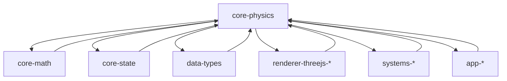

# AGENTS.md

A comprehensive guide for AI coding agents working on the Teskooano Core Physics package.

## Package Overview

The **`@teskooano/core-physics`** package is the comprehensive physics simulation engine for celestial mechanics, featuring dual simulation modes, multiple force calculation algorithms, and advanced numerical integrators. It provides the mathematical foundation for accurate N-body simulations, orbital mechanics, and collision detection in the Teskooano engine.

### Purpose

- **Dual Simulation Modes**: Perfect Keplerian orbits (ideal) and full N-body dynamics
- **Multiple Algorithms**: Direct, Barnes-Hut, FMM, P3M, and Tree-PM hybrid force calculation
- **Advanced Integrators**: Velocity Verlet, RK4, adaptive methods, and symplectic integrators
- **Intelligent Selection**: Automatic algorithm and integrator optimization
- **Real SI Units**: All calculations in meters, kilograms, and seconds
- **Performance Analysis**: Built-in profiling and optimization recommendations

## Setup Commands

### Prerequisites

- Install [moon](https://moonrepo.dev/) and [proto](https://moonrepo.dev/proto) for task running and dependency management
- Node.js 24.2.0 (specified in package.json engines)

### Installation & Development

```bash
# Install dependencies
proto use

# Run tests
moon run physics:test

# Build package
moon run physics:build

# Lint code
npm run lint
```

## Package Architecture

### Directory Structure

```
src/
├── algorithms/                 # Force calculation algorithms
│   ├── algorithm-factory.ts   # Intelligent algorithm selection
│   ├── barnes-hut-algorithm.ts # Barnes-Hut octree implementation
│   ├── fmm-algorithm.ts       # Fast Multipole Method
│   ├── p3m-algorithm.ts       # Particle-Mesh method
│   ├── tree-pm.ts            # Tree-PM hybrid implementation
│   └── neighbor-based-algorithm.ts # Neighbor-based force calculation
├── collision/                 # Collision detection and resolution
│   ├── collision.ts          # Comprehensive collision handling
│   └── collision-service.ts  # WASM-enhanced collision detection
├── forces/                    # Force calculation methods
│   ├── gravity.ts            # Newtonian gravity
│   ├── relativistic.ts       # Relativistic corrections
│   ├── non-gravitational.ts  # Thrust, drag, etc.
│   └── index.ts              # Force calculation utilities
├── integrators/               # Numerical integration methods
│   ├── euler.ts              # Basic Euler methods
│   ├── verlet.ts             # Velocity Verlet (default)
│   ├── rk4.ts                # Runge-Kutta 4th order
│   ├── adaptive.ts           # Adaptive timestep (Dormand-Prince)
│   ├── yoshida.ts            # Symplectic integrators
│   └── ideal.ts              # Analytical Keplerian orbits
├── interfaces/                # Strategy pattern interfaces
│   ├── algorithm-strategy.ts  # Algorithm interface
│   └── simulation-strategy.ts # Simulation interface
├── modes/                     # Simulation mode implementations
│   └── ideal/                # Ideal mode (Keplerian orbits)
│       └── ideal-orrery.ts   # Perfect orbital mechanics
├── orbital/                   # Orbital mechanics calculations
│   ├── kepler.ts             # Kepler's equation solver
│   ├── orbital.ts            # State vector conversions
│   ├── elementsFromState.ts  # Inverse orbital calculations
│   ├── lagrange.ts           # Lagrange point calculations
│   ├── tle.ts                # Two-Line Element support
│   └── helpers.ts            # Orbital utility functions
├── simulation/                # Main simulation orchestration
│   ├── simulation-manager.ts # High-level coordinator
│   ├── prediction.ts         # Trajectory prediction
│   └── types.ts              # Simulation interfaces
├── spatial/                   # Spatial data structures
│   ├── octree.ts             # Barnes-Hut octree
│   ├── spatial-partitioning.ts # WASM spatial partitioning
│   └── celestial-distance-service.ts # Distance calculation service
├── units/                     # Unit constants and conversions
│   ├── constants.ts          # Physical constants
│   └── units.ts              # Unit conversion utilities
├── utils/                     # Utility functions
│   ├── vectorPool.ts         # Memory optimization
│   ├── body-sort.ts          # Hierarchical sorting
│   ├── performance-monitor.ts # Performance tracking
│   └── scaling.ts            # Scaling utilities
├── debug/                     # Debug and validation tools
│   └── orbitalValidation.ts  # Orbital mechanics validation
├── types.ts                   # Core type definitions
└── index.ts                   # Main package entry point
```

### Design Principles

#### 1. Configuration-Driven Design

All simulation behavior is controlled through configuration objects rather than hardcoded behavior:

```typescript
interface SimulationConfiguration {
  mode: "ideal" | "nbody";
  integrator?: IntegratorType;
  algorithm?: AlgorithmType;
}
```

#### 2. Strategy Pattern Implementation

Different algorithms and integrators are implemented as strategies, allowing runtime selection:

- **Algorithm Strategies**: Direct, Barnes-Hut, FMM, P3M, Tree-PM
- **Integration Strategies**: Euler variants, Verlet, RK4, Adaptive, Symplectic methods

#### 3. Intelligent Selection

The `AlgorithmFactory` and `SimulationManager` automatically select optimal configurations based on:

- Body count
- Performance preferences (accuracy vs speed)
- Memory constraints
- System characteristics

#### 4. Real SI Units

All internal calculations use SI units (meters, kg, seconds) for physical accuracy and simplicity.

## Code Style & Conventions

### TypeScript Standards

- **Strict Mode**: Always use strict TypeScript configuration
- **Type Safety**: All interfaces are properly typed with no `any` types
- **JSDoc**: Comprehensive documentation with mathematical formulas
- **Minimal Dependencies**: Only essential dependencies for physics calculations

### Code Style

- **Indentation**: Use 2-space indentation
- **Naming**:
  - `PascalCase` for classes, interfaces, and types
  - `camelCase` for properties and methods
  - `UPPER_CASE` for constants
- **File Size**: Keep files focused and under 500 lines
- **Mathematical Notation**: Use clear mathematical variable names

### Import Patterns

- **Static Imports**: Use ES import statements at the top of files
- **Barrel Exports**: Use index.ts files for clean imports
- **Path Aliases**: Use `@teskooano/*` aliases when available

## Key Components

### Core Simulation Types

#### PhysicsStateReal (`types.ts`)

The fundamental data structure for all celestial bodies:

```typescript
interface PhysicsStateReal {
  id: string; // Unique identifier
  mass_kg: number; // Mass in kilograms
  position_m: OSVector3; // Position in meters (Y-up coordinates)
  velocity_mps: OSVector3; // Velocity in m/s (Y-up coordinates)
  ticksSinceLastPhysicsUpdate?: number; // Optional throttling counter
}
```

#### SimulationConfiguration (`simulation/types.ts`)

Controls simulation behavior:

```typescript
interface SimulationConfiguration {
  mode: SimulationMode; // "ideal" | "nbody"
  integrator?: IntegratorType; // Numerical integration method
  algorithm?: AlgorithmType; // Force calculation algorithm
  neighborDistance?: number; // Distance threshold for neighbor finding
  collisionDetection?: boolean; // Whether to enable collision detection
}
```

### Simulation Manager

#### SimulationManager (`simulation/simulation-manager.ts`)

The main orchestrator that provides a high-level API for physics simulations:

```typescript
class SimulationManager {
  simulate(params: SimulationManagerParams): EnhancedSimulationResult;
  createDefaultConfiguration(): SimulationConfiguration;
  private executeIdealMode(
    params: SimulationManagerParams,
  ): EnhancedSimulationResult;
  private executeNBodyMode(
    params: SimulationManagerParams,
  ): EnhancedSimulationResult;
}
```

**Responsibilities:**

- Configuration validation
- Mode selection (ideal vs N-body)
- Strategy delegation
- Performance analysis and recommendations
- Result assembly with metadata

### Algorithm Factory

#### AlgorithmFactory (`algorithms/algorithm-factory.ts`)

Intelligent selection and validation of force calculation algorithms:

```typescript
class AlgorithmFactory {
  static createAlgorithm(
    algorithmType: AlgorithmType,
    dependencies: AlgorithmDependencies,
  ): ForceCalculationAlgorithm;
  static getImplementedAlgorithms(): AlgorithmType[];
  static isAlgorithmImplemented(algorithmType: AlgorithmType): boolean;
  static createOptimalConfiguration(bodyCount: number, mode: any): any;
  static getPerformanceEstimate(algorithm: string, bodyCount: number): any;
  static validateAlgorithmChoice(algorithm: string, bodyCount: number): any;
  static selectOptimalAlgorithm(bodyCount: number, preferences?: any): string;
}
```

**Selection Logic:**

- Body count analysis
- Performance preference consideration
- Memory constraint validation
- Algorithm capability matching

### Force Calculation Algorithms

#### Direct Algorithm

**Complexity:** O(N²)
**Best for:** Small systems (< 100 bodies)

The direct algorithm calculates gravitational forces between every pair of bodies exactly:

```typescript
for (const body1 of bodies) {
  for (const body2 of bodies) {
    if (body1.id !== body2.id) {
      const force = calculateGravitationalForce(body1, body2);
      totalForce.add(force);
    }
  }
}
```

#### Barnes-Hut Algorithm (`algorithms/barnes-hut-algorithm.ts`)

**Complexity:** O(N log N)
**Best for:** Medium systems (100-10,000 bodies)

Uses spatial octree to group distant bodies and approximate their gravitational effect:

```typescript
class BarnesHutAlgorithm implements ForceCalculationAlgorithm {
  calculateAcceleration(
    targetBody: PhysicsStateReal,
    allBodies: PhysicsStateReal[],
    config: AlgorithmConfig,
  ): OSVector3;
  private calculateBarnesHutForces(
    targetBody: PhysicsStateReal,
    allBodies: PhysicsStateReal[],
    neighborGraph: number[][],
    targetIndex: number,
    threshold: number,
  ): OSVector3;
}
```

#### Tree-PM Algorithm (`algorithms/tree-pm.ts`)

**Complexity:** O(N log N)
**Best for:** Multi-scale systems (1,000-1,000,000 bodies)

Combines Tree and Particle-Mesh methods:

```typescript
class TreePMAlgorithm implements ForceCalculationAlgorithm {
  calculateAcceleration(
    targetBody: PhysicsStateReal,
    allBodies: PhysicsStateReal[],
    config: AlgorithmConfig,
  ): OSVector3;
  private calculateTreePMForces(
    targetBody: PhysicsStateReal,
    allBodies: PhysicsStateReal[],
    neighborGraph: number[][],
    targetIndex: number,
    threshold: number,
  ): OSVector3;
}
```

### Integration Methods

#### Velocity Verlet (`integrators/verlet.ts`)

**Order:** 2nd
**Symplectic:** Yes
**Default choice for orbital mechanics**

```typescript
export const velocityVerletIntegrate = (
  currentState: PhysicsStateReal,
  acceleration: OSVector3,
  calculateNewAcceleration: (stateGuess: PhysicsStateReal) => OSVector3,
  dt: number,
): PhysicsStateReal;
```

#### Adaptive Runge-Kutta (`integrators/adaptive.ts`)

**Order:** 4th-5th (embedded)
**Symplectic:** No
**Automatic timestep control**

```typescript
export const adaptiveRKIntegrate = (
  currentState: PhysicsStateReal,
  acceleration: OSVector3,
  calculateNewAcceleration: (stateGuess: PhysicsStateReal) => OSVector3,
  dt: number,
  config: Partial<AdaptiveConfig> = {},
): AdaptiveStepResult;
```

#### Symplectic Integrators (`integrators/yoshida.ts`)

**Order:** 4th
**Symplectic:** Yes
**Excellent for long-term stability**

```typescript
export const yoshida4Integrate = (
  currentState: PhysicsStateReal,
  acceleration: OSVector3,
  calculateNewAcceleration: (stateGuess: PhysicsStateReal) => OSVector3,
  dt: number,
): PhysicsStateReal;
```

### Orbital Mechanics System

#### Kepler Solver (`orbital/shared.ts`)

Fast analytical orbital calculations:

```typescript
export const solveKeplerEquation = (
  meanAnomaly: number,
  eccentricity: number,
  tolerance: number = DEFAULT_KEPLER_TOLERANCE,
  maxIterations: number = MAX_KEPLER_ITERATIONS,
  distanceAU?: number,
): number;
```

#### State Vector Conversions (`orbital/shared.ts`)

Bidirectional conversion between orbital elements and state vectors:

```typescript
export const calculateKeplerianStateAtTime = (
  orbitalParameters: OrbitalParameters,
  time_s: number,
  parentMass_kg?: number,
): { position: OSVector3; velocity: OSVector3 };
```

#### Lagrange Points (`orbital/lagrange.ts`)

Comprehensive Lagrange point calculations:

```typescript
export function calculateAllLagrangePoints(
  system: TwoBodySystem,
  options: LagrangeCalculationOptions = {},
): LagrangePoint[];
```

### Collision System

#### Collision Detection (`collision/collision.ts`)

Comprehensive collision detection and resolution:

```typescript
export const handleCollisions = (
  bodiesReal: PhysicsStateReal[],
  radii: Map<string | number, number>,
  isStar: Map<string | number, boolean>,
  bodyTypes: Map<string | number, CelestialType>,
  ignoreCollisions?: Map<string | number, boolean>,
): [PhysicsStateReal[], Set<string>];
```

**Collision Types:**

- **Star-Star**: Larger absorbs smaller (inelastic)
- **Star-Planet**: Star absorbs planet (inelastic)
- **Moon-Moon**: Mutual destruction
- **Planet-Gas Giant**: Elastic collision
- **Similar Mass**: Elastic collision
- **Large Mass Difference**: Absorption (inelastic)

### Spatial Data Structures

#### Octree (`spatial/octree.ts`)

Hierarchical spatial data structure for O(N log N) force calculations:

```typescript
export class Octree {
  insert(body: PhysicsStateReal): void;
  calculateForceOn(body: PhysicsStateReal, theta: number): OSVector3;
  findBodiesInRange(point: OSVector3, range: number): PhysicsStateReal[];
}
```

#### WASM Spatial Partitioning (`spatial/spatial-partitioning.ts`)

High-performance spatial operations using WebAssembly:

```typescript
export class SpatialPartitioning {
  async initialize(): Promise<void>;
  update(bodies: PhysicsStateReal[]): void;
  findNeighbors(bodyId: string | number): (string | number)[];
  findBodiesInRange(point: OSVector3, distance: number): (string | number)[];
}
```

## Testing Strategy

### Test Organization

- **File Convention**: Test files (`<filename>.spec.ts`) adjacent to source files
- **Unit Tests**: Use Vitest for testing individual components
- **Integration Tests**: End-to-end simulation validation
- **Performance Tests**: Algorithm scaling and timing validation

### Test Commands

```bash
# Run all tests
moon run physics:test

# Run tests in interactive mode
npm run test

# Run tests with coverage
npm run test -- --coverage
```

### Test Patterns

```typescript
// Test orbital mechanics
describe("Orbital Mechanics", () => {
  it("should calculate correct orbital position", () => {
    const orbitalParams = createOrbitalElements({
      semiMajorAxisAU: 1.0,
      eccentricity: 0.0167,
      inclinationDeg: 0,
      // ... other parameters
    });

    const { position, velocity } = calculateKeplerianStateAtTime(
      orbitalParams,
      0,
    );
    expect(position.length()).toBeCloseTo(1.496e11, 6); // 1 AU in meters
  });
});

// Test collision detection
describe("Collision Detection", () => {
  it("should detect sphere collisions correctly", () => {
    const body1 = createRealState(
      "body1",
      { x: 0, y: 0, z: 0 },
      { x: 0, y: 0, z: 0 },
      1000,
    );
    const body2 = createRealState(
      "body2",
      { x: 5, y: 0, z: 0 },
      { x: 0, y: 0, z: 0 },
      1000,
    );

    const collision = detectSphereCollision(body1, 3, body2, 3);
    expect(collision).toBeNull(); // No collision at distance 5 with radius 3 each

    const collision2 = detectSphereCollision(body1, 3, body2, 3);
    expect(collision2).not.toBeNull(); // Collision at distance 5 with radius 3 each
  });
});
```

## Coordinate System

### Y-up Right-handed System

The package enforces a consistent right-handed coordinate system:

- **Y-axis**: Points "up" (reference direction)
- **XZ-plane**: Contains orbital motion
- **Orbital Direction**: Counter-clockwise when viewed from +Y (prograde motion)

### Critical Mappings

- **2D → 3D**: `OSVector3(x, 0, -y)` for proper orientation
- **Time Evolution**: `meanAnomaly + meanMotion * time` for prograde motion
- **Rotation Order**: argP → inclination → longAscNode

## Performance Optimization

### Memory Management

- **Vector Pooling**: Reuse `OSVector3` instances to reduce GC pressure
- **State Swapping**: Reuse arrays between simulation steps
- **Sparse Storage**: Only store non-zero accelerations and forces

### Computational Optimization

- **Algorithm Auto-Selection**: Choose optimal method based on body count
- **Adaptive Time Stepping**: Adjust timestep for accuracy/performance balance
- **Early Termination**: Stop on integration failures or instabilities

### Caching Strategies

- **Force Caching**: Reuse calculations within timesteps
- **Octree Reuse**: Minimize spatial structure rebuilding
- **Validation Caching**: Store validation results

## Usage Examples

### Basic Simulation

```typescript
import { SimulationManager } from "@teskooano/core-physics";
import type { PhysicsStateReal } from "@teskooano/data-types";

// Create simulation manager
const manager = new SimulationManager();
await manager.initialize();

// Set up celestial bodies
const bodies: PhysicsStateReal[] = [
  {
    id: "sun",
    mass_kg: 1.989e30,
    position_m: new OSVector3(0, 0, 0),
    velocity_mps: new OSVector3(0, 0, 0),
  },
  {
    id: "earth",
    mass_kg: 5.972e24,
    position_m: new OSVector3(1.496e11, 0, 0),
    velocity_mps: new OSVector3(0, 0, 29780),
  },
];

// Configure simulation
const params = {
  bodies,
  deltaTime: 3600, // 1 hour
  configuration: {
    mode: "nbody" as const,
    algorithm: "barnes-hut" as const,
    integrator: "verlet" as const,
  },
};

// Run simulation step
const result = manager.simulate(params);
console.log(
  `Updated ${result.states.length} bodies in ${result.metadata.executionTime}ms`,
);
```

### Ideal Mode (Analytical)

```typescript
const config = {
  mode: "ideal",
  // No algorithm/integrator needed - uses analytical solution
};

const params = {
  bodies,
  deltaTime: 3600,
  configuration: config,
  orbitalParameters: new Map([
    [
      "earth",
      {
        semiMajorAxisAU: 1.0,
        eccentricity: 0.0167,
        // ... other orbital elements
      },
    ],
  ]),
  parentIds: new Map([["earth", "sun"]]),
  currentTime_s: 0,
};
```

### Trajectory Prediction

```typescript
import { predictTrajectory } from "@teskooano/core-physics";

const predictions = await predictTrajectory(
  "earth", // Target body
  allBodies, // Initial states
  31536000, // Duration (1 year)
  1000, // Steps
  { relativeToBodyId: "sun" },
);
```

## Performance Guidelines

| Body Count   | Recommended Algorithm | Expected Performance      |
| ------------ | --------------------- | ------------------------- |
| ≤ 100        | Direct                | Exact, fast               |
| 100-1,000    | Barnes-Hut            | High accuracy, good speed |
| 1,000-10,000 | Barnes-Hut or Tree-PM | Good balance              |
| > 10,000     | FMM or Tree-PM        | Linear scaling            |

## Troubleshooting

### Common Issues

#### Coordinate System Inconsistencies

```typescript
// ❌ Incorrect - mixing coordinate systems
const position = new OSVector3(x, 0, y); // Wrong Z mapping

// ✅ Correct - consistent right-handed system
const position = new OSVector3(x, 0, -y); // Correct Z mapping
```

#### Time Evolution Issues

```typescript
// ❌ Incorrect - creates retrograde motion
const meanAnomaly = initialMeanAnomaly - meanMotion * time;

// ✅ Correct - creates prograde motion
const meanAnomaly = initialMeanAnomaly + meanMotion * time;
```

#### Algorithm Selection Issues

```typescript
// ❌ Incorrect - using direct algorithm for large systems
const algorithm = "direct";
const result = manager.simulate({ bodies: largeBodyArray, algorithm });

// ✅ Correct - let the system choose optimal algorithm
const result = manager.simulate({ bodies: largeBodyArray });
```

### Debugging Tips

- **Check Coordinate System**: Use coordinate system tests to validate consistency
- **Validate Mathematical Operations**: Use comprehensive test suites for accuracy
- **Monitor Performance**: Profile mathematical operations for bottlenecks
- **Algorithm Validation**: Use `AlgorithmFactory.validateAlgorithmChoice()` to check efficiency

## Dependencies

### Runtime Dependencies

- **`@teskooano/core-math`**: Vector mathematics (`OSVector3`, `OSQuaternion`)
- **`@teskooano/data-types`**: Type definitions and constants
- **`@teskooano/core-state`**: State management interfaces
- **`three`**: Additional 3D math utilities
- **`rxjs`**: Reactive programming utilities

### Development Dependencies

- **`typescript`**: TypeScript compiler (version 5.9.2)
- **`vitest`**: Testing framework (version 3.2.4)
- **`@types/node`**: Node.js type definitions (version 24.5.2)

## Contributing Guidelines

### Before Making Changes

1. **Read Documentation**: Understand the mathematical principles and coordinate system
2. **Check Existing Patterns**: Follow established patterns for physics calculations
3. **Consider Performance**: Ensure changes don't impact performance or memory usage
4. **Test Thoroughly**: Write comprehensive tests for new physics functionality

### Code Review Checklist

- [ ] Follows right-handed coordinate system conventions
- [ ] Implements proper mathematical operations
- [ ] Includes comprehensive tests
- [ ] Maintains SI unit consistency
- [ ] No breaking changes to existing APIs
- [ ] Performance impact is minimal

### Testing Requirements

- [ ] Unit tests for all new physics operations
- [ ] Coordinate system consistency tests
- [ ] Performance tests for critical operations
- [ ] Edge case tests for mathematical precision

## Integration Points

### Core Packages

- **`@teskooano/core-math`**: Uses OSVector3 and OSQuaternion for physics calculations
- **`@teskooano/core-state`**: Uses physics types for state management
- **`@teskooano/data-types`**: Provides physics type definitions

### Renderer Packages

- **`@teskooano/renderer-threejs-*`**: Uses physics calculations for rendering
- **`@teskooano/renderer-threejs-orbits`**: Uses trajectory prediction for orbit visualization

### System Packages

- **`@teskooano/systems-procedural-generation`**: Uses physics types for generation
- **`@teskooano/systems-solar-system`**: Uses physics calculations for solar system data

### Application Packages

- **`@teskooano/app-simulation`**: Uses physics engine for simulation control

## Architecture Documentation

### Package Relationships



### Data Flow

```
Input: PhysicsStateReal[] → SimulationManager → Algorithm Selection → Force Calculation → Integration → Collision Detection → Output: EnhancedSimulationResult
```

## Scientific References

### Mathematical Standards

- **Newtonian Mechanics**: Standard gravitational force calculations
- **Orbital Mechanics**: Kepler's laws and orbital element calculations
- **Numerical Integration**: Runge-Kutta and symplectic methods
- **Spatial Algorithms**: Barnes-Hut, FMM, and Tree-PM methods

### Physical Constants

- **Gravitational Constant**: G = 6.6743e-11 m³/kg/s²
- **Astronomical Unit**: 1 AU = 1.496e11 meters
- **Earth Mass**: 5.972e24 kg
- **Solar Mass**: 1.989e30 kg

### Performance Standards

- **Memory Management**: JavaScript memory management best practices
- **Mathematical Optimization**: Efficient physics algorithms
- **Allocation Patterns**: Minimizing garbage collection impact
- **Batch Operations**: Efficient bulk physics operations

---

**Remember**: This package is the physics foundation for the entire Teskooano system. Always follow established physics conventions, maintain coordinate system consistency, and ensure performance is optimized. Changes to physics operations can have far-reaching effects, so thorough testing and documentation are essential.
