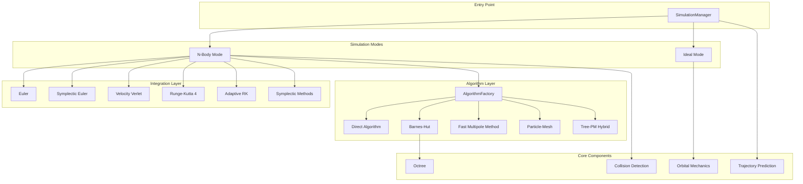

# Physics Package Architecture

The `@teskooano/core-physics` package provides a comprehensive physics simulation engine for celestial mechanics, featuring dual simulation modes, multiple algorithms, and advanced numerical integrators.

## Overview

The physics system is designed around a **configuration-driven architecture** with intelligent algorithm selection and performance optimization. It supports both perfect analytical solutions (ideal mode) and full N-body dynamics with customizable accuracy/performance trade-offs.



## Core Architecture Principles

### 1. Configuration-Driven Design

All simulation behavior is controlled through configuration objects rather than hardcoded behavior:

```typescript
interface SimulationConfiguration {
  mode: "ideal" | "nbody";
  integrator?: IntegratorType;
  algorithm?: AlgorithmType;
}
```

### 2. Strategy Pattern Implementation

Different algorithms and integrators are implemented as strategies, allowing runtime selection:

- **Algorithm Strategies**: Direct, Barnes-Hut, FMM, P3M, Tree-PM
- **Integration Strategies**: Euler variants, Verlet, RK4, Adaptive, Symplectic methods

### 3. Intelligent Selection

The `AlgorithmFactory` and `SimulationManager` automatically select optimal configurations based on:

- Body count
- Performance preferences (accuracy vs speed)
- Memory constraints
- System characteristics

### 4. Real SI Units

All internal calculations use SI units (meters, kg, seconds) for physical accuracy and simplicity.

## Directory Structure

```
src/
├── algorithms/                 # Force calculation algorithms
│   ├── algorithm-factory.ts   # Intelligent algorithm selection
│   └── tree-pm.ts            # Tree-PM hybrid implementation
├── collision/                 # Collision detection and resolution
│   └── collision.ts          # Comprehensive collision handling
├── forces/                    # Force calculation methods
│   ├── gravity.ts            # Newtonian gravity
│   ├── relativistic.ts       # Relativistic corrections
│   └── non-gravitational.ts  # Thrust, drag, etc.
├── integrators/               # Numerical integration methods
│   ├── euler.ts              # Basic Euler methods
│   ├── verlet.ts             # Velocity Verlet (default)
│   ├── rk4.ts                # Runge-Kutta 4th order
│   ├── adaptive.ts           # Adaptive timestep (Dormand-Prince)
│   ├── yoshida.ts            # Symplectic integrators
│   └── ideal.ts              # Analytical Keplerian orbits
├── interfaces/                # Strategy pattern interfaces
│   ├── algorithm-strategy.ts  # Algorithm interface
│   └── simulation-strategy.ts # Simulation interface
├── modes/                     # Simulation mode implementations
│   └── ideal/                # Ideal mode (Keplerian orbits)
│       └── ideal-orrery.ts   # Perfect orbital mechanics
├── orbital/                   # Orbital mechanics calculations
│   ├── kepler.ts             # Kepler's equation solver
│   ├── orbital.ts            # State vector conversions
│   └── elementsFromState.ts  # Inverse orbital calculations
├── simulation/                # Main simulation orchestration
│   ├── simulation-manager.ts # High-level coordinator
│   ├── simulation.ts         # Core simulation loop
│   ├── prediction.ts         # Trajectory prediction
│   └── types.ts              # Simulation interfaces
├── spatial/                   # Spatial data structures
│   └── octree.ts             # Barnes-Hut octree
├── units/                     # Unit constants and conversions
│   ├── constants.ts          # Physical constants
│   └── units.ts              # Unit conversion utilities
├── utils/                     # Utility functions
│   ├── vectorPool.ts         # Memory optimization
│   └── body-sort.ts          # Hierarchical sorting
└── types.ts                   # Core type definitions
```

## Key Components

### 1. SimulationManager (Entry Point)

**File**: `simulation/simulation-manager.ts`

The main orchestrator that provides a high-level API for physics simulations:

```typescript
class SimulationManager {
  simulate(params: SimulationManagerParams): EnhancedSimulationResult;
  createOptimalConfiguration(params): SimulationConfiguration;
  getPerformanceComparison(params): PerformanceComparison;
}
```

**Responsibilities:**

- Configuration validation
- Mode selection (ideal vs N-body)
- Strategy delegation
- Performance analysis and recommendations
- Result assembly with metadata

### 2. AlgorithmFactory (Algorithm Selection)

**File**: `algorithms/algorithm-factory.ts`

Intelligent selection and validation of force calculation algorithms:

```typescript
class AlgorithmFactory {
  static selectOptimalAlgorithm(bodyCount, preferences): AlgorithmType;
  static getPerformanceEstimate(algorithm, bodyCount): PerformanceEstimate;
  static validateAlgorithmChoice(algorithm, bodyCount): ValidationResult;
  static createOptimalConfiguration(
    bodyCount,
    mode,
    preferences,
  ): SimulationConfiguration;
}
```

**Selection Logic:**

- Body count analysis
- Performance preference consideration
- Memory constraint validation
- Algorithm capability matching

### 3. Ideal Mode Strategy

**File**: `modes/ideal/ideal-orrery.ts`

Perfect Keplerian orbital mechanics with analytical solutions:

```typescript
class IdealOrreryStrategy {
  simulate(params: IdealOrbitParams): IdealOrbitResult;
}
```

**Process:**

1. Hierarchical body sorting (topological sort)
2. Sequential Keplerian calculations
3. Exact analytical position/velocity computation
4. No force calculations or collisions

### 4. N-Body Simulation Pipeline

**File**: `simulation/simulation.ts`

Full gravitational N-body simulation with configurable algorithms and integrators:

**Flow:**

1. **Algorithm Selection**: Choose force calculation method
2. **Force Calculation**: Compute gravitational forces
3. **Integration**: Update positions and velocities
4. **Collision Handling**: Detect and resolve collisions
5. **Result Assembly**: Package output with metadata

### 5. Force Calculation Algorithms

#### Barnes-Hut Octree

**File**: `spatial/octree.ts`

Hierarchical spatial data structure for O(N log N) force calculations:

```typescript
class Octree {
  insert(body: PhysicsStateReal): void;
  calculateForceOn(body: PhysicsStateReal, theta: number): OSVector3;
}
```

#### Tree-PM Hybrid

**File**: `algorithms/tree-pm.ts`

Advanced algorithm combining Tree and Particle-Mesh methods:

```typescript
class TreePMStrategy extends AlgorithmStrategy {
  calculateForces(bodies, params): Record<string, OSVector3>;
}
```

**Multi-scale approach:**

- PM method for long-range forces (low-density regions)
- Tree method for short-range forces (high-density regions)
- Automatic density-based partitioning

### 6. Integration Methods

Multiple numerical integrators with different characteristics:

- **Velocity Verlet** (`integrators/verlet.ts`): Default, excellent energy conservation
- **RK4** (`integrators/rk4.ts`): High accuracy, 4th order
- **Adaptive RK** (`integrators/adaptive.ts`): Automatic timestep control
- **Symplectic Methods** (`integrators/yoshida.ts`): Long-term stability

### 7. Orbital Mechanics System

#### Kepler Solver

**File**: `orbital/kepler.ts`

Fast analytical orbital calculations:

- Newton-Raphson Kepler equation solver
- Coordinate system transformations
- Time evolution with proper prograde motion

#### State Vector Conversions

**File**: `orbital/orbital.ts`

Bidirectional conversion between orbital elements and state vectors:

- Synchronized with Kepler solver
- Consistent coordinate mapping
- Full 3D rotational transformations

### 8. Collision System

**File**: `collision/collision.ts`

Comprehensive collision detection and resolution:

**Collision Types:**

- **Star-Star**: Larger absorbs smaller (inelastic)
- **Star-Planet**: Star absorbs planet (inelastic)
- **Moon-Moon**: Mutual destruction
- **Planet-Gas Giant**: Elastic collision
- **Similar Mass**: Elastic collision
- **Large Mass Difference**: Absorption (inelastic)

### 9. Trajectory Prediction

**File**: `simulation/prediction.ts`

Future trajectory calculation using the same physics pipeline:

```typescript
function predictTrajectory(
  targetBodyId: string,
  allBodiesInitialStates: PhysicsStateReal[],
  duration_s: number,
  steps: number,
  options?: PredictionOptions,
): PredictedPoint[];
```

## Data Flow Architecture

### Input Processing

1. **Validation**: Check configuration and parameters
2. **Mode Selection**: Determine ideal vs N-body simulation
3. **Algorithm Selection**: Choose optimal force calculation method
4. **Integrator Selection**: Choose numerical integration method

### Simulation Execution

1. **Force Calculation**: Compute gravitational forces between bodies
2. **Integration**: Update body states using numerical methods
3. **Collision Detection**: Check for body intersections
4. **Collision Resolution**: Apply collision physics
5. **State Validation**: Check for numerical errors

### Output Assembly

1. **Result Packaging**: Combine updated states, forces, collisions
2. **Performance Analysis**: Calculate execution metrics
3. **Recommendation Generation**: Suggest optimizations
4. **Metadata Assembly**: Package analysis and timing data

## Performance Optimization

### Memory Management

- **Vector Pooling**: Reuse `OSVector3` instances to reduce GC pressure
- **State Swapping**: Reuse arrays between simulation steps
- **Sparse Storage**: Only store non-zero accelerations and forces

### Computational Optimization

- **Algorithm Auto-Selection**: Choose optimal method based on body count
- **Adaptive Time Stepping**: Adjust timestep for accuracy/performance balance
- **Early Termination**: Stop on integration failures or instabilities

### Caching Strategies

- **Force Caching**: Reuse calculations within timesteps
- **Octree Reuse**: Minimize spatial structure rebuilding
- **Validation Caching**: Store validation results

## Coordinate System Design

### Y-up Right-handed System

- **Y-axis**: "Up" direction (reference)
- **XZ-plane**: Orbital motion plane
- **Orbital Direction**: Counter-clockwise from +Y view (prograde)

### Critical Mappings

- **2D → 3D**: `OSVector3(x, 0, -y)` for proper orientation
- **Time Evolution**: `meanAnomaly + meanMotion * time` for prograde motion
- **Rotation Order**: argP → inclination → longAscNode

## Testing Architecture

### Unit Tests

- **Algorithm Accuracy**: Verify force calculations
- **Integration Stability**: Check energy conservation
- **Coordinate Consistency**: Validate orbital direction
- **Performance Bounds**: Ensure timing expectations

### Integration Tests

- **End-to-End Simulation**: Full pipeline validation
- **Mode Switching**: Verify ideal/N-body consistency
- **Collision Scenarios**: Complex multi-body interactions

### Performance Tests

- **Scaling Analysis**: Verify algorithmic complexity
- **Memory Usage**: Monitor resource consumption
- **Execution Timing**: Benchmark different configurations

## Extension Points

### Adding New Algorithms

1. Implement `IAlgorithmStrategy` interface
2. Add to `AlgorithmFactory` selection logic
3. Update performance estimates and validation
4. Add comprehensive tests

### Adding New Integrators

1. Implement `Integrator` function signature
2. Add to simulation integrator switch statement
3. Document stability and accuracy characteristics
4. Add energy conservation tests

### Adding New Force Types

1. Implement `PairForceCalculator` interface
2. Integrate into force calculation pipeline
3. Add configuration options
4. Validate physical correctness

This architecture provides a robust, extensible foundation for physics simulation with clear separation of concerns, intelligent optimization, and comprehensive testing coverage.
