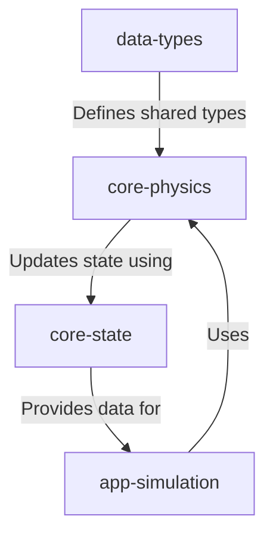

# @teskooano/core-physics

## What is it?
The `@teskooano/core-physics` library is a crucial component of the Open Space engine that handles physical simulations of celestial bodies and spacecraft. It implements Newtonian gravity with Barnes-Hut optimization, collision detection, and provides accurate numerical integrators to update the state of objects over time.

**Key Design Principle:** This package performs all internal physics calculations using **real-world SI units (meters, kilograms, seconds, Newtons)**. This ensures physical accuracy and simplifies the core logic. Conversion to scaled units for visualization or other purposes is handled by other packages (like `@teskooano/data-types` scaling functions and renderer utilities).

## Where is it?
**Physical Location:** `/packages/core/physics`

**System Context:** This package provides core physics simulation capabilities. It is primarily used by the state management system (`@teskooano/core-state`) which holds the simulation state, and potentially by other systems needing physics calculations.



## When is it used?
The physics engine logic is used when:
- The main simulation loop updates the state (positions, velocities) of all physical bodies based on calculated forces and the Velocity Verlet integration method.
- The Barnes-Hut algorithm (Octree) is used to optimize force calculations for large numbers of bodies.
- Collision detection and handling occurs between celestial bodies.
- Initial states for objects are calculated (e.g., converting orbital parameters to state vectors).
- Trajectory calculations or prediction of future states.

## How does it work?
The physics system implements:

### Physics State (`PhysicsStateReal`)
The core data structure representing the physical state of an object in **real SI units**:
- `id`: Unique identifier (string).
- `mass_kg`: Mass in kilograms.
- `position_m`: `OSVector3` position in meters.
- `velocity_mps`: `OSVector3` velocity in meters per second.
- `ticksSinceLastPhysicsUpdate?`: Optional counter for throttling updates.

### Force Calculation
- Uses the Barnes-Hut algorithm (Octree) to efficiently approximate gravitational forces between bodies, reducing complexity from O(N²) to O(N log N).
- Provides functions to calculate forces between objects (e.g., `calculateNewtonianGravitationalForce`). Operates on `PhysicsStateReal` and returns forces in Newtons.
- Includes support for relativistic and non-gravitational forces.

### Integration Methods
- Uses Velocity Verlet as the default integrator due to its stability and energy conservation properties.
- Also provides other integrators (`standardEuler`, `symplecticEuler`) to update `PhysicsStateReal` over a time step (`dt`, in seconds) based on calculated acceleration (`a = F/m`).

### Collision Handling
- Detects collisions between bodies based on their radii and types.
- Implements conservation of momentum and energy in collision resolution.
- Handles destruction of smaller bodies in collisions with larger ones.

### Simulation Loop (`simulation.ts`)
- Orchestrates the physics update:
  1. Builds an Octree from the current body positions.
  2. Calculates net forces on all bodies using the Octree's `calculateForceOn` method.
  3. Calculates acceleration for each body (`a = F/m`).
  4. Updates each body's state using the Velocity Verlet integrator.
  5. Handles collisions between bodies and returns updated states and destroyed body IDs.

### Math & Units
- Uses `OSVector3` class from `@teskooano/core-math` for vector operations.
- Provides unit constants (like `GRAVITATIONAL_CONSTANT`, `AU_METERS`) and conversion utilities (`units/units.ts`) for converting between SI units and other common units (like AU, km, days) when needed for input/output.

## Strengths
- **Real SI Units:** Core calculations use meters, kg, seconds, ensuring physical consistency and simplifying logic. Scaling is handled externally.
- **Barnes-Hut Optimization:** Efficient O(N log N) force calculation for large numbers of bodies.
- **Velocity Verlet Integration:** Stable and energy-conserving numerical integration.
- **Collision Handling:** Accurate detection and resolution of collisions between celestial bodies.
- **Modular Design:** Pluggable force calculators and integrators allow for extension and experimentation.
- **Typed:** Uses TypeScript and specific interfaces (`PhysicsStateReal`, `Integrator`, `PairForceCalculator`) for better integration.

## Installation

```bash
# Assuming usage within the monorepo
npm install @teskooano/core-physics --workspace=@your-app-or-package
```

## Core Concepts

### `PhysicsStateReal`

The fundamental data structure (defined in `src/types.ts`):

```typescript
import { OSVector3 } from '@teskooano/core-math';

export interface PhysicsStateReal {
  id: string;           // Unique identifier
  mass_kg: number;       // Mass in kilograms
  position_m: OSVector3;  // Position vector in meters
  velocity_mps: OSVector3; // Velocity vector in m/s
  ticksSinceLastPhysicsUpdate?: number; // Optional for throttling
}
```

### Simulation Update

The main simulation logic is encapsulated in `updateSimulation` (`simulation/simulation.ts`):

```typescript
import { PhysicsStateReal } from '../types';
import { OSVector3 } from '@teskooano/core-math';
import { CelestialType } from '@teskooano/data-types';
import { handleCollisions } from '../collision/collision';
import { velocityVerletIntegrate } from '../integrators/verlet';
import { Octree } from '../spatial/octree';

export interface SimulationStepResult {
  states: PhysicsStateReal[];
  accelerations: Map<string, OSVector3>;
  destroyedIds: Set<string | number>;
}

export const updateSimulation = (
  bodies: PhysicsStateReal[],
  dt: number,
  radii: Map<string | number, number>,
  isStar: Map<string | number, boolean>,
  bodyTypes: Map<string | number, CelestialType>,
  octreeSize: number = 5e13,
  barnesHutTheta: number = 0.7
): SimulationStepResult => {
  // 1. Build Octree from current body positions
  const octree = new Octree(octreeSize);
  bodies.forEach((body) => octree.insert(body));
  
  // 2. Calculate acceleration for all bodies using Octree
  const accelerations = new Map<string, OSVector3>();
  bodies.forEach((body) => {
    const force = octree.calculateForceOn(body, barnesHutTheta);
    const acc = new OSVector3(0, 0, 0);
    if (body.mass_kg !== 0) {
      acc.copy(force).multiplyScalar(1 / body.mass_kg);
    }
    accelerations.set(body.id, acc);
  });
  
  // 3. Update state using Velocity Verlet
  const integratedStates = bodies.map((body) => {
    const currentAcceleration = accelerations.get(body.id) || new OSVector3(0, 0, 0);
    
    // Calculate acceleration at predicted position (required by Velocity Verlet)
    const calculateNewAcceleration = (newStateGuess: PhysicsStateReal): OSVector3 => 
      calculateAccelerationForBody(newStateGuess, octree, barnesHutTheta);
    
    // Apply Velocity Verlet integrator
    return velocityVerletIntegrate(
      body,
      currentAcceleration,
      calculateNewAcceleration,
      dt
    );
  });
  
  // 4. Handle Collisions
  const [finalStates, destroyedIds] = handleCollisions(
    integratedStates,
    radii,
    isStar,
    bodyTypes
  );
  
  return { states: finalStates, accelerations, destroyedIds };
};
```

### Barnes-Hut Optimization

The Octree implementation uses the Barnes-Hut algorithm for efficient force calculation:

```typescript
// Example usage of Octree for force calculation
import { Octree } from '@teskooano/core-physics';

// Create an Octree covering the simulation area (size in meters)
const octree = new Octree(5e13); // e.g., 50 trillion meters (~ 334 AU)

// Insert all bodies into the tree
bodies.forEach(body => octree.insert(body));

// Calculate force on a body using Barnes-Hut approximation
// theta controls accuracy vs. performance (0.7 is a common value)
const force = octree.calculateForceOn(targetBody, 0.7);
```

### Unit Conversion

Use utilities from `units/units.ts` when needed:

```typescript
import { auToMeters, metersToAU, auDayToMetersPerSecond } from '@teskooano/core-physics';

const meters = auToMeters(1); // Convert 1 AU to meters
const au = metersToAU(149597870700); // Convert meters to AU
const mps = auDayToMetersPerSecond(1); // Convert AU/day to m/s
```

## Units
- **Internal Calculations:** Strictly uses SI units:
    - Distance: Meters (m)
    - Mass: Kilograms (kg)
    - Time: Seconds (s)
    - Velocity: Meters per second (m/s)
    - Force: Newtons (N)
    - Acceleration: Meters per second squared (m/s²)
- **Conversion Utilities:** Functions are provided in `units/units.ts` to convert between SI units and other common units (AU, km, days, etc.) for input or output purposes.

## Current Status
- [x] Core `PhysicsStateReal` structure (SI units)
- [x] Newtonian Gravity (`forces/gravity.ts`)
- [x] Relativistic Gravity (`forces/relativistic.ts`)
- [x] Non-Gravitational Forces (`forces/non-gravitational.ts`)
- [x] Euler Integrator (`integrators/euler.ts`)
- [x] Symplectic Euler Integrator (`integrators/symplecticEuler.ts`)
- [x] Velocity Verlet Integrator (`integrators/verlet.ts`) - **Used as default**
- [x] Orbital Element <-> State Vector Conversion (`orbital/orbital.ts`)
- [x] Barnes-Hut Optimization via Octree (`spatial/octree.ts`) - **Integrated**
- [x] Collision Detection & Handling (`collision/collision.ts`) - **Fully integrated**
- [x] Vector Pool for memory optimization (`utils/vectorPool.ts`)
- [x] SI Unit Constants & Conversion Utilities (`units/`)
- [x] Comprehensive test coverage for forces and integrators

## Roadmap
- [ ] Add Runge-Kutta 4th order integrator for higher accuracy
- [ ] Implement adaptive time stepping for better stability
- [ ] Add support for custom force fields
- [ ] Implement parallel computation for force calculations
- [ ] Further optimize collision detection with spatial partitioning
- [ ] Add additional unit tests for orbital calculations

## Performance Tips
1. **Adjust Barnes-Hut Theta Parameter:**
   - Lower values (e.g., 0.3) give higher accuracy but slower performance
   - Higher values (e.g., 0.9) give faster performance with less accuracy
   - Default of 0.7 is a good balance for most simulations

2. **Choose Appropriate Octree Size:**
   - Set the `octreeSize` parameter to cover the entire simulation area
   - For solar system simulations, a size of 5e13 meters (~ 334 AU) is usually sufficient

3. **Use Vector Pool:**
   - For intensive calculations, use the vector pool to reduce garbage collection overhead
   - Example: `const tempVec = vectorPool.get(); ... vectorPool.release(tempVec);`

## Contributing
1. Fork the repository
2. Create your feature branch
3. Commit your changes
4. Push to the branch
5. Create a new Pull Request

## License
MIT License - see LICENSE file for details 