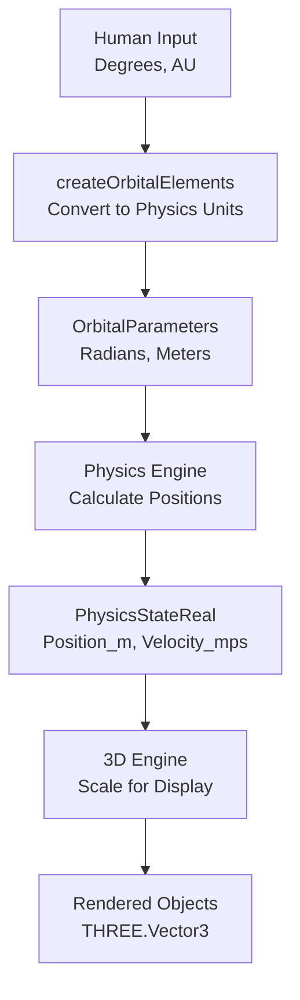

# Optimized Data Flow for Orbital Elements and Physics Simulation

This document explains the optimized data flow from human input to 3D rendering, with clear separation of concerns and efficient unit conversions.

## Overview

The system follows a clear, optimized flow that minimizes conversions and maximizes efficiency:



## Data Flow Stages

### 1. Human Input (Human-Friendly Units)

```typescript
interface OrbitalElementsInput {
  semiMajorAxisAU: number; // Distance in AU
  eccentricity: number; // 0-1 for elliptical, >1 for hyperbolic
  inclinationDeg: number; // Angle in degrees
  longitudeOfAscendingNodeDeg: number; // Angle in degrees
  argumentOfPeriapsisDeg: number; // Angle in degrees
  meanAnomalyDeg: number; // Angle in degrees
  period_s: number; // Time in seconds
  // ... other properties
}
```

**Why this format?**

- **Degrees**: Humans think in degrees (0-360°), not radians
- **AU**: Astronomical units are intuitive for solar system distances
- **Seconds**: Time periods are naturally in seconds

### 2. Physics-Ready Conversion

```typescript
function createOrbitalElements(input: OrbitalElementsInput): OrbitalParameters {
  // Convert degrees to radians
  const inclination_rad = utils.degToRad(input.inclinationDeg);

  // Convert AU to meters
  const semiMajorAxis_m = input.semiMajorAxisAU * AU;

  return {
    inclination_rad,
    semiMajorAxis_m,
    // ... other converted properties
  };
}
```

**Why this conversion?**

- **Radians**: Physics calculations require radians for trigonometric functions
- **Meters**: SI units for precise physics calculations
- **One-time conversion**: Convert once, use many times

### 3. Physics Engine Calculation

```typescript
// Physics engine uses OrbitalParameters to calculate positions
const { position, velocity } = calculateKeplerianStateAtTime(
  orbitalParameters, // Radians, meters
  currentTime_s,
  parentMass_kg,
);
```

**What happens here?**

- Kepler's equation is solved using radians
- Positions are calculated in meters
- Velocities are calculated in m/s
- Results are stored in `PhysicsStateReal`

### 4. Physics State (Simulation-Ready)

```typescript
interface PhysicsStateReal {
  id: string;
  mass_kg: number;
  position_m: OSVector3; // Meters
  velocity_mps: OSVector3; // Meters per second
}
```

**Why this format?**

- **Real units**: All values in SI units for accurate physics
- **Vector format**: Efficient for physics calculations
- **Immutable**: Once calculated, positions are stable until next update

### 5. 3D Engine Scaling

```typescript
// 3D engine scales physics positions for display
function physicsToThreeJSPosition(
  target: THREE.Vector3,
  physicsPosition: OSVector3,
) {
  target.copy(physicsPosition.toThreeJS());
  target.multiplyScalar(METERS_TO_SCENE_UNITS); // Scale for display
  return target;
}
```

**Why this scaling?**

- **Display units**: Scale to appropriate scene size
- **Performance**: Efficient rendering with scaled coordinates
- **Separation**: Physics calculations remain in real units

## Benefits of This Approach

### 1. **Clear Separation of Concerns**

- **Input**: Human-friendly units (degrees, AU)
- **Physics**: Real units (radians, meters)
- **Display**: Scaled units (scene-appropriate)

### 2. **Efficient Conversions**

- **One-time conversion**: Degrees→radians, AU→meters
- **No redundant conversions**: Each stage uses appropriate units
- **Cached results**: Physics state is calculated once, used many times

### 3. **Human-Friendly Input**

- **Intuitive units**: Degrees and AU are natural for humans
- **Clear documentation**: Input interface clearly shows expected units
- **Error prevention**: Type system prevents unit confusion

### 4. **Physics Accuracy**

- **Real units**: All physics calculations use SI units
- **Precise calculations**: Radians provide mathematical precision
- **Consistent results**: Same input always produces same output

### 5. **Rendering Performance**

- **Scaled display**: 3D engine uses appropriate scene scale
- **Efficient rendering**: No runtime unit conversions
- **Flexible scaling**: Can adjust display scale without affecting physics

## Usage Examples

### Creating Earth's Orbit

```typescript
const earthOrbit = createOrbitalElements({
  semiMajorAxisAU: 1.0, // 1 AU
  eccentricity: 0.0167, // Earth's eccentricity
  inclinationDeg: 0.00005, // Very small inclination
  longitudeOfAscendingNodeDeg: 0, // Reference direction
  argumentOfPeriapsisDeg: 102.947, // Perihelion direction
  meanAnomalyDeg: 358.617, // Current position
  period_s: 365.25 * 24 * 3600, // One year in seconds
  siderealRotationPeriod_s: 24 * 3600, // One day in seconds
  axialTiltDeg: 23.44, // Earth's axial tilt
});
```

### Creating a Comet's Hyperbolic Orbit

```typescript
const cometOrbit = createOrbitalElements({
  semiMajorAxisAU: 2.0, // Distance parameter
  eccentricity: 1.5, // Hyperbolic orbit
  inclinationDeg: 45.0, // High inclination
  isHyperbolic: true, // Flag for hyperbolic handling
  // ... other parameters
});
```

## Performance Considerations

### 1. **Conversion Overhead**

- **Minimal**: One-time conversion during object creation
- **Cached**: Physics state is calculated once, reused
- **Efficient**: No runtime unit conversions

### 2. **Memory Usage**

- **Compact**: Physics state uses minimal memory
- **Shared**: Multiple systems can reference same physics state
- **Immutable**: No need to track conversion state

### 3. **Calculation Efficiency**

- **Pre-computed**: Orbital parameters are calculated once
- **Optimized**: Physics engine uses efficient algorithms
- **Scalable**: System handles thousands of objects efficiently

## Best Practices

### 1. **Input Validation**

```typescript
// Validate input ranges
if (input.inclinationDeg < 0 || input.inclinationDeg > 180) {
  throw new Error("Inclination must be between 0 and 180 degrees");
}
```

### 2. **Unit Documentation**

```typescript
/** Semi-major axis in AU (human-friendly) */
semiMajorAxisAU?: number;
```

### 3. **Error Handling**

```typescript
// Provide meaningful error messages
if (input.semiMajorAxisAU === undefined) {
  throw new Error("semiMajorAxisAU is required for non-Lagrange orbits.");
}
```

### 4. **Performance Monitoring**

```typescript
// Monitor conversion performance
const startTime = performance.now();
const orbitalElements = createOrbitalElements(input);
const conversionTime = performance.now() - startTime;
```

This optimized flow ensures that the system is both human-friendly and computationally efficient, with clear separation between input, physics, and rendering concerns.
