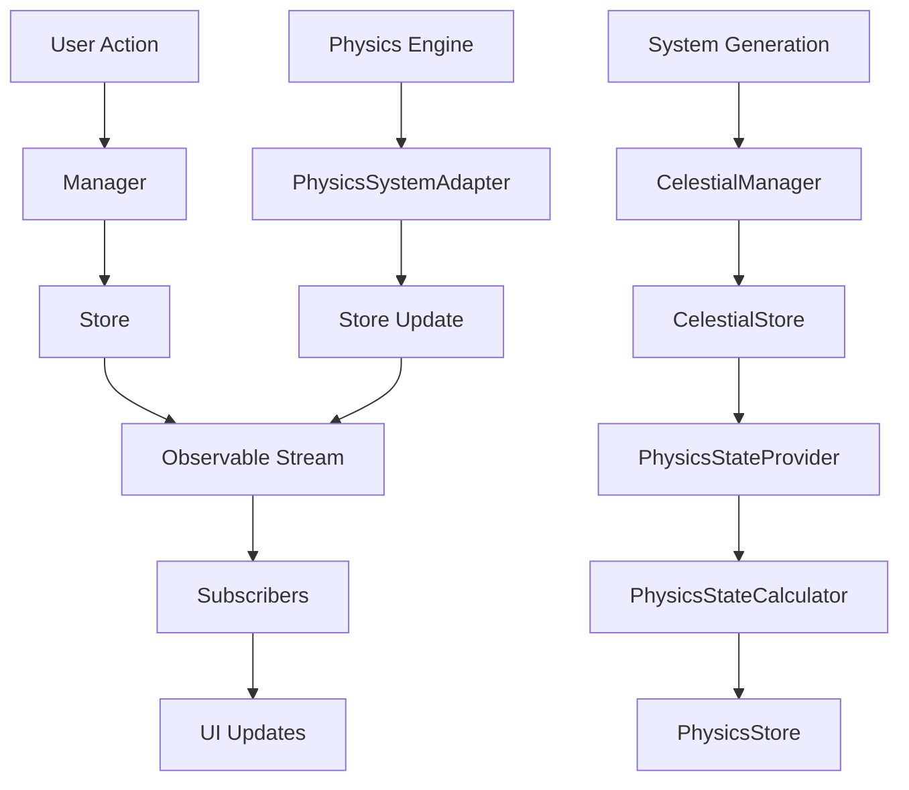
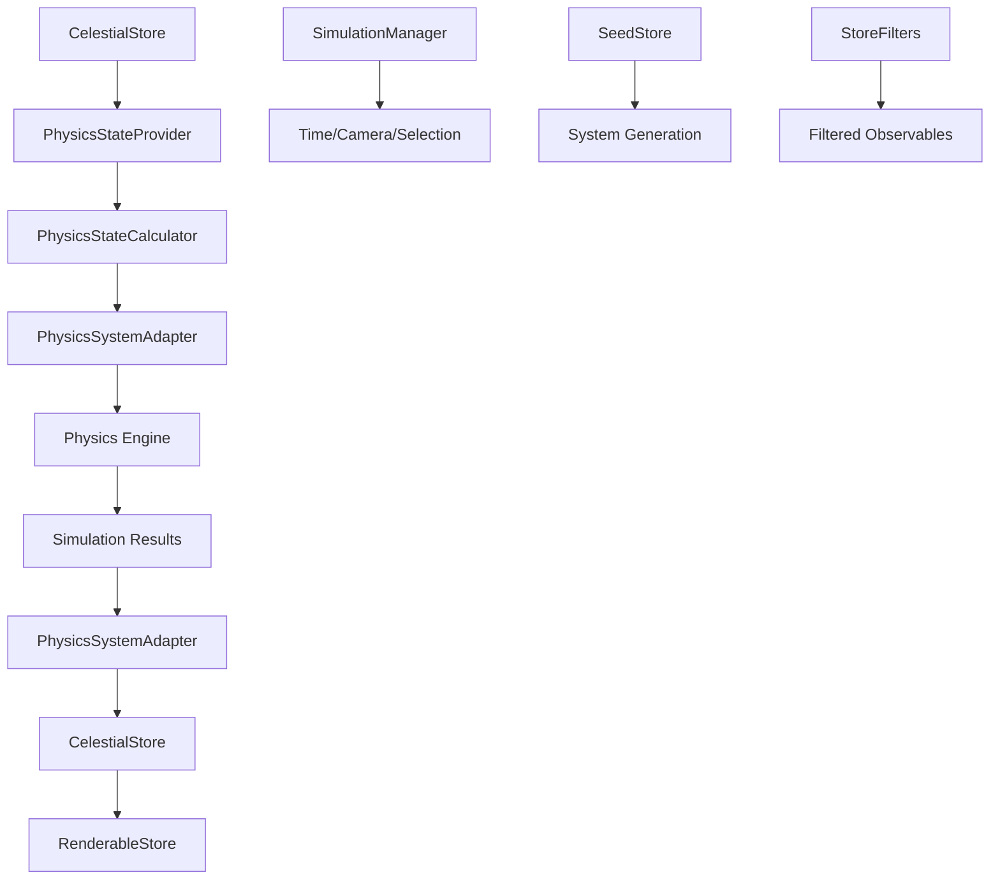
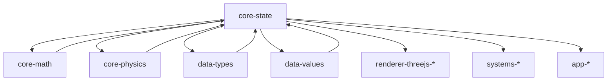

# AGENTS.md

A comprehensive guide for AI coding agents working on the Teskooano Core State package.

## Package Overview

The **`@teskooano/core-state`** package is the central state management system for the Teskooano engine, responsible for managing the simulation's core data, physics state, renderable objects, and simulation control. Using RxJS as its foundation, it provides reactive state management with intelligent caching, filtering, and performance optimization.

### Purpose

- **Centralized State Management**: Single source of truth for all simulation data
- **Reactive Architecture**: RxJS observables for efficient state updates and subscriptions
- **Performance Optimization**: Intelligent caching, filtering, and batch operations
- **Type Safety**: Full TypeScript type safety across all components
- **Modular Design**: Clear separation of concerns with specialized stores and services

## Setup Commands

### Prerequisites

- Install [moon](https://moonrepo.dev/) and [proto](https://moonrepo.dev/proto) for task running and dependency management
- Node.js 24.2.0 (specified in package.json engines)

### Installation & Development

```bash
# Install dependencies
proto use

# Run tests
moon run core-state:test

# Build package
moon run core-state:build

# Lint code
npm run lint
```

## Package Architecture

### Directory Structure

```
src/
├── adapters/
│   ├── PhysicsSystemAdapter.ts    # Bridge between core state and physics engine
│   └── index.ts                   # Re-exports all adapters
├── managers/
│   ├── CelestialManager.ts        # Celestial object lifecycle operations
│   ├── SimulationManager.ts       # Simulation control state management
│   ├── CameraManager.ts           # Camera state management per panel
│   └── index.ts                   # Re-exports all managers
├── services/
│   ├── PhysicsStateProvider.ts    # Physics state calculations with caching
│   ├── PhysicsStateCalculator.ts  # Physics state computation logic
│   ├── FlatHierarchyService.ts    # Optimized hierarchy management
│   ├── SystemEventBridge.ts       # System-level DOM to RxJS event bridge
│   ├── CelestialEventBridge.ts    # Celestial-specific DOM to RxJS event bridge
│   ├── EVENT_SYSTEM.md            # Comprehensive event system documentation
│   └── index.ts                   # Re-exports all services
├── stores/
│   ├── CelestialStore.ts          # Celestial object data and hierarchy
│   ├── PhysicsStore.ts            # Physics-related state (acceleration vectors)
│   ├── RenderableStore.ts         # Three.js-compatible renderable objects
│   ├── SeedStore.ts               # System generation seed management
│   ├── SimulationStore.ts         # Simulation control state
│   ├── CameraStore.ts             # Camera state per panel
│   └── index.ts                   # Re-exports all stores
├── types/
│   ├── types.ts                   # Core simulation state interfaces
│   ├── camera.ts                  # Camera state interfaces
│   ├── hierarchy.types.ts         # Hierarchy management types
│   └── index.ts                   # Re-exports all types
├── utils/
│   ├── CelestialUtils.ts          # Celestial object operations and validation
│   ├── StateAccessor.ts           # Unified state access with optimized observables
│   ├── StateSubscriptionMixin.ts  # RxJS subscription management
│   ├── StoreFilters.ts            # Filtering utilities for celestial and renderable objects
│   ├── utils.ts                   # Simulation configuration utilities
│   └── index.ts                   # Re-exports all utilities
├── index.ts                       # Main package entry point
└── __tests__/                     # Test files
```

### Design Principles

#### 1. Reactive Architecture

- **RxJS Observables**: All state changes are reactive and emit through observables
- **Pre-filtered Streams**: Common use cases have dedicated observables (active, visible, physics-active objects)
- **Intelligent Caching**: Physics state calculations are cached and automatically invalidated
- **Immutable Updates**: All state updates create new objects, ensuring reactive behavior

#### 2. Singleton Pattern

- **Global Access**: All stores and services use singleton pattern for global access
- **Consistent State**: Single instance ensures consistent state across the application
- **Memory Efficiency**: Prevents multiple instances and memory leaks
- **Event System**: Dual event bridges (SystemEventBridge, CelestialEventBridge) for cross-system communication

#### 3. Separation of Concerns

- **Stores**: Pure data storage with reactive updates
- **Services**: Business logic and calculations
- **Managers**: High-level operations and lifecycle management
- **Adapters**: Integration with external systems (physics engine)

#### 4. Performance Optimization

- **Batch Operations**: Efficient bulk updates and operations
- **Lazy Loading**: Calculations performed only when needed
- **Memory Management**: Proper cleanup and disposal patterns

## Code Style & Conventions

### TypeScript Standards

- **Strict Mode**: Always use strict TypeScript configuration
- **Type Safety**: All interfaces are properly typed with no `any` types
- **JSDoc**: Comprehensive documentation with examples
- **Minimal Dependencies**: Only essential dependencies (RxJS, core-math, data-types)

### Code Style

- **Indentation**: Use 2-space indentation
- **Naming**:
  - `PascalCase` for classes, interfaces, and types
  - `camelCase` for properties and methods
  - `UPPER_CASE` for constants
- **File Size**: Keep files focused and under 400 lines
- **Modularity**: Each domain has its own file structure

### Import Patterns

- **Static Imports**: Use ES import statements at the top of files
- **Barrel Exports**: Use index.ts files for clean imports
- **Path Aliases**: Use `@teskooano/*` aliases when available

## Key Components

### Stores (`src/stores/`)

#### CelestialStore (`CelestialStore.ts`)

The primary store for celestial object data:

```typescript
export class CelestialStore {
  private static instance: CelestialStore;

  // Core observables
  public readonly objects$: Observable<Record<string, CelestialObject>>;
  public readonly activeObjects$: Observable<Record<string, CelestialObject>>;
  public readonly destroyedObjects$: Observable<
    Record<string, CelestialObject>
  >;
  public readonly physicsActiveObjects$: Observable<
    Record<string, CelestialObject>
  >;
  public readonly visibleObjects$: Observable<Record<string, CelestialObject>>;

  // Core methods
  public getObjects(): Record<string, CelestialObject>;
  public setObject(id: string, object: CelestialObject): void;
  public removeObject(id: string): void;
  public setAllObjects(objects: Record<string, CelestialObject>): void;
  public processDestructionEvents(
    destroyedIds: string[],
  ): Record<string, CelestialObject>;
}
```

#### PhysicsStore (`PhysicsStore.ts`)

Manages physics-related state:

```typescript
export class PhysicsStore {
  private static instance: PhysicsStore;

  // Core observables
  public readonly accelerationVectors$: Observable<Record<string, OSVector3>>;
  public readonly nonZeroAccelerationVectors$: Observable<
    Record<string, OSVector3>
  >;

  // Core methods
  public getAccelerationVectors(): Record<string, OSVector3>;
  public updateAccelerationVectors(vectors: Map<string, OSVector3>): void;
  public setAccelerationVector(id: string, vector: OSVector3): void;
  public removeAccelerationVector(id: string): void;
}
```

#### RenderableStore (`RenderableStore.ts`)

Stores Three.js-compatible renderable objects:

```typescript
export class RenderableStore {
  private static instance: RenderableStore;

  // Core observables
  public readonly renderableObjects$: Observable<
    Record<string, RenderableCelestialObject>
  >;
  public readonly visibleRenderableObjects$: Observable<
    Record<string, RenderableCelestialObject>
  >;
  public readonly activeRenderableObjects$: Observable<
    Record<string, RenderableCelestialObject>
  >;
  public readonly physicsActiveRenderableObjects$: Observable<
    Record<string, RenderableCelestialObject>
  >;

  // Core methods
  public getRenderableObjects(): Record<string, RenderableCelestialObject>;
  public addRenderableObject(object: RenderableCelestialObject): void;
  public updateRenderableObject(
    celestialObjectId: string,
    updates: Partial<RenderableCelestialObject>,
  ): void;
  public removeRenderableObject(celestialObjectId: string): void;
}
```

#### SeedStore (`SeedStore.ts`)

Manages system generation seed:

```typescript
export class SeedStore {
  private static instance: SeedStore;

  // Core observables
  public readonly currentSeed$: Observable<string>;

  // Core methods
  public getCurrentSeed(): string;
  public updateSeed(newSeed: string): void;
}
```

#### SimulationStore (`SimulationStore.ts`)

Manages simulation control state:

```typescript
export class SimulationStore {
  private static instance: SimulationStore;

  // Core observables
  public readonly simulationState$: Observable<SimulationState>;

  // Core methods
  public getSimulationState(): SimulationState;
  public setSimulationState(newState: SimulationState): void;
  public updateSimulationState(updates: Partial<SimulationState>): void;
  public resetToInitialState(): void;
}
```

#### CameraStore (`CameraStore.ts`)

Manages camera state per panel:

```typescript
export class CameraStore {
  private static instances = new Map<string, CameraStore>();

  // Core observables
  public readonly cameraState$: Observable<CameraState>;

  // Core methods
  public getCameraState(): CameraState;
  public setCameraState(newState: CameraState): void;
  public updateCameraState(updates: Partial<CameraState>): void;
  public resetToInitialState(): void;
}
```

### Services (`src/services/`)

#### PhysicsStateProvider (`PhysicsStateProvider.ts`)

Provides physics state calculations with intelligent caching:

```typescript
export class PhysicsStateProvider {
  // Core observables
  public static readonly physicsActiveObjects$: Observable<
    Record<string, CelestialObject>
  >;
  public static readonly physicsStates$: Observable<PhysicsStateReal[]>;

  // Core methods
  public static getPhysicsState<T extends CelestialSpecificPropertiesUnion>(
    object: CelestialObject<T> | undefined,
  ): PhysicsStateReal | null;
  public static getPhysicsStates(): PhysicsStateReal[];
  public static clearCache(): void;
  public static updateCache<T extends CelestialSpecificPropertiesUnion>(
    object: CelestialObject<T>,
  ): void;
}
```

#### PhysicsStateCalculator (`PhysicsStateCalculator.ts`)

Computes physics states from celestial objects:

```typescript
export class PhysicsStateCalculator {
  public static calculatePhysicsState<
    T extends CelestialSpecificPropertiesUnion,
  >(
    data: CelestialObject<T>,
    allObjects: Record<string, CelestialObject>,
    visitedIds: Set<string> = new Set(),
  ): PhysicsStateReal | null;
}
```

#### FlatHierarchyService (`FlatHierarchyService.ts`)

Optimized hierarchy management with flat state structure:

```typescript
export class FlatHierarchyService {
  private static instance: FlatHierarchyService;

  // Core observables
  public readonly hierarchyState$: Observable<FlatHierarchyState>;

  // Core methods
  public initializeFromObjects(
    objects: Record<string, CelestialObject>,
    options?: HierarchyOperationOptions,
  ): HierarchyOperationResult;
  public addObject(
    object: CelestialObject,
    options?: HierarchyOperationOptions,
  ): HierarchyOperationResult;
  public updateParent(
    objectId: string,
    newParentId: string | undefined,
    options?: HierarchyOperationOptions,
  ): HierarchyOperationResult;
  public removeObject(
    objectId: string,
    options?: HierarchyOperationOptions,
  ): HierarchyOperationResult;
  public getChildren(
    parentId: string,
    options?: HierarchyQueryOptions,
  ): HierarchyQueryResult;
  public getParent(childId: string): HierarchyEntry | undefined;
  public getPathToRoot(objectId: string): string[];
  public getRoots(): HierarchyEntry[];
  public getObjectsAtDepth(depth: number): HierarchyEntry[];
}
```

### Managers (`src/managers/`)

#### CelestialManager (`CelestialManager.ts`)

Consolidates celestial object lifecycle operations:

```typescript
export class CelestialManager {
  private static instance: CelestialManager;

  // Core methods
  public addObject<T extends CelestialSpecificPropertiesUnion>(
    object: CelestialObject<T>,
  ): void;
  public updateObject<T extends CelestialSpecificPropertiesUnion>(
    id: string,
    updates: Partial<CelestialObject<T>>,
  ): void;
  public updateOrbit(id: string, parameters: Partial<OrbitalParameters>): void;
  public markDestroyed(id: string): void;
  public removeObject(id: string): void;
  public clearState(): void;
  public createSolarSystem<T extends CelestialSpecificPropertiesUnion>(
    data: CelestialObject<T>,
  ): string;
  public addObjects<T extends CelestialSpecificPropertiesUnion>(
    data: CelestialObject<T>[],
  ): void;
  public addCelestial<T extends CelestialSpecificPropertiesUnion>(
    data: CelestialObject<T>,
  ): void;
}
```

#### SimulationManager (`SimulationManager.ts`)

Manages simulation control state:

```typescript
export class SimulationManager {
  private static instance: SimulationManager;

  // Core methods
  public getSimulationState(): SimulationState;
  public getSimulationState$(): Observable<SimulationState>;
  public setTimeScale(scale: number): void;
  public togglePause(): void;
  public resetTime(resetPaused?: boolean): void;
  public setStartDate(startDate: Date): void;
  public resetToStartDate(startDate: Date): void;
  public stepTime(dt?: number): void;
  public setSimulationConfiguration(config: SimulationConfiguration): void;
  public setSimulationMode(mode: SimulationMode): void;
  public setNBodyAlgorithm(algorithm: AlgorithmType): void;
  public setNBodyIntegrator(integrator: IntegratorType): void;
  public getSimulationConfiguration(): SimulationConfiguration;
  public isConfigurationValid(): boolean;
  public setPerformanceProfile(profile: DeviceTier): void;
  public setTrailLengthMultiplier(multiplier: number): void;
  public setPredictionSettings(steps: number, duration: number): void;
  public resetToInitialState(): void;
}
```

#### CameraManager (`CameraManager.ts`)

Manages camera state per panel:

```typescript
export class CameraManager {
  constructor(panelId: string, initialState?: Partial<CameraState>);

  // Core methods
  public getCameraState(): CameraState;
  public getCameraState$(): Observable<CameraState>;
  public selectObject(objectId: string | null): void;
  public getSelectedObject(): string | null;
  public setFocusedObject(objectId: string | null): void;
  public getFocusedObject(): string | null;
  public updateCamera(position: OSVector3, target: OSVector3): void;
  public setCameraPosition(position: OSVector3): void;
  public getCameraPosition(): OSVector3;
  public setCameraTarget(target: OSVector3): void;
  public getCameraTarget(): OSVector3;
  public setCameraFov(fov: number): void;
  public getCameraFov(): number;
  public resetCamera(): void;
  public resetCameraPosition(): void;
  public resetSelection(): void;
  public dispose(): void;
}
```

### Adapters (`src/adapters/`)

#### PhysicsSystemAdapter (`PhysicsSystemAdapter.ts`)

Bridges core state and physics engine:

```typescript
export class PhysicsSystemAdapter {
  private static instance: PhysicsSystemAdapter;

  // Core methods
  public getPhysicsBodies(): PhysicsStateReal[];
  public getPhysicsBodies$(): Observable<PhysicsStateReal[]>;
  public getPhysicsActiveObjects$(): Observable<
    Record<string, CelestialObject>
  >;
  public getCelestialObjectsSnapshot(): Record<string, CelestialObject>;
  public getActiveCelestialObjectsSnapshot(): Record<string, CelestialObject>;
  public getOrbitalParametersSnapshot(): Map<string, OrbitalParameters>;
  public updateStateFromResult(result: SimulationStepResult): void;
}
```

### Utilities (`src/utils/`)

#### StateAccessor (`StateAccessor.ts`)

Unified state access with optimized observables:

```typescript
export class StateAccessor {
  // Observable streams
  static celestialObjects$(): Observable<Record<string, CelestialObject>>;
  static simulation$(): Observable<SimulationState>;
  static accelerationVectors$(): Observable<Record<string, OSVector3>>;
  static physicsStates$(): Observable<PhysicsStateReal[]>;
  static physicsActiveObjects$(): Observable<Record<string, CelestialObject>>;
  static activeObjects$(): Observable<Record<string, CelestialObject>>;
  static destroyedObjects$(): Observable<Record<string, CelestialObject>>;
  static visibleObjects$(): Observable<Record<string, CelestialObject>>;

  // Imperative access
  static getCelestialObjects(): Record<string, CelestialObject>;
  static getSimulationState(): SimulationState;
  static getAccelerationVectors(): Record<string, OSVector3>;
  static getPhysicsStates(): PhysicsStateReal[];
  static getPhysicsActiveObjects(): Record<string, CelestialObject>;
  static getActiveObjects(): Record<string, CelestialObject>;
  static getDestroyedObjects(): Record<string, CelestialObject>;
  static getVisibleObjects(): Record<string, CelestialObject>;

  // Object queries
  static getCelestialObject(objectId: string): CelestialObject | undefined;
  static getCelestialObjectsByIds(objectIds: string[]): CelestialObject[];
  static getCelestialObjectsMapByIds(
    objectIds: string[],
  ): Record<string, CelestialObject>;
  static hasCelestialObject(objectId: string): boolean;
  static getCelestialObjectIds(): string[];
  static getCelestialObjectCount(): number;
  static hasAnyCelestialObjects(): boolean;

  // Renderable object queries
  static renderableObjects$(): Observable<
    Record<string, RenderableCelestialObject>
  >;
  static getRenderableObjects(): Record<string, RenderableCelestialObject>;
  static getRenderableObject(
    objectId: string,
  ): RenderableCelestialObject | undefined;
  static getRenderableObjectsByIds(
    objectIds: string[],
  ): RenderableCelestialObject[];
  static getRenderableObjectsMapByIds(
    objectIds: string[],
  ): Record<string, RenderableCelestialObject>;
  static hasRenderableObject(objectId: string): boolean;
  static getRenderableObjectIds(): string[];
  static getRenderableObjectCount(): number;

  // Camera management
  static getCameraManager(
    panelId: string,
    initialState?: Partial<CameraState>,
  ): CameraManager;
  static getCameraStore(
    panelId: string,
    initialState?: Partial<CameraState>,
  ): CameraStore;
  static getAllCameraStores(): Map<string, CameraStore>;
  static removeCameraStore(panelId: string): void;
}
```

#### StoreFilters (`StoreFilters.ts`)

Filtering utilities for celestial and renderable objects:

```typescript
// Imperative filtering functions
export function filterActiveCelestialObjects(
  objects: Record<string, CelestialObject>,
): Record<string, CelestialObject>;
export function filterDestroyedCelestialObjects(
  objects: Record<string, CelestialObject>,
): Record<string, CelestialObject>;
export function filterPhysicsActiveCelestialObjects(
  objects: Record<string, CelestialObject>,
): Record<string, CelestialObject>;
export function filterVisibleCelestialObjects(
  objects: Record<string, CelestialObject>,
): Record<string, CelestialObject>;
export function filterVisibleRenderableObjects(
  objects: Record<string, RenderableCelestialObject>,
): Record<string, RenderableCelestialObject>;
export function filterActiveRenderableObjects(
  objects: Record<string, RenderableCelestialObject>,
): Record<string, RenderableCelestialObject>;
export function filterPhysicsActiveRenderableObjects(
  objects: Record<string, RenderableCelestialObject>,
): Record<string, RenderableCelestialObject>;
export function filterNonZeroAccelerationVectors(
  vectors: Record<string, OSVector3>,
): Record<string, OSVector3>;

// RxJS operator functions
export function filterActiveCelestialObjects$<
  T extends Record<string, CelestialObject>,
>(source$: Observable<T>): Observable<T>;
export function filterDestroyedCelestialObjects$<
  T extends Record<string, CelestialObject>,
>(source$: Observable<T>): Observable<T>;
export function filterPhysicsActiveCelestialObjects$<
  T extends Record<string, CelestialObject>,
>(source$: Observable<T>): Observable<T>;
export function filterVisibleCelestialObjects$<
  T extends Record<string, CelestialObject>,
>(source$: Observable<T>): Observable<T>;
export function filterVisibleRenderableObjects$<
  T extends Record<string, RenderableCelestialObject>,
>(source$: Observable<T>): Observable<T>;
export function filterActiveRenderableObjects$<
  T extends Record<string, RenderableCelestialObject>,
>(source$: Observable<T>): Observable<T>;
export function filterPhysicsActiveRenderableObjects$<
  T extends Record<string, RenderableCelestialObject>,
>(source$: Observable<T>): Observable<T>;
export function filterNonZeroAccelerationVectors$<
  T extends Record<string, OSVector3>,
>(source$: Observable<T>): Observable<T>;
```

#### StateSubscriptionMixin (`StateSubscriptionMixin.ts`)

RxJS subscription management:

```typescript
export class StateSubscriptionMixin {
  private subscription = new Subscription();

  // Core methods
  public subscribeToState<T>(
    observable$: Observable<T>,
    next: (value: T) => void,
  ): void;
  protected subscribeToMultipleStates<T>(
    observables: Observable<T>[],
    handler: (value: T) => void,
  ): void;
  protected subscribeToStateWithMapping<T, R>(
    observable: Observable<T>,
    mapper: (value: T) => R,
    handler: (value: R) => void,
  ): void;
  public subscribeToStateComposition<T>(
    observable: Observable<T>,
    handler: (value: T) => void,
    errorHandler?: (error: any) => void,
  ): void;
  protected defaultErrorHandler(error: any): void;
  public dispose(): void;
  public hasActiveSubscriptions(): boolean;
  public getSubscriptionCount(): number;
}
```

#### CelestialUtils (`CelestialUtils.ts`)

Celestial object operations and validation:

```typescript
// Validation functions
export function validateCelestialData(data: CelestialObject): boolean;
export function isValidRootObject(type: CelestialType): boolean;

// Processing functions
export function processStarData(data: CelestialObject): CelestialObject;
export function processCelestialData<
  T extends CelestialSpecificPropertiesUnion,
>(data: CelestialObject<T>): CelestialObject<T> | null;

// Hierarchy functions
export function sortByDependency(objects: CelestialObject[]): CelestialObject[];

// Event dispatching
export function dispatchObjectDestroyedEvent(objectId: string): void;
export function dispatchObjectsLoadedEvent(
  count: number,
  systemId?: string,
): void;
export function dispatchObjectsLoadedEventFromMap(
  objects: Record<string, CelestialObject>,
  systemId?: string,
): void;
```

#### Utils (`utils.ts`)

Simulation configuration utilities:

```typescript
export function isValidConfiguration(config: SimulationConfiguration): boolean;
export function getDefaultConfiguration(): SimulationConfiguration;
export function getConfigurationDisplayName(
  config: SimulationConfiguration,
): string;
export function getConfigurationShortName(
  config: SimulationConfiguration,
): string;
```

## Testing Strategy

### Test Organization

- **File Convention**: Test files (`<filename>.spec.ts`) adjacent to source files
- **Unit Tests**: Use Vitest for testing individual components
- **Integration Tests**: Test interactions between stores, services, and managers
- **Test Data**: Use fixed values for deterministic tests

### Test Commands

```bash
# Run all tests
moon run core-state:test

# Run tests in interactive mode
npm run test

# Run tests with coverage
npm run test -- --coverage
```

### Test Patterns

```typescript
// Test store functionality
describe("CelestialStore", () => {
  it("should add and retrieve celestial objects", () => {
    const store = CelestialStore.getInstance();
    const object = createMockObject("test-1");

    store.setObject("test-1", object);
    const retrieved = store.getObject("test-1");

    expect(retrieved).toEqual(object);
    expect(store.getObjects()["test-1"]).toBeDefined();
  });
});

// Test reactive updates
describe("Reactive Updates", () => {
  it("should emit state changes when objects are added", (done) => {
    const store = CelestialStore.getInstance();
    const object = createMockObject("test-1");

    store.objects$.subscribe((objects) => {
      if (objects["test-1"]) {
        expect(objects["test-1"]).toEqual(object);
        done();
      }
    });

    store.setObject("test-1", object);
  });
});
```

## Data Flow

### State Management Flow



### Reactive Architecture



## Performance Considerations

### State System Performance

- **Reactive Updates**: Only subscribers receive updates, reducing unnecessary processing
- **Intelligent Caching**: Physics state calculations are cached and automatically invalidated
- **Batch Operations**: Bulk updates are more efficient than individual operations
- **Pre-filtered Streams**: Common use cases have dedicated observables

### Memory Efficiency

- **Singleton Pattern**: Prevents multiple instances and memory leaks
- **Proper Disposal**: All managers and services implement disposal patterns
- **Subscription Management**: StateSubscriptionMixin prevents memory leaks
- **Immutable Updates**: Ensures reactive behavior without memory issues

### Bundle Size

- **Tree Shaking**: Individual components can be imported to reduce bundle size
- **Minimal Dependencies**: Only essential dependencies (RxJS, core-math, data-types)
- **Efficient Imports**: Barrel exports allow for efficient importing

## Troubleshooting

### Common Issues

#### Subscription Memory Leaks

```typescript
// ❌ Incorrect - subscription not managed
class MyComponent {
  constructor() {
    celestialStore.objects$.subscribe(/* ... */);
  }
}

// ✅ Correct - using StateSubscriptionMixin
class MyComponent extends StateSubscriptionMixin {
  constructor() {
    super();
    this.subscribeToState(celestialStore.objects$, (objects) => {
      // Handle state changes
    });
  }

  dispose() {
    super.dispose(); // Automatically unsubscribes
  }
}
```

#### State Access Errors

```typescript
// ❌ Incorrect - accessing store directly
const objects = celestialStore.getObjects();

// ✅ Correct - using StateAccessor
const objects = StateAccessor.getCelestialObjects();
```

#### Physics State Issues

```typescript
// ❌ Incorrect - not clearing cache after object changes
celestialManager.addObject(newObject);
// Cache may be stale

// ✅ Correct - cache is automatically cleared
celestialManager.addObject(newObject);
// PhysicsStateProvider automatically recalculates
```

### Debugging Tips

- **Check Subscriptions**: Use StateSubscriptionMixin to prevent memory leaks
- **Validate State**: Use StateAccessor for consistent state access
- **Monitor Performance**: Check cache hit rates and subscription counts
- **RxJS Errors**: Use proper error handling in observables

## Dependencies

### Runtime Dependencies

- **`rxjs`**: Reactive state management and observables (version 7.8.2)
- **`@teskooano/data-types`**: Core data structures and type definitions
- **`@teskooano/core-math`**: Vector math operations (OSVector3)
- **`@teskooano/core-physics`**: Physics engine integration types
- **`@teskooano/data-values`**: Scaling constants and utilities
- **`three`**: Three.js type definitions (version 0.180.0)

### Development Dependencies

- **`typescript`**: TypeScript compiler (version 5.9.2)
- **`vitest`**: Testing framework (version 3.2.4)
- **`eslint`**: Code linting (version 9.35.0)
- **`@playwright/test`**: End-to-end testing (version 1.55.0)

## Contributing Guidelines

### Before Making Changes

1. **Read Documentation**: Understand the package's purpose and architecture
2. **Check Existing Patterns**: Follow established patterns for stores, services, and managers
3. **Consider Performance**: Ensure changes don't impact performance or memory usage
4. **Test Thoroughly**: Write comprehensive tests for new functionality

### Code Review Checklist

- [ ] Follows singleton pattern for stores and services
- [ ] Implements proper disposal patterns
- [ ] Uses StateAccessor for state access
- [ ] Includes comprehensive tests
- [ ] No breaking changes to existing APIs
- [ ] Performance impact is minimal

### Testing Requirements

- [ ] Unit tests for all new functionality
- [ ] Integration tests for complex interactions
- [ ] Performance tests for critical paths
- [ ] Memory leak tests for subscription management

## Integration Points

### Core Packages

- **`@teskooano/core-math`**: Provides OSVector3 and OSQuaternion types
- **`@teskooano/core-physics`**: Uses physics state types for calculations
- **`@teskooano/data-types`**: Uses celestial object and simulation types
- **`@teskooano/data-values`**: Uses scaling constants and utilities

### Renderer Packages

- **`@teskooano/renderer-threejs-*`**: Uses renderable object types and state
- **`@teskooano/renderer-threejs-core`**: Uses performance types for optimization
- **`@teskooano/renderer-threejs-camera`**: Uses camera types for camera management

### System Packages

- **`@teskooano/systems-procedural-generation`**: Uses celestial types for generation
- **`@teskooano/systems-solar-system`**: Uses celestial types for solar system data

### Application Packages

- **`@teskooano/app-simulation`**: Uses simulation types for simulation control
- **`@teskooano/app-ui-plugin`**: Uses UI types for plugin development

## Architecture Documentation

### Package Relationships



### Data Flow

```
User Actions → Managers → Stores → Observables → Subscribers → UI Updates
Physics Engine → Adapters → Stores → Observables → Subscribers → Rendering
System Generation → Managers → Stores → Observables → Subscribers → UI Updates
```

## Scientific References

### State Management Standards

- **RxJS Documentation**: Official RxJS documentation and patterns
- **Reactive Programming**: Principles of reactive programming
- **State Management**: Best practices for state management in complex applications

### Performance Standards

- **Memory Management**: JavaScript memory management best practices
- **Subscription Management**: RxJS subscription management patterns
- **Caching Strategies**: Intelligent caching for performance optimization

### Type System Standards

- **TypeScript Handbook**: Official TypeScript documentation
- **Type Safety**: Best practices for type-safe state management
- **Interface Design**: Principles of interface design for state management

## Event System Integration

The core state package provides a comprehensive event system with dual event bridges for system-level and celestial-specific operations.

### Event Bridge Architecture

#### SystemEventBridge (`SystemEventBridge.ts`)

- **Purpose**: Handles system-level operations and bridges DOM events to RxJS events
- **Events**: `CELESTIAL_OBJECT_DESTROYED`, `CELESTIAL_OBJECTS_LOADED`
- **RxJS Events**: `celestialObjectDestroyed$`, `celestialObjectsLoaded$`
- **Usage**: System-wide operations that affect the entire simulation

#### CelestialEventBridge (`CelestialEventBridge.ts`)

- **Purpose**: Handles celestial-specific operations and bridges DOM events to RxJS events
- **Events**: `teskooano-clear-orbit-trails`, `teskooano-clear-predictions`
- **RxJS Events**: `clearOrbitTrails$`, `clearPredictions$`
- **Usage**: Celestial-specific UI interactions and visual operations

### Event Dispatching Functions

#### `dispatchObjectDestroyedEvent(objectId: string)`

- **Purpose**: Dispatches when a celestial object is destroyed
- **Event**: `CELESTIAL_OBJECT_DESTROYED`
- **Detail**: `{ objectId: string }`
- **Usage**: Automatically called by `CelestialStore.processDestructionEvents()`

#### `dispatchObjectsLoadedEvent(count: number, systemId?: string)`

- **Purpose**: Dispatches when objects are loaded into the system
- **Event**: `CELESTIAL_OBJECTS_LOADED`
- **Detail**: `{ count: number, systemId?: string }`
- **Usage**: Called when systems are loaded or generated

#### `dispatchObjectsLoadedEventFromMap(objects, systemId?: string)`

- **Purpose**: Dispatches when objects are loaded from a map
- **Event**: `CELESTIAL_OBJECTS_LOADED`
- **Detail**: `{ count: number, systemId?: string }`
- **Usage**: Called when objects are loaded from existing data

### Event Flow

```
Core State (DOM Events) → SystemEventBridge → RxJS Events → Components
UI Components (DOM Events) → CelestialEventBridge → RxJS Events → Components
```

### Integration with Renderer

The renderer system automatically initializes both event bridges:

```typescript
// System events
SystemEventBridge.getInstance().celestialObjectDestroyed$.subscribe(
  (payload) => {
    console.log(`Object ${payload.objectId} was destroyed`);
    // Handle system-level destruction
  },
);

// Celestial events
CelestialEventBridge.getInstance().clearOrbitTrails$.subscribe(() => {
  console.log("Clearing orbit trails");
  // Handle orbit trail clearing
});
```

### Best Practices

- **Use appropriate bridge**: System events use SystemEventBridge, celestial events use CelestialEventBridge
- **Always dispatch events**: Use event dispatching functions for state changes
- **Consistent payloads**: Ensure event details match expected format
- **Error handling**: Validate object existence before dispatching
- **Performance**: Events are lightweight and don't impact performance

### Documentation

See `services/EVENT_SYSTEM.md` for comprehensive documentation of the event system architecture, usage patterns, and best practices.

---

**Remember**: This package is the foundation for all state management in the Teskooano system. Always follow established patterns, use proper disposal methods, and ensure performance is maintained. Changes to state management can have far-reaching effects, so thorough testing and documentation are essential.
