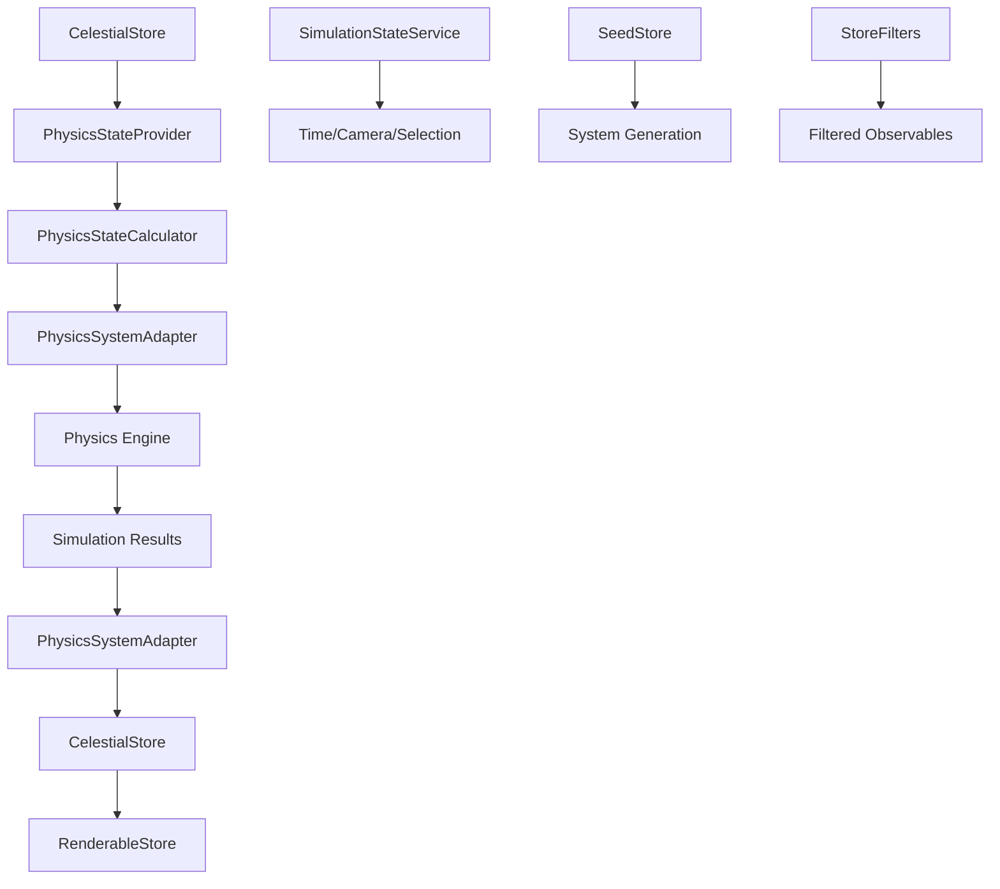

# Architecture: @teskooano/core-state

**Purpose**: This package manages the global state of the simulation using RxJS. It acts as the central source of truth for all other modules, holding information about celestial objects, simulation control parameters, physics state, and renderable objects.

## Core Components

### **Stores** (`src/stores/`)

1. **`CelestialStore`**: Singleton store managing celestial object data and hierarchy relationships.
   - `objects$`: Observable of all celestial objects by ID
   - `hierarchy$`: Observable of parent-child relationships
   - `activeObjects$`, `destroyedObjects$`, `physicsActiveObjects$`, `visibleObjects$`: Pre-filtered observables
   - Comprehensive lifecycle operations: add, update, remove, bulk operations
   - Centralized destruction event processing with cascade effects

2. **`PhysicsStore`**: Singleton store managing physics-related state.
   - `accelerationVectors$`: Observable of acceleration vectors by object ID
   - `nonZeroAccelerationVectors$`: Pre-filtered observable for non-zero vectors
   - Efficient vector operations using OSVector3
   - Batch and individual vector updates

3. **`RenderableStore`**: Singleton store managing Three.js-compatible renderable objects.
   - `renderableObjects$`: Observable of all renderable objects
   - `visibleRenderableObjects$`, `activeRenderableObjects$`, `physicsActiveRenderableObjects$`: Pre-filtered observables
   - Object lifecycle management for Three.js integration
   - State synchronization with core celestial state

4. **`SeedStore`**: Singleton store managing system generation seed.
   - `currentSeed$`: Observable of current seed value
   - localStorage persistence with error handling
   - Default seed fallback and input validation

### **Services** (`src/services/`)

1. **`SimulationStateService`**: Singleton service managing simulation control state.
   - `simulationState$`: Observable of complete simulation state
   - Time management: scale, pause, reset, step operations
   - Camera control: position, target, FOV management
   - Object selection: focused and selected object state
   - Physics configuration: mode, algorithm, integrator settings
   - Visual settings: trails, predictions, performance profiles

2. **`PhysicsStateProvider`**: Static service providing physics state calculations.
   - `physicsStates$`: Observable of physics states for active objects
   - `physicsActiveObjects$`: Observable of objects active for physics
   - Intelligent caching with automatic invalidation
   - Delegates calculations to `PhysicsStateCalculator`

3. **`PhysicsStateCalculator`**: Static service for physics state computation.
   - `calculatePhysicsState()`: Converts celestial objects to physics state
   - Multi-star system support with barycenter calculations
   - Rogue object detection and positioning
   - Special object handling (rings, clouds, fields)
   - Circular reference prevention

### **Adapters** (`src/adapters/`)

1. **`PhysicsSystemAdapter`**: Singleton adapter bridging core state and physics engine.
   - `getPhysicsBodies()`: Provides physics bodies for simulation
   - `getPhysicsBodies$()`, `getPhysicsActiveObjects$()`: Reactive streams
   - `updateStateFromResult()`: Processes simulation results
   - Delegates destruction processing to `CelestialStore`
   - Efficient batch processing and state updates

### **Managers** (`src/managers/`)

1. **`CelestialManager`**: Singleton manager consolidating celestial object lifecycle operations.
   - Factory methods: `createSolarSystem()`, `addCelestial()`, `addObjects()`
   - Lifecycle management: add, update, remove, mark destroyed
   - Dependency sorting and hierarchy management
   - Event dispatching using shared utilities

### **Utilities** (`src/utils/`)

1. **`StoreFilters`**: Static utilities for filtering celestial and renderable objects.
   - Imperative functions: `filterActiveCelestialObjects()`, `filterVisibleCelestialObjects()`, etc.
   - RxJS operators: `filterActiveCelestialObjects$()`, `filterVisibleCelestialObjects$()`, etc.
   - Physics vector filtering: `filterNonZeroAccelerationVectors()`
   - Consistent filtering across all stores

2. **`CelestialUtils`**: Static utilities for celestial object operations.
   - Validation: `validateCelestialData()`, `isValidRootObject()`
   - Processing: `processStarData()`, `processCelestialData()`
   - Hierarchy: `sortByDependency()`, `createHierarchyFromObjects()`
   - Events: `dispatchObjectDestroyedEvent()`, `dispatchObjectsLoadedEvent()`

3. **`StateAccessor`**: Static utility providing unified state access.
   - Observable streams for all stores
   - Optimized observables without redundant `startWith` operators
   - Convenience methods for common queries
   - Standard abstraction for state access

4. **`StateSubscriptionMixin`**: Mixin for managing RxJS subscriptions.
   - Simplified subscription tracking using single `Subscription` object
   - Memory leak prevention
   - Standardized disposal pattern

5. **`SimulationUtils`**: Static utilities for simulation configuration.
   - Validation: `isValidConfiguration()`
   - Defaults: `getDefaultConfiguration()`
   - Display: `getConfigurationDisplayName()`, `getConfigurationShortName()`

### **Types** (`src/types/`)

1. **`SimulationTypes`**: TypeScript definitions for simulation state.
   - `SimulationState`: Complete simulation state interface
   - `SimulationConfiguration`: Physics engine configuration
   - `CameraState`: Camera position and control
   - `VisualSettingsState`: Rendering configuration
   - `ClearStateOptions`: State clearing configuration

## Key Design Principles

- **Singleton Pattern**: All stores and services use singleton pattern for global access
- **Reactive Architecture**: RxJS observables provide reactive state updates throughout the application
- **Immutability**: All state updates create new objects, ensuring reactive updates and debugging
- **Shared Utilities**: Centralized utilities eliminate code duplication and ensure consistency
- **Performance Optimization**: Intelligent caching, filtering, and batch operations
- **Type Safety**: Full TypeScript type safety across all components
- **Error Handling**: Graceful error handling with fallbacks and logging

## Data Flow

## Dependencies

- **`rxjs`**: Reactive state management and observables
- **`@teskooano/data-types`**: Core data structures and type definitions
- **`@teskooano/core-math`**: Vector math operations (OSVector3)
- **`@teskooano/core-physics`**: Physics engine integration types

## Recent Improvements

- **Performance Optimizations**: Removed redundant `startWith` operators, simplified subscription tracking
- **Code Consolidation**: Centralized destruction logic, shared filtering utilities
- **Architecture Refinement**: Clear separation of concerns, improved delegation patterns
- **Documentation**: Comprehensive documentation for all components
