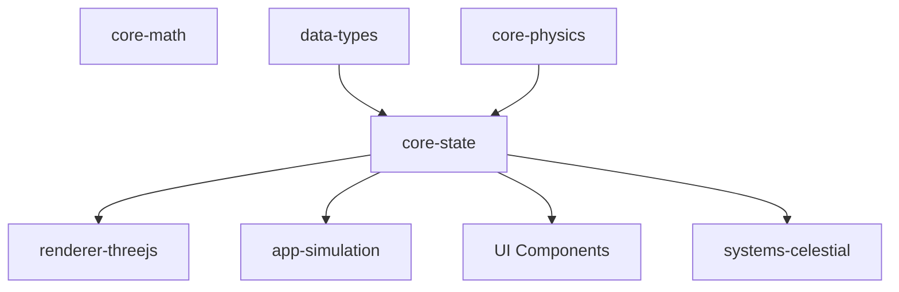

# @teskooano/core-state

## What is it?
The `@teskooano/core-state` library is the central state management system for the Open Space engine. It provides a reactive, atomic store for all game state including celestial objects, physics state, and game configuration. Using Nanostores as its foundation, it enables efficient state updates and subscriptions across the application, ensuring consistent data flow throughout the system.

## Where is it?
**Physical Location:** `/packages/core/state`

**System Context:** The state package is the central hub connecting all parts of the simulation. It serves as the source of truth for the application:

## When is it used?
The state management system is used:
- Throughout the entire application lifecycle
- When initializing the simulation with celestial objects
- During each frame update to store and retrieve current object states
- By the renderer to access current positions and properties for rendering
- By UI components to display information and respond to user interactions
- When loading and saving simulation state

## How does it work?
The state management is built around:

### Atomic Stores
- `celestialObjectsStore`: Maps object IDs to their full data including physics state
- `celestialHierarchyStore`: Tracks parent-child relationships between celestial objects

### Factory Functions
- Creates and registers new celestial objects in the state
- Manages object lifecycle and hierarchy

### Actions & Updates
- Updates physics states based on simulation ticks
- Provides actions for manipulating celestial objects
- Handles deletion and creation of objects

### Simulation Control
- Manages time progression and simulation speed
- Controls pause/resume functionality
- Maintains game clock and simulation ticks

## Strengths
- Reactive architecture ensures UI and rendering remain in sync with simulation
- Atomic updates improve performance by only rerendering what changed
- Clear separation between state and rendering logic
- Well-defined actions for state manipulation

## Weaknesses
- Currently focused primarily on celestial state management
- Limited UI state management capabilities for the planned window system

## Opportunities
- Expanding to support the new UI window management system
- Adding support for loading and saving system data from JSON
- Implementing player ship state tracking

## Future Considerations
For upcoming features:
- The new UI manager will require dedicated state stores for tracking window positions, visibility, and configuration
- System loader will need state management for loading, validating, and tracking available star systems
- Ship movement will require new state components for player ship status, navigation, and warp capabilities
- Local storage integration for persisting UI preferences and window layouts 