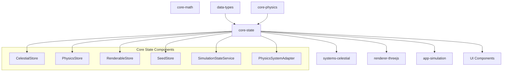

# @teskooano/core-state

## Overview

The `@teskooano/core-state` package is the central state management system for the Teskooano engine, responsible for managing the simulation's core data, physics state, renderable objects, and simulation control. Using RxJS as its foundation, it provides reactive state management with intelligent caching, filtering, and performance optimization.

## What is it?

The `@teskooano/core-state` library is the central state management system for the Teskooano engine. It provides a comprehensive, reactive state management solution for all simulation data including celestial objects, physics state, renderable objects, and simulation control. Using RxJS as its foundation, it enables efficient state updates and subscriptions across the application, ensuring consistent data flow throughout the system.

## Where is it?

**Physical Location:** `/packages/core/state`

**System Context:** The state package is the central hub connecting all parts of the simulation. It serves as the source of truth for the application:

```mermaid
graph TD
    Math[core-math]
    Physics[core-physics]
    State[core-state]
    Types[data-types]
    Celestial[systems-celestial]
    Renderer[renderer-threejs]
    Simulation[app-simulation]
    UI[UI Components]

    Types --> State
    Physics --> State
    State --> Renderer
    State --> Simulation
    State --> UI
    State --> Celestial

    subgraph "Core State Components"
        CS[CelestialStore]
        PS[PhysicsStore]
        RS[RenderableStore]
        SS[SeedStore]
        SVS[SimulationStateService]
        PPA[PhysicsSystemAdapter]
    end

    State --> CS
    State --> PS
    State --> RS
    State --> SS
    State --> SVS
    State --> PPA
```

## When is it used?

The state management system is used:

- Throughout the entire application lifecycle
- When initializing the simulation with celestial objects
- During each frame update to store and retrieve current object states
- By the renderer to access current positions and properties for rendering
- By UI components to display information and respond to user interactions
- When loading and saving simulation state
- For physics engine integration and state synchronization
- For system generation with seed-based procedural content
- For camera control and object selection
- For performance optimization and caching

## How does it work?

The state management is built around:

### Singleton Stores

- **`CelestialStore`**: Maps object IDs to their full data including physics state and hierarchy relationships
- **`PhysicsStore`**: Manages acceleration vectors and physics-related state
- **`RenderableStore`**: Stores Three.js-compatible renderable objects
- **`SeedStore`**: Manages system generation seed with localStorage persistence

### Services & Adapters

- **`SimulationStateService`**: Manages simulation control (time, camera, selection, configuration)
- **`PhysicsStateProvider`**: Provides physics state calculations with intelligent caching
- **`PhysicsStateCalculator`**: Computes physics states from celestial objects
- **`PhysicsSystemAdapter`**: Bridges core state and physics engine

### Utilities & Managers

- **`CelestialManager`**: Consolidates celestial object lifecycle operations
- **`StoreFilters`**: Provides filtering utilities for celestial and renderable objects
- **`CelestialUtils`**: Offers validation, processing, and event dispatching utilities
- **`StateAccessor`**: Provides unified state access with optimized observables

### Reactive Architecture

- RxJS observables provide reactive state updates throughout the application
- Pre-filtered observables for common use cases (active, visible, physics-active objects)
- Intelligent caching and performance optimization
- Immutable state updates ensure reactive behavior and debugging

## Strengths

- **Reactive Architecture**: RxJS observables ensure UI and rendering remain in sync with simulation
- **Performance Optimization**: Intelligent caching, filtering, and batch operations
- **Type Safety**: Full TypeScript type safety across all components
- **Modular Design**: Clear separation of concerns with specialized stores and services
- **Shared Utilities**: Centralized utilities eliminate code duplication and ensure consistency
- **Comprehensive Coverage**: Handles all aspects of simulation state (celestial, physics, renderable, control)
- **Error Handling**: Graceful error handling with fallbacks and logging

## Weaknesses

- **Complexity**: Large number of components may be overwhelming for new developers
- **Dependency Management**: Multiple singleton instances require careful dependency management
- **Learning Curve**: RxJS patterns and reactive programming concepts require understanding

## Opportunities

- **Performance Monitoring**: Add metrics and monitoring for cache hit rates and performance
- **State Persistence**: Enhanced localStorage integration for saving/loading simulation states
- **Plugin System**: Extensible architecture for custom state management plugins
- **Testing**: Comprehensive test coverage for all stores and services

## Future Considerations

For upcoming features:

- **UI State Management**: Dedicated stores for window positions, visibility, and configuration
- **System Persistence**: Enhanced state management for loading, validating, and tracking star systems
- **Player State**: New state components for player ship status, navigation, and capabilities
- **Multiplayer Support**: State synchronization for collaborative simulations
- **Advanced Caching**: More sophisticated caching strategies for large-scale simulations
