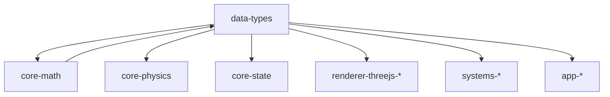

# AGENTS.md

A comprehensive guide for AI coding agents working on the Teskooano Data Types package.

## Package Overview

The **`@teskooano/data-types`** package is the central type definition library for the Open Space engine. It provides TypeScript interfaces, enums, and type definitions for all core data structures used throughout the application, ensuring type safety, consistency, and serving as living documentation for the data model across the entire system.

### Purpose

- **Centralized Type Definitions**: All core data structures in one place
- **Type Safety**: Comprehensive TypeScript interfaces for compile-time validation
- **Living Documentation**: Type definitions serve as documentation for the data model
- **Consistency**: Single source of truth for data structures across all packages
- **Scaling Logic**: Constants and functions for converting between real-world and visual units

## Setup Commands

### Prerequisites

- Install [moon](https://moonrepo.dev/) and [proto](https://moonrepo.dev/proto) for task running and dependency management
- Node.js 24.2.0 (specified in package.json engines)

### Installation & Development

```bash
# Install dependencies
proto use

# Run tests
moon run data-types:test

# Build package
moon run data-types:build

# Lint code
npm run lint
```

## Package Architecture

### Directory Structure

```
src/
├── celestial/
│   ├── index.ts              # Re-exports all celestial types
│   ├── core.types.ts         # Core CelestialObject interface
│   ├── enums.ts              # All celestial classification enums
│   ├── properties.types.ts   # Type-specific property interfaces
│   ├── orbit.type.ts         # OrbitalParameters interface
│   ├── rendering.types.ts    # RenderableCelestialObject interface
│   └── display.types.ts      # Display configuration types
├── camera.ts                 # Camera management interfaces
├── events.ts                 # Event type definitions
├── main.ts                   # Top-level simulation types
├── performance.ts            # Performance configuration types
├── physics.ts                # Physics state definitions
├── time.ts                   # Time-related type definitions
├── ui.ts                     # UI component type definitions
├── index.ts                  # Main package entry point
├── index.spec.ts             # Type validation tests
└── globals.d.ts              # Global type declarations
```

### Design Principles

#### 1. Domain Separation

Types are organized by their domain of use:

- **Celestial**: All celestial object types and classifications
- **Physics**: Physics engine state and calculations
- **Rendering**: Renderer-specific type extensions
- **UI**: Generic UI component type definitions
- **Performance**: Performance optimization types
- **Events**: Event system type definitions

#### 2. Single Source of Truth

All type definitions are defined in exactly one place to prevent inconsistencies and ensure maintainability.

#### 3. Strong Typing

Leverages TypeScript's type system for compile-time validation and developer experience.

#### 4. Clear Documentation

Every interface and type includes comprehensive JSDoc comments with usage examples and context.

## Code Style & Conventions

### TypeScript Standards

- **Strict Mode**: Always use strict TypeScript configuration
- **Type Safety**: All interfaces are properly typed with no `any` types
- **JSDoc**: Comprehensive documentation with examples
- **Minimal Dependencies**: Only essential dependencies (Three.js, core-math)

### Code Style

- **Indentation**: Use 2-space indentation
- **Naming**:
  - `PascalCase` for interfaces, enums, and types
  - `camelCase` for properties and methods
  - `UPPER_CASE` for enum values
- **File Size**: Keep files focused and under 400 lines
- **Modularity**: Each domain has its own file structure

### Import Patterns

- **Static Imports**: Use ES import statements at the top of files
- **Barrel Exports**: Use index.ts files for clean imports
- **Path Aliases**: Use `@teskooano/*` aliases when available

## Key Components

### Celestial Types (`src/celestial/`)

#### Core Types (`core.types.ts`)

The fundamental `CelestialObject` interface:

```typescript
export interface CelestialObject<T = CelestialSpecificPropertiesUnion> {
  id: string;
  type: CelestialType;
  name: string;
  status: CelestialStatus;
  realRadius_m: number;
  realMass_kg: number;
  orbit: OrbitalParameters;
  temperature: number;
  albedo?: number;
  atmosphere?: PlanetAtmosphereProperties;
  properties?: T;
  parentId?: string;
  lagrangePointTargetId?: string;
  seed?: string;
  ignorePhysics?: boolean;
  ignoreCollisions?: boolean;
  isVisible?: boolean;
}
```

#### Enums (`enums.ts`)

Comprehensive classification system:

```typescript
export enum CelestialType {
  STAR = "STAR",
  PLANET = "PLANET",
  DWARF_PLANET = "DWARF_PLANET",
  MOON = "MOON",
  ASTEROID = "ASTEROID",
  ASTEROID_FIELD = "ASTEROID_FIELD",
  GAS_GIANT = "GAS_GIANT",
  COMET = "COMET",
  OORT_CLOUD = "OORT_CLOUD",
  RING_SYSTEM = "RING_SYSTEM",
  BARYCENTER = "BARYCENTER",
  SATELLITE = "SATELLITE",
  OTHER = "OTHER",
}

export enum StellarType {
  MAIN_SEQUENCE = "MAIN_SEQUENCE",
  PROTOSTAR = "PROTOSTAR",
  PRE_MAIN_SEQUENCE = "PRE_MAIN_SEQUENCE",
  SUBGIANT = "SUBGIANT",
  RED_GIANT = "RED_GIANT",
  WHITE_DWARF = "WHITE_DWARF",
  NEUTRON_STAR = "NEUTRON_STAR",
  BLACK_HOLE = "BLACK_HOLE",
  // ... and many more
}
```

#### Properties (`properties.types.ts`)

Type-specific property interfaces:

```typescript
export interface StarProperties extends SpecificPropertiesBase {
  type: CelestialType.STAR;
  isMainStar: boolean;
  spectralClass: string;
  luminosity: number;
  color: string;
  stellarType?: StellarType;
  partnerStars?: string[];
  systemLighting?: SystemLightingProperties;
  // ... extensive star-specific properties
}

export interface PlanetProperties<
  T = ProceduralSurfaceProperties,
> extends SpecificPropertiesBase {
  type: CelestialType.PLANET | CelestialType.MOON | CelestialType.DWARF_PLANET;
  classType?: PlanetType;
  isMoon: boolean;
  composition: string[];
  atmosphere?: PlanetAtmosphereProperties;
  surface?: T;
  ringSystem?: RingSystemConfiguration;
}
```

#### Orbital Parameters (`orbit.type.ts`)

Keplerian orbital elements:

```typescript
export interface OrbitalParameters {
  realSemiMajorAxis_m: number;
  eccentricity: number;
  inclination: number;
  longitudeOfAscendingNode: number;
  argumentOfPeriapsis: number;
  meanAnomaly: number;
  period_s: number;
  siderealRotationPeriod_s?: number;
  axialTilt?: OSVector3;
  lagrangePointType?: LagrangePointType;
  realAphelion_m: number;
  realPerihelion_m: number;
  averageOrbitalSpeed_mps: number;
  epoch?: string;
  timeOfPerihelion?: string;
}
```

#### Rendering Types (`rendering.types.ts`)

Renderer-specific extensions:

```typescript
export interface RenderableCelestialObject<
  T = CelestialSpecificPropertiesUnion,
> extends CelestialObject<T> {
  radius: number;
  mass: number;
  position: THREE.Vector3;
  velocity?: THREE.Vector3;
  velocityMagnitude_mps?: number;
  rotation: THREE.Quaternion;
  physicsStateReal: PhysicsStateReal;
  primaryLightSourceId?: string;
  isVisible?: boolean;
  isTargetable?: boolean;
  isSelected?: boolean;
  isFocused?: boolean;
  uniforms: { [key: string]: any };
  axialTilt?: OSVector3 | number;
  showLabel?: boolean;
  showOrbit?: boolean;
  showPrediction?: boolean;
}
```

### Physics Types (`physics.ts`)

Core physics state definitions:

```typescript
export interface PhysicsStateReal {
  id: string;
  mass_kg: number;
  position_m: OSVector3;
  velocity_mps: OSVector3;
  ticksSinceLastPhysicsUpdate?: number;
}

export interface LagrangePoint {
  id: "L1" | "L2" | "L3" | "L4" | "L5";
  position_m: OSVector3;
  velocity_mps?: OSVector3;
  distanceFromSecondary_m: number;
  distanceFromPrimary_m: number;
  stability: "stable" | "unstable" | "marginally_stable";
  effectivePotential_Jkg: number;
  hillSphereRadius_m: number;
}
```

### Simulation Types (`main.ts`)

Top-level simulation configuration:

```typescript
export interface SimulationState {
  time: number;
  timeScale: number;
  paused: boolean;
  selectedObject: string | null;
  focusedObjectId: string | null;
  camera: {
    position: OSVector3;
    target: OSVector3;
    fov: number;
  };
}

export enum SimulationMode {
  IDEAL = "ideal", // Keplerian/ideal orbital mechanics
  NBODY = "nbody", // Full N-body physics simulation
}

export enum IntegratorType {
  EULER = "euler",
  SYMPLECTIC = "symplectic",
  VERLET = "verlet",
  RK4 = "rk4",
  ADAPTIVE = "adaptive",
  // ... and more
}
```

### Performance Types (`performance.ts`)

Performance optimization configuration:

```typescript
export interface SceneManagerOptions {
  antialias?: boolean;
  shadows?: boolean;
  hdr?: boolean;
  fov?: number;
  cameraPosition?: [number, number, number];
  cameraTarget?: [number, number, number];
}

export interface PerformanceOptimization {
  antialias: boolean;
  shadows: boolean;
  hdr: boolean;
  pixelRatio: number;
  shadowMapType: ShadowMapType;
  maxLights: number;
  maxShadowCasters: number;
  lodDistanceMultiplier: number;
  trailQuality: "low" | "medium" | "high";
  particleCountMultiplier: number;
}
```

### UI Types (`ui.ts`)

Generic UI component definitions:

```typescript
export enum UIComponentType {
  PANEL = "panel",
  FOLDER = "folder",
  BUTTON = "button",
  SLIDER = "slider",
  CHECKBOX = "checkbox",
  DROPDOWN = "dropdown",
  COLOR = "color",
  TEXT = "text",
  NUMBER = "number",
  LABEL = "label",
  TOOLBAR = "toolbar",
  WINDOW = "window",
}

export interface BaseUIComponent {
  id: string;
  type: UIComponentType;
  parent?: BaseUIComponent;
  children: BaseUIComponent[];
  visible: boolean;
  disabled: boolean;
  layer?: UILayer;
  zIndex?: number;
  // ... component methods
}
```

### Event Types (`events.ts`)

Event system definitions for cross-system communication:

```typescript
export const CustomEvents = {
  COMPOSITE_ENGINE_INITIALIZED: "composite-engine-initialized",
  SYSTEM_GENERATION_START: "system-generation-start",
  SYSTEM_GENERATION_COMPLETE: "system-generation-complete",
  SIMULATION_RESET_TIME: "resetSimulationTime",
  ORBIT_UPDATE: "orbitUpdate",
  RENDERER_READY: "renderer-ready",
  CELESTIAL_OBJECT_DESTROYED: "celestial-object-destroyed",
  CELESTIAL_OBJECTS_LOADED: "celestial-objects-loaded",
  // ... extensive event definitions
} as const;

export interface OrbitUpdatePayload {
  positions: Record<string, { x: number; y: number; z: number }>;
}

export interface SliderValueChangePayload {
  value: number;
}
```

#### Event System Integration

The `CustomEvents` object provides constants for DOM events used throughout the system, which are bridged to RxJS via `SystemEventBridge` and `CelestialEventBridge` in `@teskooano/core-state`:

- **Core State Events**: `CELESTIAL_OBJECT_DESTROYED`, `CELESTIAL_OBJECTS_LOADED`
- **UI Events**: `UI_PANEL_OPEN`, `UI_BUTTON_CLICK`, `UI_MODAL_SHOW`
- **System Events**: `SYSTEM_GENERATION_START`, `SYSTEM_GENERATION_COMPLETE`
- **Custom Events**: `teskooano-clear-orbit-trails`, `teskooano-clear-predictions`

These events are consumed by `SystemEventBridge`/`CelestialEventBridge` and converted to RxJS events for internal communication across systems.

## Testing Strategy

### Test Organization

- **File Convention**: Test files (`<filename>.spec.ts`) adjacent to source files
- **Type Validation**: Use Vitest for validating type structures
- **Browser Tests**: Use `@vitest/browser` for Three.js type testing
- **Test Data**: Use fixed values for deterministic tests

### Test Commands

```bash
# Run all tests
moon run data-types:test

# Run tests in interactive mode
npm run test

# Run tests with coverage
npm run test -- --coverage
```

### Test Patterns

```typescript
// Test type structure validation
describe("CelestialObject", () => {
  it("should be a valid CelestialObject type", () => {
    const object: CelestialObject = {
      id: "test-1",
      name: "Test Object",
      type: CelestialType.PLANET,
      // ... required properties
    };

    expect(object).toHaveProperty("id");
    expect(object).toHaveProperty("name");
    expect(object).toHaveProperty("type");
    expect(typeof object.id).toBe("string");
    expect(typeof object.name).toBe("string");
    expect(Object.values(CelestialType)).toContain(object.type);
  });
});
```

## Data Sources & Validation

### Type Sources

- **Astrophysical Standards**: IAU definitions for astronomical units and classifications
- **Physics Standards**: SI units and physical constants
- **Three.js Integration**: Proper integration with Three.js type system
- **Real-world Data**: Based on actual astronomical and physical data

### Validation Strategy

- **Type Safety**: All interfaces are properly typed with no `any` types
- **Structural Validation**: TypeScript structural typing ensures correctness
- **Unit Consistency**: All physical properties include proper units in JSDoc
- **Cross-Reference**: Types are cross-referenced with authoritative sources

## Development Guidelines

### Adding New Types

1. **Choose the Right File**: Place types in the appropriate domain file
2. **Add JSDoc**: Include comprehensive documentation with examples
3. **Export from Index**: Add to the appropriate index.ts file
4. **Write Tests**: Create tests to verify type structure
5. **Update Documentation**: Keep this AGENTS.md file updated

### Adding New Interfaces

1. **Extend Base Types**: Use existing base interfaces when possible
2. **Type Safety**: Ensure all properties are properly typed
3. **Documentation**: Include JSDoc with parameter descriptions
4. **Tests**: Write comprehensive tests for new interfaces

### Code Quality Standards

- **No Side Effects**: Type definitions should not have side effects
- **Immutable**: All exported types should be immutable
- **Consistent**: Follow established naming and formatting conventions
- **Documented**: Every public type should be documented

## Common Patterns

### Type Usage

```typescript
// Import specific types
import {
  CelestialObject,
  CelestialType,
  StarProperties,
} from "@teskooano/data-types";

// Use in function signatures
function processCelestialObject(object: CelestialObject): void {
  if (object.type === CelestialType.STAR) {
    const starProps = object.properties as StarProperties;
    // Process star-specific properties
  }
}
```

### Discriminated Unions

```typescript
// Use discriminated unions for type safety
export type CelestialSpecificPropertiesUnion =
  | StarProperties
  | PlanetProperties
  | GasGiantProperties
  | CometProperties
  | AsteroidFieldProperties
  | OortCloudProperties
  | RingSystemProperties
  | SatelliteProperties
  | AsteroidProperties;
```

### Generic Types

```typescript
// Use generics for flexible type definitions
export interface CelestialObject<T = CelestialSpecificPropertiesUnion> {
  // ... base properties
  properties?: T;
}

// Usage with specific types
const star: CelestialObject<StarProperties> = {
  // ... star-specific implementation
};
```

### Enum Usage

```typescript
// Use enums for type-safe constants
export enum CelestialType {
  STAR = "STAR",
  PLANET = "PLANET",
  // ... other types
}

// Type-safe usage
function createCelestialObject(type: CelestialType): CelestialObject {
  // Implementation
}
```

## Performance Considerations

### Type System Performance

- **Compile-time Validation**: Types are validated at compile time, not runtime
- **Tree Shaking**: Individual types can be imported to reduce bundle size
- **Minimal Dependencies**: Only essential dependencies to minimize bundle impact

### Memory Efficiency

- **Interface Definitions**: Interfaces don't exist at runtime, only at compile time
- **Enum Values**: Enums are compiled to simple string/number values
- **Type Erasure**: TypeScript types are erased at runtime

### Bundle Size

- **Tree Shaking**: Individual types can be imported to reduce bundle size
- **Minimal Dependencies**: Only essential dependencies (Three.js, core-math)
- **Efficient Imports**: Barrel exports allow for efficient importing

## Troubleshooting

### Common Issues

#### Import Errors

```typescript
// ❌ Incorrect - importing from wrong path
import { CelestialObject } from "@teskooano/data-types/celestial/core.types";

// ✅ Correct - importing from main package
import { CelestialObject } from "@teskooano/data-types";
```

#### Type Errors

```typescript
// ❌ Incorrect - using wrong type
const object: string = CelestialType.STAR;

// ✅ Correct - using proper type
const object: CelestialType = CelestialType.STAR;
```

#### Generic Type Errors

```typescript
// ❌ Incorrect - not specifying generic type
const star: CelestialObject = { type: CelestialType.STAR };

// ✅ Correct - specifying generic type
const star: CelestialObject<StarProperties> = {
  type: CelestialType.STAR,
  properties: {
    /* star properties */
  },
};
```

### Debugging Tips

- **Check Types**: Verify that types are properly imported and used
- **Validate Structure**: Ensure objects match the expected interface structure
- **Check Dependencies**: Ensure all required dependencies are installed
- **TypeScript Errors**: Use TypeScript compiler errors to identify issues

## Dependencies

### Runtime Dependencies

- **`three`**: Required for Three.js type definitions (version 0.180.0)
- **`@teskooano/data-values`**: Required for scaling constants and utilities
- **`@teskooano/core-math`**: Required for OSVector3 and OSQuaternion types

### Development Dependencies

- **`typescript`**: TypeScript compiler (version 5.9.2)
- **`vitest`**: Testing framework (version 3.2.4)
- **`eslint`**: Code linting (version 9.35.0)
- **`@types/three`**: Three.js type definitions (version 0.180.0)

## Contributing Guidelines

### Before Making Changes

1. **Read Documentation**: Understand the package's purpose and structure
2. **Check Existing Types**: Ensure you're not duplicating existing definitions
3. **Verify Sources**: Use authoritative sources for physical and astronomical data
4. **Consider Impact**: Changes to types can affect the entire system

### Code Review Checklist

- [ ] Types have proper JSDoc documentation
- [ ] Types are placed in the correct domain file
- [ ] Types are exported from the appropriate index.ts
- [ ] Tests are written for new types
- [ ] No breaking changes to existing APIs
- [ ] Type safety is maintained

### Testing Requirements

- [ ] Type validation tests for all new interfaces
- [ ] Integration tests for complex type relationships
- [ ] Documentation tests for JSDoc examples
- [ ] Cross-package compatibility tests

## Integration Points

### Core Packages

- **`@teskooano/core-math`**: Provides OSVector3 and OSQuaternion types
- **`@teskooano/core-physics`**: Uses physics state types for calculations
- **`@teskooano/core-state`**: Uses simulation state types for state management

### Renderer Packages

- **`@teskooano/renderer-threejs-*`**: Uses rendering types and Three.js integration
- **`@teskooano/renderer-threejs-core`**: Uses performance types for optimization
- **`@teskooano/renderer-threejs-camera`**: Uses camera types for camera management

### System Packages

- **`@teskooano/systems-procedural-generation`**: Uses celestial types for generation
- **`@teskooano/systems-solar-system`**: Uses celestial types for solar system data

### Application Packages

- **`@teskooano/app-simulation`**: Uses simulation types for simulation control
- **`@teskooano/app-ui-plugin`**: Uses UI types for plugin development

## Architecture Documentation

### Package Relationships



### Data Flow

```
Type Definitions → Compile-time Validation → Runtime Safety
Celestial Types → Object Creation → Rendering Pipeline
Physics Types → Simulation Engine → State Updates
UI Types → Component Creation → User Interface
```

## Scientific References

### Astronomical Data

- **IAU 2015 Resolution B3**: Astronomical units and constants
- **NASA Planetary Fact Sheet**: Planetary and solar system data
- **Stellar Data**: Hipparcos and Gaia catalogs
- **Stellar Evolution**: Harvard-Smithsonian Center for Astrophysics

### Physical Constants

- **CODATA 2018**: Committee on Data for Science and Technology
- **NIST Reference**: National Institute of Standards and Technology
- **IAU Resolutions**: International Astronomical Union

### Type System Standards

- **TypeScript Handbook**: Official TypeScript documentation
- **Three.js Types**: Three.js type definitions and patterns
- **Astronomical Classifications**: IAU stellar and planetary classification systems

---

**Remember**: This package is the foundation for all type safety in the Teskooano system. Always verify type definitions against authoritative sources and maintain consistency across the entire codebase. Changes to types can have far-reaching effects, so thorough testing and documentation are essential.
