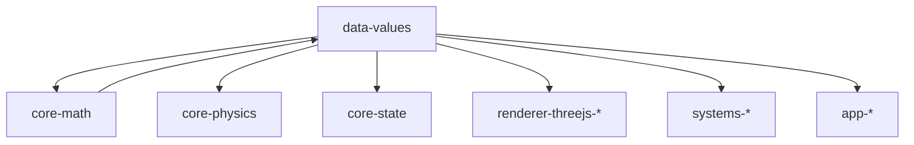

# AGENTS.md

A comprehensive guide for AI coding agents working on the Teskooano Data Values package.

## Package Overview

The **`@teskooano/data-values`** package provides centralized constant values and utility functions for the Open Space engine. It serves as the single source of truth for all physical constants, astronomical measurements, unit conversion factors, and simulation limits used throughout the Teskooano system.

### Purpose

- **Centralized Constants**: All physical and astronomical constants in one place
- **Unit Conversion**: Standardized conversion functions between different units
- **Simulation Limits**: Numerical constraints for stable physics calculations
- **Type Safety**: Fully typed constants and utilities with comprehensive JSDoc
- **Performance**: Optimized utilities like ThreeVector3Converter for efficient conversions

## Setup Commands

### Prerequisites

- Install [moon](https://moonrepo.dev/) and [proto](https://moonrepo.dev/proto) for task running and dependency management
- Node.js 24.2.0 (specified in package.json engines)

### Installation & Development

```bash
# Install dependencies
proto use

# Run tests
moon run data-values:test

# Build package
moon run data-values:build

# Lint code
npm run lint
```

## Package Architecture

### Directory Structure

```
src/
├── constants/
│   ├── index.ts          # Re-exports all constants
│   ├── physical.ts       # Fundamental physical constants (G, c, h, k, σ)
│   ├── astronomical.ts   # Astronomical units (AU, solar mass, Earth mass, etc.)
│   ├── conversion.ts     # Unit conversion factors (KM, MM, time constants)
│   ├── orbital.ts        # Orbital mechanics constants (Kepler tolerances)
│   ├── ranges.ts         # Physical property ranges (temperature, albedo, etc.)
│   ├── rendering.ts      # Rendering constants (FOV, camera speeds, LOD)
│   ├── scaling.ts        # Scaling factors and render scale constants
│   ├── simulation.ts     # Simulation limits and constraints
│   └── time.ts          # Time simulation constants (time steps, scales, FPS)
├── utils/
│   ├── index.ts         # Re-exports all utilities
│   ├── conversions.ts   # Unit conversion functions
│   └── ThreeVector3Converter.ts # Vector conversion utility
└── index.ts             # Main package entry point
```

### Design Principles

#### 1. Domain Separation

Constants are organized by their domain of use rather than by type:

- **Physical**: Fundamental constants (G, c, h, k, σ)
- **Astronomical**: Standard astronomical units and measurements
- **Conversion**: Unit conversion multipliers
- **Simulation**: Numerical limits for stability
- **Rendering**: Visualization and camera constants
- **Time**: Time simulation and animation settings

#### 2. Single Source of Truth

All constant values are defined in exactly one place to prevent inconsistencies and make maintenance easier.

#### 3. Clear Documentation

Every constant includes comprehensive JSDoc comments with:

- What the constant represents
- The units of measurement
- Usage examples
- Relevant context or constraints

#### 4. Type Safety

All constants are properly typed and exported with TypeScript declarations.

## Code Style & Conventions

### TypeScript Standards

- **Strict Mode**: Always use strict TypeScript configuration
- **Type Safety**: All constants are properly typed
- **JSDoc**: Comprehensive documentation with examples
- **No Dependencies**: Pure values library with minimal external dependencies

### Code Style

- **Indentation**: Use 2-space indentation
- **Naming**:
  - `UPPER_CASE` for constants
  - `camelCase` for functions
  - `PascalCase` for classes
- **File Size**: Keep files focused and under 300 lines
- **Modularity**: Each domain has its own file

### Import Patterns

- **Static Imports**: Use ES import statements at the top of files
- **Barrel Exports**: Use index.ts files for clean imports
- **Path Aliases**: Use `@teskooano/*` aliases when available

## Key Components

### Constants (`src/constants/`)

#### Physical Constants (`physical.ts`)

Fundamental physical constants based on CODATA recommended values:

```typescript
export const GRAVITATIONAL_CONSTANT = 6.6743e-11; // m³/(kg·s²)
export const SPEED_OF_LIGHT = 2.99792458e8; // m/s
export const PLANCK_CONSTANT = 6.62607015e-34; // J·s
export const BOLTZMANN_CONSTANT = 1.380649e-23; // J/K
export const STEFAN_BOLTZMANN_CONSTANT = 5.670374419e-8; // W/(m²·K⁴)
```

#### Astronomical Constants (`astronomical.ts`)

Standard astronomical units and measurements:

```typescript
export const AU_METERS = 149597870700; // Astronomical Unit in meters
export const LIGHT_YEAR_METERS = 9.4607304725808e15; // Light year in meters
export const PARSEC_METERS = 3.085677581491367e16; // Parsec in meters
export const SOLAR_MASS = 1.989e30; // Solar mass in kilograms
export const SOLAR_RADIUS = 6.957e8; // Solar radius in meters
export const SOLAR_LUMINOSITY = 3.828e26; // Solar luminosity in watts
export const EARTH_MASS = 5.972e24; // Earth mass in kilograms
export const EARTH_RADIUS = 6.371e6; // Earth radius in meters
export const JUPITER_MASS = 1.898e27; // Jupiter mass in kilograms
export const JUPITER_RADIUS = 6.9911e7; // Jupiter radius in meters
```

#### Conversion Factors (`conversion.ts`)

Unit conversion multipliers:

```typescript
export const KM = 1000; // Kilometers to meters
export const MM = 1e6; // Megameters to meters
export const GM = 1e9; // Gigameters to meters
export const TM = 1e12; // Terameters to meters
export const PM = 1e15; // Petameters to meters
export const SECONDS_PER_MINUTE = 60;
export const SECONDS_PER_HOUR = 3600;
export const SECONDS_PER_DAY = 86400;
export const SECONDS_PER_YEAR = 31557600; // Julian year
export const SECONDS_PER_YEAR_GREGORIAN = 31536000; // Gregorian approximation
```

#### Simulation Limits (`simulation.ts`)

Numerical limits for simulation stability:

```typescript
export const MAX_FORCE = 1e25; // Maximum force magnitude (N)
export const MAX_VELOCITY = 1e7; // Maximum velocity magnitude (m/s)
export const MIN_MASS = 1e10; // Minimum mass for stable calculations (kg)
export const MAX_MASS = 1e35; // Maximum mass for stable calculations (kg)
export const MAX_CELESTIAL_OBJECTS = 80; // Maximum objects for performance
export const MAX_PARTICLES = 10000; // Maximum particles for asteroid fields
export const GRAVITATIONAL_SOFTENING_SQUARED = 1e6; // Gravitational softening (m²)
export const MASS_DIFF_THRESHOLD = 0.1; // Mass difference threshold for collisions
```

#### Rendering Constants (`rendering.ts`)

Default values for visualization:

```typescript
export const DEFAULT_FOV = 75; // Default field of view (degrees)
export const MIN_FOV = 10; // Minimum field of view (degrees)
export const MAX_FOV = 120; // Maximum field of view (degrees)
export const DEFAULT_NEAR = 0.1; // Default near clipping plane
export const DEFAULT_FAR = 10000; // Default far clipping plane
export const DEFAULT_CAMERA_SPEED = 1.0; // Default camera movement speed
export const DEFAULT_CAMERA_ROTATION_SPEED = 0.5; // Default camera rotation speed
export const DEFAULT_CAMERA_ZOOM_SPEED = 1.0; // Default camera zoom speed
export const LOD_DISTANCE_THRESHOLD = 1000; // LOD transition distance (scene units)
```

#### Time Constants (`time.ts`)

Time simulation and animation settings:

```typescript
export const DEFAULT_TIME_STEP = 1.0; // Default simulation time step (seconds)
export const MIN_TIME_STEP = 0.001; // Minimum time step (seconds)
export const MAX_TIME_STEP = 86400; // Maximum time step (1 day in seconds)
export const DEFAULT_TIME_SCALE = 1.0; // Default time scale multiplier
export const MIN_TIME_SCALE = 0.001; // Minimum time scale
export const MAX_TIME_SCALE = 1000000; // Maximum time scale
export const TARGET_FPS = 60; // Target frame rate
export const MIN_FPS = 30; // Minimum acceptable frame rate
```

#### Property Ranges (`ranges.ts`)

Valid ranges for physical properties:

```typescript
export const MIN_STELLAR_TEMPERATURE = 2000; // Minimum stellar temperature (K)
export const MAX_STELLAR_TEMPERATURE = 50000; // Maximum stellar temperature (K)
export const MIN_PLANETARY_TEMPERATURE = 50; // Minimum planetary temperature (K)
export const MAX_PLANETARY_TEMPERATURE = 3000; // Maximum planetary temperature (K)
export const MIN_ALBEDO = 0.0; // Minimum albedo (reflectivity)
export const MAX_ALBEDO = 1.0; // Maximum albedo (reflectivity)
export const MIN_ECCENTRICITY = 0.0; // Minimum orbital eccentricity
export const MAX_ECCENTRICITY = 2.0; // Maximum orbital eccentricity (hyperbolic)
```

#### Orbital Constants (`orbital.ts`)

Orbital mechanics calculation constants:

```typescript
export const BASE_KEPLER_TOLERANCE = 1e-4; // Base tolerance for Kepler equation solver
export const KEPLER_TOLERANCE_SCALING = 1e-3; // Scaling factor for distance-based tolerance
export const MAX_KEPLER_TOLERANCE = 1e-2; // Maximum tolerance for Kepler solver
export const MIN_KEPLER_TOLERANCE = 1e-5; // Minimum tolerance for Kepler solver
export const DEFAULT_KEPLER_TOLERANCE = 1e-8; // Default tolerance for Kepler solver
export const MAX_KEPLER_ITERATIONS = 100; // Maximum iterations for Kepler solver
export const COLLISION_RESTITUTION = 1.0; // Restitution coefficient for collisions
```

#### Scaling Constants (`scaling.ts`)

Scaling and rendering constants:

```typescript
export const SCALE = {
  DISTANCE: 1.0, // Factor for scaling distances between objects
  SIZE: 1.0, // Factor for scaling physical size of objects
  TIME: 1.0, // Factor for time adjustments
  MASS: 1.0e-20, // Factor for adjusting mass values
  RENDER_SCALE_AU: 1000, // Units in ThreeJS scene per AU
  GAS_GIANT_SIZE: 1.0, // Size multiplier for gas giants
  STAR_SIZE: 1.0, // Size multiplier for stars
  MOON_DISTANCE: 50.0, // Distance multiplier for moons
} as const;

export const METERS_TO_SCENE_UNITS = SCALE.RENDER_SCALE_AU / AU_METERS;
export const DEFAULT_RENDER_SCALE_AU = 1000;
export const MIN_RENDER_SCALE_AU = 100;
export const MAX_RENDER_SCALE_AU = 10000;
```

### Utilities (`src/utils/`)

#### Conversion Functions (`conversions.ts`)

Pure functions for unit conversions:

```typescript
// Distance conversions
export function auToMeters(au: number): number;
export function metersToAu(meters: number): number;
export function lightYearsToMeters(ly: number): number;
export function metersToLightYears(meters: number): number;
export function parsecsToMeters(pc: number): number;
export function metersToParsecs(meters: number): number;

// Mass conversions
export function solarMassesToKg(solarMasses: number): number;
export function kgToSolarMasses(kg: number): number;
export function solarRadiiToMeters(solarRadii: number): number;
export function metersToSolarRadii(meters: number): number;

// Time conversions
export function daysToSeconds(days: number): number;
export function secondsToDays(seconds: number): number;
export function yearsToSeconds(years: number): number;
export function secondsToYears(seconds: number): number;
```

#### ThreeVector3Converter (`ThreeVector3Converter.ts`)

Performance-optimized utility for converting between `OSVector3` arrays and `THREE.Vector3` arrays:

```typescript
export class ThreeVector3Converter {
  private _tempVector: THREE.Vector3 = new THREE.Vector3();

  /**
   * Updates a target array of THREE.Vector3 objects with positions from an array of OSVector3.
   * Reuses THREE.Vector3 instances to minimize garbage collection.
   */
  public update(source: OSVector3[], target: THREE.Vector3[]): THREE.Vector3[];
}
```

## Testing Strategy

### Test Organization

- **File Convention**: Test files (`<filename>.spec.ts`) adjacent to source files
- **Unit Tests**: Use Vitest for testing constants and utility functions
- **Browser Tests**: Use `@vitest/browser` for ThreeVector3Converter testing
- **Test Data**: Use fixed values for deterministic tests

### Test Commands

```bash
# Run all tests
moon run data-values:test

# Run tests in interactive mode
npm run test

# Run tests with coverage
npm run test -- --coverage
```

### Test Patterns

```typescript
// Test constant values
describe("Physical Constants", () => {
  it("should have correct gravitational constant value", () => {
    expect(GRAVITATIONAL_CONSTANT).toBe(6.6743e-11);
  });
});

// Test conversion functions
describe("Conversion Functions", () => {
  it("should convert AU to meters correctly", () => {
    expect(auToMeters(1.5)).toBe(1.5 * AU_METERS);
  });
});

// Test utility classes
describe("ThreeVector3Converter", () => {
  it("should convert OSVector3 array to THREE.Vector3 array", () => {
    const converter = new ThreeVector3Converter();
    const source = [new OSVector3(1, 2, 3)];
    const target: THREE.Vector3[] = [];

    const result = converter.update(source, target);
    expect(result[0].x).toBe(1);
    expect(result[0].y).toBe(2);
    expect(result[0].z).toBe(3);
  });
});
```

## Data Sources & Validation

### Physical Constants

- **CODATA**: Committee on Data for Science and Technology recommended values
- **IAU**: International Astronomical Union definitions for astronomical units
- **NIST**: National Institute of Standards and Technology reference values

### Validation Strategy

- **Unit Consistency**: All constants include proper units in JSDoc
- **Range Validation**: Physical property ranges ensure realistic values
- **Numerical Stability**: Simulation limits prevent overflow/underflow
- **Cross-Reference**: Constants are cross-referenced with authoritative sources

## Development Guidelines

### Adding New Constants

1. **Choose the Right File**: Place constants in the appropriate domain file
2. **Add JSDoc**: Include comprehensive documentation with examples
3. **Export from Index**: Add to the appropriate index.ts file
4. **Write Tests**: Create tests to verify the constant value
5. **Update Documentation**: Keep this AGENTS.md file updated

### Adding New Utilities

1. **Pure Functions**: Keep utility functions pure and stateless
2. **Type Safety**: Ensure all functions are properly typed
3. **Performance**: Consider performance implications for frequently used functions
4. **Documentation**: Include JSDoc with parameter and return descriptions
5. **Tests**: Write comprehensive tests for all utility functions

### Code Quality Standards

- **No Side Effects**: Constants and utilities should not have side effects
- **Immutable**: All exported values should be immutable
- **Consistent**: Follow established naming and formatting conventions
- **Documented**: Every public API should be documented

## Common Patterns

### Constant Usage

```typescript
// Import specific constants
import {
  GRAVITATIONAL_CONSTANT,
  SOLAR_MASS,
  AU_METERS,
} from "@teskooano/data-values";

// Use in calculations
const force = (GRAVITATIONAL_CONSTANT * mass1 * mass2) / Math.pow(distance, 2);
const distanceInMeters = 1.5 * AU_METERS;
```

### Conversion Functions

```typescript
// Import conversion functions
import { auToMeters, solarMassesToKg } from "@teskooano/data-values";

// Use for unit conversions
const distanceInMeters = auToMeters(1.5); // 1.5 AU to meters
const massInKg = solarMassesToKg(2.0); // 2.0 solar masses to kg
```

### Simulation Limits

```typescript
// Import simulation limits
import { MAX_CELESTIAL_OBJECTS, MAX_FORCE } from "@teskooano/data-values";

// Use for validation
if (objectCount > MAX_CELESTIAL_OBJECTS) {
  throw new Error("Too many celestial objects");
}
```

### ThreeVector3Converter

```typescript
// Import converter
import { ThreeVector3Converter } from "@teskooano/data-values";

// Use for efficient vector conversions
const converter = new ThreeVector3Converter();
const threeVectors = converter.update(osVectors, existingThreeVectors);
```

## Performance Considerations

### Memory Management

- **Object Reuse**: ThreeVector3Converter reuses vector instances
- **Minimal Allocations**: Conversion functions minimize object creation
- **Efficient Updates**: Update methods modify existing arrays when possible

### Computational Efficiency

- **Pre-calculated Values**: Constants are pre-calculated to avoid runtime computation
- **Optimized Conversions**: Conversion functions use efficient mathematical operations
- **Cached Results**: Frequently used conversions can be cached

### Bundle Size

- **Tree Shaking**: Individual constants can be imported to reduce bundle size
- **Minimal Dependencies**: Only essential dependencies (Three.js for converter)
- **Efficient Imports**: Barrel exports allow for efficient importing

## Troubleshooting

### Common Issues

#### Import Errors

```typescript
// ❌ Incorrect - importing from wrong path
import { GRAVITATIONAL_CONSTANT } from "@teskooano/data-values/constants/physical";

// ✅ Correct - importing from main package
import { GRAVITATIONAL_CONSTANT } from "@teskooano/data-values";
```

#### Type Errors

```typescript
// ❌ Incorrect - using wrong type
const distance: string = AU_METERS;

// ✅ Correct - using proper type
const distance: number = AU_METERS;
```

#### Conversion Errors

```typescript
// ❌ Incorrect - using constant instead of function
const meters = distance * auToMeters; // auToMeters is a function, not a constant

// ✅ Correct - calling the function
const meters = auToMeters(distance);
```

### Debugging Tips

- **Check Units**: Verify that constants have the correct units
- **Validate Ranges**: Ensure values fall within expected ranges
- **Test Conversions**: Verify conversion functions work correctly
- **Check Dependencies**: Ensure all required dependencies are installed

## Dependencies

### Runtime Dependencies

- **`three`**: Required for ThreeVector3Converter (version 0.180.0)

### Development Dependencies

- **`typescript`**: TypeScript compiler (version 5.9.2)
- **`vitest`**: Testing framework (version 3.2.4)
- **`eslint`**: Code linting (version 9.35.0)
- **`@types/three`**: Three.js type definitions (version 0.180.0)

### Peer Dependencies

- **`@teskooano/core-math`**: Required for OSVector3 type in ThreeVector3Converter

## Contributing Guidelines

### Before Making Changes

1. **Read Documentation**: Understand the package's purpose and structure
2. **Check Existing Constants**: Ensure you're not duplicating existing values
3. **Verify Sources**: Use authoritative sources for physical constants
4. **Consider Impact**: Changes to constants can affect the entire system

### Code Review Checklist

- [ ] Constants have proper JSDoc documentation
- [ ] Constants are placed in the correct domain file
- [ ] Constants are exported from the appropriate index.ts
- [ ] Tests are written for new constants/utilities
- [ ] No breaking changes to existing APIs
- [ ] Performance implications are considered

### Testing Requirements

- [ ] Unit tests for all new constants
- [ ] Integration tests for new utilities
- [ ] Performance tests for frequently used functions
- [ ] Documentation tests for JSDoc examples

## Integration Points

### Core Packages

- **`@teskooano/core-math`**: Provides OSVector3 type for ThreeVector3Converter
- **`@teskooano/core-physics`**: Uses physical constants for calculations
- **`@teskooano/core-state`**: Uses simulation limits for validation

### Renderer Packages

- **`@teskooano/renderer-threejs-*`**: Uses rendering constants and ThreeVector3Converter
- **`@teskooano/renderer-threejs-core`**: Uses scaling constants for scene setup
- **`@teskooano/renderer-threejs-camera`**: Uses camera constants for controls

### System Packages

- **`@teskooano/systems-procedural-generation`**: Uses astronomical constants for generation
- **`@teskooano/systems-solar-system`**: Uses physical constants for solar system data

### Application Packages

- **`@teskooano/app-simulation`**: Uses time constants for simulation timing
- **`@teskooano/app-ui-plugin`**: Uses rendering constants for UI controls

## Architecture Documentation

### Package Relationships



### Data Flow

```
Physical Constants → Physics Calculations → Simulation Results
Astronomical Constants → Celestial Generation → System Creation
Conversion Functions → Unit Transformations → Rendering Pipeline
Simulation Limits → Validation → Stable Simulation
```

## Scientific References

### Physical Constants

- **CODATA 2018**: Committee on Data for Science and Technology
- **NIST Reference**: National Institute of Standards and Technology
- **IAU Resolutions**: International Astronomical Union

### Astronomical Data

- **IAU 2015 Resolution B3**: Astronomical units and constants
- **NASA Planetary Fact Sheet**: Planetary and solar system data
- **Stellar Data**: Hipparcos and Gaia catalogs

### Conversion Standards

- **SI Base Units**: International System of Units
- **Astronomical Units**: IAU standard definitions
- **Time Standards**: UTC and TAI time scales

---

**Remember**: This package is the foundation for all physical calculations in the Teskooano system. Always verify constant values against authoritative sources and maintain consistency across the entire codebase.
