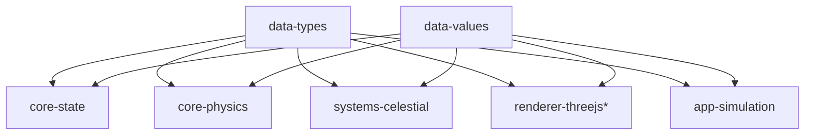

# @teskooano/data-values

## What is it?

The `@teskooano/data-values` library provides centralized constant values and utility functions used throughout the Open Space engine. This library is separate from `@teskooano/data-types` to maintain a clean separation between type definitions and actual values.

## Where is it?

**Physical Location:** `/packages/data/values`

**System Context:** The values package exists as a foundational dependency alongside the types package:



## When is it used?

The values package is used:

- When importing physical constants (GRAVITATIONAL_CONSTANT, SPEED_OF_LIGHT, etc.)
- When importing astronomical measurements (AU_METERS, SOLAR_MASS, etc.)
- When importing conversion factors (KM, SECONDS_PER_DAY, etc.)
- When importing simulation limits and constraints
- When importing rendering and visualization defaults
- When using utility functions for unit conversions
- When using the ThreeVector3Converter for efficient vector conversions

## How does it work?

The values package is organized into domain-specific modules:

### Constants (`src/constants/`)

- **`physical.ts`**: Fundamental physical constants (G, c, h, k, σ)
- **`astronomical.ts`**: Astronomical units and measurements (AU, solar mass, Earth mass, etc.)
- **`conversion.ts`**: Unit conversion factors (KM, MM, time constants, etc.)
- **`simulation.ts`**: Simulation limits and constraints (MAX_FORCE, MAX_CELESTIAL_OBJECTS, etc.)
- **`rendering.ts`**: Rendering and visualization constants (DEFAULT_FOV, camera speeds, etc.)
- **`time.ts`**: Time and animation constants (time steps, scales, FPS targets, etc.)
- **`ranges.ts`**: Physical property ranges (temperature limits, albedo bounds, etc.)

### Utilities (`src/utils/`)

- **`conversions.ts`**: Unit conversion functions (auToMeters, solarMassesToKg, etc.)
- **`ThreeVector3Converter.ts`**: Efficient conversion between OSVector3 and THREE.Vector3 arrays

## Usage Examples

```typescript
// Import specific constants
import {
  GRAVITATIONAL_CONSTANT,
  SOLAR_MASS,
  AU_METERS,
} from "@teskooano/data-values";

// Import conversion functions
import { auToMeters, solarMassesToKg } from "@teskooano/data-values";

// Import simulation limits
import { MAX_CELESTIAL_OBJECTS, MAX_FORCE } from "@teskooano/data-values";

// Import rendering constants
import { DEFAULT_FOV, DEFAULT_CAMERA_SPEED } from "@teskooano/data-values";

// Use the ThreeVector3Converter
import { ThreeVector3Converter } from "@teskooano/data-values";
```

## Strengths

- **Domain Separation**: Constants are organized by their domain of use
- **Single Source of Truth**: All constant values are defined in one place
- **Type Safety**: All constants are properly typed
- **Documentation**: Each constant has clear JSDoc comments with units
- **Utility Functions**: Provides convenient conversion functions
- **Performance**: Includes optimized utilities like ThreeVector3Converter

## Architecture Benefits

- **Clean Separation**: Types and values are in separate packages
- **Focused Responsibility**: Each package has a single, clear purpose
- **Easier Maintenance**: Changes to constants don't affect type definitions
- **Better Testing**: Constants can be tested independently of types
- **Reduced Dependencies**: Packages can import only what they need

## Future Considerations

- Adding validation functions for constant ranges
- Creating more specialized conversion utilities
- Adding constants for new simulation features
- Creating constants for different unit systems (if needed)
