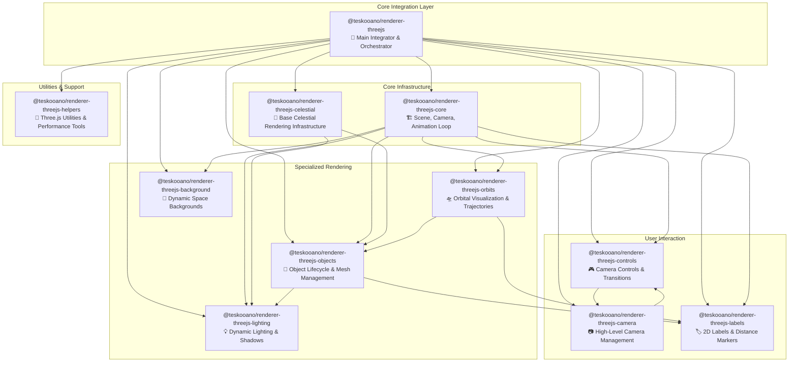

# AGENTS.md

A comprehensive guide for AI coding agents working on the Teskooano Renderer system.

## System Overview

The **Teskooano Renderer System** is a modular, high-performance Three.js-based rendering engine designed for real-time 3D space simulation. It consists of multiple specialized packages that work together to create a cohesive rendering pipeline for celestial objects, orbital mechanics, and interactive 3D environments.

## Architecture Philosophy

The renderer system follows a **modular composition pattern** where each package has a specific responsibility, and they are orchestrated by the main `@teskooano/renderer-threejs` integrator package. This design ensures:

- **Separation of Concerns**: Each package focuses on a specific aspect of rendering
- **Performance Optimization**: Specialized packages can be optimized independently
- **Maintainability**: Clear boundaries make the system easier to understand and modify
- **Testability**: Individual packages can be tested in isolation
- **Scalability**: New rendering features can be added as separate packages

## Package Hierarchy & Connections



## Package Descriptions & Links

### 🎯 Core Integration Layer

#### [@teskooano/renderer-threejs](./threejs/AGENTS.md)

**Main Integrator & Orchestrator**

- **Purpose**: Acts as the primary facade that orchestrates all renderer sub-packages
- **Key Features**: Orchestrator pattern, state bridge, render pipeline coordination
- **When to Use**: Always start here when working with the renderer system
- **Dependencies**: All other renderer packages

### 🏗️ Core Infrastructure

#### [@teskooano/renderer-threejs-core](./threejs-core/AGENTS.md)

**Scene, Camera, Animation Loop Foundation**

- **Purpose**: Provides the fundamental Three.js scene setup, camera management, and animation loop
- **Key Features**: SceneManager, AnimationLoop, logarithmic depth buffer, performance optimization
- **When to Use**: When working with core Three.js objects, scene setup, or animation timing
- **Dependencies**: Three.js, core state management

#### [@teskooano/renderer-threejs-celestial](./threejs-celestial/AGENTS.md)

**Base Celestial Rendering Infrastructure**

- **Purpose**: Provides foundational classes and utilities for all celestial object rendering
- **Key Features**: BaseCelestialRenderer, LOD management, lighting calculations, billboard systems
- **When to Use**: When creating new celestial object types or working with rendering infrastructure
- **Dependencies**: Three.js core, math utilities

### 🎨 Specialized Rendering

#### [@teskooano/renderer-threejs-objects](./threejs-objects/AGENTS.md)

**Object Lifecycle & Mesh Management**

- **Purpose**: Manages the creation, updating, and removal of Three.js objects representing celestial bodies
- **Key Features**: ObjectManager, RenderableObjectFactory, state-driven synchronization, object pooling
- **When to Use**: When working with celestial object rendering, mesh creation, or object lifecycle
- **Dependencies**: Core renderer, celestial infrastructure, lighting system

#### [@teskooano/renderer-threejs-orbits](./threejs-orbits/AGENTS.md)

**Orbital Visualization & Trajectories**

- **Purpose**: Renders orbital paths, trajectories, and prediction lines for celestial objects
- **Key Features**: OrbitsManager, trajectory prediction, historical trails, Web Worker optimization
- **When to Use**: When working with orbital mechanics visualization or trajectory rendering
- **Dependencies**: Core renderer, object management, physics integration

#### [@teskooano/renderer-threejs-background](./threejs-background/AGENTS.md)

**Dynamic Space Backgrounds**

- **Purpose**: Creates multi-layered, animated space backgrounds with stars, nebulae, and galaxies
- **Key Features**: BackgroundManager, procedural generation, parallax effects, GLSL shaders
- **When to Use**: When working with space environments, background effects, or atmospheric rendering
- **Dependencies**: Core renderer, procedural generation utilities

#### [@teskooano/renderer-threejs-lighting](./threejs-lighting/AGENTS.md)

**Dynamic Lighting & Shadows**

- **Purpose**: Manages dynamic light sources, shadow casting, and lighting calculations
- **Key Features**: LightingManager, light source queries, shadow management, performance optimization
- **When to Use**: When working with lighting effects, shadows, or light source management
- **Dependencies**: Core renderer, celestial infrastructure

### 🎮 User Interaction

#### [@teskooano/renderer-threejs-controls](./threejs-controls/AGENTS.md)

**Camera Controls & Transitions**

- **Purpose**: Provides low-level camera controls and smooth transitions
- **Key Features**: ControlsManager, OrbitControlsHandler, GSAP transitions, object following
- **When to Use**: When working with user input, camera controls, or smooth transitions
- **Dependencies**: Core renderer, Three.js OrbitControls

#### [@teskooano/renderer-threejs-camera](./threejs-camera/AGENTS.md)

**High-Level Camera Management**

- **Purpose**: Orchestrates camera operations and integrates with the simulation system
- **Key Features**: CameraManager, object focusing, FOV management, simulation integration
- **When to Use**: When working with high-level camera operations or simulation integration
- **Dependencies**: Controls system, core state management

#### [@teskooano/renderer-threejs-labels](./threejs-labels/AGENTS.md)

**2D Labels & Distance Markers**

- **Purpose**: Manages HTML-based UI elements positioned in 3D space
- **Key Features**: Layer2DManager, AU markers, label occlusion, CSS2DRenderer
- **When to Use**: When working with UI overlays, distance markers, or label systems
- **Dependencies**: Core renderer, object management

### 🔧 Utilities & Support

#### [@teskooano/renderer-threejs-helpers](./threejs-helpers/AGENTS.md)

**Three.js Utilities & Performance Tools**

- **Purpose**: Provides utility classes and functions for geometry, memory management, and performance
- **Key Features**: Geometry utilities, buffer pooling, circular buffers, performance monitoring
- **When to Use**: When working with Three.js utilities, memory optimization, or performance tools
- **Dependencies**: Three.js, core math utilities

## Data Flow & Integration Patterns

### 1. Initialization Flow

```
ModularSpaceRenderer (threejs)
├── Creates RenderingOrchestrator
│   ├── SceneManager (threejs-core)
│   ├── ObjectManager (threejs-objects)
│   ├── OrbitsManager (threejs-orbits)
│   ├── BackgroundManager (threejs-background)
│   ├── LightingManager (threejs-lighting)
│   └── GridManager (threejs-core)
├── Creates InteractionOrchestrator
│   ├── ControlsManager (threejs-controls)
│   ├── Layer2DManager (threejs-labels)
│   └── AuMarkerManager (threejs-labels)
└── Creates DebugOrchestrator
    └── DepthBufferDebugger (threejs-core)
```

### 2. State Flow

```
Core State → RendererStateAdapter → RenderableObjectFactory → ObjectManager → Three.js Scene
     ↓              ↓                        ↓                    ↓
Simulation → Visual Settings → Object Updates → Mesh Updates → Rendering
```

### 3. Render Pipeline

```
Animation Loop → RenderPipeline → Manager Updates → Scene Render → 2D Overlays
     ↓              ↓                ↓               ↓            ↓
Physics → Controls → Objects → Background → Lighting → Labels
```

## Development Workflow

### When Working on New Features

1. **Identify the Package**: Determine which package your feature belongs to based on responsibility
2. **Check Dependencies**: Review the package's AGENTS.md to understand its dependencies
3. **Follow Patterns**: Use established patterns from the package's examples
4. **Test Integration**: Ensure your changes work with the orchestrator system
5. **Update Documentation**: Keep the relevant AGENTS.md files updated

### When Debugging Issues

1. **Start with Core**: Check `threejs-core` for fundamental issues
2. **Check State Flow**: Verify `RendererStateAdapter` is transforming data correctly
3. **Inspect Pipeline**: Use `RenderPipeline` to understand update sequence
4. **Use Debug Tools**: Leverage `DebugOrchestrator` for analysis
5. **Check Dependencies**: Ensure all required packages are properly initialized

### When Adding New Packages

1. **Define Responsibility**: Clearly define what the package will handle
2. **Identify Dependencies**: Determine which existing packages it needs
3. **Create AGENTS.md**: Follow the established format for documentation
4. **Update Integrator**: Add the package to the appropriate orchestrator
5. **Test Integration**: Ensure it works with the existing system

## Performance Considerations

### System-Wide Optimizations

- **LOD Management**: All packages use Level of Detail for performance
- **Throttling**: Expensive operations are throttled across the system
- **Caching**: Shared caching strategies for expensive calculations
- **Memory Management**: Proper disposal patterns throughout all packages

### Package-Specific Optimizations

- **Core**: Logarithmic depth buffer, performance profiling
- **Objects**: Object pooling, mesh reuse, state-driven updates
- **Orbits**: Web Worker calculations, trail simplification
- **Background**: Instanced rendering, shader optimization
- **Lighting**: Light source culling, shadow optimization
- **Labels**: Occlusion detection, distance-based culling

## Testing Strategy

### Package-Level Testing

- Each package has its own test suite
- Unit tests for individual components
- Integration tests for package interactions
- Performance tests for critical paths

### System-Level Testing

- End-to-end rendering tests
- Performance regression tests
- Memory leak detection
- Cross-package integration tests

## Common Patterns Across Packages

### Manager Pattern

```typescript
export class CustomManager {
  constructor(dependencies: CustomManagerOptions);
  update(deltaTime: number): void;
  setDebugMode(enabled: boolean): void;
  dispose(): void;
}
```

### Factory Pattern

```typescript
export class CustomFactory {
  createObject(data: InputData): OutputObject;
  clearCache(): void;
}
```

### State Subscription Pattern

```typescript
export class CustomStateAdapter extends StateSubscriptionMixin {
  private subscribeToCoreState(): void;
  private processDataUpdate(data: any): void;
}
```

## Troubleshooting Guide

### Common Issues by Package

#### Core Issues

- **Scene not rendering**: Check SceneManager initialization
- **Camera problems**: Verify camera setup and controls
- **Performance issues**: Check logarithmic depth buffer configuration

#### Object Issues

- **Objects not appearing**: Check ObjectManager and state adapter
- **Mesh problems**: Verify RenderableObjectFactory
- **Memory leaks**: Check object disposal in ObjectManager

#### Orbit Issues

- **Trajectories not updating**: Check OrbitsManager and physics integration
- **Performance problems**: Verify Web Worker usage
- **Visual artifacts**: Check trail simplification settings

#### Background Issues

- **Background not showing**: Check BackgroundManager initialization
- **Shader problems**: Verify GLSL shader compilation
- **Performance issues**: Check instanced rendering usage

#### Lighting Issues

- **Shadows not working**: Check LightingManager and shadow configuration
- **Performance problems**: Verify light source culling
- **Visual artifacts**: Check shadow map settings

#### Control Issues

- **Camera not responding**: Check ControlsManager and OrbitControls
- **Transitions not working**: Verify GSAP integration
- **Following problems**: Check ObjectFollower implementation

#### Label Issues

- **Labels not showing**: Check Layer2DManager and CSS2DRenderer
- **Occlusion problems**: Verify occlusion detection system
- **Performance issues**: Check distance-based culling

## Integration with Core Systems

### State Management

- All packages integrate with `@teskooano/core-state`
- State changes trigger renderer updates
- Reactive patterns using RxJS observables

### Physics Integration

- Packages consume physics data from `@teskooano/core-physics`
- Real-time synchronization with simulation
- Support for both Keplerian and N-body physics

### Procedural Generation

- Integration with `@teskooano/systems-procedural-generation`
- Dynamic object creation and rendering
- Seeded random for deterministic generation

## Future Extensions

### Planned Packages

- **Post-Processing**: Visual effects and filters
- **Audio**: Spatial audio for space environments
- **VR/AR**: Virtual and augmented reality support
- **Network**: Multiplayer rendering synchronization

### Architecture Evolution

- **Micro-Frontend**: Package-based UI components
- **Plugin System**: Dynamic package loading
- **Performance Monitoring**: Advanced profiling tools
- **AI Integration**: Intelligent rendering optimization

## Getting Started

### For New Developers

1. Read this root AGENTS.md to understand the system
2. Start with `@teskooano/renderer-threejs` to understand the orchestrator
3. Explore `@teskooano/renderer-threejs-core` for fundamentals
4. Choose a specific package based on your feature needs
5. Follow the package's AGENTS.md for detailed guidance

### For AI Agents

1. **Always start here**: This file provides the system overview
2. **Follow the links**: Each package has detailed AGENTS.md documentation
3. **Understand connections**: Use the dependency graph to understand relationships
4. **Follow patterns**: Use established patterns across packages
5. **Test integration**: Ensure changes work with the orchestrator system

## Resources

### Documentation

- [Three.js Documentation](https://threejs.org/docs/)
- [RxJS Documentation](https://rxjs.dev/)
- [WebGL Fundamentals](https://webglfundamentals.org/)

### Architecture Patterns

- [Orchestrator Pattern](https://en.wikipedia.org/wiki/Orchestrator_pattern)
- [Facade Pattern](https://en.wikipedia.org/wiki/Facade_pattern)
- [Observer Pattern](https://en.wikipedia.org/wiki/Observer_pattern)

### Performance Resources

- [WebGL Performance Best Practices](https://developer.mozilla.org/en-US/docs/Web/API/WebGL_API/WebGL_best_practices)
- [Three.js Performance Tips](https://threejs.org/docs/#manual/en/introduction/Performance-tips)
- [Memory Management in JavaScript](https://developer.mozilla.org/en-US/docs/Web/JavaScript/Memory_Management)

---

**Remember**: This renderer system is designed for real-time 3D space simulation. Always consider performance implications when making changes, and follow the established patterns to maintain system coherence.
