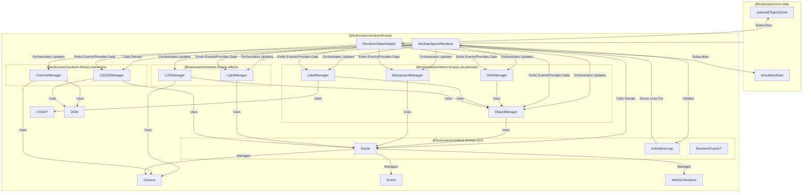

# Renderer Sub-Package Refinement Plan

## 1. Goal

Review the internal structure and components of each `@teskooano/renderer-threejs-*` sub-package to ensure clear separation of concerns, identify potential areas for refactoring large components, and confirm components are located in the most logical package.

## Target Architecture Visualization

This diagram illustrates the intended data flow and component interaction _after_ the refactoring proposed in the `packages/renderer/threejs/MIGRATION_PLAN.md` and the refinements outlined below:

## 2. Package Analysis & Refinement Actions

### 2.1. `@teskooano/renderer-threejs-core`

- **Contents:** `SceneManager.ts`, `AnimationLoop.ts`, `StateManager.ts`, `events.ts`, `setup.ts`, `index.ts`.
- **Analysis:**
  - `SceneManager`, `AnimationLoop`: Seem appropriate for core rendering setup and loop management.
  - `StateManager`: Needs review. Is this managing _renderer-specific_ state (e.g., active camera, render quality settings) or duplicating/managing _application_ state? If the latter, its role should be minimized or clarified, possibly becoming part of the `RendererStateAdapter` proposed in the `ModularSpaceRenderer` migration plan.
  - `events.ts`: Is this a generic event bus or specifically for internal renderer events? If generic, consider moving it to a dedicated `core/events` package. If renderer-specific, it's fine here but should be clearly documented as such.
- **Actions:**
  - **Review `StateManager`:** Determine its exact purpose. Refactor or integrate with `RendererStateAdapter` if it handles application state. Rename if it only handles renderer-internal state (e.g., `RendererInternalState`).
  - **Clarify `events.ts`:** Assess scope. Move to `core/events` if generic, otherwise document its renderer-specific nature.

### 2.2. `@teskooano/renderer-threejs-visualization`

- **Contents:** `ObjectManager.ts` (large), `OrbitManager.ts` (large), `BackgroundManager.ts`, `LabelManager.ts`, `index.ts`, `setup.ts`, subdirs (`object-manager`, `orbit-manager`, `background-manager`).
- **Analysis:**
  - `ObjectManager` (and subdir): Handles creating, updating, and managing visual representations (meshes) of celestial objects. Large size and subdir suggest complexity. Seems correctly placed.
  - `OrbitManager` (and subdir): Handles visualizing orbital paths (lines, trails, predictions). Large size and subdir suggest complexity. Seems correctly placed.
  - `BackgroundManager` (and subdir): Handles skybox/background rendering. Correctly placed.
  - `LabelManager`: Manages labels attached to objects in the 3D scene. Assuming these are world-space labels (like THREE.Sprite or world-positioned CSS2D), this belongs in visualization. If purely screen-space UI, it might fit better in `interaction`. Given the likely context, visualization seems correct.
- **Actions:**
  - **Refactor `ObjectManager`:** Investigate internal structure (within `object-manager/`). Break down large methods, extract helper classes/functions if needed to improve readability and testability, even if they stay within the `visualization` package. Ensure code adheres to the 300-400 line limit rule where practical.
  - **Refactor `OrbitManager`:** Similar investigation and refactoring as `ObjectManager`.
  - **Confirm `LabelManager` Scope:** Verify it handles world-space object labels. If so, it stays.

### 2.3. `@teskooano/renderer-threejs-interaction`

- **Contents:** `CSS2DManager.ts` (large), `ControlsManager.ts`, `index.ts`, `setup.ts`.
- **Analysis:**
  - `CSS2DManager`: Handles rendering UI elements using `CSS2DRenderer`. Its large size suggests it might be doing too much (e.g., managing different types of UI elements, handling state updates, event handling).
  - `ControlsManager`: Manages camera controls (e.g., `OrbitControls`). Seems correctly placed and reasonably sized. Will likely take on camera follow logic from the `ModularSpaceRenderer` plan.
- **Actions:**
  - **Refactor `CSS2DManager`:** Break down its responsibilities. Consider extracting logic for specific UI component types (e.g., tooltips, buttons, celestial labels if they are purely CSS2D) into separate helper classes or functions within the `interaction` package. Aim to reduce the size of the main manager class.
  - **Integrate Camera Follow:** Update `ControlsManager` to include the camera following logic as per the `ModularSpaceRenderer` migration plan.

### 2.4. `@teskooano/renderer-threejs-effects`

- **Contents:** `LightManager.ts`, `LODManager.ts`, `index.ts`, `setup.ts`, subdir (`lod-manager`).
- **Analysis:**
  - `LightManager`: Manages scene lighting (ambient, star point lights). Correctly placed.
  - `LODManager` (and subdir): Handles Level of Detail logic for objects. Correctly placed. Subdir suggests potential complexity.
- **Actions:**
  - **Review `LODManager`:** Investigate internal structure (`lod-manager/`). Ensure logic is clear and refactor if necessary for maintainability.

## 3. General Actions

- **Review Subdirectories:** For all packages with subdirectories (`visualization`, `effects`), ensure the file organization within those directories is logical and files aren't overly large.
- **Code Style & Limits:** Ensure all files adhere to the established code style (2-space indent) and aim to keep files below the 300-400 line target where feasible through refactoring.
- **Testing:** Ensure adequate test coverage exists in `__tests__` for all components, especially after any refactoring. Add tests where needed.
- **Documentation:** Update READMEs and code comments within each package to accurately reflect component responsibilities after refinement.

## 4. Rollback Plan

Use Git. Commit before starting refinement on each package and after significant refactoring steps within a package. Revert if major issues arise.
