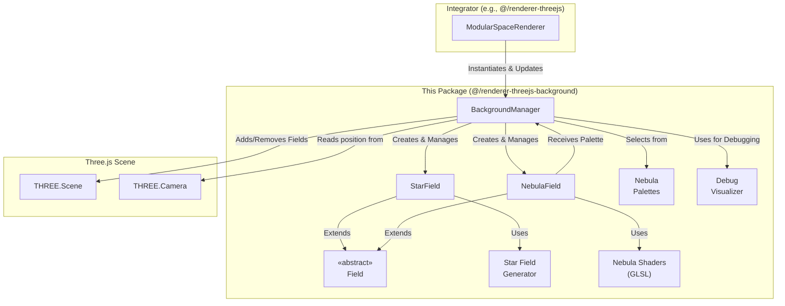

# Architecture: `@teskooano/renderer-threejs-background`

This document outlines the architecture of the `@teskooano/renderer-threejs-background` package, which is responsible for creating and managing the dynamic, multi-layered background of the simulation.

## Overview

The package is designed around a flexible, layer-based system. The primary goal is to produce a visually appealing and performant space background by composing different types of environmental effects, called "Fields". The system is orchestrated by a single manager class, `BackgroundManager`, which handles the lifecycle of all registered fields.

This architecture allows for easy extension. New background elements, like asteroid fields or different types of nebulae, can be created by simply implementing a new `Field` class.

## Core Components

1.  **`BackgroundManager.ts`**: The central orchestrator class.

    - **Responsibility**: Manages the entire lifecycle of the background. It instantiates and manages a collection of `Field` objects, handles debug mode toggling, updates all fields each frame, and cleans up resources on disposal. By default, it creates a `StarField` and a `NebulaField`.
    - **Instantiation**: It is instantiated by the main `ModularSpaceRenderer`, which also calls its `update()` method within the main render loop.

2.  **`fields/core/Field.ts`**: An abstract base class for all environmental effects.

    - **Responsibility**: Defines the common interface for all `Field` implementations, including `update()`, `dispose()`, and `toggleDebug()` methods. This ensures that the `BackgroundManager` can handle any type of field in a generic way.

3.  **`fields/star-field/`**: A `Field` implementation for creating multi-layered star fields.

    - **`StarField.ts`**: The main class that manages the star layers, handles their animation, and implements parallax effects.
    - **`star-field.generator.ts`**: A utility function that procedurally generates the positions and colors for the stars in a single layer.

4.  **`fields/nebula-field/`**: A `Field` implementation for creating a complex, procedural nebula.

    - **`NebulaField.ts`**: The main class that creates the geometry and the custom shader material for the nebula.
    - **`shaders/`**: Contains the GLSL vertex and fragment shaders responsible for rendering the nebula. The fragment shader uses multiple layers of domain-warped 3D Simplex noise to generate complex, swirling patterns and blend colors.
    - **`palettes.ts`**: Provides a set of scientifically-inspired color palettes that the `BackgroundManager` can randomly select from to color the nebula.

5.  **`background-manager/debug-visualizer.ts`**: A module for providing debug visuals.
    - **Responsibility**: Contains functions to aid in debugging the background layers. It can create wireframe spheres to show the boundaries of each star field layer. This functionality is controlled by the `toggleDebug()` method in `BackgroundManager`.
