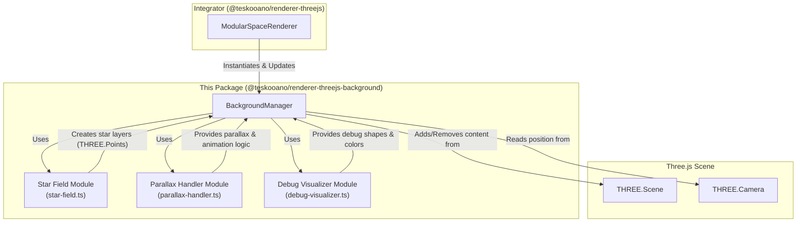

# Architecture: `@teskooano/renderer-threejs-background`

This document outlines the architecture of the `@teskooano/renderer-threejs-background` package, which is responsible for creating and managing the dynamic, multi-layered starfield background of the simulation.

## Overview

The package's primary goal is to produce a visually appealing and performant space background that enhances the sense of depth and scale through parallax and subtle animation. It is orchestrated by a single manager class, `BackgroundManager`, which composes functionality from several specialized modules.

## Core Components

1.  **`BackgroundManager.ts`**: The central orchestrator class.

    - **Responsibility**: Manages the entire lifecycle of the background elements. It instantiates the star layers, handles debug mode toggling, updates animations and parallax effects each frame, and cleans up all associated resources on disposal.
    - **Instantiation**: It is instantiated by the main `ModularSpaceRenderer`, which also calls its `update()` method within the main render loop.

2.  **`background-manager/star-field.ts`**: A module for generating the star layers.

    - **Responsibility**: Contains the `createStarLayers` function, which is the factory for the starfield. It creates multiple `THREE.Points` objects, each representing a layer of stars with different densities, sizes, and colors to create an illusion of depth.

3.  **`background-manager/parallax-handler.ts`**: A module for handling all motion.

    - **Responsibility**: Provides pure functions to handle the background's movement.
      - `updateParallax`: Moves the entire background group based on the camera's current position to create a parallax effect.
      - `animateStarField`: Applies a subtle, continuous rotation to each star layer at different speeds to give the background a dynamic feel.

4.  **`background-manager/debug-visualizer.ts`**: A module for providing debug visuals.
    - **Responsibility**: Contains functions to aid in debugging the background layers. It can create wireframe spheres to show the boundaries of each layer and apply distinct colors (red, green, blue) to the stars of each layer, making them easy to distinguish. This functionality is controlled by the `toggleDebug()` method in `BackgroundManager`.
