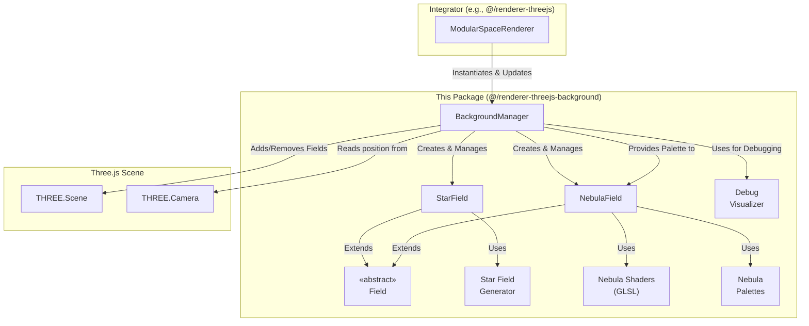

# Architecture: `@teskooano/renderer-threejs-background`

This document outlines the architecture of the `@teskooano/renderer-threejs-background` package, which is responsible for creating and managing the dynamic, multi-layered background of the simulation.

## Overview

The package is designed around a flexible, layer-based system. The primary goal is to produce a visually appealing and performant space background by composing different types of environmental effects, called "Fields". The system is orchestrated by a single manager class, `BackgroundManager`, which handles the lifecycle of all registered fields.

This architecture allows for easy extension. New background elements, like asteroid fields or different types of nebulae, can be created by simply implementing a new `Field` class.

```mermaid
graph TD
    subgraph "Integrator (e.g., @/renderer-threejs)"
        MSR["ModularSpaceRenderer"];
    end

    subgraph "This Package (@/renderer-threejs-background)"
        direction TB
        BM["BackgroundManager"];
        AbstractField["«abstract»<br/>Field"];
        StarField["StarField"];
        NebulaField["NebulaField"];
        SFG["Star Field<br/>Generator"];
        NFS["Nebula Shaders<br/>(GLSL)"];
        NFP["Nebula<br/>Palettes"];
        DV["Debug<br/>Visualizer"];
    end

    subgraph "Three.js Scene"
        Scene["THREE.Scene"];
        Camera["THREE.Camera"];
    end

    MSR -- "Instantiates & Updates" --> BM;

    BM -- "Creates & Manages" --> StarField;
    BM -- "Creates & Manages" --> NebulaField;
    BM -- "Uses for Debugging" --> DV;
    BM -- "Reads position from" --> Camera;
    BM -- "Adds/Removes Fields" --> Scene;


    StarField -- "Extends" --> AbstractField;
    NebulaField -- "Extends" --> AbstractField;

    StarField -- "Uses" --> SFG;
    NebulaField -- "Uses" --> NFS;
    BM -- "Provides Palette to" --> NebulaField;
    NebulaField -- "Uses" --> NFP;
```

## Core Components

1.  \*\*`
