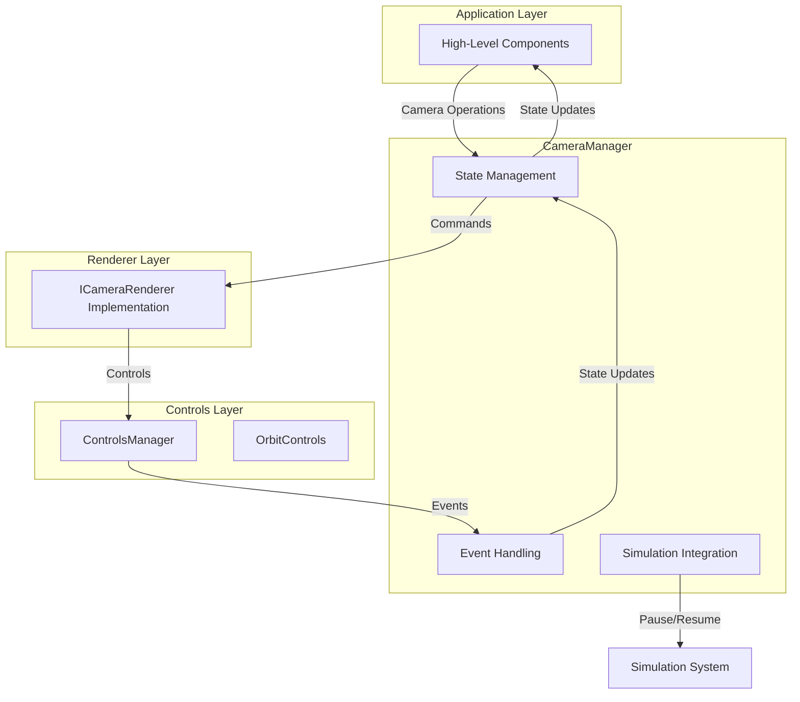

# Architecture: `@teskooano/renderer-threejs-camera`

This document outlines the architecture and design decisions for the `threejs-camera` package, focusing on the `CameraManager` class.

## Overview

The primary goal of this package is to provide high-level camera management functionality that orchestrates camera operations and integrates with the simulation system. It works in conjunction with the low-level controls provided by `@teskooano/renderer-threejs-controls`.

## Core Class: `CameraManager`

This is the central high-level manager for all camera operations. It is designed to work with any renderer that implements the `ICameraRenderer` interface.

### Responsibilities:

- **High-Level Camera Operations**: Provides methods for focusing on objects, positioning the camera, and managing FOV.
- **State Management**: Maintains an observable `BehaviorSubject` for camera state (position, target, FOV, focused object).
- **Simulation Integration**: Integrates with the simulation system to pause/resume during transitions.
- **Event Handling**: Listens for camera transition completion and user manipulation events.
- **Renderer Abstraction**: Works with any renderer that implements the `ICameraRenderer` interface.

### Key Design Decisions:

- **Interface-Based Design**: Uses `ICameraRenderer` interface to avoid circular dependencies and allow flexibility.
- **Observable State**: Provides a `BehaviorSubject` for reactive camera state updates.
- **Simulation Awareness**: Pauses simulation during camera transitions to prevent fast-moving objects from moving too far.
- **Event-Driven**: Listens for events from the controls system to update state accordingly.
- **Dependency Injection**: Accepts renderer instance through `setDependencies` method for flexibility.

### Interactions Diagram:



## Interface Design

The `ICameraRenderer` interface is defined in `@teskooano/data-types` to avoid circular dependencies. It provides a contract for any renderer that wants to work with the `CameraManager`:

- **Camera Access**: Direct access to the camera instance
- **Controls Management**: Access to the controls manager for low-level operations
- **Scene Management**: Access to scene manager for FOV and other scene operations
- **Object Management**: Access to object manager for getting renderable objects

## State Management

The `CameraManager` maintains a `BehaviorSubject` that emits camera state updates:

```typescript
interface CameraManagerState {
  currentPosition: OSVector3;
  currentTarget: OSVector3;
  fov: number;
  focusedObjectId: string | null;
}
```

This state is updated in response to:

- Programmatic camera operations (focus, move, etc.)
- User camera manipulation events
- Camera transition completion events

## Event Handling

The `CameraManager` listens for two main event types:

1. **`camera-transition-complete`**: Fired when programmatic camera transitions finish
2. **`user-camera-manipulation`**: Fired when the user manually manipulates the camera

These events are used to update the internal state and trigger callbacks.

## Simulation Integration

During camera transitions, the `CameraManager` temporarily pauses the simulation to prevent fast-moving objects from moving too far during the transition period. This ensures that the camera arrives at the correct position relative to the target object.

## Dependencies

- **`@teskooano/core-state`**: For simulation state access and actions
- **`@teskooano/core-math`**: For vector operations
- **`@teskooano/data-types`**: For type definitions and interfaces
- **`@teskooano/renderer-threejs-helpers`**: For camera helper functions
- **`@teskooano/notifications`**: For transition progress notifications
- **`rxjs`**: For reactive state management
