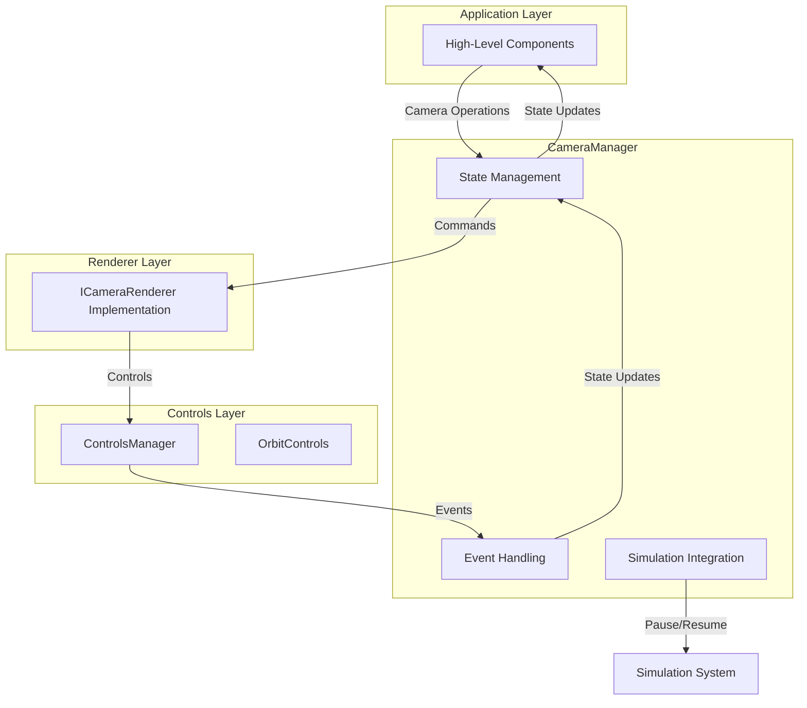

# Architecture: `@teskooano/renderer-threejs-camera`

This document outlines the architecture and design decisions for the `threejs-camera` package, focusing on the `CameraManager` class and its integration with the new core-state architecture.

## Overview

The primary goal of this package is to provide high-level camera management functionality that orchestrates camera operations and integrates with the simulation system. It works in conjunction with:

- Low-level controls from `@teskooano/renderer-threejs-controls`
- Centralized state management from `@teskooano/core-state`
- Interface-based renderer abstraction from `@teskooano/data-types`

## Core Class: `CameraManager`

This is the central high-level manager for all camera operations. It is designed to work with any renderer that implements the `ICameraRenderer` interface and delegates state management to the core-state system.

### Responsibilities:

- **High-Level Camera Operations**: Provides methods for focusing on objects, positioning the camera, and managing FOV.
- **State Delegation**: Delegates state management to `@teskooano/core-state` `CameraStore` for consistency and per-panel support.
- **Simulation Integration**: Integrates with the simulation system to pause/resume during transitions.
- **Event Handling**: Listens for camera transition completion and user manipulation events.
- **Renderer Abstraction**: Works with any renderer that implements the `ICameraRenderer` interface.
- **Per-Panel Management**: Supports multiple camera instances (one per engine panel).

### Key Design Decisions:

- **Interface-Based Design**: Uses `ICameraRenderer` interface to avoid circular dependencies and allow flexibility.
- **Centralized State Management**: Delegates to `@teskooano/core-state` `CameraStore` instead of managing state internally.
- **Per-Panel State**: Each engine panel has its own `CameraStore` instance, identified by `panelId`.
- **Observable State**: Provides access to `Observable<CameraState>` stream from core-state.
- **Simulation Awareness**: Pauses simulation during camera transitions to prevent fast-moving objects from moving too far.
- **Event-Driven**: Listens for events from the controls system to update state accordingly.
- **Dependency Injection**: Accepts renderer instance and panel ID through `setDependencies` method for flexibility.
- **Type Consistency**: Uses the same `CameraState` interface as `@teskooano/core-state` for consistency.

### Interactions Diagram:



## Interface Design

The `ICameraRenderer` interface is defined in `@teskooano/data-types` to avoid circular dependencies. It provides a contract for any renderer that wants to work with the `CameraManager`:

- **Camera Access**: Direct access to the camera instance
- **Controls Management**: Access to the controls manager for low-level operations
- **Scene Management**: Access to scene manager for FOV and other scene operations
- **Object Management**: Access to object manager for getting renderable objects

## State Management

The `CameraManager` now delegates state management to `@teskooano/core-state` `CameraStore`. Each engine panel gets its own `CameraStore` instance, identified by the panel ID.

```typescript
interface CameraState {
  position: OSVector3;
  target: OSVector3;
  fov: number;
  selectedObject: string | null;
  focusedObjectId: string | null;
}
```

### State Updates

State is updated through the `CameraStore` in response to:

- Programmatic camera operations (focus, move, etc.)
- User camera manipulation events
- Camera transition completion events

### Per-Panel Architecture

- Each panel has its own `CameraStore` instance via `CameraStore.getInstance(panelId)`
- The `CameraManager` receives the `panelId` through `setDependencies` options
- Multiple camera instances can exist simultaneously without conflicts
- State is centrally managed but panel-specific

## Event Handling

The `CameraManager` listens for two main event types:

1. **`camera-transition-complete`**: Fired when programmatic camera transitions finish
2. **`user-camera-manipulation`**: Fired when the user manually manipulates the camera

These events are used to update the internal state and trigger callbacks.

## Simulation Integration

During camera transitions, the `CameraManager` temporarily pauses the simulation to prevent fast-moving objects from moving too far during the transition period. This ensures that the camera arrives at the correct position relative to the target object.

## Dependencies

- **`@teskooano/core-state`**: For `CameraStore` state management and simulation state access
- **`@teskooano/core-math`**: For vector operations with `OSVector3`
- **`@teskooano/data-types`**: For type definitions and interfaces (`ICameraRenderer`, `CameraManagerOptions`)
- **`@teskooano/renderer-threejs-helpers`**: For camera helper functions
- **`@teskooano/notifications`**: For transition progress notifications
- **`rxjs`**: For reactive state management with `Observable`

## Architecture Improvements

### Removed Circular Dependencies

- Eliminated direct dependency on `@teskooano/renderer-threejs`
- Uses `ICameraRenderer` interface from `@teskooano/data-types` instead
- Types are now properly separated and reusable

### Integrated Core-State

- `CameraManager` no longer maintains its own `BehaviorSubject`
- Delegates all state operations to `CameraStore` from `@teskooano/core-state`
- Consistent `CameraState` interface across all packages
- Per-panel state management through static registry in `CameraStore`

### Enhanced Type Safety

- `CameraManagerOptions` now requires `panelId` for proper state management
- Consistent property names (`position`, `target` instead of `currentPosition`, `currentTarget`)
- Proper separation of selected vs focused object state
