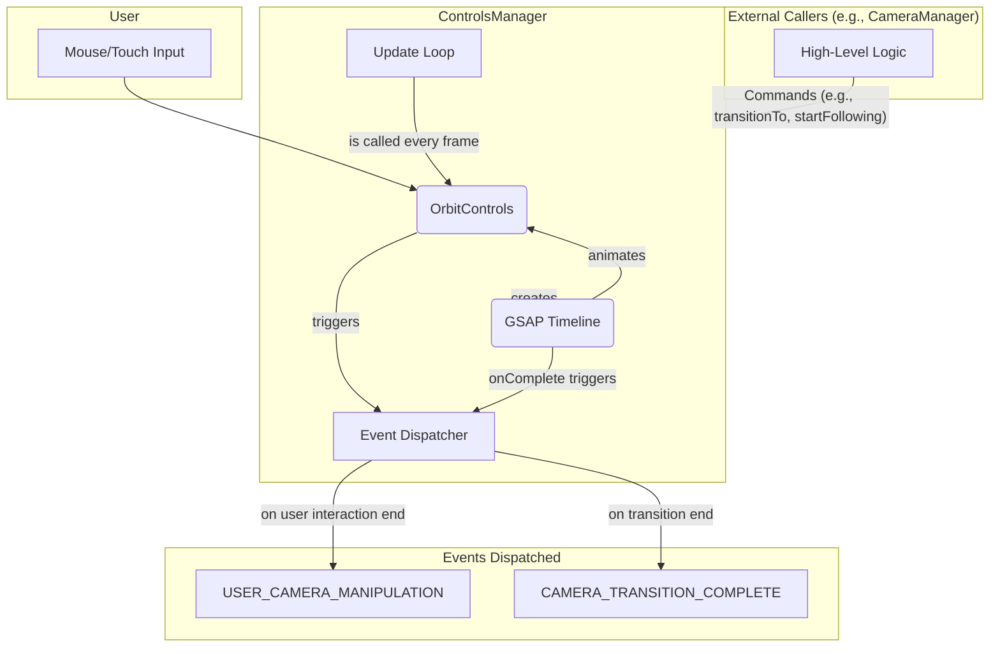

# Architecture: `@teskooano/renderer-threejs-controls`

This document outlines the architecture and design decisions for the `threejs-controls` package, focusing on the `ControlsManager` class.

## Overview

The primary goal of this package is to provide robust and intuitive camera control and interaction within the Three.js environment for the Teskooano simulation. It encapsulates the logic for:

1.  **Standard Orbit Controls:** Leveraging `THREE.OrbitControls` for basic user navigation (zoom, pan, rotate).
2.  **Animated Transitions:** Using GSAP for smooth, non-jarring camera movements when programmatically changing the view (e.g., focusing on an object).
3.  **Object Following:** Enabling the camera to track a moving `THREE.Object3D` while preserving the user's ability to orbit around that object.
4.  **Event Dispatching:** Communicating camera state changes to the rest of the application.

## Core Class: `ControlsManager`

This is the central low-level driver for all camera control and movement logic. It is designed to be stateless regarding the application's overall simulation state.

### Responsibilities:

- **Initialization:** Creates and configures an `OrbitControls` instance, attaching it to the camera and DOM element.
- **Update Loop (`update()`):** This method is crucial and **must** be called every frame from the main renderer loop. It performs two key functions:
  - **Following Logic:** If `followingTargetObject` is set and not programmatically animating (`isAnimating`), it calculates the target's movement delta since the last frame and applies this delta to both the camera position and the `controls.target`.
  - **OrbitControls Update:** It calls `controls.update()` to apply damping and process any user input relative to the camera's current state.
- **Transitions (`transitionTo`, `transitionTargetTo`):** Provides a public API for programmatic, animated camera movements using GSAP for smooth sequencing and cancellation.
  - A transition temporarily sets an `isAnimating` flag to prevent the `update()` loop's follow logic from interfering with the animation.
- **Following (`startFollowing`, `stopFollowing`):** Provides a public API to make the camera track a moving `THREE.Object3D`. This is typically called by a higher-level manager (`CameraManager`) after a transition is complete.
- **Event Dispatching:**
  - Fires a `USER_CAMERA_MANIPULATION` custom event when the user finishes a manual camera movement (e.g., dragging with the mouse).
  - Fires a `CAMERA_TRANSITION_COMPLETE` custom event when a programmatic GSAP transition finishes.
- **Cleanup (`dispose()`):** Removes event listeners, disposes of `OrbitControls`, and cancels any active GSAP animations.

### Interactions Diagram:

```mermaid
graph TD
    subgraph "External Callers (e.g., CameraManager)"
        A[High-Level Logic]
    end

    subgraph "User"
        B[Mouse/Touch Input]
    end

    subgraph "ControlsManager"
        C(OrbitControls)
        D(GSAP Timeline)
        E[Update Loop]
        F[Event Dispatcher]
    end

    subgraph "Events Dispatched"
        G[USER_CAMERA_MANIPULATION]
        H[CAMERA_TRANSITION_COMPLETE]
    end

    A -- "Commands (e.g., transitionTo, startFollowing)" --> ControlsManager;
    B --> C;
    C -- "triggers" --> F -- "on user interaction end" --> G;
    ControlsManager -- "creates" --> D;
    D -- "animates" --> C;
    D -- "onComplete triggers" --> F -- "on transition end" --> H;
    E -- "is called every frame" --> C;

```

### Key Design Decisions for `ControlsManager`:

- **Stateless Driver:** `ControlsManager` has no knowledge of the application's simulation state (like `focusedObjectId` or whether the simulation is paused). It simply executes commands and reports its actions.
- **GSAP for Transitions:** Provides reliable, controllable, and cancellable animations superior to simple lerping. The `isAnimating` flag ensures these transitions are not interrupted by the follow logic.
- **Delta-Based Following:** The `update` loop calculates the target's frame-to-frame movement delta and applies it directly to both the camera position and the `OrbitControls` target. This ensures the camera keeps pace precisely.
- **`OrbitControls.update()` is Key:** Crucially, `controls.update()` is called _after_ the delta logic. This allows `OrbitControls` to apply damping and user input _relative_ to the camera's new position/target dictated by the follow logic.
- **Event-Driven Communication:** Instead of writing to a state store, the manager dispatches specific events. This decouples it from higher-level application logic, which can listen for these events and update state accordingly.
- **Initialization of `previousFollowTargetPos`:** This value is crucial for the delta calculation. It's initialized when following begins (`startFollowing`) and at the end of a transition (`_endTransition`) to ensure the first frame of following is always correct.
