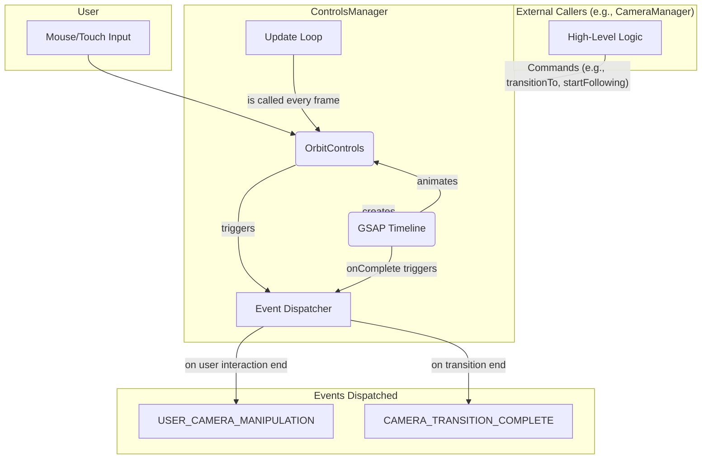
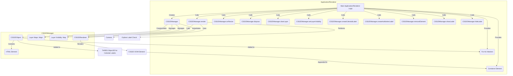

# Architecture: `@teskooano/renderer-threejs-interaction`

This document outlines the architecture and design decisions for the `threejs-interaction` package, focusing on the `ControlsManager` and `CSS2DManager` classes.

## Overview

The primary goal of this package is to provide robust and intuitive camera control and interaction within the Three.js environment for the Teskooano simulation. It encapsulates the logic for:

1.  **Standard Orbit Controls:** Leveraging `THREE.OrbitControls` for basic user navigation (zoom, pan, rotate) via `ControlsManager`.
2.  **Animated Transitions:** Using GSAP for smooth, non-jarring camera movements when programmatically changing the view (e.g., focusing on an object) via `ControlsManager`.
3.  **Object Following:** Enabling the camera to track a moving `THREE.Object3D` while preserving the user's ability to orbit around that object, managed by `ControlsManager`.
4.  **HTML Overlays:** Rendering HTML elements (like labels and markers) positioned relative to 3D objects using `CSS2DRenderer` via `CSS2DManager`.

## Core Class: `ControlsManager`

This is the central low-level driver for all camera control and movement logic. It is designed to be stateless regarding the application's overall simulation state.

### Responsibilities:

- **Initialization:** Creates and configures an `OrbitControls` instance, attaching it to the camera and DOM element.
- **Update Loop (`update()`):** This method is crucial and **must** be called every frame from the main renderer loop. It performs two key functions:
  - **Following Logic:** If `followingTargetObject` is set and not programmatically animating (`isAnimating`), it calculates the target's movement delta since the last frame and applies this delta to both the camera position and the `controls.target`.
  - **OrbitControls Update:** It calls `controls.update()` to apply damping and process any user input relative to the camera's current state.
- **Transitions (`transitionTo`, `transitionTargetTo`):** Provides a public API for programmatic, animated camera movements using GSAP for smooth sequencing and cancellation.
  - A transition temporarily sets an `isAnimating` flag to prevent the `update()` loop's follow logic from interfering with the animation.
- **Following (`startFollowing`, `stopFollowing`):** Provides a public API to make the camera track a moving `THREE.Object3D`. This is typically called by a higher-level manager (`CameraManager`) after a transition is complete.
- **Event Dispatching:**
  - Fires a `USER_CAMERA_MANIPULATION` custom event when the user finishes a manual camera movement (e.g., dragging with the mouse).
  - Fires a `CAMERA_TRANSITION_COMPLETE` custom event when a programmatic GSAP transition finishes.
- **Cleanup (`dispose()`):** Removes event listeners, disposes of `OrbitControls`, and cancels any active GSAP animations.

### Interactions Diagram:

### Key Design Decisions for `ControlsManager`:

- **Stateless Driver:** `ControlsManager` has no knowledge of the application's simulation state (like `focusedObjectId` or whether the simulation is paused). It simply executes commands and reports its actions.
- **GSAP for Transitions:** Provides reliable, controllable, and cancellable animations superior to simple lerping. The `isAnimating` flag ensures these transitions are not interrupted by the follow logic.
- **Delta-Based Following:** The `update` loop calculates the target's frame-to-frame movement delta and applies it directly to both the camera position and the `OrbitControls` target. This ensures the camera keeps pace precisely.
- **`OrbitControls.update()` is Key:** Crucially, `controls.update()` is called _after_ the delta logic. This allows `OrbitControls` to apply damping and user input _relative_ to the camera's new position/target dictated by the follow logic.
- **Event-Driven Communication:** Instead of writing to a state store, the manager dispatches specific events. This decouples it from higher-level application logic, which can listen for these events and update state accordingly.
- **Initialization of `previousFollowTargetPos`:** This value is crucial for the delta calculation. It's initialized when following begins (`startFollowing`) and at the end of a transition (`_endTransition`) to ensure the first frame of following is always correct.

## Core Class: `CSS2DManager`

Manages HTML elements overlaid onto the 3D scene using `THREE.CSS2DRenderer`.

### Responsibilities:

- **Initialization:** Creates and configures a `CSS2DRenderer` instance, adding its DOM element to the provided container. Sets necessary styles (`position: absolute`, `pointer-events: none`). Injects CSS rules to ensure `pointer-events: none` on all children.
- **Layer Management:** Defines distinct layers (`CSS2DLayerType`: `CELESTIAL_LABELS`, `TOOLTIPS`, `AU_MARKERS`) for different types of UI elements. Manages internal maps (`elements`) to store `CSS2DObject` instances per layer and tracks layer visibility (`layerVisibility`).
- **Element Creation:** Provides methods to create specific types of elements:
  - `createCelestialLabel`: Creates name labels for celestial objects, positioning them based on object type/radius (with special handling for Oort Cloud) and attaching them to the object's mesh.
  - `createAuMarkerLabel`: Creates labels for AU distance markers, attaching them directly to the scene.
  - `createCustomElement`: (Internal/Private) Helper for creating positioned labels with common styling.
- **Element Management:**
  - `removeElement`: Removes an element from the scene and internal tracking.
  - `clearLayer`: Removes all elements from a specific layer.
  - `updateCelestialLabel`: (Not currently implemented/used - positioning happens at creation).
  - `setLayerVisibility`/`toggleLayerVisibility`/`getLayerVisibility`: Controls the visibility of entire layers by toggling the `visible` property of contained `CSS2DObject`s.
  - `showLabel`/`hideLabel`: Controls the visibility of individual labels using CSS classes (`label-hidden`) for potentially faster/more direct control.
- **Rendering (`render()`):** **Must be called every frame** after the main WebGL render pass. It performs pre-render checks for orphaned labels (elements whose parent object might have been removed from the scene) and then calls the internal `renderer.render()` method.
- **Resize Handling (`onResize()`):** Updates the `CSS2DRenderer` size when the container resizes.
- **Cleanup (`dispose()`):** Removes all created elements and the renderer's DOM element.

### Interactions Diagram:

### Key Design Decisions for `CSS2DManager`:

- **`CSS2DRenderer`:** Standard Three.js approach for placing HTML elements in 3D space.
- **Layer System:** Allows logical grouping and independent visibility control for different UI categories (e.g., hide all AU markers).
- **`pointer-events: none`:** Essential for ensuring the CSS2D overlay doesn't block interaction with the underlying WebGL canvas (handled by `ControlsManager`). CSS is injected to enforce this.
- **Element Lifecycles:** Provides explicit methods for creating, removing (`removeElement`, `clearLayer`), and managing elements to keep the internal state consistent with the scene graph.
- **Orphan Check:** The `render` method includes a pre-check to find and remove labels whose parent object might have been removed from the scene unexpectedly, preventing errors in the underlying `CSS2DRenderer`.
- **Dual Visibility Control:** Offers layer-level visibility (`setLayerVisibility` toggling `CSS2DObject.visible`) and individual label visibility (`showLabel`/`hideLabel` using CSS classes). Choose based on use case (performance vs. granularity).
- **Specific Creation Methods:** Favors distinct methods (`createCelestialLabel`, `createAuMarkerLabel`) over a generic one for clarity and type safety.
