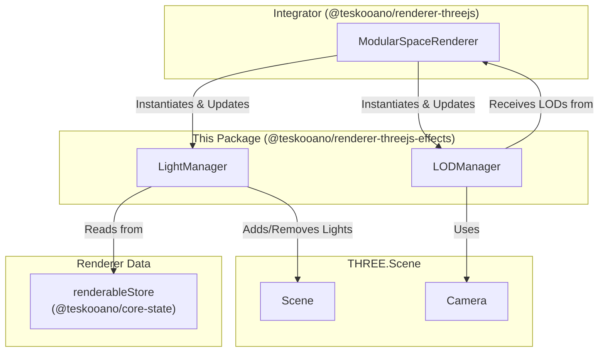

## Architecture: `@teskooano/renderer-threejs-effects`

This package provides managers and utilities for handling visual effects and optimizations like lighting and Level of Detail (LOD) within the Three.js rendering pipeline for the Teskooano engine.

**Key Goals:**

- **Performance Optimization**: Reduce GPU load by simplifying distant objects (`LODManager`).
- **Visual Enhancement**: Manage scene lighting, particularly star illumination (`LightManager`).
- **Encapsulation**: Isolate effect-related logic from core rendering and object-specific code.

**Core Components:**

1.  **`LightManager` (`LightManager.ts`)**: Responsible for managing dynamic light sources in the scene.

    - Manages a default `THREE.AmbientLight` for global illumination.
    - Reactively subscribes to the `renderableStore` and automatically creates, updates, and removes `THREE.PointLight` instances for star objects.
    - Offers utility functions (`getStarLightPositions`, `getStarLightsData`) to access positional and color data of managed star lights, which is consumed by various shaders.
    - Includes a `dispose()` method to clean up all managed lights and subscriptions.

2.  **`LODManager` (`LODManager.ts`)**: Manages Level of Detail for scene objects, primarily leveraging Three.js's built-in `THREE.LOD` system.
    - Requires a reference to the main `THREE.PerspectiveCamera` for distance calculations.
    - Maintains a `Map` (`objectLODs`) associating object IDs with their corresponding `THREE.LOD` instances.
    - Provides a `createAndRegisterLOD` method that takes an array of `LODLevel` objects (typically generated by a `CelestialRenderer`) and assembles them into a `THREE.LOD` object.
    - `update()`: Must be called each frame. It iterates through all managed `THREE.LOD` objects and calls their internal `update()` method, which automatically switches the visible mesh based on camera distance.
    - Provides `remove(objectId)` and `clear()` for cleanup.

## Integration

This package provides standalone managers intended to be consumed directly by an integrator package (e.g., `@teskooano/renderer-threejs`). The integrator is responsible for instantiating `LightManager` and `LODManager` and incorporating them into the rendering lifecycle.

