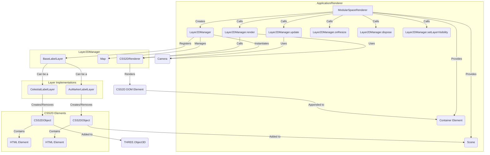

# Architecture: `@teskooano/renderer-threejs-labels`

This document outlines the architecture of the `@teskooano/renderer-threejs-labels` package.

## Overview

The primary goal of this package is to provide a robust system for rendering HTML-based labels and markers that are positioned within the Three.js 3D scene. It is responsible for managing the lifecycle, visibility, and rendering of these 2D elements.

The system is built around a `Layer2DManager` that uses the standard `THREE.CSS2DRenderer`.

## Core Class: `Layer2DManager`

Manages HTML elements overlaid onto the 3D scene using `THREE.CSS2DRenderer`.

### Responsibilities:

- **Initialization:** Creates and configures a `CSS2DRenderer` instance, adding its DOM element to the provided container. Sets necessary styles (`position: absolute`, `pointer-events: none`). Injects CSS rules to ensure `pointer-events: none` on all children to not interfere with the main 3D canvas.
- **Layer Management:** Defines distinct layers (`CSS2DLayerType`: `CELESTIAL_LABELS`, `AU_MARKERS`, etc.) for different types of UI elements. This allows for logical grouping and independent visibility control. It uses concrete `BaseLabelLayer` implementations for the logic of each layer.
- **Element Creation:** The manager itself does not create elements. Instead, it provides access to registered `BaseLabelLayer` instances (e.g., `CelestialLabelLayer`, `AuMarkerLabelLayer`), which are responsible for creating their specific `CSS2DObject` elements.
- **Element Management & Visibility:**
  - Provides methods to control the visibility of entire layers (`setLayerVisibility`).
  - The underlying layer implementations manage the lifecycle of their own elements (creation, removal, individual visibility).
- **Rendering (`render()`):** **Must be called every frame** after the main WebGL render pass. It calls the internal `renderer.render()` method to draw the 2D elements.
- **Update (`update()`):** **Must be called every frame**. It delegates the update call to each registered layer, allowing them to perform their own per-frame logic, such as checking for occluded labels or distance-based visibility.
- **Resize Handling (`onResize()`):** Updates the `CSS2DRenderer` size when the container resizes.
- **Cleanup (`dispose()`):** Removes all created elements and the renderer's DOM element.

### Interactions Diagram:

### Key Design Decisions:

- **`CSS2DRenderer`:** Standard Three.js approach for placing HTML elements in 3D space.
- **Layer System:** Allows logical grouping and independent visibility control for different UI categories (e.g., hide all AU markers). The logic for each layer is encapsulated within its own class that extends `BaseLabelLayer`.
- **`pointer-events: none`:** Essential for ensuring the CSS2D overlay doesn't block interaction with the underlying WebGL canvas. The `Layer2DManager` injects CSS to enforce this.
- **Delegated Lifecycles:** The `Layer2DManager` is a lean orchestrator. The responsibility for creating, removing, and updating the logic for labels is delegated to the specific `BaseLabelLayer` implementations. This keeps the manager simple and makes the system more extensible.
