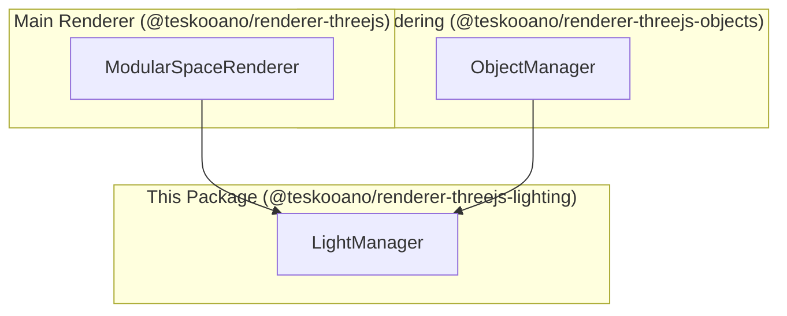

## Architecture: `@teskooano/renderer-threejs-lighting`

This package provides managers and utilities for handling lighting within the Teskooano Three.js rendering pipeline.

### Core Components

- **`LightManager`**: A centralized manager for creating, tracking, and updating all light sources in the scene. It is designed to handle lights that represent stars, which are a primary source of illumination for celestial objects.

### How it works

The `LightManager` is instantiated by the main `ModularSpaceRenderer`. Other parts of the system, particularly the `ObjectManager` (from `@teskooano/renderer-threejs-objects`), can then query the `LightManager` to get information about the nearest or most influential light sources for a given object. This allows for dynamic and realistic lighting effects on planets, moons, and other bodies as they move through the system.

A key feature is its ability to manage a specific number of "star lights" and provide their data (color, intensity, position) in a structured way that can be passed to shaders.

### Mermaid Diagram

