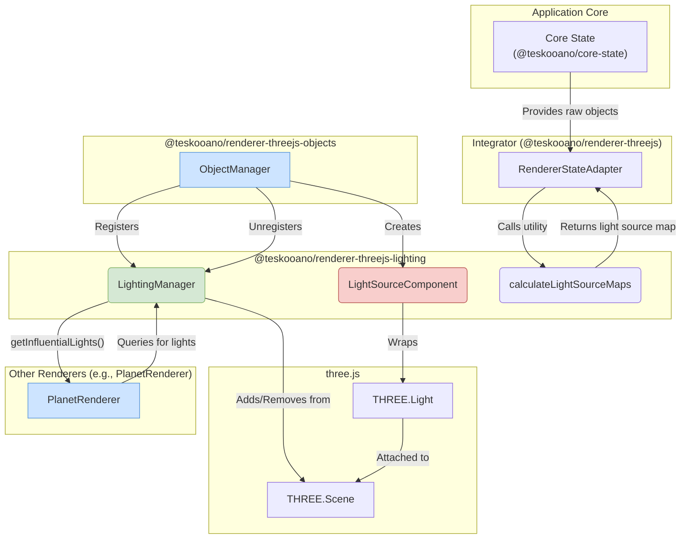

# Architecture: `@teskooano/renderer-threejs-lighting`

This document outlines the architecture for the `threejs-lighting` package, which provides lighting management for the Teskooano renderer.

## Overview

The package has been significantly refactored to follow a simpler, more direct management pattern. The previous state-driven, automatic `LightManager` has been replaced by a lean `LightingManager` that acts as a registry. This shifts the responsibility of creating and managing light sources to the consumer (typically the `@teskooano/renderer-threejs-objects` package), making the lighting system more explicit and easier to control.

The core of the package consists of two main components:

1.  **`LightingManager`**: A registry that holds all active `LightSourceComponent` instances in the scene. Its primary responsibility is to provide a performant way to query for the most influential lights affecting a specific object.
2.  **`LightSourceComponent`**: A wrapper that associates a `THREE.Light` instance with a `RenderableCelestialObject`. It's responsible for updating the light's position to match its associated object.
3.  **`calculateLightSourceMaps` utility**: A function that operates on the raw `CelestialObject` data from the core state.
    - **Responsibility**: Traverses the system's hierarchy to build a map of which star illuminates each object. This is a precursor step that happens before objects are rendered, providing the essential `primaryLightSourceId` needed by other systems.

## Data Flow and Responsibilities

The overall lighting process is now split into two distinct phases:

1.  **Hierarchy Calculation (Pre-Render)**: Before rendering, the `RendererStateAdapter` (from `@teskooano/renderer-threejs`) calls `calculateLightSourceMaps` to determine the `primaryLightSourceId` for every object based on the raw core state.
2.  **Scene Lighting (Render-time)**: The `ObjectManager` is responsible for the lifecycle of lights. When it creates a mesh for a star, it also creates a corresponding `LightSourceComponent` and registers it with the `LightingManager`. Other renderers then query the `LightingManager`'s `getInfluentialLights()` method to find the closest light sources for their shader calculations.

### Interaction Diagram

```mermaid
graph TD
    subgraph "Application Core"
        direction TB
        CoreState["Core State<br/>(@teskooano/core-state)"];
    end

    subgraph "Integrator (@teskooano/renderer-threejs)"
        RSA["RendererStateAdapter"]
    end

    subgraph "@teskooano/renderer-threejs-objects"
        OM[ObjectManager]
    end

    subgraph "@teskooano/renderer-threejs-lighting"
        direction TB
        LM(LightingManager)
        LSC(LightSourceComponent)
        CSM(calculateLightSourceMaps)
    end

    subgraph "three.js"
        L[THREE.Light]
        S[THREE.Scene]
    end

    subgraph "Other Renderers (e.g., PlanetRenderer)"
        PR[PlanetRenderer]
    end

    CoreState -- "Provides raw objects" --> RSA
    RSA -- "Calls utility" --> CSM
    CSM -- "Returns light source map" --> RSA

    OM -- "Creates" --> LSC;
    OM -- "Registers" --> LM;
    OM -- "Unregisters" --> LM;

    LSC -- "Wraps" --> L;
    LM -- "Adds/Removes from" --> S;
    L -- "Attached to" --> S;

    PR -- "Queries for lights" --> LM;
    LM -- "getInfluentialLights()" --> PR;

    classDef consumer fill:#cde4ff,stroke:#5a96d8;
    classDef manager fill:#d5e8d4,stroke:#82b366;
    classDef component fill:#f8cecc,stroke:#b85450;
    class OM,PR consumer;
    class LM manager;
    class LSC component;

```

## Key Design Decisions

- **Explicit over Implicit**: The consumer has full control over when light sources are created and destroyed, which is more predictable and easier to debug.
- **Separation of Concerns**: The logic is now clearly separated.
  - `calculateLightSourceMaps` handles the abstract, hierarchical relationships between objects based on core data.
  - `LightingManager` and `LightSourceComponent` handle the concrete `THREE.Light` objects within the 3D scene.
- **Performance-Oriented Querying**: The `getInfluentialLights()` method uses squared distance checks to avoid costly square root operations, ensuring that finding the nearest lights for an object is as fast as possible.
- **Decoupling**: The `LightingManager` does not depend on any state stores. It is a simple, self-contained registry, making it highly reusable and testable.
