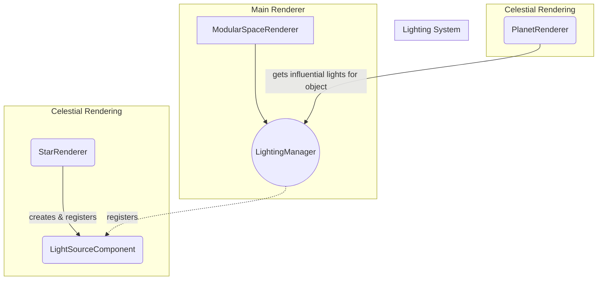

## Architecture: `@teskooano/renderer-threejs-lighting`

This package provides a component-based system for managing dynamic, emissive light sources within the Teskooano Three.js rendering pipeline. Its primary purpose is to handle lights that represent stars, which are the main sources of illumination for other celestial objects.

### Core Components

- **`LightingManager`**: A centralized manager that maintains a registry of all active `LightSourceComponent` instances in the scene. It is responsible for orchestrating updates and providing other systems with a way to query for influential lights. There should be one `LightingManager` per scene.

- **`LightSourceComponent`**: A wrapper around a `THREE.Light` instance (typically a `THREE.PointLight`). Each component is tied to a specific `RenderableCelestialObject` and is responsible for keeping the light's position and properties in sync with the object it represents.

### How it works

The `LightingManager` is instantiated by the main `ModularSpaceRenderer`. Other parts of the system, specifically the renderers for emissive objects like stars (`BaseStarRenderer`), create a `LightSourceComponent` and `register()` it with the `LightingManager`.

This imperative approach allows celestial renderers to control whether they emit light. The `LightingManager` can then be queried by any other renderer (e.g., for a planet) to get a list of the most influential light sources for that object, calculated based on distance and intensity. This enables dynamic and realistic lighting effects as celestial bodies move through the system.

This manager is **not** responsible for the visual representation of objects at a distance (e.g., showing a planet as a dot of light at low LOD). That logic belongs within the individual celestial renderers themselves.

### Mermaid Diagram

```mermaid
graph TD
    subgraph "Main Renderer"
        A[ModularSpaceRenderer] --> B((LightingManager))
    end

    subgraph "Celestial Rendering"
        C(StarRenderer) -- creates & registers --> D(LightSourceComponent)
    end

    subgraph "Lighting System"
       B -. registers .-> D
    end

    subgraph "Celestial Rendering"
        E(PlanetRenderer) -- "gets influential lights for object" --> B
    end
```
