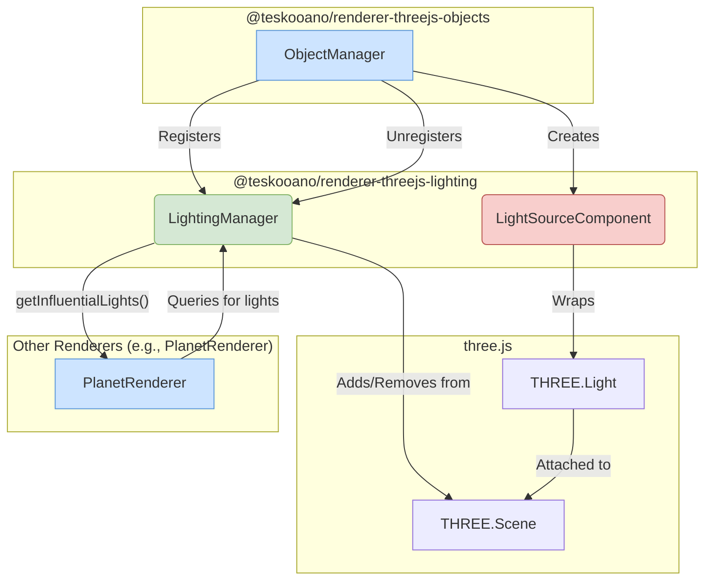

# Architecture: `@teskooano/renderer-threejs-lighting`

This document outlines the architecture for the `threejs-lighting` package, which provides lighting management for the Teskooano renderer.

## Overview

The package has been significantly refactored to follow a simpler, more direct management pattern. The previous state-driven, automatic `LightManager` has been replaced by a lean `LightingManager` that acts as a registry. This shifts the responsibility of creating and managing light sources to the consumer (typically the `@teskooano/renderer-threejs-objects` package), making the lighting system more explicit and easier to control.

The core of the package consists of two main components:

1.  **`LightingManager`**: A registry that holds all active `LightSourceComponent` instances in the scene. Its primary responsibility is to provide a performant way to query for the most influential lights affecting a specific object.
2.  **`LightSourceComponent`**: A wrapper that associates a `THREE.Light` instance with a `RenderableCelestialObject`. It's responsible for updating the light's position to match its associated object.

## Data Flow and Responsibilities

The `ObjectManager` (or another consumer) is responsible for the lifecycle of lights. When it creates a mesh for a star, it also creates a corresponding `LightSourceComponent` and registers it with the `LightingManager`. When a star is removed, the `ObjectManager` unregisters the component.

Other renderers (e.g., for planets or ships) can then query the `LightingManager`'s `getInfluentialLights()` method to find the closest light sources for their shader calculations.

### Interaction Diagram

```mermaid
graph TD
    subgraph "@teskooano/renderer-threejs-objects"
        OM[ObjectManager]
    end

    subgraph "@teskooano/renderer-threejs-lighting"
        LM(LightingManager)
        LSC(LightSourceComponent)
    end

    subgraph "three.js"
        L[THREE.Light]
        S[THREE.Scene]
    end

    subgraph "Other Renderers (e.g., PlanetRenderer)"
        PR[PlanetRenderer]
    end

    OM -- "Creates" --> LSC;
    OM -- "Registers" --> LM;
    OM -- "Unregisters" --> LM;

    LSC -- "Wraps" --> L;
    LM -- "Adds/Removes from" --> S;
    L -- "Attached to" --> S;

    PR -- "Queries for lights" --> LM;
    LM -- "getInfluentialLights()" --> PR;

    classDef consumer fill:#cde4ff,stroke:#5a96d8;
    classDef manager fill:#d5e8d4,stroke:#82b366;
    classDef component fill:#f8cecc,stroke:#b85450;
    class OM,PR consumer;
    class LM manager;
    class LSC component;

```

## Key Design Decisions

- **Explicit over Implicit**: The new design avoids the complexity of a state-driven system. The consumer has full control over when light sources are created and destroyed, which is more predictable and easier to debug.
- **Performance-Oriented Querying**: The `getInfluentialLights()` method is the most critical part of the `LightingManager`. It uses squared distance checks to avoid costly square root operations, ensuring that finding the nearest lights for an object is as fast as possible.
- **Decoupling**: The `LightingManager` does not depend on any state stores. It is a simple, self-contained registry, making it highly reusable and testable. The `LightSourceComponent` provides the link between the renderer's object data and the `THREE.Light` instance.
