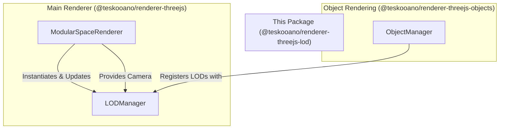

## Architecture: `@teskooano/renderer-threejs-lod`

This package provides managers and utilities for handling Level of Detail (LOD) within the Teskooano Three.js rendering pipeline.

### Core Components

- **`LODManager`**: A centralized manager for creating, tracking, and updating `THREE.LOD` objects. This helps optimize performance by rendering simpler versions of objects when they are far from the camera.

### How it works

The `LODManager` is instantiated by the main `ModularSpaceRenderer` and requires a reference to the main camera. When a renderable object is created, its renderer (e.g., a `StarRenderer`) defines a series of detail levels (e.g., a complex mesh for close-up, a simpler mesh for medium distance, and a sprite for far away).

The `LODManager` takes these levels and creates a `THREE.LOD` object, which automatically handles switching between them based on camera distance. The manager's `update` method must be called every frame to ensure the LODs are correctly calculated.

### Mermaid Diagram

