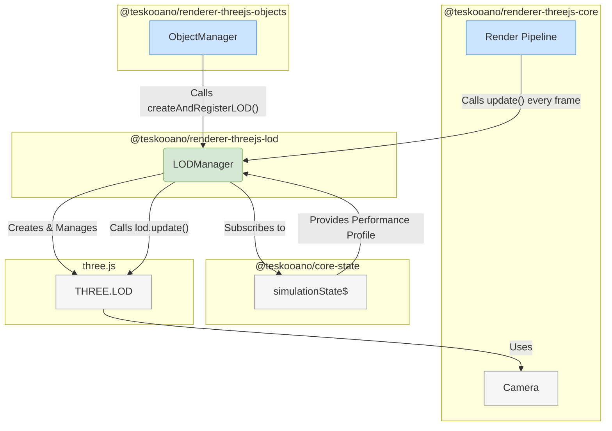

# Architecture: `@teskooano/renderer-threejs-lod`

This document provides an overview of the architecture for the Level of Detail (LOD) management system in the Teskooano renderer.

## Core Component: `LODManager`

The package's single responsibility is to manage the lifecycle and updates for `THREE.LOD` objects. `THREE.LOD` is a utility class in Three.js that allows displaying different versions of an object (e.g., a high-poly mesh vs. a low-poly mesh or a simple sprite) based on its distance from the camera. This is a critical optimization technique.

### Responsibilities

- **Registry**: The `LODManager` maintains a `Map` of all `THREE.LOD` instances in the scene, keyed by their associated celestial object ID.
- **Creation and Registration**: It provides a factory method, `createAndRegisterLOD()`, which is called by consumers (typically the `ObjectManager`). This method takes an array of `LODLevel` objects (a `THREE.Object3D` and a `distance` threshold) and creates a `THREE.LOD` instance.
- **Update Loop**: It exposes an `update()` method that must be called every frame from the main render pipeline. This method iterates through all registered `THREE.LOD` objects and calls their native `.update(camera)` method, which handles the logic of switching between levels.
- **Performance Profiles**: The manager subscribes to the global `simulationState$` to listen for changes to the `performanceProfile` setting ('low', 'medium', 'high'). This profile determines a scaling factor that is applied to the distance thresholds of **newly created** LODs.
  - **Important**: Changing the performance profile does **not** dynamically update existing LOD objects. A full recreation of celestial objects is required for the new scaling factor to be applied globally.
- **Debug Mode**: The manager includes a debug mode that can be toggled. When active, it creates and displays a 2D label next to each object, showing its ID and the currently active LOD level index.

### Interaction Diagram

```mermaid
graph TD
    subgraph "@teskooano/renderer-threejs-objects"
        OM[ObjectManager]
    end

    subgraph "@teskooano/renderer-threejs-core"
        RP[Render Pipeline]
        Cam[Camera]
    end

    subgraph "@teskooano/renderer-threejs-lod"
        LODM(LODManager)
    end

    subgraph "@teskooano/core-state"
        State[simulationState$]
    end

    subgraph "three.js"
        LOD[THREE.LOD]
    end

    OM -- "Calls createAndRegisterLOD()" --> LODM;
    LODM -- "Creates & Manages" --> LOD;
    LODM -- "Subscribes to" --> State;
    State -- "Provides Performance Profile" --> LODM;

    RP -- "Calls update() every frame" --> LODM;
    LODM -- "Calls lod.update()" --> LOD;
    LOD -- "Uses" --> Cam;

    classDef consumer fill:#cde4ff,stroke:#5a96d8;
    classDef manager fill:#d5e8d4,stroke:#82b366;
    classDef three fill:#f5f5f5,stroke:#999;
    class OM,RP consumer;
    class LODM manager;
    class Cam,LOD,State three;
```
