# Architecture: `@teskooano/renderer-threejs-visualization`

This package orchestrates the rendering of the Teskooano simulation scene, providing managers for the visual representation of celestial objects, their orbits, and the background environment.

## Overview

This package exports three main managers intended to be coordinated by a higher-level renderer (e.g., `@teskooano/renderer-threejs` or the main application):

1.  **`ObjectManager`**: Handles the lifecycle of `THREE.Object3D` instances representing celestial bodies. It subscribes to the `renderableObjectsStore` and synchronizes the scene by adding, updating, or removing meshes. It leverages specialized renderers from `@teskooano/systems-celestial`, LOD management from `@teskooano/renderer-threejs-effects`, lighting via `LightManager`, and label integration via `CSS2DManager`.
2.  **`OrbitManager`**: Manages the visualization of orbital paths. It dynamically switches between rendering static Keplerian ellipses and dynamic Verlet integration trails/predictions based on the `simulationState`'s `physicsEngine`. It highlights selected orbits and allows visibility toggling.
3.  **`BackgroundManager`**: Creates and animates a multi-layered starfield, providing a sense of depth and movement with parallax effects tied to the camera.

These managers rely heavily on data from `@teskooano/core-state` and interact with other renderer packages for effects, interaction, and core utilities.

```mermaid
graph TD
    subgraph CoreState ["@teskooano/core-state"]
        RStore[renderableObjectsStore]
        SStore[simulationState]
        AStore[accelerationVectorsStore]
        CEStore[celestialObjectsStore]
    end

    subgraph SystemsCelestial ["@teskooano/systems-celestial"]
        direction LR
        SpecializedRenderers[Specialized Renderers <GasGiant, Star, Planet, Ring, Asteroid...>]
    end

    subgraph RendererEffects ["@teskooano/renderer-threejs-effects"]
        direction LR
        LODM[LODManager]
        LightM[LightManager]
        Lensing[GravitationalLensingHandler]
    end

    subgraph RendererInteraction ["@teskooano/renderer-threejs-interaction"]
        direction LR
        CSS2DM[CSS2DManager]
    end

    subgraph Visualization ["@teskooano/renderer-threejs-visualization"]
        direction TB
        OM(ObjectManager)
        OrbM(OrbitManager)
        BGM(BackgroundManager)

        OM -- Uses --> MeshFact[object-manager/MeshFactory]
        OM -- Uses --> RendUpd[object-manager/RendererUpdater]
        OM -- Uses --> Lensing
        OM -- Uses --> LODM
        OM -- Uses --> LightM
        OM -- Uses --> CSS2DM
        OM -- Listens to --> RStore
        OM -- Listens to --> AStore
        MeshFact -- Uses --> SpecializedRenderers
        RendUpd -- Updates --> SpecializedRenderers

        OrbM -- Uses --> KepM[orbit-manager/KeplerianOrbitManager]
        OrbM -- Uses --> VerletPred[orbit-manager/verlet-predictor]
        OrbM -- Interacts with --> OM
        OrbM -- Listens to --> SStore
        OrbM -- Listens to --> RStore
        OrbM -- Reads --> CEStore

        BGM -- Uses --> BGHelpers[background-manager/*]

    end

    AppCode[Application/Main Renderer] -- Creates/Updates --> OM
    AppCode -- Creates/Updates --> OrbM
    AppCode -- Creates/Updates --> BGM
    AppCode -- Provides --> SceneCameraRenderer[Scene, Camera, Renderer]

    OM -- Needs access to --> SceneCameraRenderer
    OrbM -- Needs access to --> SceneCameraRenderer
    BGM -- Needs access to --> SceneCameraRenderer

    style CoreState fill:#f9f,stroke:#333,stroke-width:2px
    style SystemsCelestial fill:#ccf,stroke:#333,stroke-width:2px
    style RendererEffects fill:#cfc,stroke:#333,stroke-width:2px
    style RendererInteraction fill:#fcc,stroke:#333,stroke-width:2px
    style Visualization fill:#ffc,stroke:#333,stroke-width:2px
```

## Core Class: `ObjectManager`

### Responsibilities:

- **State Synchronization:** Subscribes to `renderableObjectsStore` and `accelerationVectorsStore`. Adds, updates, or removes `THREE.Object3D` representations based on store changes.
- **Mesh Creation:** Delegates mesh creation to `MeshFactory`, which selects the appropriate specialized renderer (`@teskooano/systems-celestial`) or creates standard meshes.
- **LOD Integration:** Creates and registers objects with `LODManager` (`@teskooano/renderer-threejs-effects`) via `MeshFactory`.
- **Renderer Updates:** Uses `RendererUpdater` to call the `update` method of active specialized renderers each frame, passing time, lighting, and context.
- **Position/Rotation Updates:** Updates the `position` and `rotation` of meshes based on `RenderableCelestialObject` data, converting physics units to scene units.
- **Label Management:** Creates/removes labels via the injected `CSS2DManager`.
- **Light Management:** Updates light sources via `LightManager` (especially for stars).
- **Lensing:** Manages gravitational lensing post-processing effects via `GravitationalLensingHandler`.
- **Destruction Effects:** Handles visual effects (e.g., debris) when an object is destroyed (listens to physics events).
- **Cleanup:** Disposes of meshes, materials, and unsubscribes from stores.

### Key Dependencies:

- `@teskooano/core-state` (Object & Acceleration Stores)
- `@teskooano/systems-celestial` (Specialized Renderers)
- `@teskooano/renderer-threejs-effects` (LOD, Lighting, Lensing)
- `@teskooano/renderer-threejs-interaction` (CSS2D Labels)
- `@teskooano/renderer-threejs-core` (Event Bus, Type Definitions)

## Core Class: `OrbitManager`

### Responsibilities:

- **Mode Management:** Switches between `Keplerian` and `Verlet` visualization modes based on `simulationState.physicsEngine`.
- **Keplerian Visualization:** Delegates to `KeplerianOrbitManager` to calculate and render static elliptical orbits using orbital elements.
- **Verlet Visualization:**
  - **Trails:** Maintains a history of recent object positions and renders them as `THREE.Line` trails.
  - **Predictions:** Calculates future trajectory using `verlet-predictor` based on current `physicsStateReal` from `celestialObjectsStore` and renders it as a `THREE.Line`.
- **Scene Integration:** Uses `ObjectManager` to add/remove orbit/trail/prediction lines from the scene.
- **Update Throttling:** Limits the frequency of Verlet trail geometry updates and prediction recalculations for performance.
- **Highlighting:** Changes the color of the orbit/trail/prediction line for a selected object.
- **Visibility Control:** Toggles the visibility of all managed lines.
- **Cleanup:** Removes all lines from the scene and unsubscribes from stores.

### Key Dependencies:

- `@teskooano/core-state` (Simulation State & Celestial Objects Stores)
- `@teskooano/renderer-threejs-core` (Type Definitions, State Adapter)
- `ObjectManager` (for scene manipulation)

## Core Class: `BackgroundManager`

### Responsibilities:

- **Starfield Creation:** Uses helpers in `background-manager/` to generate multiple layers of `THREE.Points` representing stars with varying density and depth.
- **Parallax Effect:** Updates the position of star layers based on camera movement to simulate parallax.
- **Animation:** Applies subtle animation effects to the starfield over time.
- **Debug Mode:** Provides an option to visualize the different layers distinctly.
- **Cleanup:** Removes layers from the scene and disposes of geometries/materials.

## Coordination (External)

Unlike a facade pattern, this package does not provide a single entry point for coordination. The responsibility of creating instances of `ObjectManager`, `OrbitManager`, and `BackgroundManager`, and calling their respective `update(delta)` methods within the main animation loop, lies with the consuming application or a higher-level renderer package (like `@teskooano/renderer-threejs`).

The consuming code needs to inject the necessary dependencies (Scene, Camera, state stores, other managers like `LightManager`, `CSS2DManager`, etc.) into the constructors of these managers.
