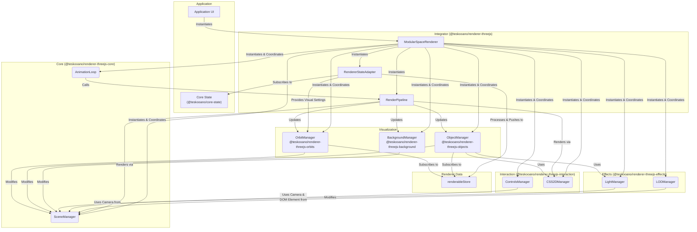

# Architecture: `@teskooano/renderer-threejs`

This document describes the architecture of the `@teskooano/renderer-threejs` package. This package acts as the **integrator** for the various modular Three.js rendering components within the Teskooano engine.

## Overview

This package does not contain core rendering logic itself. Instead, it imports and wires together managers from the other `@teskooano/renderer-threejs-*` packages to provide a unified rendering facade.

Its primary class, `ModularSpaceRenderer`, instantiates and coordinates these managers. Its other key component, `RendererStateAdapter`, acts as the bridge between the application's core state and the data format required by the rendering engine.

## Core Components within this Package

1.  **`ModularSpaceRenderer` (`ModularSpaceRenderer.ts`)**: The primary facade class.

    - **Responsibility**: Instantiates all managers from the `threejs-*` sub-modules, passes necessary dependencies between them (e.g., scene, camera), instantiates the `RenderPipeline`, provides high-level control methods (start/stop loop, toggle features), and handles disposal. It serves as the primary configuration and control point for the entire rendering system.

2.  **`RendererStateAdapter` (`RendererStateAdapter.ts`)**: The state bridge.

    - **Responsibility**: Acts as an adapter between the core application state and the rendering engine. It subscribes to `celestialObjects$` and `simulationState$`. Its primary job is to transform the raw physics-based `CelestialObject` data into the `RenderableCelestialObject` format, which involves scaling positions, calculating rotations, and determining lighting relationships. It then publishes this ready-to-render data to the `renderableStore`, which the visualization managers consume.

3.  **`RenderPipeline` (`RenderPipeline.ts`)**: The frame-by-frame orchestrator.

    - **Responsibility**: Encapsulates the logic for the sequence of operations that occur each frame. It is instantiated by `ModularSpaceRenderer` and holds references to all the managers. Its `update` method is called by the `AnimationLoop` on each tick, and it calls the individual `update` methods on the managers in the correct order.

## Data Flow & Coordination

1.  The application instantiates `ModularSpaceRenderer`, passing in the container element.
2.  `ModularSpaceRenderer`'s constructor initializes `RendererStateAdapter`, all required managers from the sub-modules, and the `RenderPipeline`.
3.  The `RendererStateAdapter` automatically subscribes to the core state (`celestialObjects$`). As data arrives, it transforms it and pushes the processed `RenderableCelestialObject[]` into the `renderableStore`.
4.  Managers like `ObjectManager` and `OrbitManager` subscribe to the `renderableStore` and react to its updates by creating, updating, or removing Three.js objects (meshes, lines, etc.) from the scene.
5.  `ModularSpaceRenderer` tells the `AnimationLoop` to use the `RenderPipeline`'s `update` method as its callback.
6.  When the loop runs (`tick`), the `RenderPipeline` orchestrates the `update` calls for all active managers in the correct order (e.g., controls first, then object positions, then final render).
7.  User interactions (like camera control) are handled by `ControlsManager`, which directly updates the camera managed by `SceneManager`.
