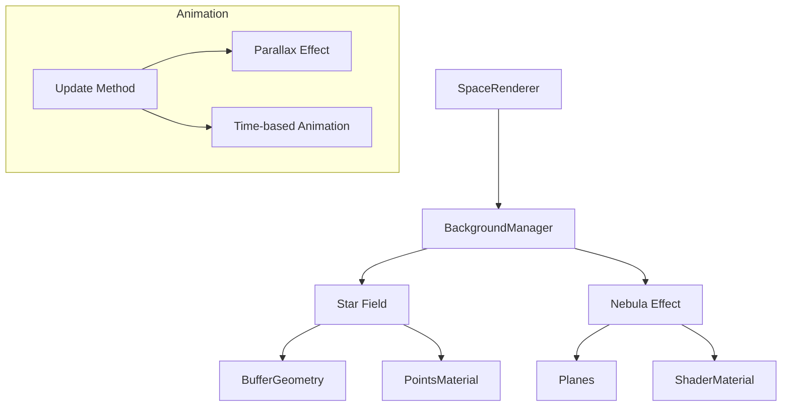

# Space Background Renderer

The Space Background Renderer creates a realistic space environment with stars and subtle nebula effects that surround the entire scene.

## Features

- **Distant Stars**: Two layers of stars at different distances to create depth
- **Animated Nebula**: Subtle animated nebula effect using custom shaders
- **Parallax Effect**: Background moves slightly with camera for increased immersion
- **Scale-Optimized**: Designed to work with the vast scale of space in the simulation
- **Performance Friendly**: Uses efficient rendering techniques with minimal impact on performance

## Implementation Details

The background consists of:

1. **Star Field**: Created using THREE.Points with carefully positioned vertices
2. **Nebula Effect**: Created using shader-based planes at extreme distances

### Technical Considerations

- The background is placed at a distance of approximately 9,000,000 units from the center, which is far enough to be beyond the far clip plane of regular objects but still visible to the camera.
- Stars have a slight parallax effect (95% of camera movement) to create a sense of depth without being distracting.
- The nebula shader uses simplex noise to create a subtle, animated effect.
- All background elements have `depthWrite` disabled to ensure they're always rendered behind other objects.

## Usage

The BackgroundManager is automatically created and managed by the ModularSpaceRenderer. No additional configuration is required to use it.

```typescript
// The ModularSpaceRenderer creates and manages the background internally
const renderer = new ModularSpaceRenderer(container, options);

// The background is automatically updated in the animation loop
renderer.startRenderLoop();
```

## Customization

To customize the background colors or star density, you would need to modify the BackgroundManager class directly:

- Nebula colors are defined in the constructor as `color1` and `color2` uniform values
- Star density is controlled by the number of points created in the constructor
- Star brightness is controlled by the HSL color value (3rd parameter)

## Technical Diagram


