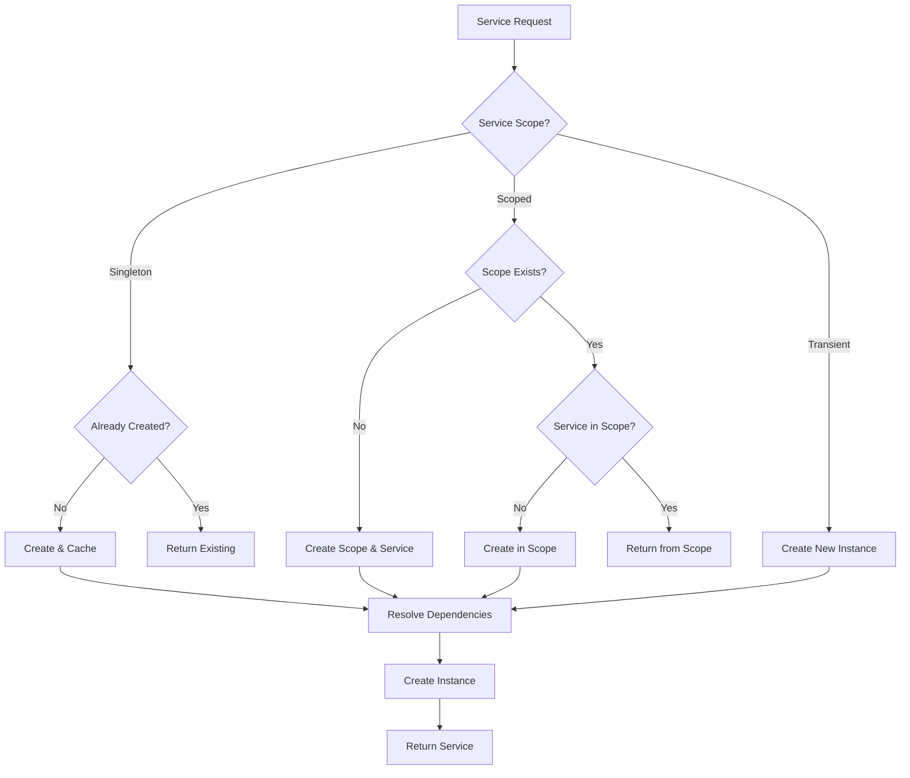

# Dependency Injection Container

This document describes the advanced dependency injection container system implemented for the Teskooano renderer.

## 🏗️ Architecture Overview

The `RendererContainer` provides a sophisticated dependency injection system that supports:

- **Service Registration**: Register services with different scopes and dependencies
- **Automatic Resolution**: Automatically resolve and inject dependencies
- **Service Scopes**: Support for singleton, transient, and scoped services
- **Service Factories**: Complex object creation with proper configuration
- **Lifecycle Management**: Proper service disposal and cleanup
- **Context Support**: Scoped services with panel-specific context

## 🔧 Service Scopes

### Singleton Services

- **Scope**: `ServiceScope.SINGLETON`
- **Behavior**: One instance shared across all panels
- **Use Case**: Global services like `RendererStateAdapter`, `LODManager`
- **Lifecycle**: Created once, disposed when application shuts down

### Scoped Services

- **Scope**: `ServiceScope.SCOPED`
- **Behavior**: One instance per panel/scope
- **Use Case**: Panel-specific services like `SceneManager`, `ObjectManager`
- **Lifecycle**: Created per panel, disposed when panel is destroyed

### Transient Services

- **Scope**: `ServiceScope.TRANSIENT`
- **Behavior**: New instance created for each request
- **Use Case**: Stateless services or temporary objects
- **Lifecycle**: Created on demand, disposed immediately after use

## 📋 Service Registration

### Basic Registration

```typescript
// Register a singleton service
container.register("MyService", () => new MyService(), ServiceScope.SINGLETON);

// Register a scoped service with dependencies
container.register(
  "MyScopedService",
  (dependency1: Dependency1, dependency2: Dependency2) =>
    new MyScopedService(dependency1, dependency2),
  ServiceScope.SCOPED,
  ["Dependency1", "Dependency2"],
);
```

### Service Factories

The `ServiceFactories` class provides pre-configured factory methods for all renderer services:

```typescript
// Using service factories
container.register(
  "SceneManager",
  (container: HTMLElement) => ServiceFactories.createSceneManager(container),
  ServiceScope.SCOPED,
  [],
);

container.register(
  "LightingManager",
  (sceneManager: SceneManager) =>
    ServiceFactories.createLightingManager(sceneManager.scene),
  ServiceScope.SCOPED,
  ["SceneManager"],
);
```

## 🔍 Service Resolution

### Basic Resolution

```typescript
// Resolve a singleton service
const stateAdapter = container.resolve<RendererStateAdapter>(
  "RendererStateAdapter",
);

// Resolve a scoped service with context
const context: ServiceContext = { scopeId: "panel-1", data: { container } };
const sceneManager = container.resolve<SceneManager>("SceneManager", context);
```

### Panel Service Creation

```typescript
// Create complete panel services
const services = container.createPanelServices(containerElement, "panel-1");

// Access shared services
const stateAdapter = services.shared.stateAdapter;
const lodManager = services.shared.lodManager;

// Access panel services
const sceneManager = services.panel.sceneManager;
const objectManager = services.panel.objectManager;
```

## 🏭 Service Factories

The `ServiceFactories` class encapsulates complex initialization logic:

### Scene Manager Factory

```typescript
static createSceneManager(container: HTMLElement): SceneManager {
  const sceneManager = new SceneManager(container);

  // Configure scene
  sceneManager.scene.background = new THREE.Color(0x000000);
  sceneManager.scene.fog = new THREE.Fog(0x000000, 1000, 10000);

  // Configure camera
  sceneManager.camera.position.set(0, 0, 1000);
  sceneManager.camera.lookAt(0, 0, 0);

  // Configure renderer
  sceneManager.renderer.setSize(container.clientWidth, container.clientHeight);
  sceneManager.renderer.setPixelRatio(window.devicePixelRatio);
  sceneManager.renderer.shadowMap.enabled = true;
  sceneManager.renderer.shadowMap.type = THREE.PCFSoftShadowMap;

  return sceneManager;
}
```

### Lighting Manager Factory

```typescript
static createLightingManager(scene: THREE.Scene): LightingManager {
  const lightingManager = new LightingManager(scene);

  // Add ambient light
  const ambientLight = new THREE.AmbientLight(0x404040, 0.1);
  scene.add(ambientLight);

  // Add directional light (sun)
  const directionalLight = new THREE.DirectionalLight(0xffffff, 1);
  directionalLight.position.set(1000, 1000, 1000);
  directionalLight.castShadow = true;
  // ... additional configuration

  return lightingManager;
}
```

## 🔄 Service Lifecycle

### Service Creation Flow



### Service Disposal

```typescript
// Dispose a specific scope (panel)
container.disposeScope("panel-1");

// Dispose all singleton services
container.disposeSingletons();

// Dispose everything
container.disposeAll();
```

## 🎯 Benefits

### 1. **Automatic Dependency Resolution**

- No manual dependency wiring
- Automatic circular dependency detection
- Type-safe service resolution

### 2. **Flexible Service Scopes**

- Singleton for global services
- Scoped for panel-specific services
- Transient for temporary services

### 3. **Complex Object Creation**

- Service factories handle complex initialization
- Consistent configuration across services
- Proper Three.js setup and configuration

### 4. **Lifecycle Management**

- Automatic service disposal
- Proper resource cleanup
- Memory leak prevention

### 5. **Testability**

- Easy service mocking
- Isolated service testing
- Dependency injection for tests

## 🧪 Testing

### Unit Testing

```typescript
// Create test container
const testContainer = new RendererContainer();

// Register test services
testContainer.register(
  "TestService",
  () => new TestService(),
  ServiceScope.TRANSIENT,
);

// Resolve and test
const service = testContainer.resolve<TestService>("TestService");
expect(service).toBeInstanceOf(TestService);
```

### Integration Testing

```typescript
// Create panel services for testing
const services = container.createPanelServices(mockContainer, "test-panel");

// Test service interactions
expect(services.panel.objectManager).toBeDefined();
expect(services.panel.orbitManager).toBeDefined();
expect(services.shared.stateAdapter).toBeDefined();
```

## 🔍 Debugging

### Service Information

```typescript
// Get information about registered services
const serviceInfo = container.getServiceInfo();
console.log(serviceInfo);

// Output:
// [
//   {
//     token: "SceneManager",
//     scope: "scoped",
//     dependencies: [],
//     resolved: true
//   },
//   {
//     token: "ObjectManager",
//     scope: "scoped",
//     dependencies: ["SceneManager", "LightingManager", "Layer2DManager"],
//     resolved: true
//   }
// ]
```

### Service Resolution Debugging

```typescript
// Enable debug logging
container.enableDebugLogging();

// Resolve services with debug output
const service = container.resolve("MyService");
// Output: [DEBUG] Resolving MyService with dependencies: [Dependency1, Dependency2]
```

## 📋 Migration Guide

### From Manual Service Creation

**Before:**

```typescript
const sceneManager = new SceneManager(container);
const lightingManager = new LightingManager(sceneManager.scene);
const objectManager = new ObjectManager(
  sceneManager.scene,
  sceneManager.camera,
  renderableStore.renderableObjects$,
  sceneManager.renderer,
  css2DManager,
  StateAccessor.accelerationVectors$(),
  lightingManager,
);
```

**After:**

```typescript
const services = container.createPanelServices(container, "panel-1");
const { sceneManager, lightingManager, objectManager } = services.panel;
```

### From RendererServiceContainer

**Before:**

```typescript
const serviceContainer = RendererServiceContainer.getInstance();
const services = serviceContainer.createRendererServices(container);
```

**After:**

```typescript
const container = RendererContainer.getInstance();
const services = container.createPanelServices(container, "panel-1");
```

## 🚀 Future Enhancements

### 1. **Service Decorators**

```typescript
@Injectable(ServiceScope.SINGLETON)
class MyService {
  constructor(@Inject("Dependency1") dep1: Dependency1) {}
}
```

### 2. **Service Interceptors**

```typescript
container.addInterceptor("MyService", {
  beforeResolve: (token, context) => console.log(`Resolving ${token}`),
  afterResolve: (token, instance) => console.log(`Resolved ${token}`),
});
```

### 3. **Service Health Checks**

```typescript
container.addHealthCheck("MyService", (instance) => instance.isHealthy());
const healthStatus = container.checkHealth();
```

---

**Note**: The DI container provides a robust foundation for service management while maintaining the existing API compatibility. It can be gradually adopted across the codebase without breaking changes.
