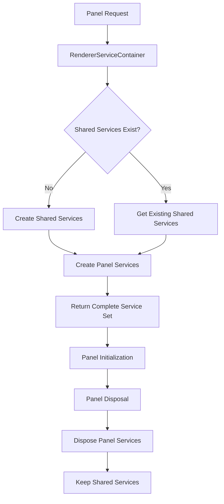
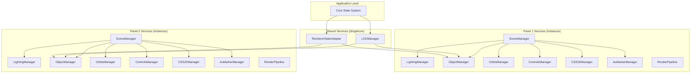

# Renderer Service Boundaries

This document defines the clear boundaries between singleton (shared) and instance (panel-specific) services in the Teskooano renderer system.

## 🏗️ Architecture Overview

The renderer system uses a **dual-service architecture** with clear separation between:

1. **Shared Services (Singletons)** - Services that are shared across all panels
2. **Panel Services (Instances)** - Services that are unique to each panel

This separation ensures:

- **Resource Efficiency**: Shared services avoid duplication
- **State Isolation**: Panel services maintain independent state
- **Clear Dependencies**: Explicit boundaries prevent coupling issues
- **Testability**: Services can be tested in isolation

## 🔄 Shared Services (Singletons)

These services are **singletons** and are shared across all renderer instances:

### `RendererStateAdapter`

- **Purpose**: Bridges between core state and renderer services
- **Why Singleton**: State is global across the application
- **Lifecycle**: Created once, shared across all panels
- **Dependencies**: Core state management system

### `LODManager`

- **Purpose**: Manages Level of Detail calculations and strategies
- **Why Singleton**: LOD strategies are global and don't vary per panel
- **Lifecycle**: Created once, shared across all panels
- **Dependencies**: Core state, celestial object data

## 🎯 Panel Services (Instances)

These services are **created per panel** and maintain independent state:

### `SceneManager`

- **Purpose**: Manages Three.js scene, camera, and renderer for a specific panel
- **Why Instance**: Each panel has its own Three.js context
- **Lifecycle**: Created per panel, disposed when panel is destroyed
- **Dependencies**: HTML container element, panel-specific configuration

### `LightingManager`

- **Purpose**: Manages lighting setup and calculations for a specific panel
- **Why Instance**: Each panel may have different lighting requirements
- **Lifecycle**: Created per panel, disposed when panel is destroyed
- **Dependencies**: Scene manager, celestial object data

### `GridManager`

- **Purpose**: Manages grid visualization for a specific panel
- **Why Instance**: Each panel may have different grid settings
- **Lifecycle**: Created per panel, disposed when panel is destroyed
- **Dependencies**: Scene manager, panel view state

### `BackgroundManager`

- **Purpose**: Manages background rendering (stars, nebula, etc.) for a specific panel
- **Why Instance**: Each panel may have different background settings
- **Lifecycle**: Created per panel, disposed when panel is destroyed
- **Dependencies**: Scene manager, panel view state

### `ObjectManager`

- **Purpose**: Manages celestial object rendering and lifecycle for a specific panel
- **Why Instance**: Each panel maintains its own object instances
- **Lifecycle**: Created per panel, disposed when panel is destroyed
- **Dependencies**: Scene manager, shared state adapter, lighting manager

### `OrbitsManager`

- **Purpose**: Manages orbit visualization and prediction for a specific panel
- **Why Instance**: Each panel may have different orbit display settings
- **Lifecycle**: Created per panel, disposed when panel is destroyed
- **Dependencies**: Object manager, shared state adapter, CSS2D manager

### `ControlsManager`

- **Purpose**: Manages camera controls and user interaction for a specific panel
- **Why Instance**: Each panel has its own camera and interaction state
- **Lifecycle**: Created per panel, disposed when panel is destroyed
- **Dependencies**: Scene manager, camera state

### `Layer2DManager` (CSS2DManager)

- **Purpose**: Manages 2D label layers and CSS2D rendering for a specific panel
- **Why Instance**: Each panel has its own label system
- **Lifecycle**: Created per panel, disposed when panel is destroyed
- **Dependencies**: Scene manager, panel view state

### `AuMarkerManager`

- **Purpose**: Manages AU distance markers for a specific panel
- **Why Instance**: Each panel may have different marker settings
- **Lifecycle**: Created per panel, disposed when panel is destroyed
- **Dependencies**: Scene manager, CSS2D manager

### `RenderPipeline`

- **Purpose**: Orchestrates the rendering pipeline for a specific panel
- **Why Instance**: Each panel has its own rendering pipeline
- **Lifecycle**: Created per panel, disposed when panel is destroyed
- **Dependencies**: All other panel services

## 🔧 Service Container Architecture

### `RendererServiceContainer`

- **Pattern**: Singleton container that manages service creation
- **Responsibilities**:
  - Creates and manages shared services (singletons)
  - Creates panel-specific services (instances)
  - Handles service disposal and cleanup
  - Validates dependencies before service creation

### Service Creation Flow

### Service Architecture Overview

## 🎯 Service Dependencies

### Shared Service Dependencies

- **RendererStateAdapter**: Core state system
- **LODManager**: Core state, celestial data

### Panel Service Dependencies

- **SceneManager**: HTML container, panel configuration
- **LightingManager**: Scene manager, celestial data
- **GridManager**: Scene manager, panel view state
- **BackgroundManager**: Scene manager, panel view state
- **ObjectManager**: Scene manager, shared state adapter, lighting manager
- **OrbitsManager**: Object manager, shared state adapter, CSS2D manager
- **ControlsManager**: Scene manager, camera state
- **Layer2DManager**: Scene manager, panel view state
- **AuMarkerManager**: Scene manager, CSS2D manager
- **RenderPipeline**: All other panel services

## 🚀 Benefits of This Architecture

### Resource Efficiency

- Shared services avoid duplication across panels
- Memory usage scales linearly with panel count
- CPU usage for shared calculations is minimized

### State Isolation

- Each panel maintains independent state
- No cross-panel interference
- Clear boundaries prevent state leakage

### Testability

- Services can be tested in isolation
- Mock dependencies are clearly defined
- Integration tests can focus on specific service combinations

### Maintainability

- Clear service boundaries make code easier to understand
- Changes to shared services affect all panels consistently
- Panel-specific changes are isolated and don't affect other panels

## 🔍 Implementation Guidelines

### Creating New Services

1. **Determine Service Type**:
   - If the service manages global state or shared resources → **Shared Service**
   - If the service manages panel-specific state or resources → **Panel Service**

2. **Define Dependencies**:
   - List all required dependencies
   - Ensure dependencies are available at creation time
   - Use constructor injection for all dependencies

3. **Implement Service**:
   - Follow the established patterns for the service type
   - Implement proper disposal methods
   - Add comprehensive error handling

4. **Register Service**:
   - Add to appropriate interface (`SharedRendererServices` or `PanelRendererServices`)
   - Update service container creation logic
   - Add proper disposal handling

### Service Lifecycle Management

1. **Shared Services**:
   - Created once when first panel is initialized
   - Disposed when application shuts down
   - Survive individual panel disposal

2. **Panel Services**:
   - Created when panel is initialized
   - Disposed when panel is destroyed
   - Independent lifecycle from other panels

## 🧪 Testing Strategy

### Unit Tests

- Test each service in isolation
- Mock all dependencies
- Verify proper disposal behavior

### Integration Tests

- Test service combinations
- Verify shared service sharing
- Test panel service isolation

### End-to-End Tests

- Test complete panel lifecycle
- Verify resource cleanup
- Test multiple panel scenarios

## 📋 Migration Checklist

When adding new services or modifying existing ones:

- [ ] Service type is correctly identified (shared vs panel)
- [ ] Dependencies are properly injected via constructor
- [ ] Service is added to appropriate interface
- [ ] Service container handles creation and disposal
- [ ] Unit tests cover the service
- [ ] Integration tests verify service boundaries
- [ ] Documentation is updated

---

**Note**: This architecture ensures that the renderer system is scalable, maintainable, and testable while providing clear boundaries between shared and panel-specific functionality.
