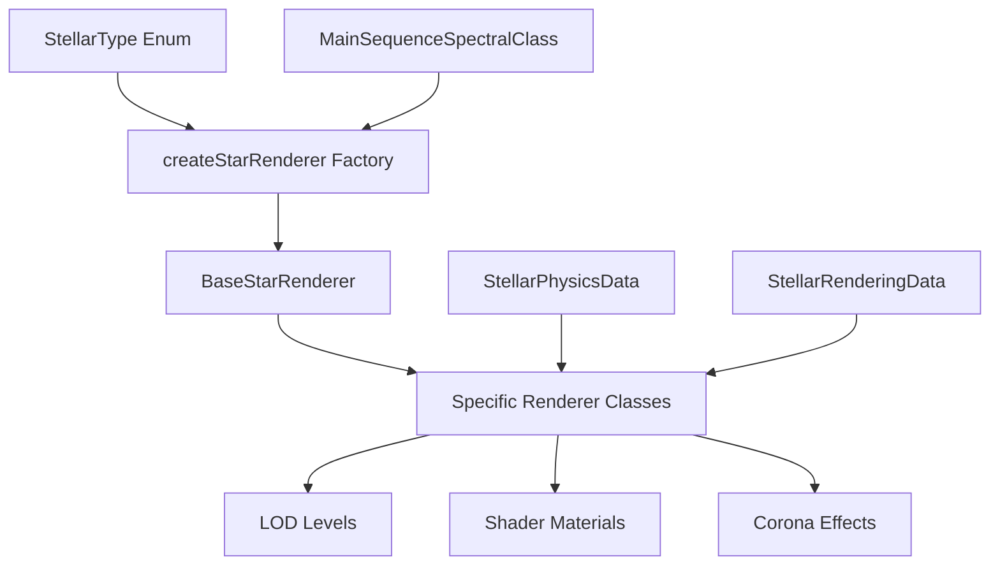

# Stellar Type Renderer Coverage

This document provides a complete mapping of all stellar types defined in the `StellarType` enum to their corresponding renderers.

## ✅ Complete Coverage Achieved

All stellar types from `@teskooano/data-types` are now fully covered with dedicated renderers.

## Stellar Type → Renderer Mapping

### Pre-main Sequence Stars

| Stellar Type   | Renderer             | File              | Characteristics                                     |
| -------------- | -------------------- | ----------------- | --------------------------------------------------- |
| `PROTOSTAR`    | `ProtostarRenderer`  | `protostar.ts`    | Dusty, irregular, infrared-heavy, accretion effects |
| `T_TAURI`      | `TTauriRenderer`     | `t-tauri.ts`      | Variable, magnetic activity, stellar winds          |
| `HERBIG_AE_BE` | `HerbigAeBeRenderer` | `herbig-ae-be.ts` | Hot, blue-white, emission lines                     |

### Main Sequence Stars

| Stellar Type    | Renderer | File                                     | Spectral Classes    |
| --------------- | -------- | ---------------------------------------- | ------------------- |
| `MAIN_SEQUENCE` | Multiple | `main-sequence-star.ts` + class-specific | O, B, A, F, G, K, M |

#### Main Sequence Spectral Class Renderers

| Spectral Class | Renderer             | File         | Temperature Range | Color             |
| -------------- | -------------------- | ------------ | ----------------- | ----------------- |
| `O`            | `ClassOStarRenderer` | `class-o.ts` | 30,000-50,000 K   | Blue              |
| `B`            | `ClassBStarRenderer` | `class-b.ts` | 10,000-30,000 K   | Blue-white        |
| `A`            | `ClassAStarRenderer` | `class-a.ts` | 7,500-10,000 K    | White             |
| `F`            | `ClassFStarRenderer` | `class-f.ts` | 6,000-7,500 K     | Yellow-white      |
| `G`            | `ClassGStarRenderer` | `class-g.ts` | 5,200-6,000 K     | Yellow (Sun-like) |
| `K`            | `ClassKStarRenderer` | `class-k.ts` | 3,700-5,200 K     | Orange            |
| `M`            | `ClassMStarRenderer` | `class-m.ts` | 2,400-3,700 K     | Red               |

### Post-main Sequence Stars

| Stellar Type | Renderer             | File            | Characteristics                    |
| ------------ | -------------------- | --------------- | ---------------------------------- |
| `SUBGIANT`   | `SubgiantRenderer`   | `subgiant.ts`   | Slightly evolved, expanding        |
| `RED_GIANT`  | `RedGiantRenderer`   | `red-giant.ts`  | Large, cool, convective, mass loss |
| `BLUE_GIANT` | `BlueGiantRenderer`  | `blue-giant.ts` | Hot, massive, strong winds         |
| `SUPERGIANT` | `SupergiantRenderer` | `supergiant.ts` | Enormous, luminous, unstable       |
| `HYPERGIANT` | `HypergiantRenderer` | `hypergiant.ts` | Extreme size, massive eruptions    |

### Evolved/Special Types

| Stellar Type    | Renderer               | File               | Characteristics                      |
| --------------- | ---------------------- | ------------------ | ------------------------------------ |
| `WOLF_RAYET`    | `WolfRayetRenderer`    | `wolf-rayet.ts`    | Hot, stripped envelope, strong winds |
| `CARBON_STAR`   | `CarbonStarRenderer`   | `carbon-star.ts`   | Deep red, carbon-rich atmosphere     |
| `VARIABLE_STAR` | `VariableStarRenderer` | `variable-star.ts` | Dramatic brightness variations       |

### Stellar Remnants

| Stellar Type   | Renderer                         | File                          | Characteristics                      |
| -------------- | -------------------------------- | ----------------------------- | ------------------------------------ |
| `WHITE_DWARF`  | `WhiteDwarfRenderer`             | `white-dwarf.ts`              | Small, hot, dense remnant            |
| `NEUTRON_STAR` | `NeutronStarRenderer`            | `neutron-star.ts`             | Extremely dense, magnetic fields     |
| `BLACK_HOLE`   | `SchwarzschildBlackHoleRenderer` | `schwarzschild-black-hole.ts` | Event horizon, gravitational lensing |
| `BLACK_HOLE`   | `KerrBlackHoleRenderer`          | `kerr-black-hole.ts`          | Rotating black hole variant          |

## Factory Function Usage

The `createStarRenderer()` function automatically selects the appropriate renderer:

```typescript
import { createStarRenderer } from "@teskooano/celestial-renderers";
import { StellarType, MainSequenceSpectralClass } from "@teskooano/data-types";

// Pre-main sequence
const protostar = createStarRenderer(StellarType.PROTOSTAR);

// Main sequence with spectral class
const sunLike = createStarRenderer(
  StellarType.MAIN_SEQUENCE,
  MainSequenceSpectralClass.G,
);

// Evolved stars
const redGiant = createStarRenderer(StellarType.RED_GIANT);

// Remnants
const blackHole = createStarRenderer(StellarType.BLACK_HOLE);
```

## Deprecated Elements Removed

The following deprecated enums have been **removed** from the stellar classification:

- ❌ `SpectralClass` (replaced by `MainSequenceSpectralClass` for main sequence stars)
- ❌ `LuminosityClass` (replaced by data-driven classification)
- ❌ `SpecialSpectralClass` (replaced by specific `StellarType` values)

## Renderer Features

All renderers inherit from `BaseStarRenderer` and provide:

- **LOD System**: Multiple detail levels for performance optimization
- **Shader Effects**: Custom fragment shaders for realistic stellar surfaces
- **Corona Effects**: Stellar wind and atmospheric effects
- **Time-based Animation**: Dynamic surface activity and variability
- **Physics Integration**: Compatible with `StellarPhysicsData` and `StellarRenderingData`

## Architecture



## Testing

Comprehensive test coverage is provided in:

- `star-renderers.spec.ts` - Individual renderer tests
- `main-sequence-star.spec.ts` - Main sequence specific tests

All stellar types are tested for:

- Renderer creation
- LOD level generation
- Material updates
- Resource disposal
- Error handling

## Commit Suggestion

```
feat(renderers): complete stellar type renderer coverage

- ✅ All 16 StellarType enum values now have dedicated renderers
- 🗑️ Removed deprecated SpectralClass, LuminosityClass, SpecialSpectralClass enums
- 🏭 Enhanced factory function with complete type mapping
- 📚 Added comprehensive coverage documentation
- 🎨 Specialized shaders for each stellar type (protostars, giants, variables, etc.)
- 🔄 Maintained backward compatibility with legacy function

BREAKING CHANGE: Removed deprecated stellar classification enums
```
