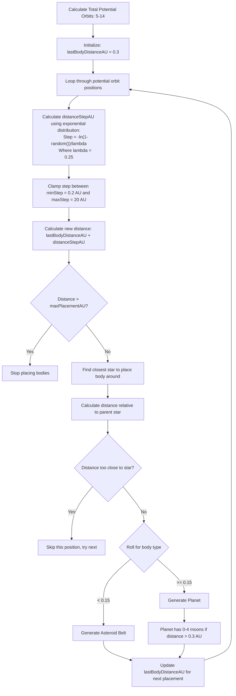
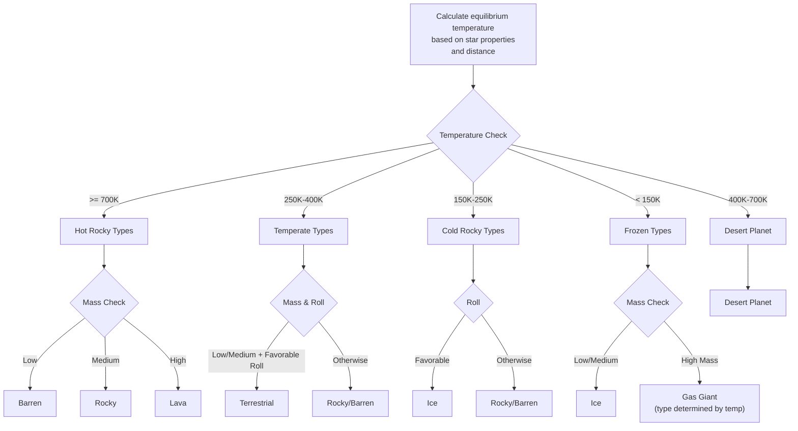
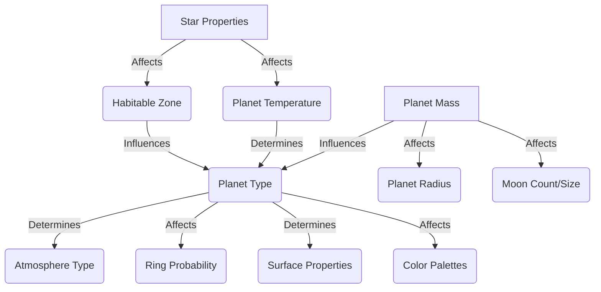

# Architecture: systems/procedural-generation

This document outlines the architecture for the procedural generation system within the Teskooano engine. Since the actual source code is yet to be written, this describes the intended design and components.

## 1. Purpose

The `procedural-generation` package is responsible for creating celestial bodies (stars, planets, moons, asteroid belts) and arranging them into star systems based on deterministic algorithms fed by a seed string. This allows for vast, varied, and replayable game worlds.

## 2. Core Concepts

- **Determinism:** Given the same input seed string, the `generateSystem` function must always produce the exact same array of `CelestialObject` data. A custom seeded pseudo-random number generator (PRNG) ensures this.
- **Modularity:** Specific generation logic for different celestial types (Star, Planet, Moon, Asteroid Belt) is encapsulated in separate files within the `src/generators/` directory.
- **Physics Integration:** Leverages `core-physics` to calculate initial orbital parameters and positions/velocities, especially for binary star systems.
- **Configurability:** While currently driven primarily by the seed, the internal constants and generation logic offer points for future parameterization.

## 3. Components

Based on the current implementation (`generator.ts` and `src/generators/`):

| Component                   | Location (`src/`)            | Description                                                                                                                                                  | Key Inputs                                         | Key Outputs                   | Dependencies                                                                        |
| :-------------------------- | :--------------------------- | :----------------------------------------------------------------------------------------------------------------------------------------------------------- | :------------------------------------------------- | :---------------------------- | :---------------------------------------------------------------------------------- |
| **System Generator**        | `generator.ts`               | Orchestrates the entire system generation process (`generateSystem` function). Determines number of stars, loops to place bodies, calls specific generators. | Seed string                                        | `CelestialObject[]`           | `seeded-random`, `generators/*`, `core-physics`, `data-types`                       |
| **Seeded PRNG**             | `seeded-random.ts`           | Provides a deterministic pseudo-random number generator based on an initial seed string.                                                                     | Seed string                                        | Random number function        | -                                                                                   |
| **Star Generator**          | `generators/star.ts`         | Generates properties for a single star (spectral class, mass, radius, temperature, etc.).                                                                    | Seeded random function                             | `CelestialObject` (Star Data) | `utils`, `constants`, `data-types`                                                  |
| **Planet Generator**        | `generators/planet.ts`       | Generates properties for a planet (type, radius, mass, atmosphere, etc.) based on distance from parent star and other factors. Includes orbit calculation.   | Seeded random function, Parent Star Data, Distance | `{ generatedObjects, ... }`   | `generators/*` (sub-generators), `core-physics`, `utils`, `constants`, `data-types` |
| **Moon Generator**          | `generators/moon.ts`         | Generates properties for a moon orbiting a planet. Includes orbit calculation relative to the planet.                                                        | Seeded random function, Parent Planet Data         | `moonData`                    | `utils`, `constants`, `data-types`, `core-physics`                                  |
| **Asteroid Belt Generator** | `generators/asteroidBelt.ts` | Generates data for an asteroid belt at a specific orbital distance.                                                                                          | Seeded random function, Parent Star Data, Distance | `CelestialObject` (Belt Data) | `utils`, `constants`, `data-types`, `core-physics`                                  |
| **Planet Sub-Generators**   | `generators/planet-*.ts`     | Helper modules for specific planet aspects (orbit, properties, rings, type). Called by `generators/planet.ts`.                                               | Seeded random function, Planet Data (partial)      | Specific planet properties    | `utils`, `constants`, `data-types`                                                  |
| **Utilities & Constants**   | `utils.ts`, `constants.ts`   | Helper functions (e.g., orbit calculations not in core-physics) and constant values (AU, Solar Radius, etc.) used across generators.                         | Various                                            | Various                       | `core-math` (for utils)                                                             |

## 4. Data Flow (`generateSystem` function)

```mermaid
graph LR
    A[Input: Seed String] --> B(Create Seeded PRNG);
    B --> C{Determine Star Count};
    C -- Loop --> D[Generate Star(s)];
    D -- Uses --> SG(generators/star.ts);
    D -- Handles Binary? --> E{Calculate Barycentric Orbits};
    E -- Uses --> CP(core-physics);
    subgraph Star Generation
        D; SG; E; CP;
    end

    F[Initialize Object List with Stars] --> G{Loop for Potential Orbits};
    G -- Uses --> B;
    G --> H{Determine Distance & Parent Star};
    H --> I{Roll: Planet or Belt?};

    subgraph Body Placement Loop
        G; H; I;
    end

    I -- Belt --> J[Generate Asteroid Belt];
    J -- Uses --> ABG(generators/asteroidBelt.ts);
    J --> K(Add Belt to List);


    I -- Planet --> L[Generate Planet];
    L -- Uses --> PG(generators/planet.ts);
    L -- Has Planet? --> M{Generate Moons};
    M -- Uses --> MG(generators/moon.ts);
    M -- Loop --> N(Add Moon to List);
    L --> O(Add Planet/Rings to List);


    subgraph Generators
        PG -- Calls --> PSG(generators/planet-*.ts);
        SG; ABG; PG; PSG; MG;
    end

    K --> P{Next Orbit};
    N --> P;
    O --> P;
    G -- More Orbits? --> H;
    G -- No More Orbits --> Q[Output: CelestialObject[]];

    %% Styling (Optional)
    classDef core fill:#f9f,stroke:#333,stroke-width:2px;
    class CP,SG,ABG,PG,PSG,MG core;
```

1.  **Initialization:** Takes a `seed` string.
2.  **PRNG Setup:** Creates a deterministic pseudo-random number generator (`seeded-random.ts`).
3.  **Star Generation:**
    - Determines the number of stars (1-4).
    - Calls `generators/star.ts` to generate properties for each star.
    - If binary/multiple, calculates barycentric orbits and initial physics states using `core-physics`. Adds stars to the output list.
4.  **Body Placement Loop:**
    - Iterates a set number of times, calculating potential orbital distances using the PRNG and an exponential distribution favoring closer orbits.
    - Determines the closest star to be the parent.
    - Rolls to decide between generating a planet or an asteroid belt.
5.  **Asteroid Belt Generation:** If rolled, calls `generators/asteroidBelt.ts` and adds the result to the list.
6.  **Planet & Moon Generation:**
    - If rolled, calls `generators/planet.ts` (which internally uses `planet-*.ts` helpers) to generate the planet and potentially rings.
    - Adds the planet/rings to the list.
    - If a planet was successfully generated, potentially generates 0-4 moons by calling `generators/moon.ts` in a loop, adding each to the list.
7.  **Output:** Returns the complete list of generated `CelestialObject` data.

## 5. Design Considerations

- **Binary Star Handling:** Includes logic to calculate mutual orbits around a barycenter for binary systems.
- **Orbital Placement:** Uses an exponential distribution for placing planets/belts, leading to denser configurations closer to stars. Placement is relative to the _closest_ star in multi-star systems.
- **Physics State:** Calculates and stores initial `physicsStateReal` (position, velocity) for objects, crucial for the simulation engine.
- **Dependencies:** Relies heavily on `core-physics` for orbital calculations and `data-types` for object structures.

## 6. Future Extensions

- Surface feature generation (mountains, craters, resource nodes).
- Nebulae and other spatial phenomena.
- Generation of non-celestial elements (derelict ships, anomalies).
- More sophisticated parameterization beyond just the seed (e.g., passing a config object).
- Performance optimization (e.g., parallelization if generation becomes slow).

## 7. Generation Rules & Decision Trees

This section details the specific rules and decision logic used throughout the procedural generation process.

### 7.1 System Type Determination

```mermaid
flowchart TD
    A[Roll: random()] --> B{systemTypeRoll > 0.10?}
    B -- Yes --> C[numberOfStars = 2]
    B -- No --> D[numberOfStars = 1]
    C --> E{systemTypeRoll > 0.60?}
    E -- Yes --> F[numberOfStars = 3]
    E -- No --> G[Keep numberOfStars = 2]
    F --> H{systemTypeRoll > 0.85?}
    H -- Yes --> I[numberOfStars = 4]
    H -- No --> J[Keep numberOfStars = 3]

    %% Add labels
    L1["10% Single Star"] -.-> D
    L2["50% Binary System"] -.-> G
    L3["25% Trinary System"] -.-> J
    L4["15% Quaternary System"] -.-> I
```

The system first determines the number of stars:

- 10% chance for a single star system
- 50% chance for a binary star system
- 25% chance for a trinary star system
- 15% chance for a quaternary star system

### 7.2 Star Generation

For each star:

1. **Primary Star** (first star):

   - Generated with default position (0,0,0)
   - No initial orbital parameters

2. **Companion Stars** (if any):

   - Assigned as children of the primary star (`parentId = primaryStar.id`)
   - Given orbital parameters around the primary:
     - Semi-major axis: 0.1-10 AU
     - Eccentricity: 0.1-0.5
     - Inclination: +/- 0.1 rad (~5.7°)
     - Random values for other orbital elements
   - Primary star also gets adjusted orbital parameters around the barycenter

3. **Star Properties** (all stars):
   - Spectral class determined based on statistical distribution
   - Temperature derived from spectral class
   - Radius determined by spectral class with some variation
   - Mass calculated from radius and appropriate density
   - Luminosity calculated using Stefan-Boltzmann law
   - Color assigned based on temperature

### 7.3 Planetary System Layout



The system places celestial bodies using these rules:

1. Determine a random number (5-14) of potential orbital positions
2. Start from 0.3 AU from system center
3. For each potential position:
   - Calculate a distance step using an exponential distribution (favoring smaller steps)
   - Find the closest star to this distance to be the parent
   - Determine actual distance relative to the chosen parent star
   - Skip if too close to the parent star's radius
   - 15% chance to generate an asteroid belt, 85% chance for a planet

### 7.4 Planet Type Determination



Planet type is determined by:

1. Calculate equilibrium temperature at the planet's orbit
2. Apply temperature-based ruleset:
   - Very hot: Lava, Rocky, Barren (depending on mass)
   - Hot: Desert
   - Temperate: Terrestrial, Rocky, Barren
   - Cold: Ice, Rocky, Barren
   - Very cold: Ice or Gas Giant
3. For gas giants, apply the Sudan classification system:
   - Class I (Jupiter-like): 100-150K
   - Class II (Saturn-like): 150-250K
   - Class III/IV (Ice giants): <100K
   - Class V (Hot Jupiters): >1000K

### 7.5 Moon Generation

For each planet that's not too close to its star (>0.3 AU):

1. Determine 0-4 moons randomly
2. For each moon:
   - Start placement at 2.5 × planet radius (beyond approximate Roche limit)
   - Increase distance for each subsequent moon
   - Calculate appropriate mass (smaller than planet) and radius
   - Determine orbital parameters:
     - Semi-major axis based on calculated distance
     - Eccentricity: 0-0.1 (near-circular)
     - Inclination: +/- 0.1 rad
     - Random values for other orbital elements

### 7.6 Ring System Generation

Some planets have a chance to generate ring systems:

1. Gas giants have ~60% chance of rings
2. Ice planets have ~25% chance of rings
3. Terrestrial and rocky planets have <10% chance of rings
4. Ring system properties:
   - Inner radius: 1.5-2.5 × planet radius
   - Outer radius: Inner radius + (0.5-1.5) × planet radius
   - Composition determined by planet type (ice, rock, dust)
   - Colors selected from appropriate palettes

### 7.7 Rule Dependencies



The ruleset creates a cascade of dependent properties:

1. Star properties define habitable zones and potential temperatures
2. Planet types are determined by temperature and random mass
3. Planet types then determine possible atmosphere types
4. Surface properties depend on planet type
5. Moon generation depends on planet mass and orbit

## 8. Future Extensions

- Surface feature generation (mountains, craters, resource nodes)
- Nebulae and other spatial phenomena
- Generation of non-celestial elements (derelict ships, anomalies)
- More sophisticated parameterization beyond just the seed (e.g., passing a config object)
- Performance optimization (e.g., parallelization if generation becomes slow)
