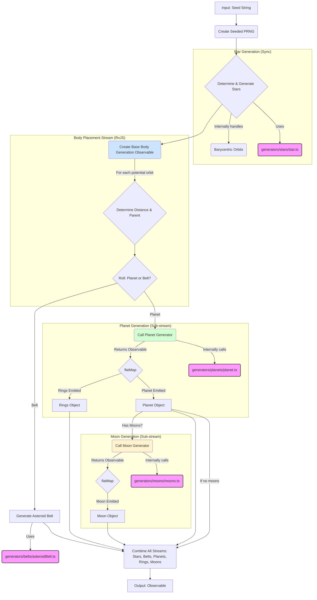
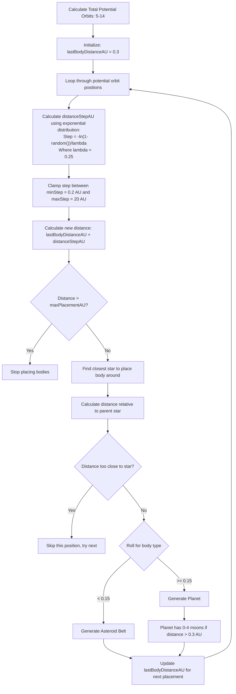
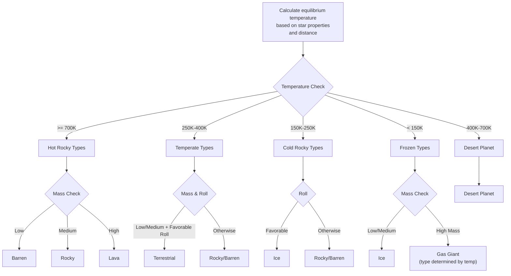
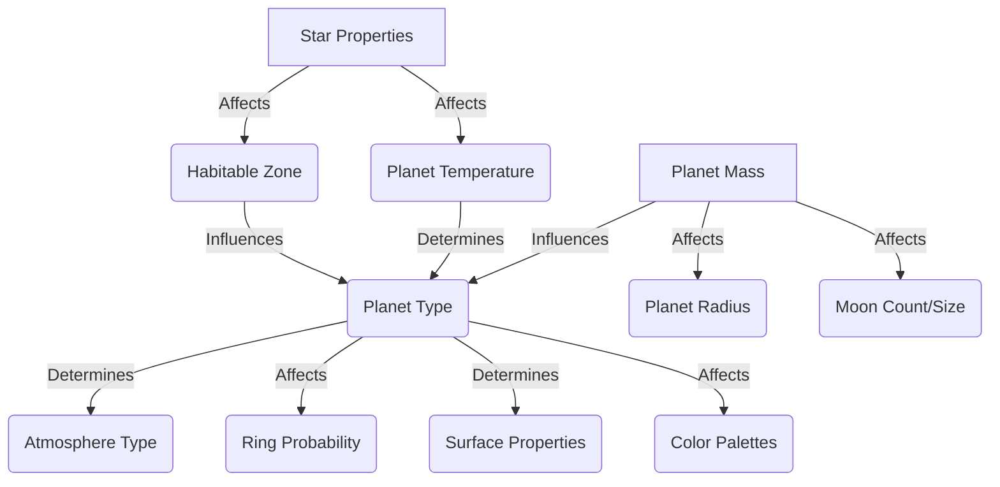

# Architecture: @teskooano/systems-procedural-generation

This document outlines the architecture for the procedural generation system within the Teskooano engine.

## 1. Purpose

The `@teskooano/systems-procedural-generation` package is responsible for creating celestial bodies (stars, planets, moons, asteroid belts) and arranging them into star systems based on deterministic algorithms fed by a seed string. This allows for vast, varied, and replayable game worlds. The system is designed to be reactive, streaming generated objects via an RxJS Observable.

## 2. Core Concepts

- **Determinism:** Given the same input seed string, the `generateSystem` function must always produce the exact same sequence of `CelestialObject` data. A custom seeded pseudo-random number generator (PRNG) ensures this.
- **Reactivity:** The primary `generateSystem` function is asynchronous and returns an `Observable<CelestialObject>`. This allows the application to process objects as they are generated without blocking the UI, which is crucial for large systems.
- **Modularity:** Specific generation logic for different celestial types (Star, Planet, Moon, Asteroid Belt) is encapsulated in separate files within the `src/generators/` directory.
- **Procedural Visuals:** For rocky planets, the system generates a rich `ProceduralSurfaceProperties` object. This data is designed to be consumed directly by shaders to create detailed and varied planet surfaces without requiring pre-made textures.
- **Physics Integration:** The main `generator.ts` contains internal logic to calculate initial orbital parameters and `PhysicsStateReal` (position/velocity vectors), especially for complex binary and multi-star systems.

## 3. Components

| Component                   | Location (`src/`)              | Description                                                                                                                                                       | Key Inputs                              | Key Outputs                   | Dependencies                                                                           |
| :-------------------------- | :----------------------------- | :---------------------------------------------------------------------------------------------------------------------------------------------------------------- | :-------------------------------------- | :---------------------------- | :------------------------------------------------------------------------------------- |
| **System Generator**        | `generator.ts`                 | Orchestrates the entire system generation process (`generateSystem` function). Determines star count, then sets up an RxJS pipeline to generate all other bodies. | Seed string                             | `{ systemName, objects$ }`    | `seeded-random`, `generators/*`, `core-physics`, `rxjs`                                |
| **Seeded PRNG**             | `seeded-random.ts`             | Provides a deterministic pseudo-random number generator (PRNG) based on a hashed seed string, using the Web Crypto API.                                           | Seed string                             | `() => number` (PRNG func)    | -                                                                                      |
| **Star Generator**          | `generators/stars/star.ts`     | Generates properties for a single star (type, class, mass, radius, etc.).                                                                                         | Seeded PRNG                             | `CelestialObject` (Star)      | `utils`, `constants`, `data-types`                                                     |
| **Planet Generator**        | `generators/planets/planet.ts` | An orchestrator that returns an `Observable`. It combines helpers for type, properties, orbit, and rings to generate a complete planet and its ring system.       | Seeded PRNG, Parent Star Data, Distance | `Observable<CelestialObject>` | `generators/planets/*`, `core-physics`, `utils`, `constants`, `data-types`, `rxjs`     |
| **Moon Generator**          | `generators/moons/moons.ts`    | Returns an `Observable` that generates 0-4 moons for a parent planet, each with its own orbit and properties.                                                     | Seeded PRNG, Parent Planet Data         | `Observable<CelestialObject>` | `generators/moons/moon.ts`, `core-physics`, `utils`, `constants`, `data-types`, `rxjs` |
| **Asteroid Belt Generator** | `generators/belts/*.ts`        | Generates data for an asteroid belt at a specific orbital distance.                                                                                               | Seeded PRNG, Parent Star Data, Distance | `CelestialObject` (Belt)      | `utils`, `constants`, `data-types`, `core-physics`                                     |
| **Planet Sub-Generators**   | `generators/planets/*.ts`      | Helper modules for specific planet aspects (orbit, properties, rings, type). These are composed by `generators/planets/planet.ts`.                                | Seeded PRNG, Planet Data (partial)      | Specific planet properties    | `utils`, `constants`, `data-types`                                                     |
| **Utilities & Constants**   | `utils.ts`, `constants.ts`     | Helper functions (e.g., orbit calculations, color mixing, procedural surface data) and constant values (AU, Solar Radius, etc.) used across generators.           | Various                                 | Various                       | `core-math`, `data-types`                                                              |

## 4. Data Flow (`generateSystem` function)

The data flow is based on RxJS operators, creating a processing pipeline.



1.  **Initialization:** The `generateSystem` function takes a `seed` string.
2.  **PRNG Setup:** It creates a deterministic pseudo-random number generator (`seeded-random.ts`).
3.  **Star Generation (Synchronous):**
    - It first determines the number of stars (1-4) and generates them synchronously.
    - If it's a multi-star system, it performs internal calculations to set up barycentric orbits and update their physics states.
    - The generated stars are the first items emitted by the final `Observable`.
4.  **Body Generation Pipeline (Asynchronous / Reactive):**
    - An RxJS `Observable` is created to represent the potential orbital slots (5-14 of them).
    - A `concatMap` operator is used to process each slot sequentially, ensuring deterministic placement.
    - Inside the `concatMap`, the generator logic decides whether to create a planet or an asteroid belt.
    - **If Belt:** `generateAsteroidBelt` is called, and the resulting object is emitted.
    - **If Planet:** `generatePlanet` is called. This function itself returns an `Observable`. A `flatMap` is used to merge the emitted planet (and its potential rings) into the main stream.
    - **Moons:** If a planet is generated, `generateMoonsObservable` is called, which returns another `Observable`. This is also merged via `flatMap` to emit all the moons for that planet.
5.  **Output:** The final result is an `Observable<CelestialObject>` that emits all generated objects (stars, belts, planets, rings, moons) in a deterministic order. The consumer can then subscribe to this stream to process each object as it arrives.

## 5. Design Considerations

- **Binary Star Handling:** The main `generator.ts` contains all logic to calculate mutual orbits around a barycenter for multi-star systems. This is handled synchronously before the main reactive pipeline begins.
- **Orbital Placement:** Uses an exponential distribution for placing planets/belts, leading to denser configurations closer to stars.
- **Procedural Surfaces:** The `utils.ts` file contains `createProceduralSurfaceProperties`, a large function that defines the "look" of each rocky planet type by outputting a data structure for use in shaders. This is a key part of the visual generation.
- **Dependencies:** Relies heavily on `@teskooano/core-physics`, `@teskooano/data-types`, and `rxjs`.

## 6. Future Extensions

- Surface feature generation (mountains, craters, resource nodes).
- Nebulae and other spatial phenomena.
- Generation of non-celestial elements (derelict ships, anomalies).
- More sophisticated parameterization beyond just the seed (e.g., passing a config object).
- Performance optimization (e.g., parallelization if generation becomes slow).

## 7. Generation Rules & Decision Trees

This section details the specific rules and decision logic used throughout the procedural generation process.

### 7.1 System Type Determination

```mermaid
flowchart TD
    A[Roll: random()] --> B{systemTypeRoll > 0.10?}
    B -- Yes --> C[numberOfStars = 2]
    B -- No --> D[numberOfStars = 1]
    C --> E{systemTypeRoll > 0.60?}
    E -- Yes --> F[numberOfStars = 3]
    E -- No --> G[Keep numberOfStars = 2]
    F --> H{systemTypeRoll > 0.85?}
    H -- Yes --> I[numberOfStars = 4]
    H -- No --> J[Keep numberOfStars = 3]

    %% Add labels
    L1["10% Single Star"] -.-> D
    L2["50% Binary System"] -.-> G
    L3["25% Trinary System"] -.-> J
    L4["15% Quaternary System"] -.-> I
```

The system first determines the number of stars:

- 10% chance for a single star system
- 50% chance for a binary star system
- 25% chance for a trinary star system
- 15% chance for a quaternary star system

### 7.2 Star Generation

For each star:

1. **Primary Star** (first star):

   - Generated with default position (0,0,0)
   - No initial orbital parameters

2. **Companion Stars** (if any):

   - Assigned as children of the primary star (`parentId = primaryStar.id`)
   - Given orbital parameters around the primary:
     - Semi-major axis: 0.1-10 AU
     - Eccentricity: 0.1-0.5
     - Inclination: +/- 0.1 rad (~5.7°)
     - Random values for other orbital elements
   - Primary star also gets adjusted orbital parameters around the barycenter

3. **Star Properties** (all stars):
   - Spectral class determined based on statistical distribution
   - Temperature derived from spectral class
   - Radius determined by spectral class with some variation
   - Mass calculated from radius and appropriate density
   - Luminosity calculated using Stefan-Boltzmann law
   - Color assigned based on temperature

### 7.3 Planetary System Layout



The system places celestial bodies using these rules:

1. Determine a random number (5-14) of potential orbital positions
2. Start from 0.3 AU from system center
3. For each potential position:
   - Calculate a distance step using an exponential distribution (favoring smaller steps)
   - Find the closest star to this distance to be the parent
   - Determine actual distance relative to the chosen parent star
   - Skip if too close to the parent star's radius
   - 15% chance to generate an asteroid belt, 85% chance for a planet

### 7.4 Planet Type Determination



Planet type is determined by:

1. Calculate equilibrium temperature at the planet's orbit
2. Apply temperature-based ruleset:
   - Very hot: Lava, Rocky, Barren (depending on mass)
   - Hot: Desert
   - Temperate: Terrestrial, Rocky, Barren
   - Cold: Ice, Rocky, Barren
   - Very cold: Ice or Gas Giant
3. For gas giants, apply the Sudan classification system:
   - Class I (Jupiter-like): 100-150K
   - Class II (Saturn-like): 150-250K
   - Class III/IV (Ice giants): <100K
   - Class V (Hot Jupiters): >1000K

### 7.5 Moon Generation

For each planet that's not too close to its star (>0.3 AU):

1. Determine 0-4 moons randomly
2. For each moon:
   - Start placement at 2.5 × planet radius (beyond approximate Roche limit)
   - Increase distance for each subsequent moon
   - Calculate appropriate mass (smaller than planet) and radius
   - Determine orbital parameters:
     - Semi-major axis based on calculated distance
     - Eccentricity: 0-0.1 (near-circular)
     - Inclination: +/- 0.1 rad
     - Random values for other orbital elements

### 7.6 Ring System Generation

Some planets have a chance to generate ring systems:

1. Gas giants have ~60% chance of rings
2. Ice planets have ~25% chance of rings
3. Terrestrial and rocky planets have <10% chance of rings
4. Ring system properties:
   - Inner radius: 1.5-2.5 × planet radius
   - Outer radius: Inner radius + (0.5-1.5) × planet radius
   - Composition determined by planet type (ice, rock, dust)
   - Colors selected from appropriate palettes

### 7.7 Rule Dependencies



The ruleset creates a cascade of dependent properties:

1. Star properties define habitable zones and potential temperatures
2. Planet types are determined by temperature and random mass
3. Planet types then determine possible atmosphere types
4. Surface properties depend on planet type
5. Moon generation depends on planet mass and orbit

## 8. Future Extensions

- Surface feature generation (mountains, craters, resource nodes)
- Nebulae and other spatial phenomena
- Generation of non-celestial elements (derelict ships, anomalies)
- More sophisticated parameterization beyond just the seed (e.g., passing a config object)
- Performance optimization (e.g., parallelization if generation becomes slow)
