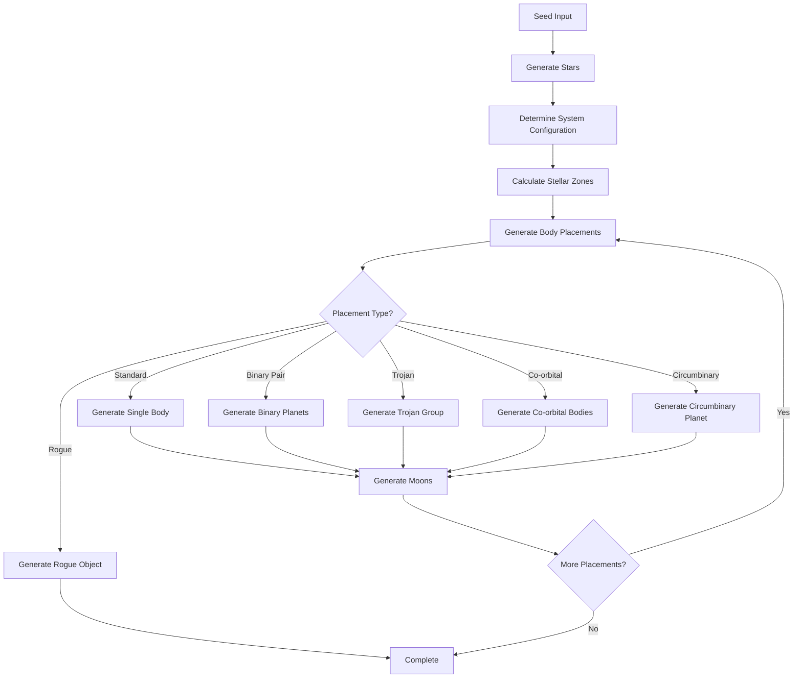
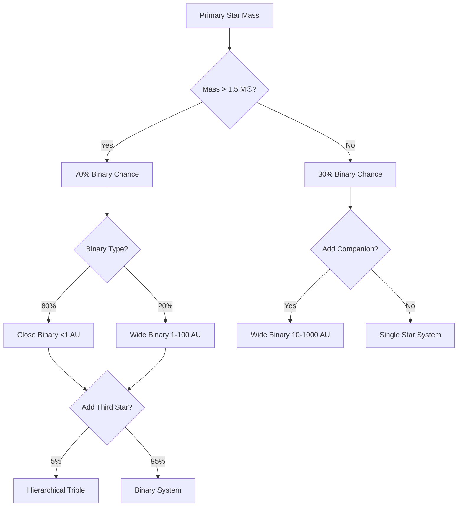
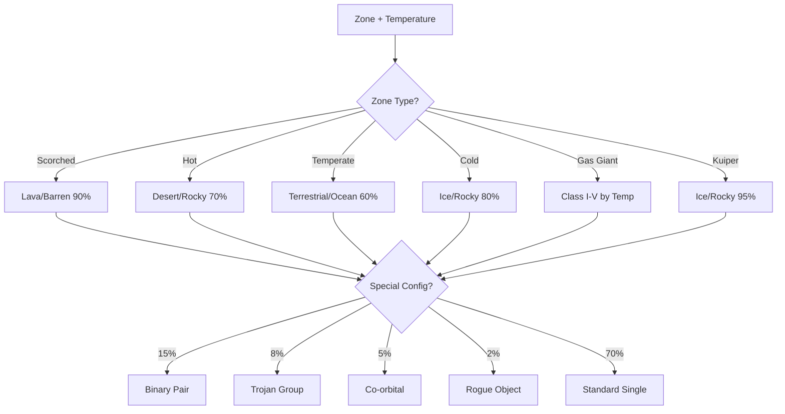

# @teskooano/systems-procedural-generation

> Advanced procedural star system generation with realistic celestial mechanics and sophisticated orbital configurations

## Overview

This package generates deterministic, realistic star systems from a seed string with significant enhancements over previous versions. The system now supports complex multi-star hierarchies, special orbital configurations (binary planets, trojans, co-orbital arrangements), rogue objects, and temperature-based zone generation for improved realism while maintaining fun and variety.

## Key Features

| Feature                          | Description                                                    |
|----------------------------------|----------------------------------------------------------------|
| **Enhanced Multi-Star Systems** | Hierarchical binary and multiple star configurations          |
| **Zone-Based Generation**        | Temperature and gravitational zone determination               |
| **Special Orbital Configs**      | Binary planets, trojans, co-orbital, and circumbinary bodies |
| **Rogue Objects**               | Unbound planets in interstellar space                         |
| **Realistic Physics**           | Proper orbital mechanics and stability calculations           |
| **10,000 AU Playground**        | Full utilization of available space with diverse environments |

## Usage

```typescript
import { generateSystem } from '@teskooano/systems-procedural-generation';

async function createStarSystem() {
  const { systemName, objects$ } = await generateSystem('my-seed-string');
  
  console.log(`Generated system: ${systemName}`);
  
  // Subscribe to the stream of celestial objects
  objects$.subscribe({
    next: (celestialObject) => {
      console.log(`Generated: ${celestialObject.name} (${celestialObject.type})`);
    },
    complete: () => {
      console.log('System generation complete!');
    }
  });
}
```

## Architecture Overview

The enhanced procedural generation system is built around several key architectural components:

### Core Components

| Component                    | Purpose                                                  |
|------------------------------|----------------------------------------------------------|
| **CelestialZoneManager**     | Manages temperature zones and orbital configurations    |
| **StellarSystemGenerator**   | Creates hierarchical multi-star systems                 |
| **BodyPlacementSystem**      | Sophisticated placement with special configurations     |
| **EnhancedBodyGenerator**    | Generates bodies with advanced orbital mechanics        |
| **ProceduralProperties**     | Modular planet surface and atmospheric properties       |

### Zone-Based Generation

The system uses sophisticated zone classification:

- **Scorched Zone** (0.01-0.3 AU): Lava worlds, tidally locked planets
- **Hot Zone** (0.3-0.8 AU): Venus-like, desert worlds  
- **Temperate Zone** (0.8-1.5 AU): Earth-like, habitable worlds
- **Cold Zone** (1.5-5.2 AU): Ice worlds, frozen planets
- **Asteroid Belt Zone** (2.0-5.0 AU): Rocky debris, asteroid belts
- **Gas Giant Zone** (5.2-30 AU): Jovian planets with ring systems
- **Ice Giant Zone** (30-50 AU): Neptune-like worlds
- **Kuiper Zone** (30-100 AU): Icy bodies, dwarf planets
- **Scattered Disk** (100-1000 AU): Cometary objects
- **Oort Cloud** (1000-10000 AU): Long-period comets, rogue objects

### Special Orbital Configurations

#### Binary Planet Pairs
- Planets orbiting each other while orbiting a star
- Realistic mass ratios and separation distances
- Complex tidal interactions

#### Trojan Configurations  
- Bodies at L4/L5 Lagrange points
- Stable co-orbital arrangements
- Multiple trojans per main body

#### Co-Orbital Systems
- Multiple bodies sharing the same orbit
- Different orbital phases to prevent collisions
- Realistic for asteroid families

#### Circumbinary Objects
- Planets orbiting both stars in binary systems
- Proper stability calculations
- Enhanced for wide binary separations

#### Rogue Objects
- Unbound planets ejected from their birth systems
- Scattered throughout interstellar space
- Cold, isolated worlds

### Stellar System Types

The generator creates diverse stellar configurations:

| System Type                | Description                                    | Frequency |
|----------------------------|------------------------------------------------|-----------|
| **Single Star**            | Isolated main sequence star                   | 60%       |
| **Close Binary**           | Stars separated by <1 AU                      | 15%       |
| **Wide Binary**            | Stars separated by 1-100 AU                   | 20%       |
| **Hierarchical Triple**    | Three stars in nested binary configuration    | 4%        |
| **Alpha Centauri-like**    | Close binary + distant companion              | 1%        |

### Enhanced Realism Features

#### Temperature-Based Planet Types
- Realistic temperature gradients from stellar luminosity
- Greenhouse effects for atmospheric worlds  
- Albedo variations based on surface composition
- Tidal heating for close-orbit bodies

#### Improved Asteroid Belts
- Formation based on planetary migration
- Kirkwood gaps from gravitational resonances
- Realistic mass distributions
- Shepherd moon interactions

#### Advanced Ring Systems
- Multiple ring components with different compositions
- Shepherd moon dynamics
- Ring-moon interactions and orbital resonances
- Realistic ring particle sizes and densities

## Generation Process Flow



## Generation Rules & Decision Trees

### Star Count Determination



### Planet Type Determination



## Development

### Building

```bash
moon run procedural-generation:build
```

### Testing

```bash
moon run procedural-generation:test
```

### Type Checking

```bash
moon run procedural-generation:typecheck
```

## Changelog

See [CHANGELOG.md](./CHANGELOG.md) for detailed version history.

## Architecture Documentation

For detailed technical documentation, see [ARCHITECTURE.md](./ARCHITECTURE.md).
