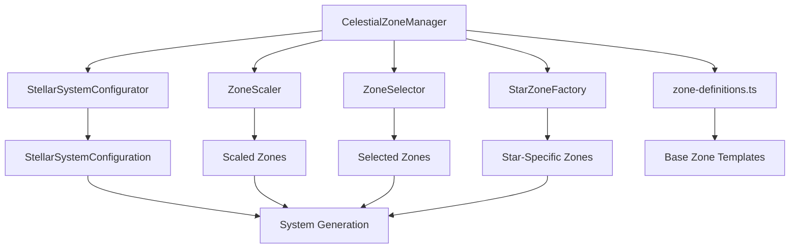

# Celestial Zone System Documentation

## Overview

The Celestial Zone System is a sophisticated architecture that creates realistic star systems by dividing space around stars into temperature-based zones. Each zone has specific properties that determine what types of celestial bodies can form there, creating scientifically-based planetary systems.

## Architecture Overview

The system consists of 6 modular components working together:



## Core Components

### 1. CelestialZoneManager (Orchestrator)

The main coordinator that manages all zone operations:

```typescript
class CelestialZoneManager {
  // Main API methods:
  static createForStar(star, random); // Single star system
  determineStellarConfiguration(); // System type (single/binary/multi)
  getAdjustedZones(stars, config); // Zones scaled for stellar properties
  selectZonesForPlacement(stars, config); // Final zones for body placement
  static createStarSpecificZones(star, random); // Star-type specific zones
}
```

### 2. Zone Definitions (Base Templates)

**File:** `zone-definitions.ts`

Defines the base zone templates that serve as starting points for all calculations:

```typescript
interface CelestialZone {
  name: string; // "Hot Inner Zone", "Temperate Zone", etc.
  category: ZoneCategory; // SCORCHED, HOT, TEMPERATE, COOL, etc.

  // Template boundaries (relative to G-type star, L=1.0)
  baseMinAU: number; // 0.4 AU for Hot Inner Zone
  baseMaxAU: number; // 0.8 AU for Hot Inner Zone

  // Runtime boundaries (calculated dynamically)
  minAU: number; // Scaled based on star luminosity
  maxAU: number; // Scaled based on star luminosity

  // Physical properties
  temperatureRange: { min: number; max: number }; // 400-800K for Hot Inner

  // Formation constraints
  allowedPlanetTypes: PlanetType[]; // [ROCKY, DESERT, LAVA]
  allowedGasGiantClasses: GasGiantClass[]; // [CLASS_IV, CLASS_V]
  formationProbability: number; // 0.7 (70% chance of formation)

  // Body placement limits
  maxBodies: number; // 6 max bodies in this zone
  minBodies?: number; // 1 guaranteed body

  // Special object chances
  cometChance: number; // 0.0 (no comets in hot zone)
  asteroidBeltChance: number; // 0.2 (20% asteroid belt chance)

  // Advanced orbital configurations
  specialConfigurations: OrbitalConfiguration[]; // [STANDARD, BINARY_PAIR, TROJAN]
}
```

**Default Zones:**

- **Scorched Zone** (0.2-0.4 AU): Lava planets, tidally locked
- **Hot Inner Zone** (0.4-0.8 AU): Rocky/desert planets, hot gas giants
- **Temperate Zone** (0.8-2.0 AU): Terrestrial/ocean planets, habitable zone
- **Cool Zone** (2.0-5.0 AU): Ice worlds, gas giants beyond frost line
- **Outer Gas Zone** (5.0-30.0 AU): Large gas giants, icy moons
- **Frozen Outer Zone** (30.0-100.0 AU): Distant ice worlds, comets
- **Outer Zone** (100.0-1000.0 AU): Trans-Neptunian analogs
- **Distant Zone** (1000.0-5000.0 AU): Kuiper belt analogs
- **Interstellar Zone** (5000.0+ AU): Rogue objects, extreme orbits

### 3. Stellar System Configurator

**File:** `stellar-system-configurator.ts`

Determines whether the system is single star, binary, or multi-star:

```typescript
determineStellarConfiguration(): StellarSystemConfiguration {
  const roll = this.random();

  if (roll < 0.6) {
    return { type: StellarSystemType.SINGLE_STAR, stars: 1 };        // 60% chance
  } else if (roll < 0.85) {
    return { type: StellarSystemType.BINARY_CLOSE, stars: 2 };       // 25% chance
  } else if (roll < 0.95) {
    return { type: StellarSystemType.BINARY_WIDE, stars: 2 };        // 10% chance
  } else if (roll < 0.98) {
    return { type: StellarSystemType.TRIPLE_HIERARCHICAL, stars: 3 }; // 3% chance
  } else {
    return { type: StellarSystemType.MULTIPLE_COMPLEX, stars: 4-6 };  // 2% chance
  }
}
```

### 4. Zone Scaler

**File:** `zone-scaler.ts`

Scales zone boundaries based on stellar properties using real astrophysics:

#### Step 1: Calculate Stellar Scaling Factor

```typescript
calculateScalingFactor(star: CelestialObject): number {
  // Get luminosity (preferred) or calculate from mass
  let luminosity = star.properties.luminosity || Math.pow(solarMasses, 3.5);

  // Base scaling from luminosity (habitable zone scales as √L)
  let scalingFactor = Math.sqrt(luminosity);

  // Adjust for stellar type
  scalingFactor *= getStellarTypeScalingMultiplier(stellarType);

  // Adjust for spectral class
  scalingFactor *= getSpectralClassScalingMultiplier(spectralClass);

  return scalingFactor;
}
```

#### Stellar Type Multipliers

```typescript
getStellarTypeScalingMultiplier(stellarType: string): number {
  switch (stellarType) {
    case StellarType.WHITE_DWARF:    return 0.1;   // 10% - very compact zones
    case StellarType.NEUTRON_STAR:   return 0.05;  // 5% - extremely compact
    case StellarType.BLACK_HOLE:     return 0.05;  // 5% - extremely compact
    case StellarType.WOLF_RAYET:     return 2.0;   // 200% - very hot and luminous
    case StellarType.MAIN_SEQUENCE:  return 1.0;   // 100% - standard scaling
    default:                         return 1.0;
  }
}
```

#### Spectral Class Multipliers

```typescript
getSpectralClassScalingMultiplier(spectralClass: string): number {
  // Based on stellar temperature and luminosity
  if (spectralClass.startsWith("M")) return 0.3;   // Red dwarfs - zones much closer
  if (spectralClass.startsWith("K")) return 0.7;   // Orange dwarfs - zones closer
  if (spectralClass.startsWith("G")) return 1.0;   // Sun-like - baseline
  if (spectralClass.startsWith("F")) return 1.5;   // Hotter - zones farther
  if (spectralClass.startsWith("A")) return 2.0;   // Much hotter - zones much farther
  if (spectralClass.startsWith("B")) return 3.0;   // Very hot - zones very far
  if (spectralClass.startsWith("O")) return 3.0;   // Extremely hot - zones extremely far
  if (spectralClass.startsWith("W")) return 4.0;   // Wolf-Rayet - zones at extreme distances
  return 1.0;
}
```

#### Multi-Star System Scaling

```typescript
scaleZones(zones: CelestialZone[], stars: CelestialObject[], config: StellarSystemConfiguration): CelestialZone[] {
  // Calculate combined luminosity of all stars
  const totalLuminosity = stars.reduce((sum, star) => sum + star.luminosity, 0);

  // Apply complexity factor for multi-star systems
  const complexity = getComplexityFactor(config);
  const scaledLuminosity = totalLuminosity * complexity;

  // Scale zone boundaries using √L relationship
  const luminosityFactor = Math.sqrt(scaledLuminosity);

  return zones.map(zone => ({
    ...zone,
    minAU: zone.baseMinAU * luminosityFactor,
    maxAU: zone.baseMaxAU * luminosityFactor,
    formationProbability: zone.formationProbability * complexity
  }));
}
```

#### Complexity Factors

Multi-star systems affect planetary formation:

```typescript
getComplexityFactor(config: StellarSystemConfiguration): number {
  switch (config.type) {
    case "SINGLE_STAR":        return 1.0;  // No modification
    case "BINARY_CLOSE":       return 0.8;  // 20% reduction (disrupted formation)
    case "BINARY_WIDE":        return 1.1;  // 10% boost (stable zones between stars)
    case "TRIPLE_HIERARCHICAL": return 0.9;  // 10% reduction (mild disruption)
    case "MULTIPLE_COMPLEX":   return 0.7;  // 30% reduction (chaotic dynamics)
    default:                   return 1.0;
  }
}
```

### 5. Zone Selector

**File:** `zone-selector.ts`

Determines which zones will actually be used for body placement:

```typescript
selectZonesForPlacement(adjustedZones: CelestialZone[], stars: CelestialObject[], config: StellarSystemConfiguration): CelestialZone[] {
  const activeZones: CelestialZone[] = [];

  // Step 1: Guarantee zones with minBodies > 0
  const guaranteedZones = adjustedZones.filter(zone => (zone.minBodies ?? 0) > 0);
  activeZones.push(...guaranteedZones);

  // Step 2: Probabilistic selection for remaining zones
  for (const zone of adjustedZones) {
    if (activeZones.find(z => z.name === zone.name)) continue;

    // Apply zone inclusion multiplier to reduce outer zone selection
    let inclusionChance = zone.formationProbability * getZoneInclusionMultiplier(zone.category);

    if (this.random() < inclusionChance) {
      activeZones.push(zone);
    }
  }

  // Step 3: Add fallback zones if none selected
  if (activeZones.length === 0) {
    addFallbackZones(adjustedZones, activeZones);
  }

  // Step 4: Limit total zones to prevent over-generation (4-5 max)
  const maxZones = 4 + Math.floor(this.random() * 2);
  if (activeZones.length > maxZones) {
    return activeZones.sort((a, b) => a.minAU - b.minAU).slice(0, maxZones);
  }

  return activeZones.sort((a, b) => a.minAU - b.minAU);
}
```

#### Zone Inclusion Multipliers

Reduces the probability of selecting distant zones:

```typescript
getZoneInclusionMultiplier(category: ZoneCategory): number {
  switch (category) {
    case ZoneCategory.COLD:         return 0.5;  // 50% reduction
    case ZoneCategory.FROZEN:       return 0.5;  // 50% reduction
    case ZoneCategory.OUTER:        return 0.3;  // 70% reduction
    case ZoneCategory.DISTANT:      return 0.3;  // 70% reduction
    case ZoneCategory.INTERSTELLAR: return 0.1;  // 90% reduction
    default:                        return 1.0;  // No reduction
  }
}
```

### 6. Star Zone Factory

**File:** `star-zone-factory.ts`

Creates zones specifically tailored to individual star types (alternative to scaling):

```typescript
createStarSpecificZones(star: CelestialObject, random: () => number): CelestialZone[] {
  const starProps = star.properties;
  const spectralClass = starProps.spectralClass || "G";
  const stellarType = starProps.classType || "MAIN_SEQUENCE";
  const luminosity = starProps.luminosity || 1.0;

  const baseScaling = Math.sqrt(luminosity);

  switch (stellarType) {
    case "WHITE_DWARF":
      return createWhiteDwarfZones(baseScaling);
    case "NEUTRON_STAR":
      return createNeutronStarZones(baseScaling);
    case "BLACK_HOLE":
      return createBlackHoleZones(baseScaling);
    case "RED_GIANT":
    case "SUPERGIANT":
      return createGiantStarZones(baseScaling);
    case "MAIN_SEQUENCE":
    default:
      return createMainSequenceZones(spectralClass, baseScaling);
  }
}
```

#### Example: Neutron Star Zones

```typescript
createNeutronStarZones(baseScaling: number): CelestialZone[] {
  const scaling = baseScaling * 0.05;  // Very compact zones
  return [
    createZone("Scorched Zone", ZoneCategory.SCORCHED, 0.001, 0.01, scaling),
    createZone("Hot Inner Zone", ZoneCategory.HOT, 0.01, 0.05, scaling),
    createZone("Temperate Zone", ZoneCategory.TEMPERATE, 0.05, 0.5, scaling),
  ];
}
```

#### Example: O/B-Type Star Zones

```typescript
createOBTypeZones(baseScaling: number): CelestialZone[] {
  const scaling = baseScaling * 3.0;  // Massive zones
  return [
    createZone("Scorched Zone", ZoneCategory.SCORCHED, 2.0, 10.0, scaling),
    createZone("Hot Inner Zone", ZoneCategory.HOT, 10.0, 30.0, scaling),
    createZone("Temperate Zone", ZoneCategory.TEMPERATE, 30.0, 100.0, scaling),
    createZone("Cool Zone", ZoneCategory.COOL, 100.0, 300.0, scaling),
    createZone("Outer Gas Zone", ZoneCategory.COLD, 300.0, 1000.0, scaling),
  ];
}
```

## Data Flow Pipeline

### 1. System Generation Request

```typescript
// Input: Seeded random function + star properties
const zoneManager = new CelestialZoneManager(seededRandom);
```

### 2. Stellar System Configuration

```typescript
const config = zoneManager.determineStellarConfiguration();
// Output: { type: "BINARY_CLOSE", stars: 2 }
```

### 3. Zone Scaling

```typescript
const adjustedZones = zoneManager.getAdjustedZones(stars, config);
// Output: Zones with minAU/maxAU scaled based on combined stellar luminosity
```

### 4. Zone Selection

```typescript
const selectedZones = zoneManager.selectZonesForPlacement(stars, config);
// Output: 3-5 zones that will actually contain celestial bodies
```

### 5. Body Placement

The selected zones are used by the planet generator to determine:

- **Where** to place bodies (distance from star)
- **What types** of bodies can form (planet types, gas giant classes)
- **How many** bodies per zone (minBodies, maxBodies)
- **Special configurations** (binary pairs, trojans, etc.)

## Real-World Examples

### Example 1: Sun-like G2V Star

**Input:**

```typescript
star = {
  properties: {
    spectralClass: "G2V",
    classType: "MAIN_SEQUENCE",
    luminosity: 1.0,
  },
};
```

**Zone Scaling:**

- Base scaling factor: √1.0 = 1.0
- Stellar type multiplier: 1.0 (main sequence)
- Spectral class multiplier: 1.0 (G-type)
- **Final scaling: 1.0**

**Resulting Zones:**
| Zone | Distance (AU) | Temperature (K) | Allowed Bodies |
|------------------|---------------|-----------------|--------------------------|
| Scorched Zone | 0.2 - 0.4 | 800-2000 | Lava, Rocky |
| Hot Inner Zone | 0.4 - 0.8 | 400-800 | Rocky, Desert, Lava |
| Temperate Zone | 0.8 - 2.0 | 200-400 | Terrestrial, Ocean, Rocky|
| Cool Zone | 2.0 - 5.0 | 100-200 | Ice, Rocky |
| Outer Gas Zone | 5.0 - 30.0 | 50-100 | Ice + Gas Giants |

### Example 2: M5V Red Dwarf

**Input:**

```typescript
star = {
  properties: {
    spectralClass: "M5V",
    classType: "MAIN_SEQUENCE",
    luminosity: 0.004,
  },
};
```

**Zone Scaling:**

- Base scaling factor: √0.004 = 0.063
- Stellar type multiplier: 1.0 (main sequence)
- Spectral class multiplier: 0.3 (M-type)
- **Final scaling: 0.019**

**Resulting Zones:**
| Zone | Distance (AU) | Notes |
|------------------|---------------|--------------------------|
| Scorched Zone | 0.004 - 0.008 | Very close, tidally locked|
| Hot Inner Zone | 0.008 - 0.015 | Still very close |
| Temperate Zone | 0.015 - 0.038 | Habitable zone very close|
| Cool Zone | 0.038 - 0.095 | Outer system |

### Example 3: O5V Massive Star

**Input:**

```typescript
star = {
  properties: {
    spectralClass: "O5V",
    classType: "MAIN_SEQUENCE",
    luminosity: 280000,
  },
};
```

**Zone Scaling:**

- Base scaling factor: √280,000 = 529
- Stellar type multiplier: 1.0 (main sequence)
- Spectral class multiplier: 3.0 (O-type)
- **Final scaling: 1,587**

**Resulting Zones:**
| Zone | Distance (AU) | Notes |
|------------------|--------------------|------------------------------|
| Scorched Zone | 317 - 1,905 | Massive scorched region |
| Hot Inner Zone | 1,905 - 3,810 | Larger than our solar system |
| Temperate Zone | 3,810 - 15,870 | Habitable zone very far out |
| Cool Zone | 15,870 - 47,610 | Enormous outer system |

### Example 4: Binary System

**Input:**

```typescript
stars = [
  { luminosity: 1.0, spectralClass: "G2V" },
  { luminosity: 0.8, spectralClass: "K1V" },
];
config = { type: "BINARY_WIDE", stars: 2 };
```

**Zone Scaling:**

- Combined luminosity: 1.0 + 0.8 = 1.8
- Complexity factor: 1.1 (binary wide boost)
- Scaled luminosity: 1.8 × 1.1 = 1.98
- **Final scaling: √1.98 = 1.41**

**Result:** Zones are 41% larger than Sun-like system, with 10% boost to formation probability.

## Usage Examples

### Basic Usage

```typescript
import { CelestialZoneManager } from "./CelestialZoneManager";

// Create zone manager with seeded random
const zoneManager = new CelestialZoneManager(seededRandom);

// Generate system configuration
const config = zoneManager.determineStellarConfiguration();

// Get zones for star system
const zones = zoneManager.getAdjustedZones(stars, config);

// Select zones for body placement
const selectedZones = zoneManager.selectZonesForPlacement(stars, config);
```

### Single Star System

```typescript
// Create manager pre-configured for single star
const zoneManager = CelestialZoneManager.createForStar(star, seededRandom);

// Get zones (already scaled for this star)
const zones = zoneManager.getAllZones();
```

### Custom Star-Specific Zones

```typescript
// Create zones tailored to specific star type
const customZones = CelestialZoneManager.createStarSpecificZones(
  neutronStar,
  seededRandom,
);
```

### Zone Lookup

```typescript
// Find zone for specific distance
const zone = zoneManager.getZoneForDistance(1.5); // Returns "Temperate Zone" for Sun-like star
```

## Key Design Principles

1. **Physics-Based Scaling**: Zones scale with stellar luminosity using √L relationship (habitable zone physics)
2. **Stellar Type Awareness**: Different star types have fundamentally different zone structures
3. **Multi-Star Complexity**: Binary/multiple systems have modified formation probabilities
4. **Probabilistic Selection**: Not all zones are guaranteed to contain bodies
5. **Fallback Safety**: System always generates at least some zones for body placement
6. **Realistic Constraints**: Each zone has scientifically-appropriate body types and formation chances
7. **Deterministic Generation**: Same seed produces identical zone configurations

## Testing

```typescript
import { CelestialZoneManager } from "./CelestialZoneManager";

// Test zone scaling
const manager = new CelestialZoneManager(() => 0.5);
const config = manager.determineStellarConfiguration();
const zones = manager.getAdjustedZones(testStars, config);

// Verify zone boundaries
expect(zones[0].minAU).toBeCloseTo(expectedValue, 2);
expect(zones[0].maxAU).toBeCloseTo(expectedValue, 2);
```

## Binary Stability Validation

For multi-star systems, the zone system integrates with enhanced binary stability validation to ensure stable orbital configurations in n-body simulations.

### Binary Stability Constraints

**File:** `operators/star-generator.ts`

The system validates binary star separations using astrophysical stability criteria:

```typescript
interface BinaryStabilityResult {
  isStable: boolean;
  minSeparationAU: number;
  recommendedSeparationAU: number;
  warnings: string[];
}

function calculateBinaryStability(
  star1: CelestialObject,
  star2: CelestialObject,
  proposedSeparationAU: number,
): BinaryStabilityResult {
  // 1. Minimum separation: 3× combined stellar radii safety margin
  const minSeparationAU = (star1RadiusAU + star2RadiusAU) * 3.0;

  // 2. Roche limit calculation for mass transfer stability
  const massRatio = star2.realMass_kg / star1.realMass_kg;
  const rocheLimit =
    (proposedSeparationAU * 0.49 * Math.pow(massRatio, 2 / 3)) /
    (0.6 * Math.pow(massRatio, 2 / 3) +
      Math.log(1 + Math.pow(massRatio, 1 / 3)));

  // 3. Conservative stability separation
  const recommendedSeparationAU = Math.max(rocheStableSeparation, 0.5);

  return { isStable, minSeparationAU, recommendedSeparationAU, warnings };
}
```

### Enhanced Binary Generation

**Conservative Separation Ranges:**

- **Close binaries**: 0.5-2.0 AU (increased from 0.1-1.0 AU)
- **Wide binaries**: 2.0-100 AU (gap to avoid unstable intermediate range)

**Stability-Optimized Orbital Parameters:**

- **Very low eccentricity**: 0.01-0.06 for close binaries (reduced from 0.01-0.16)
- **Minimal inclination**: ±1.4° for close binaries (reduced from ±5.7°)
- **Phase distribution**: Improved initial conditions to avoid problematic configurations

### Physics Engine Recommendations

The system automatically suggests optimal simulation parameters for binary stability:

```typescript
function suggestBinaryPhysicsConfig(
  separationAU: number,
  totalMass_kg: number,
  orbitalPeriod_s: number,
): {
  recommendedTimestep_s: number;
  recommendedAlgorithm: string;
  notes: string[];
} {
  // Dynamic timestep: orbital period / 100 for stability
  const baseDynamicTimestep = orbitalPeriod_s / 100;

  if (separationAU < 0.5) {
    return {
      recommendedTimestep_s: Math.min(baseDynamicTimestep, 1800), // ≤30 min
      recommendedAlgorithm: "verlet", // Symplectic integrator
      notes: [
        "Very close binary: Use small timestep and symplectic integrator",
      ],
    };
  }
  // ... additional ranges
}
```

**Automatic Logging:**

```
[setupBinaryOrbit] Stable binary created: KV-Idimi-MV-Xireyov, separation: 1.245 AU, period: 502.3 days
[setupBinaryOrbit] Physics recommendations: timestep ≤ 0.5h, algorithm: verlet
[setupBinaryOrbit] Close binary (1.245 AU): Use moderate timestep with stable integrator
```

### Validation Features

1. **Automatic Separation Adjustment**: Unstable systems are automatically moved to safe distances
2. **Roche Limit Checking**: Prevents mass transfer and tidal disruption
3. **Initial Condition Validation**: Verifies position/velocity accuracy (5% tolerance)
4. **Physics Parameter Guidance**: Suggests optimal timestep and integration algorithm

This ensures that zone-generated binary systems remain stable in n-body simulations while maintaining realistic astrophysical properties.

This system creates realistic, diverse star systems that reflect the actual physics of stellar evolution and planetary formation, providing a solid foundation for procedural system generation.
