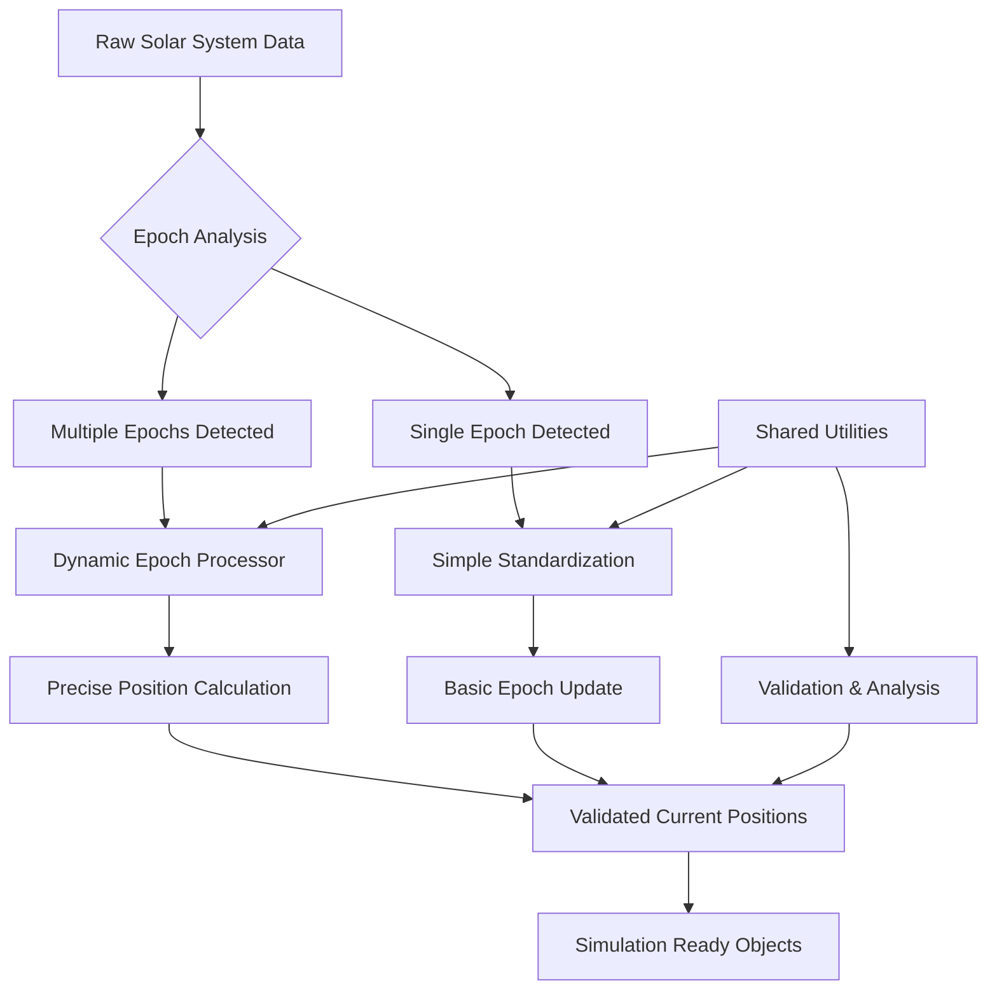

# Solar System Epoch Processing System

## Overview

The Teskooano solar system uses a comprehensive epoch processing system to ensure accurate celestial object positioning. This system handles the challenge of different objects having orbital elements defined at different reference times (epochs) and brings them all to a consistent current time for precise simulation.

## What is an Epoch?

An **epoch** is a specific point in time used as a reference for celestial mechanics calculations. Orbital elements (like semi-major axis, eccentricity, inclination) are measured and defined relative to this reference time.

### Common Epoch Formats:

- **J2000.0**: January 1, 2000, 12:00 TT (most common)
- **J1950.0**: January 1, 1950, 12:00 ET (older standard)
- **Current Time**: Real-time epochs like "2024-12-19T20:42:15.000Z"

### Why Epochs Matter:

- Orbital elements change over time due to perturbations
- Objects with epochs far from current time have positional errors
- Consistency across all objects is crucial for accurate simulation

## Architecture Overview



## Core Components

### 1. Shared Utilities (`epoch-utilities.ts`)

**Purpose**: Centralized functionality for epoch validation, analysis, and logging.

**Key Functions**:

- `validateEpochConsistency()`: Checks for epoch inconsistencies and accuracy issues
- `generateEpochSummary()`: Creates detailed epoch usage statistics
- `calculateProcessingStats()`: Analyzes processing results
- `logEpochAnalysis()`: Comprehensive console logging

**Benefits**:

- Eliminates code duplication
- Provides consistent validation logic
- Standardized logging and analysis

### 2. Dynamic Epoch Processor (`dynamic-epoch-processor.ts`)

**Purpose**: High-precision epoch processing using advanced position calculations.

**When to Use**:

- Multiple different epochs in the dataset
- High-precision requirements (satellites, fast-moving objects)
- Complex orbital propagation needed
- Real-time current positioning required

**Process**:

1. Analyzes time differences between original and current epochs
2. Uses `calculateCurrentPositionPrecise()` for each object
3. Propagates orbital elements through time using physics engine
4. Provides detailed statistics and validation

**Advantages**:

- Maximum accuracy for all object types
- Handles large time differences well
- Comprehensive tracking and validation
- Real-time position calculations

### 3. Epoch Standardization (`epoch-standardization.ts`)

**Purpose**: Simple, lightweight epoch standardization for consistent datasets.

**When to Use**:

- Most objects already use the same epoch
- Simple epoch updates needed
- Performance is critical
- Basic standardization sufficient

**Process**:

1. Uses `standardizeToCurrentEpoch()` for simple updates
2. Applies consistent epoch across all objects
3. Basic validation and logging

**Advantages**:

- Faster processing
- Lower computational overhead
- Simple, straightforward approach

## Processing Workflows

### Dynamic Processing Workflow

```typescript
// Initialize processor
const processor = new DynamicEpochProcessor();

// Process all objects with detailed tracking
const processedObjects = processor.processObjects(objects);

// Get comprehensive statistics
const stats = processor.getProcessingStats();

// Validate results
const validation = processor.validateProcessing();

// Log detailed analysis
logProcessingStats(stats);
```

### Standardization Workflow

```typescript
// Simple standardization
const standardizedObjects = standardizeSolarSystemEpochs(objects);

// Validate consistency
const validation = validateEpochConsistency(standardizedObjects);

// Log analysis
logEpochAnalysis(standardizedObjects);
```

## Key Metrics and Validation

### Accuracy Thresholds:

- **<1 year difference**: ✅ Excellent accuracy
- **1-10 years difference**: ⚠️ Good accuracy, minor adjustments
- **10-50 years difference**: ⚠️ Reduced accuracy, noticeable drift
- **>50 years difference**: ❌ Significant accuracy issues

### Validation Checks:

1. **Epoch Consistency**: All objects use compatible epochs
2. **Time Difference Analysis**: Identifies objects with large time gaps
3. **Processing Validation**: Ensures all objects were correctly updated
4. **Accuracy Assessment**: Flags potential precision issues

## Performance Considerations

### Dynamic Processor:

- **CPU**: Higher computational cost due to precise calculations
- **Memory**: Moderate overhead for tracking statistics
- **Accuracy**: Maximum precision for all objects
- **Best for**: Mixed datasets, high-precision requirements

### Standardization:

- **CPU**: Lower computational cost
- **Memory**: Minimal overhead
- **Accuracy**: Good for consistent datasets
- **Best for**: Uniform datasets, performance-critical applications

## Usage Examples

### Detecting Epoch Issues:

```typescript
import { logEpochAnalysis, validateEpochConsistency } from "./epoch-utilities";

// Analyze the dataset
logEpochAnalysis(solarSystemObjects);

// Check for issues
const validation = validateEpochConsistency(solarSystemObjects);
if (!validation.isConsistent) {
  console.warn("Epoch issues detected:", validation.issues);
}
```

### Choosing the Right Processor:

```typescript
import { generateEpochSummary } from "./epoch-utilities";
import { DynamicEpochProcessor } from "./dynamic-epoch-processor";
import { standardizeSolarSystemEpochs } from "./epoch-standardization";

const summary = generateEpochSummary(objects);

if (
  summary.epochBreakdown.length > 1 ||
  summary.epochBreakdown.some(
    (e) => Math.abs(e.daysDifferenceFromCurrent) > 365,
  )
) {
  // Use dynamic processor for complex cases
  const processor = new DynamicEpochProcessor();
  return processor.processObjects(objects);
} else {
  // Use simple standardization for uniform datasets
  return standardizeSolarSystemEpochs(objects);
}
```

## Troubleshooting

### Common Issues:

1. **"Very old epoch" warnings**:
   - **Cause**: Objects with epochs >10 years old
   - **Solution**: Use dynamic processor for better accuracy
   - **Impact**: Reduced positional accuracy

2. **Multiple epoch inconsistency**:
   - **Cause**: Mixed datasets with different reference times
   - **Solution**: Apply dynamic processing to standardize
   - **Impact**: Potential simulation errors

3. **Large time differences**:
   - **Cause**: Historical data mixed with current observations
   - **Solution**: Validate if high precision is needed
   - **Impact**: Cumulative orbital drift

### Debug Logging:

Enable comprehensive logging to diagnose issues:

```typescript
// Full analysis
logEpochAnalysis(objects, "Debug Analysis");

// Processing statistics
const stats = processor.getProcessingStats();
logProcessingStats(stats, "Debug Processing");
```

## Migration Guide

### From Legacy Functions:

```typescript
// OLD: Individual functions
validateEpochConsistency(); // ❌ Deprecated
getEpochSummary(); // ❌ Deprecated
logEpochInformation(); // ❌ Deprecated

// NEW: Shared utilities
import {
  validateEpochConsistency,
  generateEpochSummary,
  logEpochAnalysis,
} from "./epoch-utilities";
```

### Recommended Approach:

1. **Start with analysis**: Use `logEpochAnalysis()` to understand your dataset
2. **Choose processor**: Based on epoch complexity and accuracy needs
3. **Validate results**: Always check processing validation
4. **Monitor performance**: Balance accuracy vs. computational cost

## Future Enhancements

- **Adaptive Processing**: Automatic processor selection based on dataset analysis
- **Caching**: Store processed results to avoid re-computation
- **Parallel Processing**: Multi-threaded processing for large datasets
- **Real-time Updates**: Continuous epoch updates for live simulations
