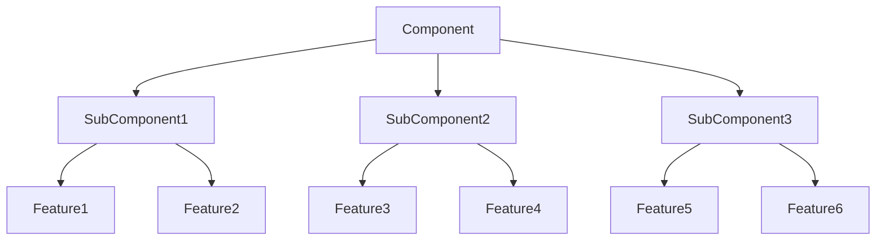

---
aliases:
  [Agent Documentation Template, Documentation Standards, Agent Guidelines]
tags: [templates, documentation, standards, agents, guidelines]
type: Template
package: "@teskooano/templates"
dependencies: []
classes: []
functions: []
constants: []
types: []
status: active
---

# Agent Documentation Template Guide

A comprehensive template and guidelines for creating high-quality, consistent documentation that follows the established standards for the Open Space project.

## 🎯 Purpose

This document serves as the definitive guide for AI agents and developers to create consistent, comprehensive documentation that matches the high-quality standards established in the Open Space project. It ensures all documentation follows the same structure, style, and depth of detail.

## 🏗️ Documentation Architecture

The documentation follows a structured, hierarchical approach with consistent formatting and comprehensive coverage:

```mermaid
graph TD
    A[Documentation Template] --> B[Frontmatter Metadata]
    A --> C[Core Content Structure]
    A --> D[Technical Details]
    A --> E[Usage Examples]
    A --> F[Integration & Performance]

    B --> G[YAML Frontmatter]
    B --> H[Metadata Fields]
    B --> I[Status Tracking]

    C --> J[Purpose & Overview]
    C --> K[Architecture Diagrams]
    C --> L[Core Features]
    C --> M[Key Methods]

    D --> N[TypeScript Interfaces]
    D --> O[Data Flow Diagrams]
    D --> P[Technical Specifications]

    E --> Q[Basic Usage]
    E --> R[Advanced Scenarios]
    E --> S[Real-world Examples]

    F --> T[Performance Considerations]
    F --> U[Integration Points]
    F --> V[Debug Features]
    F --> W[Future Enhancements]
```



## 📋 Required Template Structure

### 1. YAML Frontmatter (Required)

Every documentation file MUST start with comprehensive YAML frontmatter:

```yaml
---
aliases: [PrimaryName, AlternativeName1, AlternativeName2]
tags: [category, subcategory, specific-tags, related-concepts]
type: [Class|Function|Interface|System|Template|Guide|Index|Utility]
package: "@teskooano/package-name"
name: "ComponentName" # Optional: explicit name field
version: "1.0.0" # Optional: for package-level docs
dependencies:
  ["@teskooano/dependency1", "@teskooano/dependency2", "external-dependency"]
devDependencies:
  ["typescript", "vitest", "@vitest/browser", "@playwright/test", "eslint"]
classes: ["ClassName1", "ClassName2", "RelatedClass"]
functions: ["functionName1", "functionName2", "utilityFunction"]
events: ["eventName1", "eventName2"] # Optional: for event-driven components
constants: ["CONSTANT_NAME_1", "CONSTANT_NAME_2", "CONSTANT_VALUE"]
types: ["TypeName1", "TypeName2", "InterfaceName"]
status: [active|deprecated|experimental|planned]
---
```

### 2. Document Header

```markdown
# Component/System Name

Brief one-sentence description of what this component does and its primary purpose.

## 🎯 Purpose

Detailed explanation of the component's role, responsibilities, and why it exists in the system.
```

### 3. Architecture Section

````markdown
## 🏗️ Architecture

The [ComponentName] follows a [architectural pattern] that [explains the design approach].


````

````

### 4. Core Features Section

```markdown
## 🚀 Core Features

### 1. Feature Category 1
- **Specific Feature**: Description of the feature
- **Another Feature**: Description of another feature
- **Related Feature**: Description of related functionality

### 2. Feature Category 2
- **Advanced Feature**: Description of advanced functionality
- **Integration Feature**: How it integrates with other systems
- **Performance Feature**: Performance-related capabilities
````

### 5. Key Methods/Components Section

````markdown
## 🔧 Key Methods

### `methodName(parameters)`

**Purpose**: Clear explanation of what this method does and why it's important.

```typescript
methodName(param1: Type1, param2: Type2): ReturnType
```
````

**Parameters**:

- `param1` - Description of parameter 1
- `param2` - Description of parameter 2

**Returns**: `ReturnType` - Description of what is returned

**Process**:

1. **Step 1**: Description of first step
2. **Step 2**: Description of second step
3. **Step 3**: Description of third step
4. **Step 4**: Description of fourth step
5. **Step 5**: Description of final step

````

### 5a. API Reference Section (Alternative/Additional)

```markdown
## API Reference

### Lifecycle Management

#### `methodName(): ReturnType`
Clear explanation of what this method does and why it's important.

**Process:**
1. **Step 1**: Description of first step
2. **Step 2**: Description of second step
3. **Step 3**: Description of third step

**Usage:**
```typescript
const result = component.methodName();
````

### Event System

#### `eventName$: Observable<EventType>`

Description of when this event is emitted and what data it contains.

**Event Data:**

- `property1`: Description of event property
- `property2`: Description of event property

**Usage:**

```typescript
component.eventName$.subscribe((data) => {
  console.log("Event received:", data);
});
```

````

### 6. Data Flow Section

```markdown
## 🔄 Data Flow

The [ComponentName] follows a systematic data flow:

```mermaid
graph LR
    A[Input] --> B[Processing Step 1]
    B --> C[Processing Step 2]
    C --> D[Processing Step 3]
    D --> E[Output]

    F[Configuration] --> B
    G[Validation] --> C
    H[Optimization] --> D
````

### Processing Pipeline

1. **Input**: Description of input data
2. **Processing Step 1**: What happens in first step
3. **Processing Step 2**: What happens in second step
4. **Processing Step 3**: What happens in third step
5. **Output**: Description of final output

````

### 7. Technical Specifications Section

```markdown
## 📊 Technical Specifications

### Interface/Type Definitions

```typescript
interface ComponentInterface {
  property1: Type1;
  property2: Type2;
  property3: Type3;
  method1(): ReturnType1;
  method2(param: Type4): ReturnType2;
}

type ComponentType = {
  specificProperty: SpecificType;
  anotherProperty: AnotherType;
};
````

### Configuration Options

```typescript
interface ComponentConfig {
  option1: boolean;
  option2: number;
  option3: string;
  option4: {
    nestedOption1: Type1;
    nestedOption2: Type2;
  };
}
```

````

### 8. Usage Examples Section

```markdown
## 💡 Usage Examples

### Basic Usage

```typescript
import { ComponentName } from '@teskooano/package-name';

// Basic usage example
const component = new ComponentName(config);
const result = component.methodName(parameters);

console.log('Result:', result);
````

### Advanced Usage

```typescript
import { ComponentName } from "@teskooano/package-name";

// Advanced usage with configuration
const advancedConfig = {
  option1: true,
  option2: 42,
  option3: "advanced",
  option4: {
    nestedOption1: value1,
    nestedOption2: value2,
  },
};

const component = new ComponentName(advancedConfig);
const result = component.advancedMethod(parameters);

// Analyze results
console.log("Advanced result:", result);
result.forEach((item, index) => {
  console.log(`Item ${index + 1}:`, item);
});
```

### Real-world Scenario

```typescript
import { ComponentName } from "@teskooano/package-name";

// Real-world usage scenario
const realWorldConfig = {
  // Configuration based on real requirements
};

const component = new ComponentName(realWorldConfig);

// Process real data
const realData = getRealData();
const processedData = component.processData(realData);

// Analyze and validate results
const analysis = component.analyzeResults(processedData);
console.log("Analysis results:", analysis);
```

````

### 9. Performance Considerations Section

```markdown
## ⚡ Performance Considerations

### Efficiency
- **Optimization 1**: Description of optimization technique
- **Optimization 2**: Description of another optimization
- **Memory Usage**: Description of memory management
- **Processing Speed**: Description of speed optimizations

### Quality Metrics
- **Accuracy**: How accurate the results are
- **Reliability**: How reliable the component is
- **Consistency**: How consistent the behavior is
- **Scalability**: How well it scales

### Performance Monitoring
- **Metric 1**: Description of performance metric
- **Metric 2**: Description of another metric
- **Monitoring Tools**: Available monitoring tools
- **Optimization Strategies**: How to optimize performance
````

### 10. Integration Points Section

```markdown
## 🔌 Integration Points

### Primary Integration

- **Integration 1**: How it integrates with primary system
- **Integration 2**: How it integrates with secondary system
- **Data Flow**: How data flows between systems
- **API Usage**: How APIs are used

### Secondary Integration

- **Utility Integration**: Integration with utility systems
- **Service Integration**: Integration with services
- **Library Integration**: Integration with libraries
- **Framework Integration**: Integration with frameworks
```

### 11. Debug Features Section

```markdown
## 🐛 Debug Features

### Validation

- **Input Validation**: How inputs are validated
- **Output Validation**: How outputs are validated
- **State Validation**: How state is validated
- **Configuration Validation**: How configuration is validated

### Monitoring

- **Performance Monitoring**: Available performance monitoring
- **Error Monitoring**: Available error monitoring
- **Usage Monitoring**: Available usage monitoring
- **Health Monitoring**: Available health monitoring

### Debugging Tools

- **Debug Mode**: How to enable debug mode
- **Logging**: Available logging capabilities
- **Tracing**: Available tracing capabilities
- **Profiling**: Available profiling capabilities
```

### 12. Future Enhancements Section

```markdown
## 🔮 Future Enhancements

### Planned Features

- **Feature 1**: Description of planned feature
- **Feature 2**: Description of another planned feature
- **Feature 3**: Description of third planned feature
- **Feature 4**: Description of fourth planned feature

### Optimization Opportunities

- **Performance Optimization**: Areas for performance improvement
- **Memory Optimization**: Areas for memory improvement
- **Code Optimization**: Areas for code improvement
- **Architecture Optimization**: Areas for architectural improvement

### Advanced Features

- **Advanced Feature 1**: Description of advanced feature
- **Advanced Feature 2**: Description of another advanced feature
- **Integration Enhancement**: Planned integration improvements
- **API Enhancement**: Planned API improvements
```

### 13. Architecture Patterns Section (Optional)

```markdown
## 📚 Architecture Patterns

- **Pattern Name 1**: Description of how this pattern is implemented
- **Pattern Name 2**: Description of another pattern used
- **Pattern Name 3**: Description of third pattern
- **Pattern Name 4**: Description of fourth pattern
```

### 14. Related Documentation Section

```markdown
## 📚 Related Documentation

- [[RelatedComponent1]] - Description of relationship
- [[RelatedComponent2]] - Description of relationship
- [[RelatedSystem]] - Description of relationship
- [[RelatedInterface]] - Description of relationship
- [[RelatedGuide]] - Description of relationship
```

### 15. Dependencies Section (For Package-Level Docs)

```markdown
## Dependencies

### Core Dependencies

- **@teskooano/dependency1**: Description of dependency and its role
- **@teskooano/dependency2**: Description of dependency and its role
- **external-dependency**: Description of external dependency

### Development Dependencies

- **typescript**: Type safety and modern JavaScript features
- **vitest**: Testing framework with browser support
- **@vitest/browser**: Browser testing capabilities
- **@playwright/test**: End-to-end testing
- **eslint**: Code quality and consistency
```

### 16. Package-Level Documentation Structure (For Index/Overview Docs)

```markdown
## 📚 Documentation Structure

### Core Components

- [[Component1]] - Description of component
- [[Component2]] - Description of component
- [[Component3]] - Description of component

### Manager Classes

- [[Manager1]] - Description of manager
- [[Manager2]] - Description of manager
- [[Manager3]] - Description of manager

### Utilities

- [[Utility1]] - Description of utility
- [[Utility2]] - Description of utility
- [[Utility3]] - Description of utility

## 🔄 Quick Navigation

### By Component Type

- **Base Classes**: [[BaseClass1]], [[BaseClass2]]
- **Data Management**: [[DataManager1]], [[DataManager2]]
- **Rendering**: [[Renderer1]], [[Renderer2]]
- **Utilities**: [[Utility1]], [[Utility2]]

### By Architecture Pattern

- **Manager Pattern**: [[Manager Pattern Guide]]
- **Template Method**: [[Template Method Guide]]
- **Resource Management**: [[Resource Management Guide]]
- **Performance**: [[Performance Guide]]
```

## 🎨 Style Guidelines

### Emoji Usage

Use consistent emoji headers for all major sections:

- 🎯 Purpose
- 🏗️ Architecture
- 🚀 Core Features
- 🔧 Key Methods
- API Reference (Alternative to Key Methods)
- 🔄 Data Flow
- 📊 Technical Specifications
- 💡 Usage Examples
- ⚡ Performance Considerations
- 🔌 Integration Points
- 🐛 Debug Features
- 🔮 Future Enhancements
- 📚 Architecture Patterns (Optional)
- Dependencies (For package-level docs)
- 📚 Documentation Structure (For package-level docs)
- 🔄 Quick Navigation (For package-level docs)
- 📚 Related Documentation

### Code Formatting

- Use TypeScript for all code examples
- Include comprehensive type definitions
- Provide realistic, working examples
- Add comments explaining complex logic
- Use consistent naming conventions

### Diagram Standards

- Use Mermaid diagrams for architecture and data flow
- Keep diagrams simple and focused
- Use consistent node shapes and colors
- Include clear labels and relationships

### Content Depth

- Provide comprehensive explanations
- Include multiple usage scenarios
- Cover edge cases and error handling
- Explain the "why" behind design decisions
- Include performance considerations

## 📝 Quality Checklist

Before finalizing any documentation, ensure:

### ✅ Structure

- [ ] YAML frontmatter is complete and accurate
- [ ] All required sections are present
- [ ] Emoji headers are used consistently
- [ ] Table of contents is logical and complete

### ✅ Content

- [ ] Purpose is clearly explained
- [ ] Architecture is well-documented with diagrams
- [ ] All methods/functions are documented
- [ ] Usage examples are comprehensive and realistic
- [ ] Performance considerations are addressed
- [ ] Integration points are clearly defined

### ✅ Technical Accuracy

- [ ] TypeScript interfaces are correct and complete
- [ ] Code examples are syntactically correct
- [ ] Diagrams accurately represent the system
- [ ] Dependencies are correctly listed
- [ ] Related documentation links are valid

### ✅ Style Consistency

- [ ] Writing style is consistent throughout
- [ ] Technical terminology is used correctly
- [ ] Examples follow the same patterns
- [ ] Formatting is consistent across sections

## 🚀 Implementation Guidelines

### For AI Agents

1. **Always start with the template structure**
2. **Fill in all required sections completely**
3. **Use the provided emoji headers consistently**
4. **Include comprehensive TypeScript examples**
5. **Create Mermaid diagrams for architecture and data flow**
6. **Provide multiple usage scenarios**
7. **Address performance and integration concerns**
8. **Include debug and monitoring capabilities**
9. **Plan for future enhancements**
10. **Link to related documentation**

### For Human Developers

1. **Follow the template structure exactly**
2. **Maintain consistency with existing documentation**
3. **Update related documentation when making changes**
4. **Test all code examples before including them**
5. **Review and validate all technical content**
6. **Ensure diagrams accurately represent the system**
7. **Keep documentation up-to-date with code changes**

## 📋 Template Files

### Quick Start Template (Component-Level)

```markdown
---
aliases: [ComponentName]
tags: [category, subcategory]
type: [Class|Function|Interface|System|Utility]
package: "@teskooano/package-name"
dependencies: []
devDependencies: []
classes: []
functions: []
events: [] # Optional: for event-driven components
constants: []
types: []
status: active
---

# ComponentName

Brief description of the component.

## 🎯 Purpose

Detailed explanation of the component's purpose and role.

## 🏗️ Architecture

[Architecture description with Mermaid diagram]

## 🚀 Core Features

[Feature descriptions]

## 🔧 Key Methods

[Method documentation]

## 🔄 Data Flow

[Data flow description with Mermaid diagram]

## 📊 Technical Specifications

[TypeScript interfaces and types]

## 💡 Usage Examples

[Comprehensive usage examples]

## ⚡ Performance Considerations

[Performance details]

## 🔌 Integration Points

[Integration information]

## 🐛 Debug Features

[Debug capabilities]

## 🔮 Future Enhancements

[Planned improvements]

## 📚 Architecture Patterns

[Architecture patterns used]

## 📚 Related Documentation

[Related documentation links]
```

### Package-Level Template (Index/Overview)

```markdown
---
aliases: [PackageName, package-name]
tags: [package, index, overview, architecture]
type: Index
package: "@teskooano/package-name"
name: "@teskooano/package-name"
version: "1.0.0"
dependencies: []
devDependencies: []
classes: []
functions: []
events: [] # Optional: for event-driven packages
constants: []
types: []
status: active
---

# Package Name (`@teskooano/package-name`)

Brief description of the package and its purpose.

## 🎯 Purpose

Detailed explanation of the package's role and responsibilities.

## 📚 Documentation Structure

### Core Components

- [[Component1]] - Description of component
- [[Component2]] - Description of component

### Manager Classes

- [[Manager1]] - Description of manager
- [[Manager2]] - Description of manager

## 🔄 Quick Navigation

### By Component Type

- **Base Classes**: [[BaseClass1]], [[BaseClass2]]
- **Data Management**: [[DataManager1]], [[DataManager2]]

### By Architecture Pattern

- **Manager Pattern**: [[Manager Pattern Guide]]
- **Template Method**: [[Template Method Guide]]

## 🚀 Getting Started

1. Start with [[MainComponent]] to understand the basics
2. Explore [[ArchitectureGuide]] for system design
3. Check out [[PerformanceGuide]] for optimization

## Dependencies

### Core Dependencies

- **[[Dependency1]]** - Description of dependency
- **[[Dependency2]]** - Description of dependency

### Development Dependencies

- **typescript** - Type safety and modern JavaScript features
- **vitest** - Testing framework with browser support
- **@vitest/browser** - Browser testing capabilities
- **@playwright/test** - End-to-end testing
- **eslint** - Code quality and consistency

## 📚 Related Documentation

- [[RelatedPackage1]] - Description of relationship
- [[RelatedPackage2]] - Description of relationship
```

This template ensures all documentation maintains the high quality and consistency established in the Open Space project, providing comprehensive information for developers and users.
