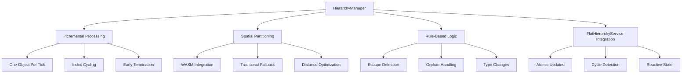

# HierarchyManager (Updated with FlatHierarchyService)

Manages the dynamic hierarchy of celestial objects within the simulation, applying simple rules to maintain realistic orbital parentage and handle escape scenarios using the optimized FlatHierarchyService.

## 🎯 Purpose

The `HierarchyManager` implements a rule-based system for maintaining celestial object hierarchies in n-body simulations. It processes one object per simulation tick to spread computational load and uses centralized WASM spatial partitioning when available for efficient gravitational dominance calculations. The manager now integrates with the [[core/core-state/FlatHierarchyService|FlatHierarchyService]] for optimized hierarchy state management.

## 🏗️ Architecture

The `HierarchyManager` follows a performance-optimized architecture that spreads computational load across frames while maintaining accurate hierarchy management through the flat hierarchy system.



## 🚀 Core Features

### 1. Incremental Processing

- **One Object Per Tick**: Spreads computational load across frames for 60 FPS performance
- **Index Cycling**: Automatically cycles through all objects to ensure complete processing
- **Early Termination**: Skips inactive or invalid objects to maintain efficiency
- **Load Balancing**: Distributes hierarchy updates evenly across simulation ticks

### 2. Spatial Partitioning Integration

- **WASM Integration**: Uses centralized spatial partitioning for O(log n) neighbor queries
- **Automatic Fallback**: Falls back to traditional O(n) methods if WASM fails
- **Distance Optimization**: Type-specific search distances minimize unnecessary calculations
- **Performance Monitoring**: Tracks spatial query performance and optimization

### 3. Rule-Based Hierarchy Management

- **Escape Detection**: Monitors moons and satellites for escape conditions
- **Orphan Handling**: Reassigns parentless objects to appropriate gravitational sources
- **Type Changes**: Automatically updates object types based on orbital behavior
- **Gravitational Dominance**: Uses mass-based calculations for parent selection
- **Cycle Detection**: Prevents invalid hierarchy structures using FlatHierarchyService

### 4. FlatHierarchyService Integration

- **Atomic Updates**: All hierarchy changes are atomic and maintain consistency
- **Cycle Prevention**: Built-in cycle detection prevents invalid parent assignments
- **Reactive State**: Uses RxJS observables for reactive hierarchy updates
- **Performance Optimized**: O(1) lookups for most hierarchy operations
- **State Synchronization**: Maintains consistency between CelestialStore and hierarchy state

## 🔧 Key Methods

### `updateHierarchies(): void`

**Purpose**: Updates the hierarchies of all celestial objects based on established rules.

```typescript
public updateHierarchies(): void
```

**Process:**

1. **Object Selection**: Processes one object per tick using `updateIndex`
2. **Active Filtering**: Only processes active objects (non-destroyed)
3. **Rule Application**: Applies appropriate hierarchy rules based on object type
4. **FlatHierarchyService Updates**: Uses atomic updates via FlatHierarchyService
5. **State Synchronization**: Updates CelestialStore parentId properties

**Performance Characteristics:**

- **Incremental Processing**: One object per tick to maintain 60 FPS
- **Index Cycling**: Automatically cycles through all objects
- **Early Termination**: Skips inactive or invalid objects
- **Atomic Operations**: All hierarchy changes are atomic and consistent

### `initializeHierarchy(): void`

**Purpose**: Initializes the FlatHierarchyService with current celestial objects.

```typescript
public initializeHierarchy(): void
```

**Process:**

1. **Object Retrieval**: Gets all current celestial objects from StateAccessor
2. **Service Initialization**: Calls FlatHierarchyService.initializeFromObjects()
3. **Validation**: Validates hierarchy consistency
4. **Event Emission**: Emits reactive events for UI updates

**Usage:**

```typescript
// Initialize hierarchy when loading a new system
hierarchyManager.initializeHierarchy();
```

## 🔄 Migration from Legacy System

### Before (Old Hierarchy System)

```typescript
// Old inefficient approach
const hierarchy = celestialStore.getHierarchy();
const childIds = hierarchy[parentId] || [];
const objects = celestialStore.getObjects();
const children = childIds.map((id) => objects[id]).filter(Boolean);

// Manual depth calculation
function getDepth(objectId: string): number {
  const object = celestialStore.getObject(objectId);
  if (!object?.parentId) return 0;
  return 1 + getDepth(object.parentId);
}
```

### After (FlatHierarchyService Integration)

```typescript
// New efficient approach
const hierarchyService = FlatHierarchyService.getInstance();
const children = hierarchyService.getChildren(parentId);
const depth = hierarchyService.getDepth(objectId);
const path = hierarchyService.getPath(objectId);
const descendants = hierarchyService.getDescendants(objectId);

// Atomic parent updates with cycle detection
const updateResult = hierarchyService.updateParent("moon", "mars", {
  validate: true,
  emitEvents: true,
});

if (updateResult.success) {
  celestialManager.updateObject("moon", { parentId: "mars" });
} else {
  console.warn("Failed to update parent:", updateResult.error);
}
```

## 🔗 Integration Points

### With FlatHierarchyService

- **Atomic Updates**: Uses FlatHierarchyService.updateParent() for all parent changes
- **Cycle Detection**: Leverages built-in cycle detection to prevent invalid hierarchies
- **State Consistency**: Maintains consistency between CelestialStore and hierarchy state
- **Reactive Updates**: Uses RxJS observables for efficient UI updates

### With CelestialManager

- **Direct Updates**: Updates object parentId properties via CelestialManager
- **State Synchronization**: Ensures both stores remain consistent
- **Event Coordination**: Coordinates updates between hierarchy and object state

### With SimulationOrchestrator

- **Initialization**: Called during simulation startup to initialize hierarchy
- **Reset Handling**: Re-initializes hierarchy after system resets
- **Performance Integration**: Integrates with simulation loop for optimal performance

## 📚 Related Documentation

- [[core/core-state/FlatHierarchyService|FlatHierarchyService]] - Optimized hierarchy state management
- [[app/app-simulation/SimulationOrchestrator|SimulationOrchestrator]] - Main simulation coordinator
- [[core/core-physics/core-physics|Core Physics]] - WASM spatial partitioning service
- [[core/core-state/core-state|Core State]] - State management and celestial manager
- [[data/types/data-types|Data Types]] - CelestialType and object definitions
- [[data/values/data-values|Data Values]] - AU_METERS constant

---

_The HierarchyManager now provides efficient, atomic hierarchy management for celestial objects with cycle detection, reactive updates, and optimized performance through FlatHierarchyService integration._
