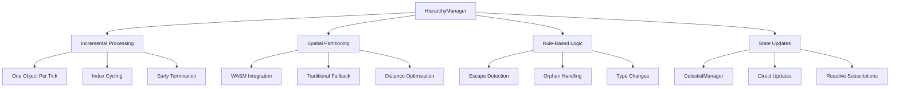
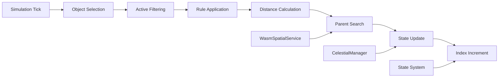

# HierarchyManager

Manages the dynamic hierarchy of celestial objects within the simulation, applying simple rules to maintain realistic orbital parentage and handle escape scenarios.

## 🎯 Purpose

The `HierarchyManager` implements a rule-based system for maintaining celestial object hierarchies in n-body simulations. It processes one object per simulation tick to spread computational load and uses centralized WASM spatial partitioning when available for efficient gravitational dominance calculations.

## 🏗️ Architecture

The `HierarchyManager` follows a performance-optimized architecture that spreads computational load across frames while maintaining accurate hierarchy management.



## 🚀 Core Features

### 1. Incremental Processing

- **One Object Per Tick**: Spreads computational load across frames for 60 FPS performance
- **Index Cycling**: Automatically cycles through all objects to ensure complete processing
- **Early Termination**: Skips inactive or invalid objects to maintain efficiency
- **Load Balancing**: Distributes hierarchy updates evenly across simulation ticks

### 2. Spatial Partitioning Integration

- **WASM Integration**: Uses centralized spatial partitioning for O(log n) neighbor queries
- **Automatic Fallback**: Falls back to traditional O(n) methods if WASM fails
- **Distance Optimization**: Type-specific search distances minimize unnecessary calculations
- **Performance Monitoring**: Tracks spatial query performance and optimization

### 3. Rule-Based Hierarchy Management

- **Escape Detection**: Monitors moons and satellites for escape conditions
- **Orphan Handling**: Reassigns parentless objects to appropriate gravitational sources
- **Type Changes**: Automatically updates object types based on orbital behavior
- **Gravitational Dominance**: Uses mass-based calculations for parent selection

### 4. State Management Integration

- **Direct Updates**: Updates state directly via `celestialManager` for efficiency
- **Reactive Subscriptions**: Relies on reactive state subscriptions for UI updates
- **Event-Free Updates**: Minimizes event overhead by using direct state manipulation
- **Consistency**: Ensures state consistency across all hierarchy changes

## Hierarchy Rules

### Core Principles

- **Main Star**: The largest star serves as the system root
- **Binary Systems**: Other stars can orbit the main star
- **Planetary Systems**: Celestials (planets, gas giants, comets, asteroids) orbit stars
- **Satellite Systems**: Moons orbit planets/gas giants
- **Dynamic Reassignment**: Objects can change parents based on gravitational dominance

### Escape Scenarios

#### Moon Escape (> 0.1 AU)

When a moon moves more than 0.1 AU from its parent:

- **Type Change**: Moon → Dwarf Planet
- **Parent Reassignment**: Finds new parent via gravitational dominance
- **Threshold**: 0.1 AU (1.496×10¹⁰ meters)

#### Satellite Escape (> 0.05 AU)

When a satellite moves more than 0.05 AU from its parent:

- **Type Change**: Satellite → Asteroid
- **Parent Reassignment**: Finds new parent via gravitational dominance
- **Threshold**: 0.05 AU (7.48×10⁹ meters)

#### Orphaned Objects

When an object's parent is destroyed or removed:

- **Automatic Reassignment**: Finds new parent via gravitational dominance
- **Status Preservation**: Maintains object type and properties
- **Immediate Processing**: Handled as soon as parent removal is detected

## Architecture

### Performance Optimization

```typescript
export class HierarchyManager {
  private updateIndex = 0;
  private wasmSpatialService: WasmSpatialService;

  public updateHierarchies(): void {
    // Process one object per tick to spread computational load
    const objectId = objectIds[this.updateIndex];
    // ... process single object
    this.updateIndex++;
  }
}
```

### Spatial Partitioning Integration

The manager uses centralized WASM spatial partitioning for efficient neighbor queries:

```typescript
private findBestParent(child: CelestialObject, childState: PhysicsStateReal): CelestialObject | null {
  if (!this.wasmSpatialService.isInitialized()) {
    return this.findBestParentTraditional(child, childState, allObjects, allPhysicsStates);
  }

  // Use WASM spatial partitioning for O(log n) performance
  const nearbyBodies = this.wasmSpatialService.findBodiesInRange(
    childState.position_m,
    searchDistance
  );
}
```

## API Reference

### Main Interface

#### `updateHierarchies(): void`

Updates the hierarchies of all celestial objects based on established rules.

**Process:**

1. **Object Selection**: Processes one object per tick using `updateIndex`
2. **Active Filtering**: Only processes active objects (non-destroyed)
3. **Rule Application**: Applies appropriate hierarchy rules based on object type
4. **State Updates**: Updates object properties via `celestialManager`

**Performance Characteristics:**

- **Incremental Processing**: One object per tick to maintain 60 FPS
- **Index Cycling**: Automatically cycles through all objects
- **Early Termination**: Skips inactive or invalid objects

### Internal Methods

#### `handleObjectHierarchy(obj, physicsState, allObjects, allPhysicsStates): void`

Main hierarchy handler that applies rules based on object type.

**Object Type Handling:**

- **Stars**: Skipped (maintain their hierarchy)
- **Moons**: Check for escape conditions
- **Satellites**: Check for escape conditions
- **Other Objects**: Check for orphaned status

#### `handleMoonEscape(obj, physicsState, allObjects, allPhysicsStates): void`

Handles moon escape scenarios with 0.1 AU threshold.

**Process:**

1. **Distance Calculation**: Computes distance to parent using `OSVector3.distanceTo()`
2. **Threshold Check**: Compares against 0.1 AU (1.496×10¹⁰ meters)
3. **Type Change**: Updates to `CelestialType.DWARF_PLANET`
4. **Parent Reassignment**: Finds new parent via gravitational dominance

#### `handleSatelliteEscape(obj, physicsState, allObjects, allPhysicsStates): void`

Handles satellite escape scenarios with 0.05 AU threshold.

**Process:**

1. **Distance Calculation**: Computes distance to parent
2. **Threshold Check**: Compares against 0.05 AU (7.48×10⁹ meters)
3. **Type Change**: Updates to `CelestialType.ASTEROID`
4. **Parent Reassignment**: Finds new parent via gravitational dominance

#### `handleOrphanedObject(obj, physicsState, allObjects, allPhysicsStates): void`

Handles objects whose parents have been destroyed or removed.

**Process:**

1. **Parent Validation**: Checks if parent exists and is active
2. **Orphan Detection**: Identifies objects with missing/inactive parents
3. **Reassignment**: Finds new parent via gravitational dominance
4. **State Update**: Updates parent relationship without type change

## Gravitational Dominance Calculation

### WASM Spatial Partitioning (Preferred)

```typescript
private findBestParent(child: CelestialObject, childState: PhysicsStateReal): CelestialObject | null {
  // Update centralized WASM spatial service
  this.wasmSpatialService.update(allPhysicsStates);

  // Find nearby bodies using spatial partitioning
  const searchDistance = this.getSearchDistance(child);
  const nearbyBodies = this.wasmSpatialService.findBodiesInRange(
    childState.position_m,
    searchDistance
  );

  // Calculate gravitational force for each nearby body
  for (const nearbyId of nearbyBodies) {
    const force = potentialParent.realMass_kg / distanceSq;
    if (force > maxForce) {
      maxForce = force;
      bestParent = potentialParent;
    }
  }
}
```

### Traditional Method (Fallback)

```typescript
private findBestParentTraditional(child: CelestialObject, childState: PhysicsStateReal): CelestialObject | null {
  // Iterate through all active objects
  for (const potentialParentId in activeObjects) {
    const distanceVec = childState.position_m.clone().sub(parentState.position_m);
    const distanceSq = distanceVec.lengthSq();
    const force = potentialParent.realMass_kg / distanceSq;

    if (force > maxForce) {
      maxForce = force;
      bestParent = potentialParent;
    }
  }
}
```

## Search Distance Configuration

The manager uses type-specific search distances for efficient gravitational influence calculations:

```typescript
private getSearchDistance(obj: CelestialObject): number {
  switch (obj.type) {
    case CelestialType.STAR:
      return 1000 * AU_METERS; // 1000 AU - stars influence at great distances
    case CelestialType.GAS_GIANT:
      return 100 * AU_METERS;  // 100 AU - gas giants have strong influence
    case CelestialType.PLANET:
      return 10 * AU_METERS;   // 10 AU - planets influence nearby objects
    case CelestialType.DWARF_PLANET:
      return 10 * AU_METERS;   // 10 AU - similar to planets
    case CelestialType.MOON:
      return 1 * AU_METERS;    // 1 AU - moons typically stay close
    case CelestialType.SATELLITE:
      return 10e6;             // 10 Mm - satellites stay very close
    case CelestialType.COMET:
      return 100 * AU_METERS;  // 100 AU - comets can have wide orbits
    case CelestialType.ASTEROID:
      return 10 * AU_METERS;   // 10 AU - asteroids within planetary systems
    default:
      return 10 * AU_METERS;   // 10 AU default
  }
}
```

## Performance Optimizations

### Incremental Processing

- **One Object Per Tick**: Spreads computational load across frames
- **Index Cycling**: Ensures all objects are eventually processed
- **Early Termination**: Skips inactive objects immediately

### Spatial Partitioning

- **WASM Integration**: Uses centralized spatial partitioning for O(log n) queries
- **Automatic Fallback**: Falls back to traditional O(n) methods if WASM fails
- **Distance Optimization**: Type-specific search distances minimize unnecessary calculations

### State Management

- **Active Object Filtering**: Uses pre-filtered active objects for efficiency
- **Direct State Updates**: Updates state directly via `celestialManager`
- **Event-Free Updates**: Relies on reactive state subscriptions for UI updates

## Error Handling

### WASM Service Fallback

```typescript
try {
  this.wasmSpatialService.update(allPhysicsStates);
  const nearbyBodies = this.wasmSpatialService.findBodiesInRange(/*...*/);
} catch (error) {
  console.warn(
    "[HierarchyManager] WASM spatial partitioning failed, falling back:",
    error,
  );
  return this.findBestParentTraditional(/*...*/);
}
```

### Validation Checks

- **Object Existence**: Validates objects exist before processing
- **Physics State**: Ensures physics states are available
- **Active Status**: Only processes active (non-destroyed) objects
- **Distance Validation**: Prevents division by zero in force calculations

## Integration Examples

### Basic Usage

```typescript
import { HierarchyManager } from "@teskooano/app-simulation";

const hierarchyManager = new HierarchyManager();

// Called once per simulation tick
hierarchyManager.updateHierarchies();
```

### Integration with Simulation Loop

```typescript
// In SimulationOrchestrator
private updateHierarchies(): void {
  const simulationConfig = coreSimulationManager.getSimulationState().simulationConfig;
  if (simulationConfig.mode !== "ideal") {
    this.hierarchyManager.updateHierarchies();
  }
}
```

### Monitoring Hierarchy Changes

```typescript
// Listen for celestial object changes
celestialObjects$.subscribe((objects) => {
  // UI automatically updates when hierarchy changes
  updateHierarchyDisplay(objects);
});
```

## Configuration Constants

### Escape Thresholds

- **Moon Escape**: 0.1 AU (1.496×10¹⁰ meters)
- **Satellite Escape**: 0.05 AU (7.48×10⁹ meters)

### Search Distances

- **Stars**: 1000 AU (1.496×10¹⁴ meters)
- **Gas Giants**: 100 AU (1.496×10¹³ meters)
- **Planets/Dwarf Planets**: 10 AU (1.496×10¹² meters)
- **Moons**: 1 AU (1.496×10¹¹ meters)
- **Satellites**: 10 Mm (1×10⁷ meters)
- **Comets**: 100 AU (1.496×10¹³ meters)
- **Asteroids**: 10 AU (1.496×10¹² meters)

## 🔄 Data Flow

The HierarchyManager follows a systematic data flow for processing hierarchy updates:



### Processing Pipeline

1. **Simulation Tick**: Called once per simulation frame
2. **Object Selection**: Selects one object using `updateIndex`
3. **Active Filtering**: Filters out inactive or destroyed objects
4. **Rule Application**: Applies appropriate hierarchy rules based on object type
5. **Distance Calculation**: Calculates distance to current parent
6. **Parent Search**: Finds new parent if escape conditions are met
7. **State Update**: Updates object properties via `celestialManager`
8. **Index Increment**: Advances to next object for next tick

## 📊 Technical Specifications

### Interface Definition

```typescript
interface HierarchyManager {
  updateHierarchies(): void;
}
```

### Configuration Constants

```typescript
interface HierarchyConfig {
  escapeThresholds: {
    moon: number; // 0.1 AU
    satellite: number; // 0.05 AU
  };
  searchDistances: {
    star: number; // 1000 AU
    gasGiant: number; // 100 AU
    planet: number; // 10 AU
    moon: number; // 1 AU
    satellite: number; // 10 Mm
  };
}
```

## 💡 Usage Examples

### Basic Usage

```typescript
import { HierarchyManager } from "@teskooano/app-simulation";

const hierarchyManager = new HierarchyManager();

// Called once per simulation tick
hierarchyManager.updateHierarchies();
```

### Integration with Simulation Loop

```typescript
// In SimulationOrchestrator
private updateHierarchies(): void {
  const simulationConfig = coreSimulationManager.getSimulationState().simulationConfig;
  if (simulationConfig.mode !== "ideal") {
    this.hierarchyManager.updateHierarchies();
  }
}
```

### Monitoring Hierarchy Changes

```typescript
// Listen for celestial object changes
celestialObjects$.subscribe((objects) => {
  // UI automatically updates when hierarchy changes
  updateHierarchyDisplay(objects);
});
```

## ⚡ Performance Considerations

### Efficiency

- **Incremental Processing**: One object per tick to maintain 60 FPS
- **WASM Integration**: O(log n) spatial queries vs O(n) traditional methods
- **Early Termination**: Skips inactive objects immediately
- **Distance Optimization**: Type-specific search distances minimize calculations

### Quality Metrics

- **Frame Rate**: Maintains 60 FPS with incremental processing
- **Accuracy**: Gravitational dominance calculations ensure realistic hierarchies
- **Consistency**: State updates maintain data integrity
- **Scalability**: Performance scales with object count using spatial partitioning

### Performance Monitoring

- **Spatial Query Performance**: Tracks WASM vs traditional method performance
- **Processing Time**: Monitors time per object for optimization
- **Memory Usage**: Efficient object reuse and minimal allocation
- **State Update Frequency**: Optimized update patterns

## 🔌 Integration Points

### Core Physics Integration

- **WasmSpatialService**: Centralized spatial partitioning for performance
- **SimulationManager**: Core physics simulation coordination
- **Two-Body Systems**: Gravitational force calculations
- **Orbital Mechanics**: Distance and force calculations

### State Management Integration

- **CelestialManager**: Direct state updates for efficiency
- **PhysicsSystemAdapter**: State synchronization
- **SimulationStore**: Configuration and state management
- **StateSubscriptionMixin**: Reactive state updates

### Data Types Integration

- **CelestialObject**: Object definitions and properties
- **PhysicsStateReal**: Position and velocity vectors
- **CelestialType**: Object type definitions
- **AU_METERS**: Distance constants

## 🐛 Debug Features

### Validation

- **Object Existence**: Validates objects exist before processing
- **Physics State**: Ensures physics states are available
- **Active Status**: Only processes active (non-destroyed) objects
- **Distance Validation**: Prevents division by zero in calculations

### Monitoring

- **Performance Monitoring**: Tracks processing time per object
- **Error Monitoring**: Comprehensive error handling and fallback mechanisms
- **Usage Monitoring**: Tracks hierarchy update frequency
- **Health Monitoring**: WASM service health checks

### Debugging Tools

- **WASM Service Fallback**: Automatic fallback to traditional methods
- **Distance Logging**: Logs distance calculations for debugging
- **Parent Change Tracking**: Tracks parent reassignments
- **State Inspection**: Access to internal state for debugging

## 🔮 Future Enhancements

### Optimization Opportunities

- **Performance Optimization**: Further WASM optimizations and spatial partitioning improvements
- **Memory Optimization**: Advanced memory management strategies and object pooling
- **Algorithm Optimization**: Improved gravitational dominance calculations and distance metrics
- **Architecture Optimization**: Enhanced modular architecture and rule system separation

### Potential Improvements

- **Advanced Hierarchy Rules**: More sophisticated parent selection algorithms based on orbital mechanics
- **Multi-Threading**: Web Workers for parallel hierarchy processing
- **Advanced Spatial Partitioning**: Enhanced spatial data structures for better performance
- **Real-Time Analytics**: Hierarchy change analytics and reporting capabilities

## 📚 Related Documentation

- [[SimulationOrchestrator]] - Main simulation coordinator
- [[@teskooano/core-physics]] - WASM spatial partitioning service
- [[@teskooano/core-state]] - State management and celestial manager
- [[@teskooano/data-types]] - CelestialType and object definitions
- [[@teskooano/data-values]] - AU_METERS constant
