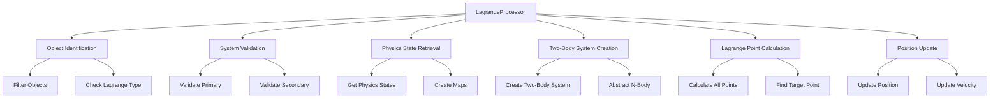
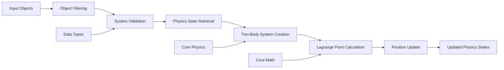

# LagrangeProcessor

Utility for processing celestial objects designated to be at Lagrange points, calculating their initial positions and velocities based on the gravitational dynamics of their parent system.

## 🎯 Purpose

The `LagrangeProcessor` handles the special case of objects that are positioned at Lagrange points (L1, L2, L3, L4, L5) in a two-body system. These points represent stable or semi-stable orbital positions where gravitational forces balance out, allowing objects to maintain their relative positions.

## 🏗️ Architecture

The `LagrangeProcessor` follows a utility-based architecture that processes Lagrange point objects during simulation initialization.



## Lagrange Points

### L1 (First Lagrange Point)

- **Location**: Between the primary and secondary body
- **Stability**: Unstable (requires station-keeping)
- **Use Case**: Space telescopes, solar observatories
- **Example**: SOHO spacecraft at Sun-Earth L1

### L2 (Second Lagrange Point)

- **Location**: Beyond the secondary body, opposite the primary
- **Stability**: Unstable (requires station-keeping)
- **Use Case**: Space telescopes, deep space missions
- **Example**: James Webb Space Telescope at Sun-Earth L2

### L3 (Third Lagrange Point)

- **Location**: Beyond the primary body, opposite the secondary
- **Stability**: Unstable (requires station-keeping)
- **Use Case**: Theoretical missions, science fiction
- **Example**: Rarely used in practice

### L4 (Fourth Lagrange Point)

- **Location**: 60° ahead of the secondary body in its orbit
- **Stability**: Stable (natural equilibrium)
- **Use Case**: Trojan asteroids, space colonies
- **Example**: Jupiter's Trojan asteroids

### L5 (Fifth Lagrange Point)

- **Location**: 60° behind the secondary body in its orbit
- **Stability**: Stable (natural equilibrium)
- **Use Case**: Trojan asteroids, space colonies
- **Example**: Jupiter's Trojan asteroids

### Implementation Details

### Core Function

```typescript
export function processLagrangeObjects(
  celestialObjects: Map<string, CelestialObject>,
  physicsStates: Map<string, PhysicsStateReal>,
): void;
```

### Processing Pipeline

1. **Object Identification**: Finds objects with `lagrangePointType` property
2. **System Validation**: Ensures primary and secondary objects exist
3. **Physics State Retrieval**: Gets current positions and velocities
4. **Two-Body System Creation**: Creates simplified two-body system
5. **Lagrange Point Calculation**: Computes all five Lagrange points
6. **Position Update**: Updates object's physics state with calculated position

## API Reference

### Main Function

#### `processLagrangeObjects(celestialObjects, physicsStates): void`

Processes all celestial objects designated to be at Lagrange points.

**Parameters:**

- `celestialObjects`: Map of all celestial object definitions
- `physicsStates`: Map of physics states (mutated during processing)

**Process:**

1. **Iteration**: Loops through all celestial objects
2. **Filtering**: Identifies objects with `lagrangePointType` property
3. **Validation**: Ensures required parent and target objects exist
4. **Calculation**: Computes Lagrange point positions and velocities
5. **Update**: Modifies physics state with calculated values

**Usage:**

```typescript
import { processLagrangeObjects } from "@teskooano/app-simulation";

const celestialObjectsMap = new Map(Object.entries(allCelestialObjects));
const physicsStatesMap = new Map<string, PhysicsStateReal>();

// Populate physics states map
for (const state of activeBodiesArray) {
  physicsStatesMap.set(state.id, state);
}

// Process Lagrange point objects
processLagrangeObjects(celestialObjectsMap, physicsStatesMap);
```

### Object Validation

```typescript
celestialObjects.forEach((obj) => {
  if (!obj.orbit.lagrangePointType) {
    return; // Skip objects not at Lagrange points
  }

  if (obj.parentId && obj.lagrangePointTargetId) {
    const primaryObject = celestialObjects.get(obj.parentId);
    const secondaryObject = celestialObjects.get(obj.lagrangePointTargetId);

    if (!primaryObject || !secondaryObject) {
      console.warn(`[LagrangeProcessor] Missing objects for ${obj.id}`);
      return;
    }
  }
});
```

### Two-Body System Creation

```typescript
const realTwoBodySystem = createTwoBodySystem(
  primaryPhysicsState,
  secondaryPhysicsState,
);
```

The `createTwoBodySystem` function from `@teskooano/core-physics` creates a simplified two-body system for Lagrange point calculations, abstracting away the complex n-body dynamics.

### Lagrange Point Calculation

```typescript
const realLagrangePoints = calculateAllLagrangePoints(realTwoBodySystem);
const realLPoint = realLagrangePoints.find(
  (lp) => lp.id === obj.orbit.lagrangePointType,
);
```

The `calculateAllLagrangePoints` function computes all five Lagrange points for the two-body system, returning positions and velocities for each point.

### Physics State Update

```typescript
if (realLPoint) {
  const targetPhysicsState = physicsStates.get(obj.id);
  if (targetPhysicsState) {
    targetPhysicsState.position_m = realLPoint.position_m.clone();
    targetPhysicsState.velocity_mps =
      realLPoint.velocity_mps?.clone() ?? new OSVector3(0, 0, 0);
  }
}
```

## Celestial Object Configuration

### Required Properties

For an object to be processed as a Lagrange point object, it must have:

```typescript
interface CelestialObject {
  id: string;
  parentId: string; // Primary body (e.g., Sun)
  lagrangePointTargetId: string; // Secondary body (e.g., Earth)
  orbit: {
    lagrangePointType: LagrangePointType; // L1, L2, L3, L4, or L5
    // ... other orbital properties
  };
  // ... other properties
}
```

### Example Configuration

```typescript
const jamesWebbTelescope: CelestialObject = {
  id: "james-webb-telescope",
  name: "James Webb Space Telescope",
  type: CelestialType.SATELLITE,
  parentId: "sun", // Primary: Sun
  lagrangePointTargetId: "earth", // Secondary: Earth
  orbit: {
    lagrangePointType: LagrangePointType.L2, // Sun-Earth L2
    // ... other orbital properties
  },
  // ... other properties
};
```

## Integration with Simulation

### Timing

The Lagrange processor is called during the simulation initialization phase:

```typescript
// In SimulationOrchestrator
private processLagrangeObjects(): void {
  const activeBodiesArray = physicsSystemAdapter.getPhysicsBodies();
  const allCelestialObjects = physicsSystemAdapter.getCelestialObjectsSnapshot();

  const celestialObjectsMap = new Map(Object.entries(allCelestialObjects));
  const physicsStatesMap = new Map<string, PhysicsStateReal>();

  for (const state of activeBodiesArray) {
    physicsStatesMap.set(state.id, state);
  }

  processLagrangeObjects(celestialObjectsMap, physicsStatesMap);
}
```

### Processing Order

1. **System Initialization**: All celestial objects and basic physics states created
2. **Lagrange Processing**: Lagrange point objects positioned correctly
3. **Simulation Start**: Main physics loop begins with correct initial conditions

## Error Handling

### Missing Objects

```typescript
if (!primaryObject) {
  console.warn(
    `[LagrangeProcessor] Primary object '${obj.parentId}' not found for Lagrange-bound object '${obj.id}'. Skipping.`,
  );
  return;
}
```

### Missing Physics States

```typescript
if (!primaryPhysicsState || !secondaryPhysicsState) {
  console.warn(
    `[LagrangeProcessor] Physics states not fully available for Lagrange calculation for '${obj.id}'. Skipping.`,
  );
  return;
}
```

### Missing Lagrange Point

```typescript
if (!realLPoint) {
  console.warn(
    `[LagrangeProcessor] Lagrange point '${obj.orbit.lagrangePointType}' not calculated for '${obj.id}'.`,
  );
}
```

### Real-World Examples

### Sun-Earth System

```typescript
// SOHO spacecraft at Sun-Earth L1
const soho: CelestialObject = {
  id: "soho",
  parentId: "sun",
  lagrangePointTargetId: "earth",
  orbit: { lagrangePointType: LagrangePointType.L1 },
};

// James Webb Space Telescope at Sun-Earth L2
const jwst: CelestialObject = {
  id: "jwst",
  parentId: "sun",
  lagrangePointTargetId: "earth",
  orbit: { lagrangePointType: LagrangePointType.L2 },
};
```

### Jupiter System

```typescript
// Trojan asteroid at Jupiter-Sun L4
const trojanAsteroid: CelestialObject = {
  id: "trojan-asteroid",
  parentId: "sun",
  lagrangePointTargetId: "jupiter",
  orbit: { lagrangePointType: LagrangePointType.L4 },
};
```

### Mathematical Background

### Lagrange Point Calculation

The Lagrange points are calculated using the restricted three-body problem, where:

- **Primary Mass**: Large central body (e.g., Sun)
- **Secondary Mass**: Smaller orbiting body (e.g., Earth)
- **Test Mass**: Object at Lagrange point (negligible mass)

### Stability Analysis

- **L1, L2, L3**: Unstable equilibrium points requiring station-keeping
- **L4, L5**: Stable equilibrium points where objects can remain naturally

### Coordinate System

- **Barycentric**: Centered on the system's center of mass
- **Co-rotating**: Rotates with the secondary body's orbital period
- **Normalized**: Scaled by the distance between primary and secondary

## 🚀 Core Features

### 1. Lagrange Point Processing

- **Five Point Support**: Handles L1, L2, L3, L4, L5 Lagrange points
- **Two-Body System Abstraction**: Simplifies complex n-body dynamics
- **Real-World Applications**: Supports space telescopes, Trojan asteroids, space colonies
- **Stability Analysis**: Distinguishes between stable and unstable equilibrium points

### 2. System Validation

- **Object Existence**: Validates primary and secondary objects exist
- **Physics State**: Ensures physics states are available for calculations
- **Configuration Validation**: Checks for proper Lagrange point configuration
- **Error Handling**: Comprehensive error handling with graceful fallbacks

### 3. Physics Integration

- **Core Physics Integration**: Uses `@teskooano/core-physics` for calculations
- **Two-Body System Creation**: Creates simplified systems for Lagrange calculations
- **Position Calculation**: Computes accurate Lagrange point positions
- **Velocity Calculation**: Calculates appropriate velocities for orbital mechanics

### 4. Performance Optimization

- **Single Pass Processing**: Processes all Lagrange objects in one iteration
- **Early Exit**: Skips objects without Lagrange point designation
- **Memory Efficiency**: Reuses existing physics state objects
- **Vector Cloning**: Properly handles OSVector3 object cloning

## 🔄 Data Flow

The LagrangeProcessor follows a systematic data flow for processing Lagrange point objects:



### Processing Pipeline

1. **Input Objects**: Receives celestial objects and physics states
2. **Object Filtering**: Filters objects with Lagrange point designation
3. **System Validation**: Validates primary and secondary objects exist
4. **Physics State Retrieval**: Gets current positions and velocities
5. **Two-Body System Creation**: Creates simplified two-body system
6. **Lagrange Point Calculation**: Computes all five Lagrange points
7. **Position Update**: Updates physics state with calculated position
8. **Updated Physics States**: Returns modified physics states

## 📊 Technical Specifications

### Function Signature

```typescript
function processLagrangeObjects(
  celestialObjects: Map<string, CelestialObject>,
  physicsStates: Map<string, PhysicsStateReal>,
): void;
```

### Required Object Properties

```typescript
interface LagrangeObject {
  id: string;
  parentId: string; // Primary body (e.g., Sun)
  lagrangePointTargetId: string; // Secondary body (e.g., Earth)
  orbit: {
    lagrangePointType: LagrangePointType; // L1, L2, L3, L4, or L5
  };
}
```

### Lagrange Point Types

```typescript
enum LagrangePointType {
  L1 = "L1", // Between primary and secondary
  L2 = "L2", // Beyond secondary, opposite primary
  L3 = "L3", // Beyond primary, opposite secondary
  L4 = "L4", // 60° ahead of secondary
  L5 = "L5", // 60° behind secondary
}
```

## 💡 Usage Examples

### Basic Usage

```typescript
import { processLagrangeObjects } from "@teskooano/app-simulation";

const celestialObjectsMap = new Map(Object.entries(allCelestialObjects));
const physicsStatesMap = new Map<string, PhysicsStateReal>();

// Populate physics states map
for (const state of activeBodiesArray) {
  physicsStatesMap.set(state.id, state);
}

// Process Lagrange point objects
processLagrangeObjects(celestialObjectsMap, physicsStatesMap);
```

### Real-World Configuration

```typescript
// James Webb Space Telescope at Sun-Earth L2
const jwst: CelestialObject = {
  id: "james-webb-telescope",
  name: "James Webb Space Telescope",
  type: CelestialType.SATELLITE,
  parentId: "sun", // Primary: Sun
  lagrangePointTargetId: "earth", // Secondary: Earth
  orbit: {
    lagrangePointType: LagrangePointType.L2, // Sun-Earth L2
  },
};

// SOHO spacecraft at Sun-Earth L1
const soho: CelestialObject = {
  id: "soho",
  name: "SOHO Spacecraft",
  type: CelestialType.SATELLITE,
  parentId: "sun",
  lagrangePointTargetId: "earth",
  orbit: {
    lagrangePointType: LagrangePointType.L1, // Sun-Earth L1
  },
};
```

### Integration with Simulation

```typescript
// In SimulationOrchestrator
private processLagrangeObjects(): void {
  const activeBodiesArray = physicsSystemAdapter.getPhysicsBodies();
  const allCelestialObjects = physicsSystemAdapter.getCelestialObjectsSnapshot();

  const celestialObjectsMap = new Map(Object.entries(allCelestialObjects));
  const physicsStatesMap = new Map<string, PhysicsStateReal>();

  for (const state of activeBodiesArray) {
    physicsStatesMap.set(state.id, state);
  }

  processLagrangeObjects(celestialObjectsMap, physicsStatesMap);
}
```

## ⚡ Performance Considerations

### Efficiency

- **Single Pass Processing**: Processes all Lagrange objects in one iteration
- **Early Exit**: Skips objects without Lagrange point designation
- **Minimal Validation**: Only validates necessary objects
- **Object Reuse**: Reuses existing physics state objects

### Quality Metrics

- **Accuracy**: Uses precise two-body system calculations
- **Reliability**: Comprehensive error handling and validation
- **Consistency**: Consistent processing across all Lagrange objects
- **Scalability**: Performance scales with number of Lagrange objects

### Performance Monitoring

- **Processing Time**: Tracks time per Lagrange object
- **Memory Usage**: Efficient object reuse and minimal allocation
- **Error Rate**: Monitors validation failures
- **Success Rate**: Tracks successful Lagrange point calculations

## 🔌 Integration Points

### Core Physics Integration

- **createTwoBodySystem**: Creates simplified two-body systems
- **calculateAllLagrangePoints**: Computes all five Lagrange points
- **Two-Body Systems**: Abstracts complex n-body dynamics
- **Orbital Mechanics**: Advanced gravitational calculations

### Core Math Integration

- **OSVector3**: Position and velocity vector operations
- **Vector Cloning**: Proper object cloning to avoid reference issues
- **Mathematical Operations**: Distance and force calculations
- **Coordinate Systems**: Barycentric and co-rotating frames

### Data Types Integration

- **CelestialObject**: Object definitions and properties
- **PhysicsStateReal**: Position and velocity vectors
- **LagrangePointType**: L1, L2, L3, L4, L5 designations
- **Type Definitions**: Comprehensive type safety

## 🐛 Debug Features

### Validation

- **Object Existence**: Validates primary and secondary objects exist
- **Physics State**: Ensures physics states are available
- **Configuration**: Validates Lagrange point configuration
- **Data Integrity**: Checks for proper object properties

### Monitoring

- **Processing Monitoring**: Tracks processing success/failure
- **Error Monitoring**: Comprehensive error logging
- **Usage Monitoring**: Tracks Lagrange object processing
- **Health Monitoring**: Validates system state

### Debugging Tools

- **Error Logging**: Detailed error messages for debugging
- **State Inspection**: Access to internal state for debugging
- **Validation Logging**: Logs validation failures
- **Processing Logging**: Tracks processing steps

## 🔮 Future Enhancements

### Optimization Opportunities

- **Performance Optimization**: Further processing optimizations and batch processing improvements
- **Memory Optimization**: Advanced memory management strategies and object reuse
- **Algorithm Optimization**: Improved Lagrange point calculations and two-body system handling
- **Code Optimization**: Additional algorithmic improvements for physics calculations

### Potential Improvements

- **Multi-Body Systems**: Support for three-body and n-body Lagrange point calculations
- **Real-Time Updates**: Dynamic Lagrange point position updates during simulation
- **Advanced Analytics**: Lagrange point stability analysis and orbital mechanics insights
- **Data Export**: Comprehensive Lagrange point data export capabilities

## 📚 Related Documentation

- [[app/app-simulation/SimulationOrchestrator|SimulationOrchestrator]] - Main simulation coordinator that calls this processor
- [[core/core-physics/core-physics|Core Physics]] - Provides `createTwoBodySystem` and `calculateAllLagrangePoints`
- [[core/math/core-math|Core Math]] - OSVector3 for position and velocity vectors
- [[data/types/data-types|Data Types]] - CelestialObject and LagrangePointType definitions
