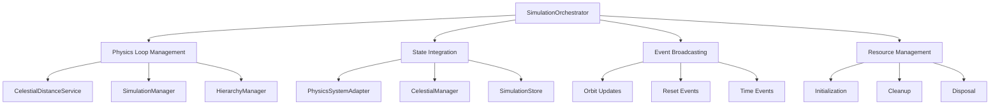
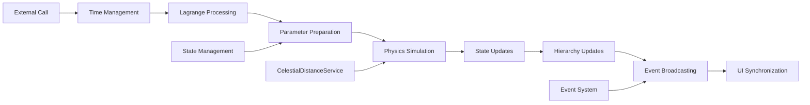

# SimulationOrchestrator

Singleton orchestrator that manages the overall simulation lifecycle, physics loop, state integration, and event broadcasting for the Open Space engine.

## 🎯 Purpose

The `SimulationOrchestrator` serves as the central coordination hub for the simulation system, integrating the physics engine (`@teskooano/core-physics`), state management (`@teskooano/core-state`), and spatial partitioning services. It provides a clean API for controlling simulation lifecycle while handling complex internal coordination between subsystems.

## 🏗️ Architecture

The `SimulationOrchestrator` follows a singleton pattern with comprehensive subsystem integration for managing complex simulation workflows.



## 🚀 Core Features

### 1. Physics Loop Management

- **Time Integration**: Manages simulation time vs real time with proper scaling
- **Physics Coordination**: Integrates WASM-based physics simulation with state management
- **Performance Optimization**: Uses centralized spatial partitioning for efficient calculations
- **Event Broadcasting**: Emits orbit updates and reset events for UI synchronization

### 2. State Integration

- **Bidirectional Data Flow**: Reads from and writes to centralized state stores
- **Parameter Preparation**: Converts state data into physics simulation parameters
- **Result Processing**: Updates state with physics simulation results
- **Lagrange Point Processing**: Handles special orbital mechanics for Lagrange point objects

### 3. Hierarchy Management

- **Dynamic Parentage**: Updates celestial object hierarchies based on gravitational dominance
- **Escape Detection**: Monitors moons and satellites for escape conditions
- **Orphan Handling**: Reassigns parentless objects to appropriate gravitational sources

### 4. Resource Management

- **Initialization**: Proper service startup and configuration
- **Cleanup**: Resource disposal and memory management
- **Disposal**: Complete system shutdown and cleanup

## 🔄 Data Flow

The SimulationOrchestrator follows a systematic data flow for processing physics updates:



### Processing Pipeline

1. **External Call**: Physics callback receives delta time
2. **Time Management**: Tracks real time and applies scaling
3. **Lagrange Processing**: Updates Lagrange point objects
4. **Parameter Preparation**: Converts state to physics parameters
5. **Physics Simulation**: Runs core physics calculations
6. **State Updates**: Updates state with simulation results
7. **Hierarchy Updates**: Updates object hierarchies
8. **Event Broadcasting**: Emits events for UI updates
9. **UI Synchronization**: Updates user interface

## 📊 Technical Specifications

### Interface Definition

```typescript
interface SimulationOrchestrator {
  startLoop(): Promise<void>;
  stopLoop(): void;
  isLoopRunning: boolean;
  createPhysicsCallback(): (deltaTime: number) => void;
  resetSystem(skipStateClear?: boolean): void;
  resetTime(): void;
  dispose(): void;
  onResetTime$: Observable<void>;
  onOrbitUpdate$: Observable<OrbitUpdatePayload>;
}
```

### Event System

The orchestrator provides two main event streams:

#### `onResetTime$: Observable<void>`

Emitted when simulation time is reset to zero, typically during system changes or manual resets.

#### `onOrbitUpdate$: Observable<OrbitUpdatePayload>`

Emitted after each physics step with updated positions of all celestial objects.

## API Reference

### Lifecycle Management

#### `startLoop(): Promise<void>`

Initializes and starts the simulation loop with proper service initialization.

**Process:**

1. Disposes of existing simulation manager and subscriptions
2. Resets time tracking for proper simulation scaling
3. Initializes the core simulation manager (which initializes WASM components)
4. Sets up state subscriptions for reactive updates
5. Enables the main simulation loop

**Usage:**

```typescript
await simulationOrchestrator.startLoop();
```

#### `stopLoop(): void`

Stops the simulation loop and cleans up resources.

**Process:**

1. Stops the main simulation loop
2. Disposes of state subscriptions
3. Maintains service instances for potential restart

#### `isLoopRunning: boolean`

Read-only property indicating whether the simulation loop is currently active.

### Physics Integration

#### `createPhysicsCallback(): (deltaTime: number) => void`

Creates a physics callback function that can be integrated with external animation loops.

**Returns:** A callback function that performs one complete physics simulation step.

**Process:**

1. **Time Management**: Tracks real time and applies time scaling
2. **Lagrange Processing**: Updates Lagrange point objects
3. **Parameter Preparation**: Converts state to physics parameters
4. **Physics Simulation**: Runs the core physics step
5. **State Update**: Updates state with simulation results
6. **Hierarchy Update**: Updates object hierarchies (non-ideal modes only)
7. **Event Emission**: Broadcasts orbit updates

**Usage:**

```typescript
const physicsCallback = simulationOrchestrator.createPhysicsCallback();

// In animation loop
requestAnimationFrame((timestamp) => {
  const deltaTime = (timestamp - lastTimestamp) / 1000;
  physicsCallback(deltaTime);
  lastTimestamp = timestamp;
});
```

### System Management

#### `resetSystem(skipStateClear?: boolean): void`

Resets the simulation system, clearing celestial objects and optionally preserving state.

**Parameters:**

- `skipStateClear`: If true, preserves state for chaining with system initializers

**Process:**

1. Clears celestial objects (unless skipped)
2. Resets simulation time to zero
3. Emits `onResetTime` event
4. Maintains simulation configuration

**Usage:**

```typescript
// Full reset
simulationOrchestrator.resetSystem();

// Reset with state preservation (for system loading)
simulationOrchestrator.resetSystem(true);
initializeSolarSystem();
```

#### `resetTime(): void`

Emits a time reset event without clearing the system state.

**Usage:**

```typescript
simulationOrchestrator.resetTime();
```

### Resource Management

#### `dispose(): void`

Cleans up all resources and stops the simulation.

**Process:**

1. Stops the simulation loop
2. Completes event streams
3. Disposes of subscriptions
4. Cleans up internal resources

### Internal Architecture

### Time Management

The orchestrator maintains sophisticated time tracking:

```typescript
private lastRealTime: number = 0;

// In physics callback
const currentRealTime = performance.now() / 1000;
const realTimeDelta = this.lastRealTime === 0 ? 0 : currentRealTime - this.lastRealTime;
const scaledDeltaTime = realTimeDelta * timeScale;
```

### Parameter Preparation

Converts state data into physics simulation parameters:

```typescript
private prepareSimulationParameters(newSimulationTime: number) {
  return {
    bodies: physicsSystemAdapter.getPhysicsBodies(),
    configuration: simulationConfig,
    orbitalParameters: physicsSystemAdapter.getOrbitalParametersSnapshot(),
    parentIds: parentIdsMap,
    currentTime_s: newSimulationTime,
    radii: radii,
    isStar: isStar,
    bodyTypes: bodyTypes,
    ignoreCollisions: ignoreCollisions,
  };
}
```

### Lagrange Point Processing

Handles special orbital mechanics for objects at Lagrange points:

```typescript
private processLagrangeObjects(): void {
  const celestialObjectsMap = new Map(Object.entries(allCelestialObjects));
  const physicsStatesMap = new Map<string, PhysicsStateReal>();

  processLagrangeObjects(celestialObjectsMap, physicsStatesMap);
}
```

### Performance Optimizations

### Centralized Spatial Partitioning

- Uses WASM-based spatial partitioning for O(log n) neighbor queries
- 1000 AU neighbor distance for comprehensive gravitational influence
- Automatic fallback to traditional O(n) methods if WASM fails

### Efficient State Management

- Single-pass parameter preparation for maximum performance
- Pre-computed maps for parent relationships and object properties
- Minimal memory allocation during simulation steps

### Time Scaling

- Proper real-time to simulation-time conversion
- Pause state handling with time jump prevention
- Configurable time scale for different simulation speeds

## Error Handling

### WASM Service Fallback

The orchestrator gracefully handles WASM service failures through the SimulationManager:

```typescript
try {
  await this.coreSimulationManager.initialize();
  console.log("SimulationManager initialized successfully");
} catch (error) {
  console.warn("Failed to initialize SimulationManager:", error);
  // Continues with traditional methods
}
```

### Physics Engine Fallback

The SimulationManager handles WASM initialization internally with fallback behavior:

```typescript
// SimulationManager internally handles WASM initialization
private async initialize(): Promise<void> {
  if (this.initialized) return;

  await this.celestialDistanceService.initialize({
    neighborDistance: 1000 * AU_METERS,
  });
  await this.collisionDetectionService.initialize();
  await this.spatialPartitioning.initialize();

  this.initialized = true;
}

// Methods check initialization before using WASM
if (this.spatialPartitioning.isInitialized()) {
  this.spatialPartitioning.update(params.bodies);
} else {
  console.warn("WASM spatial partitioning not initialized, skipping update");
}
```

### Configuration

### Spatial Partitioning

- **Neighbor Distance**: 1000 AU (1.5×10¹⁴ meters)
- **Search Optimization**: O(log n) vs O(n) performance
- **Fallback Strategy**: Traditional distance-based queries

### Time Management

- **Real Time Tracking**: High-precision performance.now() timing
- **Time Scaling**: Configurable via simulation state
- **Pause Handling**: Proper time jump prevention

### Hierarchy Updates

- **Update Frequency**: One object per tick for performance
- **Escape Thresholds**: 0.1 AU for moons, 0.05 AU for satellites
- **Gravitational Dominance**: Mass-based parent selection

## 💡 Usage Examples

### Basic Simulation Setup

```typescript
import { simulationOrchestrator } from "@teskooano/app-simulation";
import { initializeSolarSystem } from "@teskooano/app-simulation/systems";

// Initialize system
initializeSolarSystem();

// Start simulation
await simulationOrchestrator.startLoop();

// Listen for updates
simulationOrchestrator.onOrbitUpdate.subscribe((payload) => {
  console.log("Updated positions:", payload.positions);
});
```

### Custom Animation Loop Integration

```typescript
const physicsCallback = simulationOrchestrator.createPhysicsCallback();

function animationLoop(timestamp: number) {
  const deltaTime = (timestamp - lastTimestamp) / 1000;
  physicsCallback(deltaTime);

  // Render frame
  renderer.render(scene, camera);

  lastTimestamp = timestamp;
  requestAnimationFrame(animationLoop);
}
```

### Event-Driven UI Updates

```typescript
// Listen for time resets
simulationOrchestrator.onResetTime.subscribe(() => {
  updateTimeDisplay(0);
  resetTrailVisualizations();
});

// Listen for orbit updates
simulationOrchestrator.onOrbitUpdate.subscribe((payload) => {
  updateObjectPositions(payload.positions);
  updateTrailHistory(payload.positions);
});
```

## ⚡ Performance Considerations

### Efficiency

- **WASM Integration**: Uses WebAssembly for high-performance spatial partitioning
- **Centralized Spatial Partitioning**: O(log n) vs O(n) performance for neighbor queries
- **Efficient State Management**: Single-pass parameter preparation for maximum performance
- **Time Scaling**: Proper real-time to simulation-time conversion

### Quality Metrics

- **Frame Rate**: 60 FPS target with proper delta time handling
- **Time Scaling**: Configurable time scale for different simulation speeds
- **Pause Handling**: Proper time jump prevention when pausing/unpausing
- **Spatial Partitioning**: 1000 AU neighbor distance for comprehensive gravitational influence

### Performance Monitoring

- **Simulation Loop**: Real-time performance tracking
- **Memory Usage**: Object reuse and garbage collection optimization
- **Spatial Queries**: Efficient neighbor detection and gravitational calculations
- **State Synchronization**: Optimized bidirectional data flow

## 🔌 Integration Points

### Core Physics Integration

- **SimulationManager**: Core physics simulation engine
- **CelestialDistanceService**: Centralized spatial partitioning for performance
- **Two-Body Systems**: Lagrange point calculations
- **Orbital Mechanics**: Advanced gravitational dynamics

### State Management Integration

- **PhysicsSystemAdapter**: Bidirectional state synchronization
- **CelestialManager**: Object lifecycle management
- **SimulationStore**: Time and configuration management
- **StateSubscriptionMixin**: Reactive state updates

### Data Types Integration

- **CelestialObject**: Object definitions and properties
- **PhysicsStateReal**: Position and velocity vectors
- **LagrangePointType**: L1, L2, L3, L4, L5 designations
- **OrbitUpdatePayload**: Event data structures

## 🐛 Debug Features

### Validation

- **Object Existence**: Validates objects exist before processing
- **Physics State**: Ensures physics states are available
- **Active Status**: Only processes active (non-destroyed) objects
- **Service Initialization**: Validates WASM service initialization

### Monitoring

- **Performance Monitoring**: Real-time simulation performance tracking
- **Error Monitoring**: Comprehensive error handling and fallback mechanisms
- **Usage Monitoring**: Event system for tracking simulation state changes
- **Health Monitoring**: Service initialization and health checks

### Debugging Tools

- **WASM Service Fallback**: Automatic fallback to traditional methods
- **Physics Engine Fallback**: Graceful degradation when WASM fails
- **Event System**: Comprehensive event broadcasting for debugging
- **State Inspection**: Access to internal state for debugging purposes

## 🔮 Future Enhancements

### Optimization Opportunities

- **Performance Optimization**: Further WASM optimizations and spatial partitioning improvements
- **Memory Optimization**: Advanced memory management strategies and object pooling
- **Code Optimization**: Additional algorithmic improvements for physics calculations
- **Architecture Optimization**: Enhanced modular architecture and service separation

### Potential Improvements

- **Multi-Threading**: Web Workers for parallel processing of hierarchy updates
- **Advanced Lagrange Points**: Support for more complex orbital mechanics scenarios
- **Data Export**: Comprehensive simulation data export capabilities
- **Plugin System**: Extensible architecture for custom simulation features

## 📚 Related Documentation

- [[app/app-simulation/HierarchyManager|HierarchyManager]] - Dynamic hierarchy management
- [[app/app-simulation/LagrangeProcessor|LagrangeProcessor]] - Lagrange point calculations
- [[core/core-physics/core-physics|Core Physics]] - Physics simulation engine
- [[core/core-state/core-state|Core State]] - State management system
- [[data/types/data-types|Data Types]] - Type definitions
- [[data/values/data-values|Data Values]] - Constants and utilities
