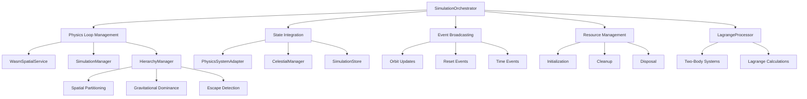
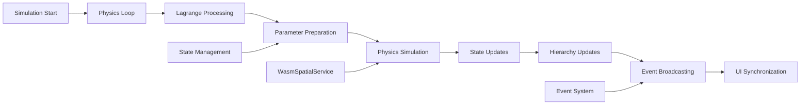

# App Simulation (`@teskooano/app-simulation`)

High-level orchestration package that manages the simulation lifecycle, physics loop coordination, and dynamic hierarchy management for the Open Space engine.

## 🎯 Purpose

The `@teskooano/app-simulation` package serves as the central coordination hub for the simulation system, integrating the physics engine (`@teskooano/core-physics`), state management (`@teskooano/core-state`), and spatial partitioning services. It provides a clean API for controlling simulation lifecycle while handling complex internal coordination between subsystems.

## 🏗️ Architecture

The `@teskooano/app-simulation` package follows a modular, orchestration-based architecture that coordinates multiple subsystems for comprehensive simulation management.



## 🚀 Core Features

### 1. Simulation Lifecycle Management

- **Physics Loop Orchestration**: Manages the main simulation loop with proper time scaling
- **State Integration**: Coordinates bidirectional data flow between physics and state systems
- **Event Broadcasting**: Emits orbit updates and reset events for UI synchronization
- **Resource Management**: Handles initialization, cleanup, and disposal of simulation resources

### 2. Dynamic Hierarchy Management

- **Rule-Based Parentage**: Maintains celestial object hierarchies based on gravitational dominance
- **Escape Detection**: Monitors moons and satellites for escape conditions (0.1 AU and 0.05 AU thresholds)
- **Orphan Handling**: Reassigns parentless objects to appropriate gravitational sources
- **Performance Optimization**: Uses centralized WASM spatial partitioning for efficient calculations

### 3. Advanced Orbital Mechanics

- **Lagrange Point Processing**: Handles objects positioned at L1, L2, L3, L4, L5 Lagrange points
- **Two-Body System Calculations**: Computes stable and unstable equilibrium positions
- **Real-World Applications**: Supports space telescopes, Trojan asteroids, and space colonies

### 4. Performance Optimizations

- **WASM Integration**: Uses WebAssembly for high-performance spatial partitioning
- **Incremental Processing**: Spreads computational load across frames (one object per tick)
- **Automatic Fallbacks**: Gracefully handles WASM failures with traditional methods
- **Efficient State Management**: Minimizes memory allocation and maximizes performance

## 🔧 Key Components

### `SimulationOrchestrator`

**Purpose**: Singleton orchestrator that manages the overall simulation lifecycle and coordinates all subsystems.

**Key Responsibilities:**

- Physics loop management with proper time scaling
- State integration and parameter preparation
- Event broadcasting for UI synchronization
- Resource management and cleanup

### `HierarchyManager`

**Purpose**: Manages dynamic celestial object hierarchies using rule-based gravitational dominance calculations.

**Key Responsibilities:**

- Moon and satellite escape detection
- Orphaned object reassignment
- Gravitational dominance calculations
- Performance-optimized spatial queries

### `LagrangeProcessor`

**Purpose**: Utility for processing objects positioned at Lagrange points in two-body systems.

**Key Responsibilities:**

- Lagrange point position and velocity calculations
- Two-body system abstraction
- Physics state updates for Lagrange objects
- Real-world mission support (space telescopes, Trojan asteroids)

## 🔄 Data Flow

The simulation system follows a systematic data flow for processing physics updates and state synchronization:



### Processing Pipeline

1. **Simulation Start**: Initialize services and start main loop
2. **Physics Loop**: Main simulation loop with time scaling
3. **Lagrange Processing**: Update Lagrange point objects
4. **Parameter Preparation**: Convert state to physics parameters
5. **Physics Simulation**: Run core physics calculations
6. **State Updates**: Update state with simulation results
7. **Hierarchy Updates**: Update object hierarchies
8. **Event Broadcasting**: Emit events for UI updates
9. **UI Synchronization**: Update user interface

## 📊 Technical Specifications

### Interface Definitions

```typescript
interface SimulationOrchestrator {
  startLoop(): Promise<void>;
  stopLoop(): void;
  isLoopRunning: boolean;
  createPhysicsCallback(): (deltaTime: number) => void;
  resetSystem(skipStateClear?: boolean): void;
  resetTime(): void;
  dispose(): void;
  onResetTime$: Observable<void>;
  onOrbitUpdate$: Observable<OrbitUpdatePayload>;
}

interface HierarchyManager {
  updateHierarchies(): void;
}

interface LagrangeProcessor {
  processLagrangeObjects(
    celestialObjects: Map<string, CelestialObject>,
    physicsStates: Map<string, PhysicsStateReal>,
  ): void;
}
```

### Configuration Options

```typescript
interface SimulationConfig {
  mode: "ideal" | "realistic";
  timeScale: number;
  neighborDistance: number;
  escapeThresholds: {
    moon: number; // 0.1 AU
    satellite: number; // 0.05 AU
  };
  searchDistances: {
    star: number; // 1000 AU
    gasGiant: number; // 100 AU
    planet: number; // 10 AU
    moon: number; // 1 AU
    satellite: number; // 10 Mm
  };
}
```

## 💡 Usage Examples

### Basic Simulation Setup

```typescript
import { simulationOrchestrator } from "@teskooano/app-simulation";
import { initializeSolarSystem } from "@teskooano/app-simulation/systems";

// Initialize system
initializeSolarSystem();

// Start simulation
await simulationOrchestrator.startLoop();

// Listen for updates
simulationOrchestrator.onOrbitUpdate.subscribe((payload) => {
  console.log("Updated positions:", payload.positions);
});
```

### Custom Animation Loop Integration

```typescript
const physicsCallback = simulationOrchestrator.createPhysicsCallback();

function animationLoop(timestamp: number) {
  const deltaTime = (timestamp - lastTimestamp) / 1000;
  physicsCallback(deltaTime);

  // Render frame
  renderer.render(scene, camera);

  lastTimestamp = timestamp;
  requestAnimationFrame(animationLoop);
}
```

### Lagrange Point Object Configuration

```typescript
const jamesWebbTelescope: CelestialObject = {
  id: "jwst",
  name: "James Webb Space Telescope",
  type: CelestialType.SATELLITE,
  parentId: "sun", // Primary: Sun
  lagrangePointTargetId: "earth", // Secondary: Earth
  orbit: {
    lagrangePointType: LagrangePointType.L2, // Sun-Earth L2
    // ... other orbital properties
  },
  // ... other properties
};
```

### Event-Driven UI Updates

```typescript
// Listen for time resets
simulationOrchestrator.onResetTime.subscribe(() => {
  updateTimeDisplay(0);
  resetTrailVisualizations();
});

// Listen for orbit updates
simulationOrchestrator.onOrbitUpdate.subscribe((payload) => {
  updateObjectPositions(payload.positions);
  updateTrailHistory(payload.positions);
});
```

## ⚡ Performance Considerations

### Efficiency

- **WASM Integration**: Uses WebAssembly for high-performance spatial partitioning
- **Incremental Processing**: Spreads computational load across frames (one object per tick)
- **Automatic Fallbacks**: Gracefully handles WASM failures with traditional methods
- **Efficient State Management**: Minimizes memory allocation and maximizes performance

### Quality Metrics

- **Frame Rate**: 60 FPS target with proper delta time handling
- **Time Scaling**: Configurable time scale for different simulation speeds
- **Pause Handling**: Proper time jump prevention when pausing/unpausing
- **Spatial Partitioning**: O(log n) neighbor queries using WASM

### Performance Monitoring

- **Simulation Loop**: Real-time performance tracking
- **Memory Usage**: Object reuse and garbage collection optimization
- **Spatial Queries**: Efficient neighbor detection and gravitational calculations
- **State Synchronization**: Optimized bidirectional data flow

## 🔌 Integration Points

### Core Physics Integration

- **SimulationManager**: Core physics simulation engine
- **WasmSpatialService**: Centralized spatial partitioning for performance
- **Two-Body Systems**: Lagrange point calculations
- **Orbital Mechanics**: Advanced gravitational dynamics

### State Management Integration

- **PhysicsSystemAdapter**: Bidirectional state synchronization
- **CelestialManager**: Object lifecycle management
- **SimulationStore**: Time and configuration management
- **StateSubscriptionMixin**: Reactive state updates

### Data Types Integration

- **CelestialObject**: Object definitions and properties
- **PhysicsStateReal**: Position and velocity vectors
- **LagrangePointType**: L1, L2, L3, L4, L5 designations
- **OrbitUpdatePayload**: Event data structures

## 🐛 Debug Features

### Validation

- **Object Existence**: Validates objects exist before processing
- **Physics State**: Ensures physics states are available
- **Active Status**: Only processes active (non-destroyed) objects
- **Distance Validation**: Prevents division by zero in calculations

### Monitoring

- **Performance Monitoring**: Real-time simulation performance tracking
- **Error Monitoring**: Comprehensive error handling and fallback mechanisms
- **Usage Monitoring**: Event system for tracking simulation state changes
- **Health Monitoring**: Service initialization and health checks

### Debugging Tools

- **WASM Service Fallback**: Automatic fallback to traditional methods
- **Physics Engine Fallback**: Graceful degradation when WASM fails
- **Event System**: Comprehensive event broadcasting for debugging
- **State Inspection**: Access to internal state for debugging purposes

## 🔮 Future Enhancements

### Planned Features

- **Advanced Physics**: Enhanced n-body simulation algorithms
- **Multi-Threading**: Web Workers for parallel processing
- **Advanced Lagrange Points**: Support for more complex orbital mechanics
- **Real-Time Collaboration**: Multi-user simulation support

### Optimization Opportunities

- **Performance Optimization**: Further WASM optimizations
- **Memory Optimization**: Advanced memory management strategies
- **Code Optimization**: Additional algorithmic improvements
- **Architecture Optimization**: Enhanced modular architecture

### Advanced Features

- **Machine Learning**: AI-powered simulation optimization
- **Advanced Visualization**: Enhanced 3D rendering integration
- **Data Export**: Comprehensive simulation data export
- **Plugin System**: Extensible architecture for custom features

## Dependencies

### Core Dependencies

- **@teskooano/core-physics**: Physics simulation engine and spatial partitioning
- **@teskooano/core-state**: State management and celestial object lifecycle
- **@teskooano/data-types**: Type definitions for celestial objects and physics
- **@teskooano/data-values**: Constants and utility functions
- **rxjs**: Reactive programming for event streams

### Development Dependencies

- **typescript**: Type safety and modern JavaScript features
- **vitest**: Testing framework with browser support
- **@vitest/browser**: Browser testing capabilities
- **@playwright/test**: End-to-end testing
- **eslint**: Code quality and consistency

## 🔗 Related

### Core Classes

- [[app/app-simulation/SimulationOrchestrator|SimulationOrchestrator]] - Main simulation coordinator
- [[app/app-simulation/HierarchyManager|HierarchyManager]] - Dynamic hierarchy management
- [[app/app-simulation/LagrangeProcessor|LagrangeProcessor]] - Lagrange point calculations

### Core Dependencies

- [[core/core-physics/core-physics|Core Physics]] - Physics simulation engine
- [[core/core-state/core-state|Core State]] - State management system
- [[data/types/data-types|Data Types]] - Type definitions
- [[data/values/data-values|Data Values]] - Constants and utilities

### Integration Points

- [[renderer/threejs/threejs|Three.js Renderer]] - 3D rendering system
- [[app/app-simulation/systems|System Initializers]] - System initializers
