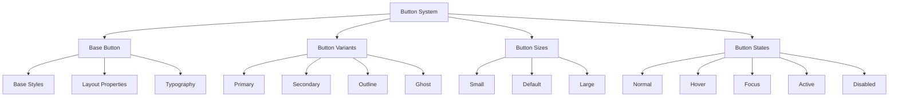
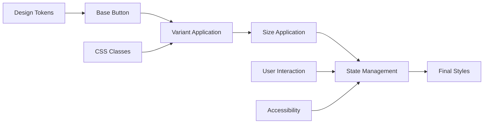

# Button System (`components/buttons.css`)

A comprehensive button styling system providing multiple variants, sizes, and states for consistent interactive elements across Teskooano applications. Features semantic styling, accessibility support, and smooth transitions.

## 🎯 Purpose

The Button System provides a complete set of button styles that ensure consistency across all interactive elements in Teskooano applications. It offers multiple variants for different use cases, proper accessibility support, and smooth state transitions while maintaining visual consistency with the overall design system.

## 🏗️ Architecture

The Button System follows a variant-based architecture with state management:



## 🚀 Core Features

### 1. Button Variants

- **Primary**: Main action buttons with brand colors
- **Secondary**: Secondary actions with alternative colors
- **Outline**: Transparent buttons with colored borders
- **Ghost**: Minimal buttons with hover effects

### 2. Button Sizes

- **Small**: Compact buttons for dense interfaces
- **Default**: Standard button size for most use cases
- **Large**: Prominent buttons for primary actions

### 3. Interactive States

- **Hover**: Subtle background and border changes
- **Focus**: Accessible focus indicators
- **Active**: Pressed state feedback
- **Disabled**: Reduced opacity and disabled cursor

### 4. Accessibility Features

- **Focus Indicators**: Clear focus outlines
- **Keyboard Navigation**: Full keyboard support
- **Screen Reader Support**: Proper semantic markup
- **Color Contrast**: WCAG-compliant contrast ratios

## 🔧 Key Components

### Base Button Styles

```css
button,
input[type="button"],
input[type="submit"],
input[type="reset"] {
  /* Layout */
  display: inline-flex;
  align-items: center;
  justify-content: center;
  gap: var(--spacing-sm);

  /* Spacing */
  padding: var(--space-2) var(--space-4);

  /* Typography */
  font-family: var(--font-family-base);
  font-size: var(--font-size-base);
  font-weight: var(--font-weight-medium);
  text-align: center;
  white-space: nowrap;

  /* Visual */
  border: var(--border-width-thin) solid transparent;
  border-radius: var(--radius-md);
  background-color: var(--color-surface-2);
  color: var(--color-text-primary);
  border-color: var(--color-border-subtle);

  /* Interaction */
  cursor: pointer;
  user-select: none;

  /* Transitions */
  transition:
    background-color var(--transition-duration-fast)
      var(--transition-timing-base),
    border-color var(--transition-duration-fast) var(--transition-timing-base),
    color var(--transition-duration-fast) var(--transition-timing-base),
    box-shadow var(--transition-duration-fast) var(--transition-timing-base);
}
```

### Button Variants

```css
/* Primary Button */
.button-primary {
  background-color: var(--color-primary);
  color: var(--color-text-on-primary);
  border-color: var(--color-primary);
}

.button-primary:hover {
  background-color: var(--color-primary-hover);
  border-color: var(--color-primary-hover);
}

.button-primary:active {
  background-color: var(--color-primary-active);
  border-color: var(--color-primary-active);
}

.button-primary:focus,
.button-primary:focus-visible {
  box-shadow:
    0 0 0 2px var(--color-background),
    0 0 0 4px var(--color-primary);
}

/* Secondary Button */
.button-secondary {
  background-color: var(--color-secondary);
  color: var(--color-text-on-secondary);
  border-color: var(--color-secondary);
}

.button-secondary:hover {
  background-color: var(--color-secondary-hover);
  border-color: var(--color-secondary-hover);
}

.button-secondary:active {
  background-color: var(--color-secondary-active);
  border-color: var(--color-secondary-active);
}

.button-secondary:focus,
.button-secondary:focus-visible {
  box-shadow:
    0 0 0 2px var(--color-background),
    0 0 0 4px var(--color-secondary);
}

/* Outline Button */
.button-outline {
  background-color: transparent;
  color: var(--color-primary);
  border-color: var(--color-primary);
}

.button-outline:hover {
  background-color: rgba(var(--color-primary-rgb, 108, 99, 255), 0.1);
  color: var(--color-primary-hover);
  border-color: var(--color-primary-hover);
}

.button-outline:active {
  background-color: rgba(var(--color-primary-rgb, 108, 99, 255), 0.2);
}

.button-outline:focus,
.button-outline:focus-visible {
  box-shadow: 0 0 0 2px var(--color-primary);
}

/* Ghost Button */
.button-ghost {
  background-color: transparent;
  color: var(--color-text-secondary);
  border-color: transparent;
}

.button-ghost:hover {
  background-color: var(--color-surface-2);
  color: var(--color-text-primary);
  border-color: var(--color-border-subtle);
}

.button-ghost:active {
  background-color: var(--color-surface-1);
}

.button-ghost:focus,
.button-ghost:focus-visible {
  box-shadow: 0 0 0 2px var(--color-primary);
}
```

### Button Sizes

```css
/* Small Button */
.button-sm {
  padding: var(--space-1) var(--space-2);
  font-size: var(--font-size-small);
  gap: var(--spacing-xs);
  border-radius: var(--radius-sm);
}

/* Large Button */
.button-lg {
  padding: var(--space-3) var(--space-5);
  font-size: var(--font-size-large);
  gap: var(--spacing-sm);
  border-radius: var(--radius-lg);
}
```

### Button States

```css
/* Hover State */
button:hover,
input[type="button"]:hover,
input[type="submit"]:hover,
input[type="reset"]:hover {
  background-color: var(--color-surface-3);
  border-color: var(--color-border-strong);
}

/* Focus State */
button:focus,
input[type="button"]:focus,
input[type="submit"]:focus,
input[type="reset"]:focus,
button:focus-visible,
input[type="button"]:focus-visible,
input[type="submit"]:focus-visible,
input[type="reset"]:focus-visible {
  outline: none;
  border-color: var(--color-border-focus);
  box-shadow: 0 0 0 2px var(--color-primary);
}

/* Active State */
button:active,
input[type="button"]:active,
input[type="submit"]:active,
input[type="reset"]:active {
  background-color: var(--color-surface-1);
}

/* Disabled State */
button:disabled,
input[type="button"]:disabled,
input[type="submit"]:disabled,
input[type="reset"]:disabled {
  opacity: 0.6;
  cursor: not-allowed;
}
```

## 🔄 Data Flow

The Button System follows a systematic data flow for styling application:



### Processing Pipeline

1. **Base Button**: Apply foundational button styles
2. **Variant Application**: Apply button variant classes
3. **Size Application**: Apply button size classes
4. **State Management**: Handle interactive states
5. **Final Styles**: Computed styles applied to button elements

## 📊 Technical Specifications

### Button Structure

```html
<!-- Basic Button Structure -->
<button class="button-primary">
  <span class="button-content">Button Text</span>
</button>

<!-- Button with Icon -->
<button class="button-primary">
  <svg class="button-icon">...</svg>
  <span class="button-content">Button Text</span>
</button>

<!-- Button with Loading State -->
<button class="button-primary" disabled>
  <svg class="button-spinner">...</svg>
  <span class="button-content">Loading...</span>
</button>
```

### CSS Class Hierarchy

```css
/* Base Classes */
button {
  /* Base button styles */
}

/* Variant Classes */
.button-primary {
  /* Primary variant */
}
.button-secondary {
  /* Secondary variant */
}
.button-outline {
  /* Outline variant */
}
.button-ghost {
  /* Ghost variant */
}

/* Size Classes */
.button-sm {
  /* Small size */
}
.button-lg {
  /* Large size */
}

/* State Classes */
.button-loading {
  /* Loading state */
}
.button-disabled {
  /* Disabled state */
}
```

## 💡 Usage Examples

### Basic Button Usage

```html
<!-- Primary Button -->
<button class="button-primary">Primary Action</button>

<!-- Secondary Button -->
<button class="button-secondary">Secondary Action</button>

<!-- Outline Button -->
<button class="button-outline">Outline Action</button>

<!-- Ghost Button -->
<button class="button-ghost">Ghost Action</button>
```

### Button Sizes

```html
<!-- Small Button -->
<button class="button-primary button-sm">Small</button>

<!-- Default Button -->
<button class="button-primary">Default</button>

<!-- Large Button -->
<button class="button-primary button-lg">Large</button>
```

### Buttons with Icons

```html
<!-- Button with Icon -->
<button class="button-primary">
  <svg class="button-icon" width="16" height="16" viewBox="0 0 16 16">
    <path d="M8 0L10.5 5.5L16 8L10.5 10.5L8 16L5.5 10.5L0 8L5.5 5.5L8 0Z" />
  </svg>
  <span>Save</span>
</button>

<!-- Icon-only Button -->
<button class="button-ghost button-sm" aria-label="Close">
  <svg class="button-icon" width="16" height="16" viewBox="0 0 16 16">
    <path d="M12 4L4 12M4 4L12 12" stroke="currentColor" stroke-width="2" />
  </svg>
</button>
```

### Button Groups

```html
<!-- Button Group -->
<div class="button-group">
  <button class="button-primary">Primary</button>
  <button class="button-secondary">Secondary</button>
  <button class="button-outline">Outline</button>
</div>

<!-- Segmented Control -->
<div class="button-group segmented">
  <button class="button-primary">Option 1</button>
  <button class="button-ghost">Option 2</button>
  <button class="button-ghost">Option 3</button>
</div>
```

### Loading States

```html
<!-- Loading Button -->
<button class="button-primary" disabled>
  <svg class="button-spinner" width="16" height="16" viewBox="0 0 16 16">
    <circle
      cx="8"
      cy="8"
      r="6"
      fill="none"
      stroke="currentColor"
      stroke-width="2"
    />
  </svg>
  <span>Loading...</span>
</button>
```

### Form Integration

```html
<!-- Form Buttons -->
<form>
  <div class="form-group">
    <label for="email">Email</label>
    <input type="email" id="email" name="email" required />
  </div>

  <div class="form-actions">
    <button type="submit" class="button-primary">Submit</button>
    <button type="reset" class="button-ghost">Reset</button>
  </div>
</form>
```

## ⚡ Performance Considerations

### Efficiency

- **CSS-only Implementation**: No JavaScript required for styling
- **Efficient Selectors**: Optimized CSS selectors for performance
- **Minimal DOM**: Lightweight HTML structure
- **Smooth Transitions**: Hardware-accelerated CSS transitions

### Quality Metrics

- **Consistency**: Standardized button appearance across applications
- **Accessibility**: WCAG-compliant focus indicators and contrast
- **Usability**: Clear visual feedback for all interactive states
- **Maintainability**: Token-based styling for easy updates

### Performance Monitoring

- **Render Performance**: Efficient CSS rendering and layout
- **Interaction Performance**: Smooth hover and focus transitions
- **Accessibility Performance**: Screen reader compatibility
- **Cross-browser Performance**: Consistent behavior across browsers

## 🔌 Integration Points

### Primary Integration

- **Design Tokens**: Uses design system tokens for consistent styling
- **Form System**: Integrates with form components and validation
- **Icon System**: Supports icon integration and alignment

### Secondary Integration

- **Layout System**: Works with layout utilities and spacing
- **Theme System**: Supports theme customization and overrides
- **Accessibility System**: Integrates with accessibility features

## 🐛 Debug Features

### Validation

- **CSS Validation**: Valid CSS syntax and properties
- **Accessibility Validation**: WCAG compliance checking
- **Browser Compatibility**: Cross-browser CSS compatibility
- **State Validation**: Proper state management and transitions

### Monitoring

- **Button Usage**: Monitoring of button variant usage
- **Performance Monitoring**: CSS performance and render metrics
- **Accessibility Monitoring**: Focus and keyboard navigation
- **User Interaction**: Button click and interaction tracking

### Debugging Tools

- **CSS Inspector**: Browser dev tools for button styling
- **Accessibility Inspector**: Screen reader and keyboard testing
- **State Debugger**: Button state debugging tools
- **Performance Profiler**: Button interaction performance analysis

## 🔮 Future Enhancements

### Optimization Opportunities

- **Performance Optimization**: Enhanced CSS optimization and transitions
- **Bundle Optimization**: Improved CSS bundling and tree-shaking
- **Animation Optimization**: Enhanced button animations and micro-interactions
- **Accessibility Optimization**: Improved accessibility features and support

### Potential Improvements

- **Additional Variants**: More button variants for different use cases
- **Advanced States**: Loading, success, and error states
- **Icon Integration**: Enhanced icon support and alignment
- **Advanced Debugging**: Enhanced debugging tools and development experience

## 📚 Related Documentation

- [[app/design-system/design-system|Design System]] - Main design system documentation
- [[app/design-system/design-tokens|Design Tokens]] - Design tokens used by button system
- [[app/design-system/typography-system|Typography System]] - Typography styles for button text
- [[app/design-system/layout-system|Layout System]] - Layout utilities for button positioning
- [[app/design-system/theme-system|Theme System]] - Theme customization for buttons
- [[app/design-system/component-styles|Component Styles]] - Component styling patterns and conventions
